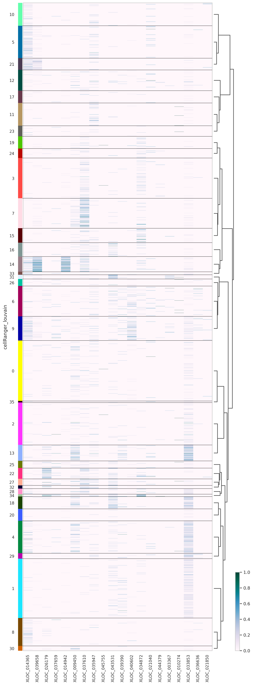

<a href="https://colab.research.google.com/github/pachterlab/CWGFLHGCCHAP_2021/blob/master/notebooks/SearchAndPlotInteractive/MARIMBAAtlasSearchAndPlot.ipynb" target="_parent"></a>


```
!date
```

    Thu Nov  5 02:05:27 UTC 2020


### **Download Data**


```
import requests
from tqdm import tnrange, tqdm_notebook
def download_file(doi,ext):
    url = 'https://api.datacite.org/dois/'+doi+'/media'
    r = requests.get(url).json()
    netcdf_url = r['data'][0]['attributes']['url']
    r = requests.get(netcdf_url,stream=True)
    #Set file name
    fname = doi.split('/')[-1]+ext
    #Download file with progress bar
    if r.status_code == 403:
        print("File Unavailable")
    if 'content-length' not in r.headers:
        print("Did not get file")
    else:
        with open(fname, 'wb') as f:
            total_length = int(r.headers.get('content-length'))
            pbar = tnrange(int(total_length/1024), unit="B")
            for chunk in r.iter_content(chunk_size=1024):
                if chunk:
                    pbar.update()
                    f.write(chunk)
        return fname
```


```
#Marimba filtered/clustered adata
download_file('10.22002/D1.1833','.gz')
```

    /usr/local/lib/python3.6/dist-packages/ipykernel_launcher.py:18: TqdmDeprecationWarning: Please use `tqdm.notebook.trange` instead of `tqdm.tnrange`


    HBox(children=(FloatProgress(value=0.0, max=520896.0), HTML(value='')))


    'D1.1833.gz'


```
!gunzip *.gz
```


```
!pip install --quiet anndata
!pip install --quiet scanpy
```

         |████████████████████████████████| 122kB 13.7MB/s 
         |████████████████████████████████| 7.7MB 10.7MB/s 
         |████████████████████████████████| 51kB 5.7MB/s 
         |████████████████████████████████| 71kB 7.1MB/s 
    [?25h  Building wheel for sinfo (setup.py) ... [?25l[?25hdone


### **Import Packages**


```
#Install Packages
import random
import pandas as pd
import anndata
import scanpy as sc
import numpy as np
import scipy.sparse

import warnings
warnings.filterwarnings('ignore')

#import scrublet as scr

import matplotlib.pyplot as plt
%matplotlib inline
sc.set_figure_params(dpi=125)

import seaborn as sns
sns.set(style="whitegrid")
```

### **Read in Data for Plotting and Embedding Visualizations**


```
#Read in data
jelly_adata = anndata.read('D1.1833')
jelly_adata
```


    AnnData object with n_obs × n_vars = 13673 × 9609
        obs: 'batch', 'orgID', 'fed', 'starved', 'cellRanger_louvain', 'n_counts', 'n_countslog'
        var: 'n_counts', 'mean', 'std'
        uns: 'cellRanger_louvain_colors', 'cellRanger_louvain_sizes', 'neighbors', 'paga', 'pca', 'rank_genes_groups', 'umap'
        obsm: 'X_pca', 'X_umap'
        varm: 'PCs'
        obsp: 'connectivities', 'distances'


```
#Add dendrogram
sc.tl.dendrogram(jelly_adata,'cellRanger_louvain',linkage_method='ward')
jelly_adata.uns['dendrogram_cellRanger_louvain'] = jelly_adata.uns["dendrogram_['cellRanger_louvain']"]
```

Plot genes of interest on heatmap


```

jelly_adata.obs['cellRanger_louvain'] = pd.Categorical(jelly_adata.obs['cellRanger_louvain'])
#Example genes list
genes = ['XLOC_014365','XLOC_039658','XLOC_026179','XLOC_037659','XLOC_014942','XLOC_009450','XLOC_037610','XLOC_035947',
 'XLOC_045755','XLOC_043531','XLOC_039390','XLOC_040602','XLOC_034872','XLOC_021040','XLOC_044379',
 'XLOC_003367','XLOC_010274','XLOC_033853','XLOC_036636','XLOC_021850']

sc.pl.heatmap(jelly_adata, genes, groupby='cellRanger_louvain',dendrogram=True, show_gene_labels=True,swap_axes=False,figsize = (10,30),
              cmap='PuBuGn',standard_scale='var')


```





Plot genes of interest on cell atlas embedding


```


sc.pl.umap(jelly_adata,color=genes)
```


