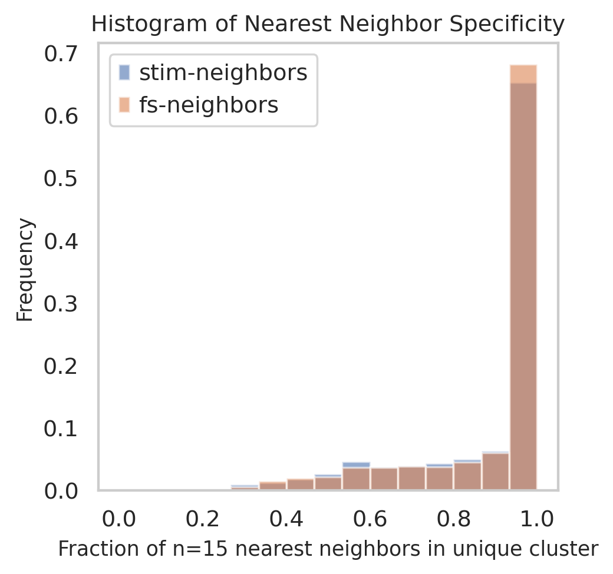
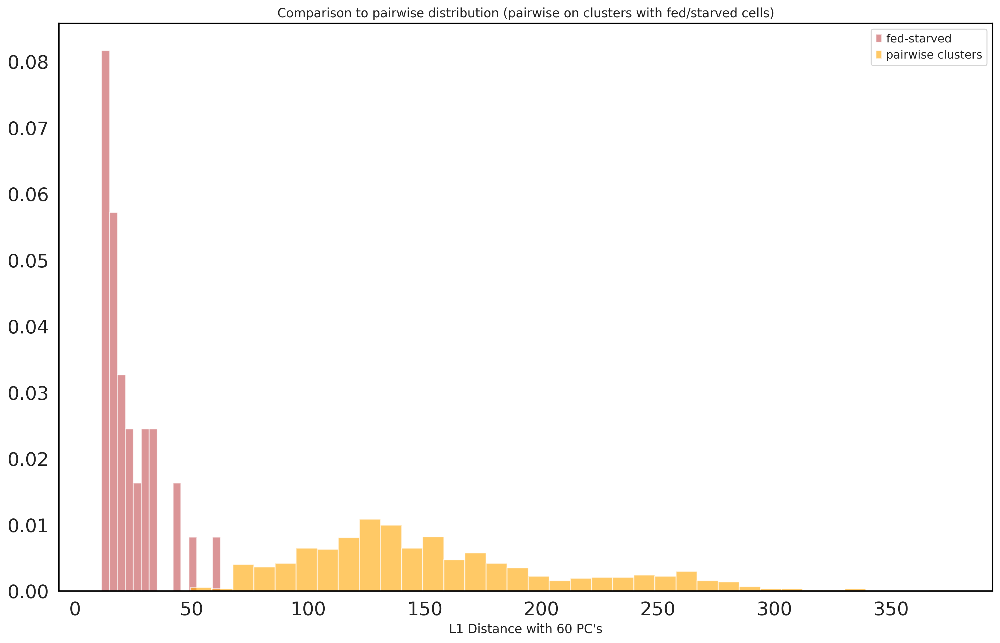
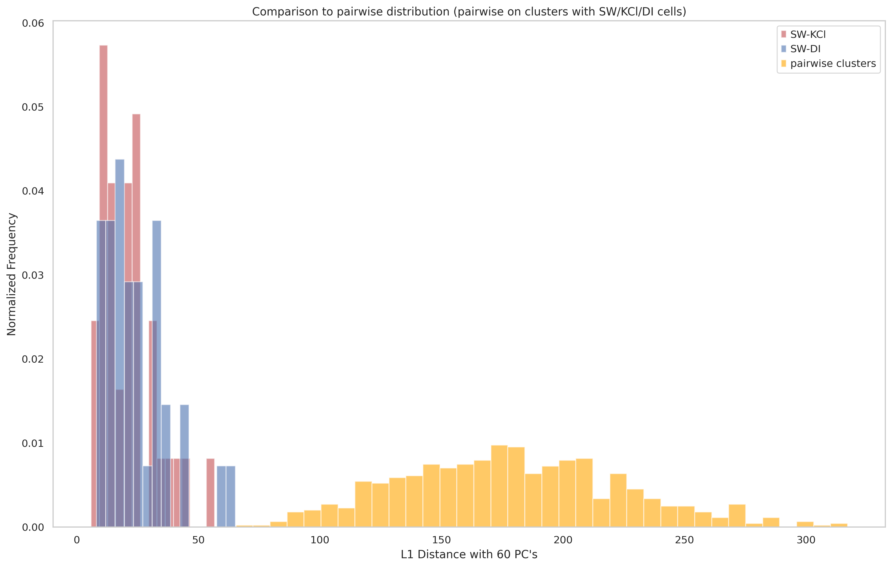
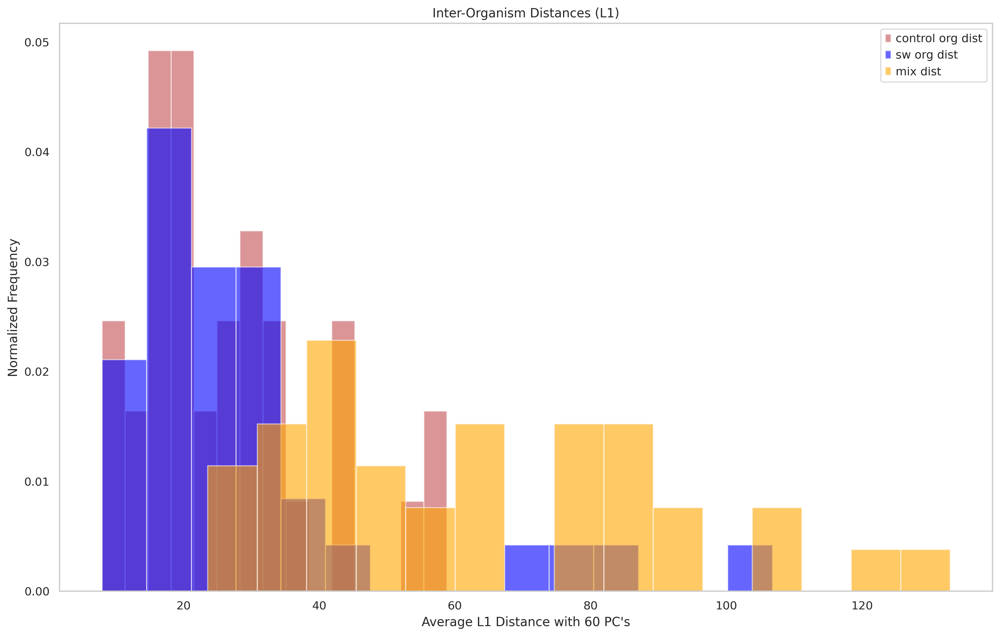

<a href="https://colab.research.google.com/github/pachterlab/CWGFLHGCCHAP_2021/blob/master/notebooks/ComparativeDistanceAnalysis/allDistanceCalculations.ipynb" target="_parent"></a>


```
!date
```

    Mon Aug 17 20:20:34 UTC 2020


### **Download Data**


```
import requests
from tqdm import tnrange, tqdm_notebook
def download_file(doi,ext):
    url = 'https://api.datacite.org/dois/'+doi+'/media'
    r = requests.get(url).json()
    netcdf_url = r['data'][0]['attributes']['url']
    r = requests.get(netcdf_url,stream=True)
    #Set file name
    fname = doi.split('/')[-1]+ext
    #Download file with progress bar
    if r.status_code == 403:
        print("File Unavailable")
    if 'content-length' not in r.headers:
        print("Did not get file")
    else:
        with open(fname, 'wb') as f:
            total_length = int(r.headers.get('content-length'))
            pbar = tnrange(int(total_length/1024), unit="B")
            for chunk in r.iter_content(chunk_size=1024):
                if chunk:
                    pbar.update()
                    f.write(chunk)
        return fname
```


```
#Kallisto bus clustered starvation data, h5ad
download_file('10.22002/D1.1796','.gz')

#CellRanger Starvation h5ad data
download_file('10.22002/D1.1798','.gz')

#Import previously saved, clustered, & filtered stimulation data 

download_file('10.22002/D1.1821','.gz')
```

    /usr/local/lib/python3.6/dist-packages/ipykernel_launcher.py:18: TqdmDeprecationWarning: Please use `tqdm.notebook.trange` instead of `tqdm.tnrange`


    HBox(children=(FloatProgress(value=0.0, max=479630.0), HTML(value='')))


    HBox(children=(FloatProgress(value=0.0, max=45376.0), HTML(value='')))


    HBox(children=(FloatProgress(value=0.0, max=772581.0), HTML(value='')))


    'D1.1821.gz'


```
#Starvation h5ad data, all nonzero genes included, filtered for 'real cells' from de-multiplexing
download_file('10.22002/D1.1797','.gz')

#Import raw, unclustered stimulation data
download_file('10.22002/D1.1814','.gz')
```

    /usr/local/lib/python3.6/dist-packages/ipykernel_launcher.py:18: TqdmDeprecationWarning: Please use `tqdm.notebook.trange` instead of `tqdm.tnrange`


    HBox(children=(FloatProgress(value=0.0, max=26058.0), HTML(value='')))


    HBox(children=(FloatProgress(value=0.0, max=78502.0), HTML(value='')))


    'D1.1814.gz'


```
#Import merged data with knn clusters
download_file('10.22002/D1.1823','.gz')
```

    /usr/local/lib/python3.6/dist-packages/ipykernel_launcher.py:18: TqdmDeprecationWarning: Please use `tqdm.notebook.trange` instead of `tqdm.tnrange`


    HBox(children=(FloatProgress(value=0.0, max=257856.0), HTML(value='')))


    'D1.1823.gz'


```

!gunzip *.gz
```


```
!pip install --quiet anndata
!pip install --quiet scanpy
!pip install --quiet louvain
```

         |████████████████████████████████| 122kB 4.3MB/s 
         |████████████████████████████████| 10.2MB 4.0MB/s 
         |████████████████████████████████| 71kB 7.6MB/s 
         |████████████████████████████████| 51kB 6.1MB/s 
         |████████████████████████████████| 71kB 7.9MB/s 
    [?25h  Building wheel for sinfo (setup.py) ... [?25l[?25hdone
      Building wheel for umap-learn (setup.py) ... [?25l[?25hdone
         |████████████████████████████████| 2.2MB 4.3MB/s 
         |████████████████████████████████| 3.2MB 44.6MB/s 
    [?25h

###**Import packages**


```
import pandas as pd
import anndata
import scanpy as sc
import numpy as np
import scipy.sparse

import warnings
warnings.filterwarnings('ignore')

from sklearn.neighbors import (KNeighborsClassifier,NeighborhoodComponentsAnalysis)
from sklearn.pipeline import Pipeline
from sklearn.manifold import TSNE
from sklearn.decomposition import PCA

import matplotlib
import matplotlib.pyplot as plt
%matplotlib inline
sc.set_figure_params(dpi=125)

import seaborn as sns
sns.set(style="whitegrid")
```

###**Do Distance Based Analysis for Inter- and Intra- Cluster Distances**

Read in previously saved data


```
# Description: bus_fs_combo data (filtered + clustered starvation (fed/starved --> fs) data)
# Description: bus_combo_noZero (filtered + clustered stimulation data) from Kallisto bus

#bus_fs_combo
bus_fs_combo = anndata.read("D1.1796")

print(bus_fs_combo)

bus_combo_noZero = anndata.read('D1.1821') 
print(bus_combo_noZero)

#Previously saved overlap, merged data (from both experiments)
overlap_combo = anndata.read("D1.1823")
overlap_combo
```

    AnnData object with n_obs × n_vars = 13673 × 8696
        obs: 'batch', 'n_counts', 'n_countslog', 'louvain', 'leiden', 'orgID', 'fed', 'starved', 'fed_neighbor_score', 'cellRanger_louvain', 'annos', 'new_cellRanger_louvain', 'annosSub'
        var: 'n_counts', 'mean', 'std'
        uns: 'annosSub_colors', 'annos_colors', 'cellRanger_louvain_colors', 'cellRanger_louvain_sizes', "dendrogram_['new_cellRanger_louvain']", 'dendrogram_new_cellRanger_louvain', 'fed_colors', 'fed_neighbor_score_colors', 'leiden', 'leiden_colors', 'louvain', 'louvain_colors', 'neighbors', 'new_cellRanger_louvain_colors', 'orgID_colors', 'paga', 'pca', 'rank_genes_groups', 'umap'
        obsm: 'X_nca', 'X_pca', 'X_tsne', 'X_umap'
        varm: 'PCs'
        obsp: 'connectivities', 'distances'
    AnnData object with n_obs × n_vars = 18921 × 10260
        obs: 'batch', 'n_counts', 'n_countslog', 'louvain', 'condition', 'orgID', 'cellRanger_louvain'
        var: 'n_counts', 'mean', 'std'
        uns: 'cellRanger_louvain_colors', 'cellRanger_louvain_sizes', 'condition_colors', 'louvain', 'neighbors', 'paga', 'pca', 'umap'
        obsm: 'X_pca', 'X_tsne', 'X_umap'
        varm: 'PCs'
        obsp: 'connectivities', 'distances'


    AnnData object with n_obs × n_vars = 32594 × 6756
        obs: 'batch', 'n_counts', 'n_countslog', 'louvain', 'leiden', 'orgID', 'fed', 'starved', 'fed_neighbor_score', 'cellRanger_louvain', 'annos', 'new_cellRanger_louvain', 'annosSub', 'condition', 'cell_origin', 'knn_clus'
        var: 'n_counts-0', 'mean-0', 'std-0', 'n_counts-1', 'mean-1', 'std-1', 'mean', 'std'
        uns: 'pca'
        obsm: 'X_nca', 'X_pca', 'X_tsne', 'X_umap'
        varm: 'PCs'


```
#How raw overlap adata was made (no genes filtered out)
bus_fs_raw = anndata.read("D1.1797")

bus_stim_raw = anndata.read("D1.1814")

#Merge datasets
bus_fs_raw.obs_names = [i+'_fs' for i in bus_fs_raw.obs_names]
bus_stim_raw.obs_names = [i+'_ieg' for i in bus_stim_raw.obs_names]

raw_overlap_combo = bus_fs_raw.concatenate(bus_stim_raw,join='outer', index_unique=None)
```

Predict labels for stimulation data


```
#Make X_pca with merged, use top n PC's
def getPredLabels(overlap_fs,overlap_combo, n_PC):
    
    numFS = len(overlap_fs.obs_names)
    X_train = overlap_combo.obsm['X_pca'][0:numFS,0:n_PC]

    #X_pca at stim rows = X_test
    X_test = overlap_combo.obsm['X_pca'][numFS:,0:n_PC]

    #y_train is f/s louvain labels
    y_train = overlap_fs.obs['cellRanger_louvain']

    #Fit and predict
    classifier = KNeighborsClassifier(n_neighbors=15)
    classifier.fit(X_train, y_train)

    y_pred = classifier.predict(X_test)
    
    labels = list(y_train)+list(y_pred)
    
    print(len(labels),' labels created')
    
    return labels

```

#### **How merged dataset (joint-PC space) with stimulation and starvation experiments was made (= overlap_combo)**


```
#Get intersection of var names between the two (making overlap_combo)
overlap = list(set(bus_combo_noZero.var_names).intersection(bus_fs_combo.var_names))

overlap_fs = bus_fs_combo[:,overlap]

overlap_stim = bus_combo_noZero[:,overlap]


#Merge datasets
overlap_fs.obs_names = [i+'_fs' for i in overlap_fs.obs_names]
overlap_stim.obs_names = [i+'_ieg' for i in overlap_stim.obs_names]

origin = list(np.repeat('FS',len(overlap_fs.obs_names))) + list(np.repeat('Stim',len(overlap_stim.obs_names)))
overlap_combo = overlap_fs.concatenate(overlap_stim,join='outer', index_unique=None)

overlap_combo.obs['cell_origin'] = pd.Categorical(origin)
sc.pp.scale(overlap_combo, max_value=10)

#Do PCA on merged dataset + plot variance explained
sc.tl.pca(overlap_combo, n_comps=60)
#sc.pl.pca_variance_ratio(overlap_combo, log=True)

#overlap_combo

labels = getPredLabels(overlap_fs,overlap_combo,n_PC = 60)

overlap_combo.obs['knn_clus'] = pd.Categorical(labels)

```

    32594  labels created


```
sc.pp.neighbors(overlap_combo,n_neighbors=150, n_pcs=60,random_state=42)
sc.tl.paga(overlap_combo, groups='knn_clus')
sc.pl.paga(overlap_combo, color=['knn_clus'])

```


```
sc.tl.tsne(overlap_combo,random_state=42,n_pcs=60,early_exaggeration=5)
```

    WARNING: Consider installing the package MulticoreTSNE (https://github.com/DmitryUlyanov/Multicore-TSNE). Even for n_jobs=1 this speeds up the computation considerably and might yield better converged results.


```
sc.tl.umap(overlap_combo,random_state=42,spread=2.5,min_dist = 0.8,init_pos='paga')
```


```
# sc.pl.tsne(overlap_combo,color=['knn_clus'])
```


```
sc.pl.umap(overlap_combo,color=['knn_clus'],color_map='viridis')
```


```
#overlap_combo.write('overlap_combo.h5ad')
```

##### **Plot percent of K neighbors for each stim cell that are in one unique cluster**


```
from sklearn.neighbors import NearestNeighbors
import random 

#Read in previously saved data
overlap_combo = anndata.read("D1.1823")

n = 15

neigh = NearestNeighbors(n_neighbors=n)
n_PC = 60


numFS = len(overlap_fs.obs_names)
X_train = overlap_combo.obsm['X_pca'][0:numFS,0:n_PC]

#X_pca at stim rows = X_test
X_test = overlap_combo.obsm['X_pca'][numFS:,0:n_PC]

#y_train is f/s louvain labels
y_train = overlap_fs.obs['cellRanger_louvain']

#Fit and predict
#neigh.fit(X_train)


#Subsample 70% of fed/starved data for training, test on remaining 30% and stim data
numSamp = np.int(0.7*X_train.shape[0])
ind = random.sample(range(0,X_train.shape[0]),numSamp)
allInd = range(0,X_train.shape[0])
rest = [i for i in allInd if i not in ind]

#Fit and predict
neigh.fit(X_train[ind,:])

X_rest = X_train[rest,:]


fsNeigh = neigh.kneighbors(X_rest)
stimNeigh = neigh.kneighbors(X_test)


```


```
y_train = y_train[ind]
```


```
stim_neighbors = stimNeigh[1]
fs_neighbors = fsNeigh[1]

#y_train = y_train[ind]
stim_perc = np.zeros(stim_neighbors.shape[0])
for i in range(0,len(stim_perc)): 
  #How many of top neighbors come from same cluster in fed/starved data (out of n=15)
  stim_perc[i] = np.max(y_train[stim_neighbors[i]].value_counts())/n 

fs_perc = np.zeros(fs_neighbors.shape[0])
#y_train = y_train[ind]
for i in range(0,len(fs_perc)): 
  fs_perc[i] = np.max(y_train[fs_neighbors[i]].value_counts())/n

```


```
plt.hist(stim_perc,density=False,range=(0,1),alpha=0.6 ,bins=15,weights=np.ones(len(stim_perc))/len(stim_perc),label='stim-neighbors')
plt.hist(fs_perc,density=False,range=(0,1),alpha=0.6 ,bins=15 ,weights=np.ones(len(fs_perc))/len(fs_perc),label='fs-neighbors')
plt.legend(loc='upper left')
plt.title('Histogram of Nearest Neighbor Specificity',fontsize=11)
plt.grid(b=None)
plt.xlabel("Fraction of n=15 nearest neighbors in unique cluster",fontsize=10)
plt.ylabel("Frequency",fontsize=10)
plt.show()
```





####**Determine Inter and Intra Cluster Distances (perturbation effect vs cell type distance)**


```
#Plot distances between centroid of stim-starved and fed-starved for each cluster
def changeBool(fed):
    if fed == 'True':
        return 'fed'
    elif fed == 'False':
        return 'starved' 
    else:
        return 'stim'

def addConds(overlap_combo):
    fs_conds = [changeBool(i) for i in overlap_combo.obs['fed']]
    overlap_combo.obs['centroid_conds'] = pd.Categorical(fs_conds)

    overlap_combo.obs['centroid_conds']
```


```
from sklearn.metrics import pairwise_distances
#Centroids of cell atlas/defined clusters
def getClusCentroids(overlap_combo,pcs=60,clusType='knn_clus'):
    clusters = np.unique(overlap_combo.obs[clusType])
    centroids = np.zeros((len(clusters),pcs))
    
    for c in clusters:
        
        sub_data = overlap_combo[overlap_combo.obs[clusType] == c]
        pca_embed = sub_data.obsm['X_pca'][:,0:pcs]
        centroid = pca_embed.mean(axis=0)
        
        centroids[c,:] = list(centroid)
        
    return centroids
```


```
#Distance between conditions within clusters
def getCentroidDists(overlap_combo,pcs=60,clusType='knn_clus'):
    fedStarv = []
    fsStim = []

    cluster = []

    #Initialize output matrix
    addConds(overlap_combo)
    clusters = np.unique(overlap_combo.obs[clusType])
    centroid_dist = pd.DataFrame(columns =['fedStarv','fsStim','cluster','clus_color']) 

    for c in clusters:
        #Get cells in cluster and their conditions
        sub_data = overlap_combo[overlap_combo.obs[clusType] == c]
        centroid_conds = sub_data.obs['centroid_conds'] 

        #Get 2D tsne embedding
        pca_embed = sub_data.obsm['X_pca'][:,0:pcs] #PCA

        #Get location of condition cells
        stim_pos = list(centroid_conds == 'stim')
        allFS_pos = list(centroid_conds != 'stim')
        fed_pos = list(centroid_conds == 'fed')
        starved_pos = list(centroid_conds == 'starved')

        #Get column means for x,y coords
        meanFed = pca_embed[fed_pos,].mean(axis=0)

        meanStarv = pca_embed[starved_pos,].mean(axis=0)

        meanStim = pca_embed[stim_pos,].mean(axis=0)

        meanFS = pca_embed[allFS_pos,].mean(axis=0)


        cluster += [c]

        #Dist between fed and starved
        fs_dist = np.linalg.norm(meanFed - meanStarv,1)

        #Dist between (all) starved experiment and stim

        starvStim_dist = np.linalg.norm(meanFS - meanStim,1)

        fedStarv += [fs_dist]
        fsStim += [starvStim_dist]

    centroid_dist['fedStarv'] = fedStarv
    centroid_dist['fsStim'] = fsStim

    centroid_dist['cluster'] = cluster

    return centroid_dist
```


```
#Distance between conditions within clusters
def getStimCentroidDists(overlap_combo,pcs=60,clusType='knn_clus'):
    swKCl = []
    swDI = []

    cluster = []

    #Initialize output matrix
    #addConds(overlap_combo)
    clusters = np.unique(overlap_combo.obs[clusType])
    centroid_dist = pd.DataFrame(columns =['swKCl','swDI','cluster','clus_color']) 

    for c in clusters:
        #Get cells in cluster and their conditions
        sub_data = overlap_combo[overlap_combo.obs[clusType] == c]
        centroid_conds = sub_data.obs['condition'] 

        #Get 2D tsne embedding
        pca_embed = sub_data.obsm['X_pca'][:,0:pcs] #PCA

        #Get location of condition cells
        sw_pos = list(centroid_conds == 'SW')
        kcl_pos = list(centroid_conds == 'KCl')
        di_pos = list(centroid_conds == 'DI')
        

        #Get column means for x,y coords
        meanSW = pca_embed[sw_pos,].mean(axis=0)

        meanKCl = pca_embed[kcl_pos,].mean(axis=0)

        meanDI = pca_embed[di_pos,].mean(axis=0)


        cluster += [c]

        #Dist between fed and starved
        swKCl_dist = np.linalg.norm(meanSW - meanKCl,1)

        #Dist between (all) starved experiment and stim

        swDI_dist = np.linalg.norm(meanSW - meanDI,1)

        swKCl += [swKCl_dist]
        swDI += [swDI_dist]

    centroid_dist['swKCl'] = swKCl 
    centroid_dist['swDI'] =  swDI

    centroid_dist['cluster'] = cluster

    return centroid_dist
```

#####**Fed/Starved L1 Analysis**
Cell type v state plots


```
withinFS_Dists = getCentroidDists(bus_fs_combo,60,'cellRanger_louvain')
withinFS_Dists.head()
```


<div>
<style scoped>
    .dataframe tbody tr th:only-of-type {
        vertical-align: middle;
    }

    .dataframe tbody tr th {
        vertical-align: top;
    }

    .dataframe thead th {
        text-align: right;
    }
</style>
<table border="1" class="dataframe">
  <thead>
    <tr style="text-align: right;">
      <th></th>
      <th>fedStarv</th>
      <th>fsStim</th>
      <th>cluster</th>
      <th>clus_color</th>
    </tr>
  </thead>
  <tbody>
    <tr>
      <th>0</th>
      <td>11.357661</td>
      <td>NaN</td>
      <td>0</td>
      <td>NaN</td>
    </tr>
    <tr>
      <th>1</th>
      <td>17.776861</td>
      <td>NaN</td>
      <td>1</td>
      <td>NaN</td>
    </tr>
    <tr>
      <th>2</th>
      <td>12.411180</td>
      <td>NaN</td>
      <td>2</td>
      <td>NaN</td>
    </tr>
    <tr>
      <th>3</th>
      <td>18.126976</td>
      <td>NaN</td>
      <td>3</td>
      <td>NaN</td>
    </tr>
    <tr>
      <th>4</th>
      <td>13.799874</td>
      <td>NaN</td>
      <td>4</td>
      <td>NaN</td>
    </tr>
  </tbody>
</table>
</div>


```
#Compare to pairwise distances between cell atlas clusters
centroids = getClusCentroids(bus_fs_combo,60,'cellRanger_louvain')
#centroids_arr = centroids['centroid'].to_numpy()
pairCentroid_dists = pairwise_distances(centroids, metric = 'l1')
pairCentroid_dists.shape
print(np.mean(pairCentroid_dists))
```

    150.34457080272998


```
np.unique(bus_fs_combo.obs['cellRanger_louvain'])
```


    array([ 0,  1,  2,  3,  4,  5,  6,  7,  8,  9, 10, 11, 12, 13, 14, 15, 16,
           17, 18, 19, 20, 21, 22, 23, 24, 25, 26, 27, 28, 29, 30, 31, 32, 33,
           34, 35])


```
#Early cnidocytes, germ cells, stem cells have distances that overlap with intra-F/S distances for 14&19
np.where(pairCentroid_dists < 62)
```


    (array([ 0,  0,  1,  2,  2,  3,  3,  4,  5,  6,  7,  7,  8,  9, 10, 11, 12,
            12, 13, 14, 15, 16, 17, 18, 19, 20, 20, 21, 22, 23, 24, 25, 26, 27,
            28, 29, 30, 31, 32, 33, 34, 35]),
     array([ 0, 12,  1,  2, 20,  3,  7,  4,  5,  6,  3,  7,  8,  9, 10, 11,  0,
            12, 13, 14, 15, 16, 17, 18, 19,  2, 20, 21, 22, 23, 24, 25, 26, 27,
            28, 29, 30, 31, 32, 33, 34, 35]))


```
max(pairCentroid_dists.reshape((36*36,)))
reshape_noZero = [i for i in pairCentroid_dists.reshape((36*36,)) if i != 0]
print(np.min(reshape_noZero))

matplotlib.rc('axes',edgecolor='black')

plt.figure(figsize=(16,10))
plt.hist(withinFS_Dists['fedStarv'],color='r',bins=15,alpha=0.6,label='fed-starved',density=True)

plt.hist(reshape_noZero, bins=36,color = 'orange',alpha=0.6,label='pairwise clusters',density=True)
plt.legend(loc='upper right')
plt.title('Comparison to pairwise distribution (pairwise on clusters with fed/starved cells)')
plt.grid(b=None)
plt.xlabel("L1 Distance with 60 PC's")
plt.xticks(fontsize=18)
plt.yticks(fontsize=18)
plt.show()
```

    49.54310559108853





```
#Area where line between cell state/type is blurred seems to be only in digestive endodermal clusters 14,19 (strong metabolic responses to starvation)
outlier_clus = withinFS_Dists[withinFS_Dists.fedStarv> 46.69]['cluster']
outlier_clus

```


    14    14
    19    19
    Name: cluster, dtype: int64


Compare internal distances to differences in numbers of fed & starved cells (Spearman Rank correlation)


```
#Composition of broad cell types between fed and starved , cell counts
counts = pd.DataFrame(columns =['count', 'orgID','condition','cluster']) 
clusters = np.unique(bus_fs_combo.obs['cellRanger_louvain'])

c = []
org = []
cond = []
clus = []

orgs = np.unique(bus_fs_combo.obs['orgID'])
conds = ['True', 'False']
for cl in clusters:
    data = bus_fs_combo[bus_fs_combo.obs['cellRanger_louvain'].isin([cl])]
    
    for cd in conds:
        #c_data = data[data.obs['condition'].isin([cd])]
        
        for o in orgs:
            pos = (data.obs['fed'].isin([cd])) & (data.obs['orgID'].isin([o]))
            org_data = data[pos]
            c += [org_data.n_obs]
            org += [o]
            if cd == 'True':
              cond += ['fed']
            else:
              cond += ['starved']
            clus += [cl]
            
                
print(len(c))


   
    
counts['count'] = c
counts['orgID'] = org
counts['condition'] = cond
counts['cluster'] = clus
```

    720


```
counts = counts[counts['count']> 0 ]
counts.head()
```


<div>
<style scoped>
    .dataframe tbody tr th:only-of-type {
        vertical-align: middle;
    }

    .dataframe tbody tr th {
        vertical-align: top;
    }

    .dataframe thead th {
        text-align: right;
    }
</style>
<table border="1" class="dataframe">
  <thead>
    <tr style="text-align: right;">
      <th></th>
      <th>count</th>
      <th>orgID</th>
      <th>condition</th>
      <th>cluster</th>
    </tr>
  </thead>
  <tbody>
    <tr>
      <th>0</th>
      <td>118</td>
      <td>1</td>
      <td>fed</td>
      <td>0</td>
    </tr>
    <tr>
      <th>2</th>
      <td>83</td>
      <td>2</td>
      <td>fed</td>
      <td>0</td>
    </tr>
    <tr>
      <th>3</th>
      <td>102</td>
      <td>3</td>
      <td>fed</td>
      <td>0</td>
    </tr>
    <tr>
      <th>4</th>
      <td>102</td>
      <td>4</td>
      <td>fed</td>
      <td>0</td>
    </tr>
    <tr>
      <th>5</th>
      <td>118</td>
      <td>5</td>
      <td>fed</td>
      <td>0</td>
    </tr>
  </tbody>
</table>
</div>


```
#One-way anova for each cluster
pvalsFTest = {}

for cl in clusters:
  sub = counts[counts.cluster == cl]
  subFed = sub[sub.condition == 'fed']
  subStarv = sub[sub.condition == 'starved']

  fedVals = list(subFed['count'])
  starvVals = list(subStarv['count'])

  pvalsFTest[cl] = scipy.stats.f_oneway(fedVals,starvVals)
```


```
import statsmodels.stats as sm
pvals = []
# sizes = [] 
for c in clusters:
  pvals += [pvalsFTest[c][1]] 
  # sizes += [len(bus_fs_combo[bus_fs_combo.obs['cellRanger_louvain'].isin([c])].obs_names)]

pvals = sm.multitest.fdrcorrection(pvals,alpha=0.05, method='indep')
pvals
```


    (array([False, False, False, False, False, False, False, False, False,
            False,  True, False, False, False, False, False, False, False,
            False, False, False, False, False, False, False, False, False,
            False, False, False, False, False, False, False, False, False]),
     array([1.64253441e-01, 9.35522778e-01, 5.21386720e-01, 8.07361578e-01,
            9.97826979e-01, 3.31498471e-01, 8.07361578e-01, 5.68508228e-01,
            6.91908915e-01, 5.34369937e-01, 4.49408286e-04, 1.99877010e-01,
            9.63535360e-01, 7.78106033e-01, 2.25187596e-01, 4.82880690e-01,
            6.42595657e-01, 4.19543898e-01, 6.87698796e-01, 9.35522778e-01,
            3.31498471e-01, 9.63535360e-01, 9.63535360e-01, 3.31498471e-01,
            3.31498471e-01, 9.97826979e-01, 4.82880690e-01, 1.64253441e-01,
            4.82880690e-01, 2.09527206e-01, 4.82880690e-01, 3.31498471e-01,
            9.63535360e-01, 1.64253441e-01, 9.35522778e-01, 1.00000000e+00]))


```
#counts = counts[counts['count']> 0 ]
#https://stackoverflow.com/questions/36578458/how-does-one-insert-statistical-annotations-stars-or-p-values-into-matplotlib/37518947#37518947

counts['cluster'] = [int(i) for i in counts['cluster']] 
plt.figure(figsize=(16, 6))
ax = sns.boxplot(x="cluster", y="count", hue="condition", data=counts,linewidth=0.5,palette=["darkorange", "b"])
ax.set(ylabel='Normalized Cell Count')
ax.set(xlabel='Louvain Cluster')

# statistical annotation
# alpha < 0.05
for i in [11]: 
  w = 0.5
  x1, x2 = i-w,i+w  

  y, h, col = counts['count'][counts['cluster'] == i].max() + 2, 4, 'k'
  plt.plot([x1, x1, x2, x2], [y, y+h, y+h, y], lw=1.5, c=col)
  plt.text((x1+x2)*.5, y+h, "*", ha='center', va='bottom', color=col)


plt.show()


```


```
internalDist = list(withinFS_Dists['fedStarv'])
```


```
scipy.stats.spearmanr(internalDist,pvals[1])
```


    SpearmanrResult(correlation=-0.050871795043468955, pvalue=0.768261688241116)


```
plt.scatter(internalDist,pvals[1])
plt.xlabel('Internal Distances')
plt.ylabel('P-value: Cell Count Difference')
plt.grid(None)
```


```
counts.to_csv('individ_cellCounts.csv',index=None)
```

#####**Repeat for Stimulation Data**


```
overlap_combo = anndata.read("D1.1823")
bus_combo_noZero.obs['cellRanger_louvain'] = pd.Categorical(overlap_combo[overlap_combo.obs['cell_origin'] == 'Stim'].obs['knn_clus'])
```


```
withinStim_Dists = getStimCentroidDists(bus_combo_noZero,60,'cellRanger_louvain')
withinStim_Dists
```


<div>
<style scoped>
    .dataframe tbody tr th:only-of-type {
        vertical-align: middle;
    }

    .dataframe tbody tr th {
        vertical-align: top;
    }

    .dataframe thead th {
        text-align: right;
    }
</style>
<table border="1" class="dataframe">
  <thead>
    <tr style="text-align: right;">
      <th></th>
      <th>swKCl</th>
      <th>swDI</th>
      <th>cluster</th>
      <th>clus_color</th>
    </tr>
  </thead>
  <tbody>
    <tr>
      <th>0</th>
      <td>7.350214</td>
      <td>8.503921</td>
      <td>0</td>
      <td>NaN</td>
    </tr>
    <tr>
      <th>1</th>
      <td>21.065245</td>
      <td>36.732548</td>
      <td>1</td>
      <td>NaN</td>
    </tr>
    <tr>
      <th>2</th>
      <td>20.948408</td>
      <td>20.759415</td>
      <td>2</td>
      <td>NaN</td>
    </tr>
    <tr>
      <th>3</th>
      <td>13.442171</td>
      <td>34.598927</td>
      <td>3</td>
      <td>NaN</td>
    </tr>
    <tr>
      <th>4</th>
      <td>14.205286</td>
      <td>25.923903</td>
      <td>4</td>
      <td>NaN</td>
    </tr>
    <tr>
      <th>5</th>
      <td>22.041147</td>
      <td>31.476810</td>
      <td>5</td>
      <td>NaN</td>
    </tr>
    <tr>
      <th>6</th>
      <td>14.477929</td>
      <td>25.217993</td>
      <td>6</td>
      <td>NaN</td>
    </tr>
    <tr>
      <th>7</th>
      <td>11.867729</td>
      <td>17.921000</td>
      <td>7</td>
      <td>NaN</td>
    </tr>
    <tr>
      <th>8</th>
      <td>12.292484</td>
      <td>11.644725</td>
      <td>8</td>
      <td>NaN</td>
    </tr>
    <tr>
      <th>9</th>
      <td>22.288679</td>
      <td>22.918928</td>
      <td>9</td>
      <td>NaN</td>
    </tr>
    <tr>
      <th>10</th>
      <td>10.736828</td>
      <td>11.939169</td>
      <td>10</td>
      <td>NaN</td>
    </tr>
    <tr>
      <th>11</th>
      <td>9.275630</td>
      <td>8.065190</td>
      <td>11</td>
      <td>NaN</td>
    </tr>
    <tr>
      <th>12</th>
      <td>5.801665</td>
      <td>22.793827</td>
      <td>12</td>
      <td>NaN</td>
    </tr>
    <tr>
      <th>13</th>
      <td>31.335329</td>
      <td>31.087091</td>
      <td>13</td>
      <td>NaN</td>
    </tr>
    <tr>
      <th>14</th>
      <td>25.940889</td>
      <td>28.084023</td>
      <td>14</td>
      <td>NaN</td>
    </tr>
    <tr>
      <th>15</th>
      <td>10.881435</td>
      <td>18.185766</td>
      <td>15</td>
      <td>NaN</td>
    </tr>
    <tr>
      <th>16</th>
      <td>25.211300</td>
      <td>17.230129</td>
      <td>16</td>
      <td>NaN</td>
    </tr>
    <tr>
      <th>17</th>
      <td>22.916479</td>
      <td>12.188016</td>
      <td>17</td>
      <td>NaN</td>
    </tr>
    <tr>
      <th>18</th>
      <td>21.876759</td>
      <td>14.847662</td>
      <td>18</td>
      <td>NaN</td>
    </tr>
    <tr>
      <th>19</th>
      <td>23.442184</td>
      <td>24.017313</td>
      <td>19</td>
      <td>NaN</td>
    </tr>
    <tr>
      <th>20</th>
      <td>56.649334</td>
      <td>65.165184</td>
      <td>20</td>
      <td>NaN</td>
    </tr>
    <tr>
      <th>21</th>
      <td>24.023872</td>
      <td>16.950150</td>
      <td>21</td>
      <td>NaN</td>
    </tr>
    <tr>
      <th>22</th>
      <td>13.108215</td>
      <td>19.507177</td>
      <td>22</td>
      <td>NaN</td>
    </tr>
    <tr>
      <th>23</th>
      <td>6.248736</td>
      <td>12.076812</td>
      <td>23</td>
      <td>NaN</td>
    </tr>
    <tr>
      <th>24</th>
      <td>32.759808</td>
      <td>45.112389</td>
      <td>24</td>
      <td>NaN</td>
    </tr>
    <tr>
      <th>25</th>
      <td>11.500583</td>
      <td>18.344841</td>
      <td>25</td>
      <td>NaN</td>
    </tr>
    <tr>
      <th>26</th>
      <td>34.523087</td>
      <td>26.619263</td>
      <td>26</td>
      <td>NaN</td>
    </tr>
    <tr>
      <th>27</th>
      <td>25.315067</td>
      <td>31.565296</td>
      <td>27</td>
      <td>NaN</td>
    </tr>
    <tr>
      <th>28</th>
      <td>46.271626</td>
      <td>31.329525</td>
      <td>28</td>
      <td>NaN</td>
    </tr>
    <tr>
      <th>29</th>
      <td>13.501001</td>
      <td>10.425589</td>
      <td>29</td>
      <td>NaN</td>
    </tr>
    <tr>
      <th>30</th>
      <td>18.720173</td>
      <td>38.476334</td>
      <td>30</td>
      <td>NaN</td>
    </tr>
    <tr>
      <th>31</th>
      <td>38.197033</td>
      <td>57.892250</td>
      <td>31</td>
      <td>NaN</td>
    </tr>
    <tr>
      <th>32</th>
      <td>31.816713</td>
      <td>17.769464</td>
      <td>32</td>
      <td>NaN</td>
    </tr>
    <tr>
      <th>33</th>
      <td>40.618649</td>
      <td>44.847408</td>
      <td>33</td>
      <td>NaN</td>
    </tr>
    <tr>
      <th>34</th>
      <td>11.309300</td>
      <td>12.301980</td>
      <td>34</td>
      <td>NaN</td>
    </tr>
    <tr>
      <th>35</th>
      <td>16.585102</td>
      <td>11.396259</td>
      <td>35</td>
      <td>NaN</td>
    </tr>
  </tbody>
</table>
</div>


```
#Compare to pairwise distances between cell atlas clusters
centroids = getClusCentroids(bus_combo_noZero,60,'cellRanger_louvain')
#centroids_arr = centroids['centroid'].to_numpy()
pairCentroid_dists = pairwise_distances(centroids, metric = 'l1')
pairCentroid_dists.shape
print(np.mean(pairCentroid_dists))
```

    173.6400492134319


```
#withinStim_Dists['swDI']
print(np.max(withinStim_Dists))
```

    swKCl         56.649334
    swDI          65.165184
    cluster       35.000000
    clus_color          NaN
    dtype: float64


```
max(pairCentroid_dists.reshape((36*36,)))
reshape_noZero = [i for i in pairCentroid_dists.reshape((36*36,)) if i != 0]
print(np.min(reshape_noZero))

plt.figure(figsize=(16,10))
plt.hist(withinStim_Dists['swKCl'],color='r',bins=15,alpha=0.6,label='SW-KCl',density=True)
plt.hist(withinStim_Dists['swDI'],color='b',bins=15,alpha=0.6,label='SW-DI',density=True)

plt.hist(reshape_noZero, bins=36,color = 'orange',alpha=0.6,label='pairwise clusters',density=True)
plt.legend(loc='upper right')
plt.title('Comparison to pairwise distribution (pairwise on clusters with SW/KCl/DI cells)')

plt.xlabel("L1 Distance with 60 PC's")
plt.ylabel("Normalized Frequency")
plt.grid(b=None)
plt.show()
```

    65.46425357810222





```
print(np.where(pairCentroid_dists < 65.46))
```

    (array([ 0,  1,  2,  3,  4,  5,  6,  7,  8,  9, 10, 11, 12, 13, 14, 15, 16,
           17, 18, 19, 20, 21, 22, 23, 24, 25, 26, 27, 28, 29, 30, 31, 32, 33,
           34, 35]), array([ 0,  1,  2,  3,  4,  5,  6,  7,  8,  9, 10, 11, 12, 13, 14, 15, 16,
           17, 18, 19, 20, 21, 22, 23, 24, 25, 26, 27, 28, 29, 30, 31, 32, 33,
           34, 35]))


####**Organismal Distances, Fed/Starved + Stimulation**
Batch effect plots


```
#condition -- Stim, fed -- Fed/Starved data
overlap_combo = anndata.read("D1.1823")
overlap_combo
```


    AnnData object with n_obs × n_vars = 32594 × 6756
        obs: 'batch', 'n_counts', 'n_countslog', 'louvain', 'leiden', 'orgID', 'fed', 'starved', 'fed_neighbor_score', 'cellRanger_louvain', 'annos', 'new_cellRanger_louvain', 'annosSub', 'condition', 'cell_origin', 'knn_clus'
        var: 'n_counts-0', 'mean-0', 'std-0', 'n_counts-1', 'mean-1', 'std-1', 'mean', 'std'
        uns: 'pca'
        obsm: 'X_nca', 'X_pca', 'X_tsne', 'X_umap'
        varm: 'PCs'


```
#Use overlap_combo

#Go through each clustee
clus = np.unique(overlap_combo.obs['knn_clus'])

fed_data = overlap_combo[overlap_combo.obs['fed'] == 'True']
sw_data = overlap_combo[overlap_combo.obs['condition'] == 'SW']

fed_orgs = np.unique(fed_data.obs['orgID'])
sw_orgs = np.unique(sw_data.obs['orgID'])

pcs = 60

org_metadata = pd.DataFrame(columns =['orgID','cluster','condition']) #centroid = row mean for all cells in organism
num_points = (len(fed_orgs)+len(sw_orgs))*len(clus)

#Get centroid in PCA space in each cluster for each organism
org_centroids = np.zeros((num_points,pcs))

condition = []
cluster = []
orgID = []

count = 0
toRemove = []
for c in clus:
  #Get all cells in chosen condition
  fed_sub = fed_data[fed_data.obs['knn_clus'] == c]
  fed_pca_embed = fed_sub.obsm['X_pca'][:,0:pcs] #PCA matrix

  sw_sub = sw_data[sw_data.obs['knn_clus'] == c]
  sw_pca_embed = sw_sub.obsm['X_pca'][:,0:pcs] #PCA matrix

  #For each org, get centroid of cells (X_pca)
  for sw in sw_orgs:
    condition += ['SW']
    cluster += [c]
    orgID += [sw]

    #Get location of org cells
    org_pos = list(sw_sub.obs['orgID'] == sw)

    #Sum down rows of cells for each PC
    if len(sw_pca_embed[org_pos,]) == 0:
      toRemove += [count]

    org_centroids[count,:] = list(sw_pca_embed[org_pos,].mean(axis=0))

    count += 1

  for fed in fed_orgs:
    condition += ['Fed']
    cluster += [c]
    orgID += [fed]

    #Get location of org cells
    org_pos = list(fed_sub.obs['orgID'] == fed)
    #Sum down rows of cells for each PC
    if len(fed_pca_embed[org_pos,]) == 0:
      toRemove += [count]

    org_centroids[count,:] = list(fed_pca_embed[org_pos,].mean(axis=0))

    count += 1    

  #For each org, get centroid of cells (X_pca)

  #Average pairwise distance between org centroid

org_metadata['orgID'] = orgID
org_metadata['cluster'] = cluster
org_metadata['condition'] = condition


```


```
toRemove 
```


    []


```
org_metadata = org_metadata.drop(org_metadata.index[toRemove])
org_metadata.head()

org_centroids= np.delete(org_centroids, toRemove, 0)
org_centroids[0,:]
```


    array([-2.25471210e+00, -1.51177585e+00, -1.93993020e+00, -9.54584032e-02,
           -2.38718843e+00, -1.51001954e+00, -2.81468654e+00,  1.05100930e+00,
            1.54143572e+00, -7.58547902e-01, -1.50774598e+00, -2.47600722e+00,
            7.53088653e-01, -9.25398111e-01,  5.30199647e-01, -2.36053783e-02,
            9.48955193e-02, -6.50646329e-01,  1.05686748e+00, -2.67228413e+00,
            2.98014688e+00,  5.93579225e-02,  5.69488704e-01, -1.05491745e+00,
            1.12574625e+00, -1.49573892e-01,  5.68022847e-01, -1.29234409e+00,
            1.40452191e-01, -3.84621084e-01,  2.95532733e-01,  1.13393039e-01,
            2.88706899e-01, -5.50938368e-01, -1.17623888e-01, -1.51531205e-01,
           -7.78403163e-01, -7.72583902e-01,  9.31857646e-01,  9.21139657e-01,
           -4.21358228e-01,  9.92068797e-02, -3.57610792e-01,  1.40223965e-01,
            4.30851281e-02,  2.75345147e-01,  5.04794896e-01, -1.59878790e-01,
            1.80910379e-01,  2.61838585e-01, -2.14510873e-01,  1.25861779e-01,
           -3.76004130e-01,  2.04274207e-01, -1.61955715e-03, -9.25957318e-03,
            5.98372109e-02, -2.70651639e-01,  2.62535036e-01,  1.59801412e-02])


```
org_pairDists = pd.DataFrame(columns =['cluster','pair_fed','pair_sw','pair_mix'])
cluster = []
pair_fed = []
pair_sw = []
pair_mix = []

for c in clus:

  #Fed org centroids
  where_fed = (org_metadata.cluster == c) & (org_metadata.condition == 'Fed')
  fed_mat = org_centroids[where_fed,:]

  pair_fed_dist = pairwise_distances(fed_mat, metric = 'l1')
  pair_fed_mean = np.mean(pair_fed_dist)

  #SW org centroids
  where_sw = (org_metadata.cluster == c) & (org_metadata.condition == 'SW')
  sw_mat = org_centroids[where_sw,:]

  pair_sw_dist = pairwise_distances(sw_mat, metric = 'l1')
  pair_sw_mean = np.mean(pair_sw_dist)

  pair_mix_dist = pairwise_distances(fed_mat,sw_mat, metric = 'l1')
  pair_mix_mean = np.mean(pair_mix_dist)

  cluster += [c]
  pair_fed += [pair_fed_mean]
  pair_sw += [pair_sw_mean]
  pair_mix += [pair_mix_mean]

org_pairDists['cluster'] = cluster
org_pairDists['pair_fed'] = pair_fed
org_pairDists['pair_sw'] = pair_sw
org_pairDists['pair_mix'] = pair_mix
```


```
org_pairDists.head()
```


<div>
<style scoped>
    .dataframe tbody tr th:only-of-type {
        vertical-align: middle;
    }

    .dataframe tbody tr th {
        vertical-align: top;
    }

    .dataframe thead th {
        text-align: right;
    }
</style>
<table border="1" class="dataframe">
  <thead>
    <tr style="text-align: right;">
      <th></th>
      <th>cluster</th>
      <th>pair_fed</th>
      <th>pair_sw</th>
      <th>pair_mix</th>
    </tr>
  </thead>
  <tbody>
    <tr>
      <th>0</th>
      <td>0</td>
      <td>8.005131</td>
      <td>7.995117</td>
      <td>23.570756</td>
    </tr>
    <tr>
      <th>1</th>
      <td>1</td>
      <td>15.629137</td>
      <td>32.140367</td>
      <td>75.364971</td>
    </tr>
    <tr>
      <th>2</th>
      <td>2</td>
      <td>9.598802</td>
      <td>14.187616</td>
      <td>49.332659</td>
    </tr>
    <tr>
      <th>3</th>
      <td>3</td>
      <td>19.421792</td>
      <td>22.127487</td>
      <td>42.742088</td>
    </tr>
    <tr>
      <th>4</th>
      <td>4</td>
      <td>16.030268</td>
      <td>26.287836</td>
      <td>36.652727</td>
    </tr>
  </tbody>
</table>
</div>


```
plt.figure(figsize=(16,10))
plt.hist(org_pairDists['pair_fed'],color='r',bins=15,alpha=0.6,label='control org dist',density=True)
plt.hist(org_pairDists['pair_sw'],color='blue',bins=15,alpha=0.6,label='sw org dist',density=True)
plt.hist(org_pairDists['pair_mix'], bins=15,color = 'orange',alpha=0.6,label='mix dist',density=True)
plt.legend(loc='upper right')
plt.title('Inter-Organism Distances (L1)')
plt.grid(b=None)
plt.xlabel("Average L1 Distance with 60 PC's")
plt.ylabel("Normalized Frequency")

plt.show()
```





```
overlap_combo
```


    AnnData object with n_obs × n_vars = 32594 × 6756
        obs: 'batch', 'n_counts', 'n_countslog', 'louvain', 'leiden', 'orgID', 'fed', 'starved', 'fed_neighbor_score', 'cellRanger_louvain', 'annos', 'new_cellRanger_louvain', 'annosSub', 'condition', 'cell_origin', 'knn_clus'
        var: 'n_counts-0', 'mean-0', 'std-0', 'n_counts-1', 'mean-1', 'std-1', 'mean', 'std'
        uns: 'pca'
        obsm: 'X_nca', 'X_pca', 'X_tsne', 'X_umap'
        varm: 'PCs'


```
overlap_combo.write('overlap_combo.h5ad')
```

    ... storing 'louvain' as categorical
    ... storing 'leiden' as categorical
    ... storing 'orgID' as categorical
    ... storing 'fed' as categorical
    ... storing 'starved' as categorical
    ... storing 'cellRanger_louvain' as categorical
    ... storing 'annos' as categorical
    ... storing 'new_cellRanger_louvain' as categorical
    ... storing 'annosSub' as categorical
    ... storing 'condition' as categorical

