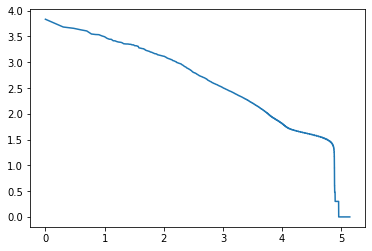

<a href="https://colab.research.google.com/github/pachterlab/CWGFLHGCCHAP_2021/blob/master/notebooks/Preprocessing/ClickTagDemultiplexing/cellRangerClickTagCounts.ipynb" target="_parent"></a>


```
!date
```

    Sat Dec  5 01:21:00 UTC 2020


### **Download Data**


```
import requests
from tqdm import tnrange, tqdm_notebook
def download_file(doi,ext):
    url = 'https://api.datacite.org/dois/'+doi+'/media'
    r = requests.get(url).json()
    netcdf_url = r['data'][0]['attributes']['url']
    r = requests.get(netcdf_url,stream=True)
    #Set file name
    fname = doi.split('/')[-1]+ext
    #Download file with progress bar
    if r.status_code == 403:
        print("File Unavailable")
    if 'content-length' not in r.headers:
        print("Did not get file")
    else:
        with open(fname, 'wb') as f:
            total_length = int(r.headers.get('content-length'))
            pbar = tnrange(int(total_length/1024), unit="B")
            for chunk in r.iter_content(chunk_size=1024):
                if chunk:
                    pbar.update()
                    f.write(chunk)
        return fname
```


```
#70BPbarcodes (ClickTag sequences)
download_file('10.22002/D1.1831','.gz')

#tags1.bam
download_file('10.22002/D1.1815','.gz')

#tags2.bam
download_file('10.22002/D1.1816','.gz')
```

    /usr/local/lib/python3.6/dist-packages/ipykernel_launcher.py:18: TqdmDeprecationWarning: Please use `tqdm.notebook.trange` instead of `tqdm.tnrange`


    HBox(children=(FloatProgress(value=1.0, bar_style='info', max=1.0), HTML(value='')))


    HBox(children=(FloatProgress(value=0.0, max=901767.0), HTML(value='')))


    HBox(children=(FloatProgress(value=0.0, max=901767.0), HTML(value='')))


    'D1.1816.gz'


```
!gunzip *.gz
```


```
!pip install --quiet pysam
!pip install --quiet scanpy
!pip install --quiet fuzzywuzzy
!pip install --quiet biopython
```

         |████████████████████████████████| 10.0MB 5.7MB/s 
         |████████████████████████████████| 7.7MB 6.8MB/s 
         |████████████████████████████████| 122kB 60.6MB/s 
         |████████████████████████████████| 71kB 11.1MB/s 
         |████████████████████████████████| 51kB 8.1MB/s 
    [?25h  Building wheel for sinfo (setup.py) ... [?25l[?25hdone
         |████████████████████████████████| 2.3MB 6.8MB/s 
    [?25h

### **Import Packages**


```
import pysam
import pickle
import os
import csv
import pandas
import numpy as np
from fuzzywuzzy import fuzz
from fuzzywuzzy import process
from Bio import SeqIO
import time
import copy
import matplotlib.pyplot as plt
import scipy.io
import seaborn as sns
from collections import Counter
from collections import defaultdict
from collections import OrderedDict
from itertools import islice
from itertools import combinations
import pandas as pd
import time
import locale
#import Levenshtein
import re
import scanpy as sc
import multiprocessing
```

    /usr/local/lib/python3.6/dist-packages/fuzzywuzzy/fuzz.py:11: UserWarning: Using slow pure-python SequenceMatcher. Install python-Levenshtein to remove this warning
      warnings.warn('Using slow pure-python SequenceMatcher. Install python-Levenshtein to remove this warning')


```
from google.colab import drive
drive.mount('/drive')
```

    Mounted at /drive


```
## Set parameters - below are parameters for 10x 3' v2 chemistry

cell_barcode_length = 16
UMI_length = 10

!mv D1.1831 70BPbarcodes.fa
!mv D1.1815 tags1.bam
!mv D1.1816 tags2.bam
tags = "70BPbarcodes.fa"
CellRangerOut = "tags1.bam"


```


```

def parse_tags(filename):
    odict = OrderedDict()
    for record in SeqIO.parse(filename, "fasta"):
        #odict[row[0].encode('utf-8')] = row[1]
        odict[record.name] = str(record.seq)[28:36]
    return odict


def worker(procnum, unique_lines_full, start, end, celltags, cellbarcodes, return_list):
    """worker function"""
    full_dataframe=pd.DataFrame(index=ab_map.keys(), columns=set([x[:16] for x in unique_lines_full]))
    full_dataframe.fillna(0, inplace=True)
    #variables
    res_table = defaultdict(lambda : defaultdict(int))
    n=0
    for line in unique_lines_full[start:end]:
        cell_barcode = line[0:cell_barcode_length]
        UMI = line[cell_barcode_length:cell_barcode_length+UMI_length]
        BC_UMI = cell_barcode + UMI
        TAG_seq = line[len(BC_UMI):]
        tagpositions = [TAG_seq[i:(i+23)] for i in range(0,10)]
        fuzzpos = process.extractOne("TCGTCGGCAGCGTCAGATGTGTA", tagpositions)
        if fuzzpos[1] > 85:

            pos = TAG_seq.find(fuzzpos[0])
            fuzzbc = process.extractOne(TAG_seq[pos+23:pos+31], list(ab_map.values()))
            if fuzzbc[1] > 85:
                best = list(ab_map.keys())[list(ab_map.values()).index(fuzzbc[0])]
                BC_UMI_TAG = BC_UMI + best
                if BC_UMI_TAG not in UMI_reduce:
                    #print("got one")
                    res_table[cell_barcode][best]+=1
                    full_dataframe.loc[best,cell_barcode]+=1
                    #print(full_dataframe.loc[best,cell_barcode])
                    UMI_reduce.add(BC_UMI_TAG)
        n += 1
        #if(n>5):break
        if(n%20000==0):
            print(n)
            print("elapsed time " + str(time.time()-start))
    if procnum < 5:
        print('hello_world '+cell_barcode)
        print(full_dataframe.loc[:,cell_barcode])
        #put res_table into dataframe
        """worker function"""
        print('worker '+str(procnum) + '\t' + 'start '+str(start) + '\t' + 'end '+str(end))
        print(pd.DataFrame(res_table))
        print(' ')
    return_list.append(full_dataframe)
    return


```


```
ab_map=parse_tags(tags)
```


```
ab_map
```


    OrderedDict([('BC_21', 'AGCAGTTA'),
                 ('BC_22', 'CTTGTACC'),
                 ('BC_23', 'GAACCCGG'),
                 ('BC_24', 'TCGTAGAT'),
                 ('BC_25', 'ACGCGGAA'),
                 ('BC_26', 'CGCTATCC'),
                 ('BC_27', 'GTTGCATG'),
                 ('BC_28', 'TAAATCGT'),
                 ('BC_29', 'ATCGCCAT'),
                 ('BC_30', 'CATAAAGG'),
                 ('BC_31', 'TCACGGTA'),
                 ('BC_32', 'CACTCAAC'),
                 ('BC_33', 'GCTGTGTA'),
                 ('BC_34', 'TTGCGTCG'),
                 ('BC_35', 'ATATGAGA'),
                 ('BC_36', 'CACCTCAG'),
                 ('BC_37', 'GCTACTTC'),
                 ('BC_38', 'TGGGAGCT'),
                 ('BC_39', 'ATCCGGCA'),
                 ('BC_40', 'CCGTTATG')])


### **Count ClickTags lane 1 tags first** 
Will need multiple Colab sessions to complete


```
"Create a set for UMI reduction. Fast way to collapse UMIs"

UMI_reduce=set()
#Creaet result table
res_table=defaultdict(lambda : defaultdict(int))
#set counter
n=0
#set number of reads to process
top_n = None
```


```
"""
This section of code processes the entire genome BAM file.
Proccessing is slow due to multiple fuzzy matching steps
Currently configured for 10x v2 and sample tags used in Gehring et. al 2018
The script iterates through the genome BAM, identifies quality barcode sequences with fuzzywuzzy score > 85, 
then classifies them.
fuzzpos is a constant sequence just upstream of the barcode
fuzzbc is the barcode sequence extracted for classification
"""

#Load TAGS barcodes
ab_map = parse_tags(tags)
#Create a set for UMI reduction. Fast way to check if it already exists
UMI_reduce = set()
#Create result table
res_table = defaultdict(lambda : defaultdict(int))
res_table_sum = defaultdict(lambda : defaultdict(int))
# set counter
n = 0
top_n = None
unique_lines = set()
start = time.time()

samfile = pysam.AlignmentFile(CellRangerOut, "rb")
for read in samfile.fetch(until_eof=True):
    if read.has_tag('CB'):
        line = str(read.get_tag('CB'))[:-2] + read.get_tag('UR') + str(read.query_sequence)
        unique_lines.add(line)    
    if top_n: 
        if top_n < n: break
    n += 1
    if(n%1000000==0):print(n)
    if(n%1000000==0):
        print('elapsed time: ' + str(time.time()-start))
samfile.close()
print(str(n) + ' reads loaded')
print(str(len(unique_lines)) + ' unique reads loaded')

    
    
print("runtime " + str(time.time() - start))
```

    1000000
    elapsed time: 4.597801923751831
    2000000
    elapsed time: 10.547113418579102
    3000000
    elapsed time: 16.278574228286743
    4000000
    elapsed time: 22.130943775177002
    5000000
    elapsed time: 28.186386346817017
    6000000
    elapsed time: 33.99790954589844
    7000000
    elapsed time: 40.27485632896423
    8000000
    elapsed time: 46.15766453742981
    9000000
    elapsed time: 51.997294664382935
    10000000
    elapsed time: 57.882442235946655
    10090668 reads loaded
    9626566 unique reads loaded
    runtime 58.40797400474548


```
# unique_lines = list(unique_lines)
# #unique_lines
```

#### **Run for first half of sequences only (in Colab session)**


```
unique_lines = list(unique_lines)

jobs=[]
manager = multiprocessing.Manager()
return_list = manager.list()
n_threads=4 #4
slicestart=0 
celltags=list(ab_map.keys())
cellbarcodes=list(set([x[:16] for x in unique_lines]))

for job in range(2): 
    #divide up the unique_lines by the number of threads
    #call the worker function, passing positions in unique_lines as input
    sliceend=slicestart+len(unique_lines)//n_threads #len(unique_lines)
    p = multiprocessing.Process(target=worker, args=(job, unique_lines,slicestart, sliceend, celltags, cellbarcodes, return_list))
    jobs.append(p)
    p.start()
    slicestart=sliceend

for p in jobs:
  p.join()
```

    20000
    elapsed time 1607217158.6493077
    20000
    elapsed time 1609623800.100184
    40000
    elapsed time 1607217356.2207532
    40000
    elapsed time 1609623998.0858455
    60000
    elapsed time 1607217554.9690099
    60000
    elapsed time 1609624197.2008579
    80000
    elapsed time 1607217754.1007595
    80000
    elapsed time 1609624396.840754
    100000
    elapsed time 1607217953.7962384
    100000
    elapsed time 1609624598.007182
    120000
    elapsed time 1607218153.5528383
    120000
    elapsed time 1609624798.059268
    140000
    elapsed time 1607218351.4955757
    140000
    elapsed time 1609624996.6735802
    160000
    elapsed time 1607218549.7395768
    160000
    elapsed time 1609625195.8214443
    180000
    elapsed time 1607218748.7075853
    180000
    elapsed time 1609625395.4471507
    200000
    elapsed time 1607218949.7268035
    200000
    elapsed time 1609625596.5210767
    220000
    elapsed time 1607219148.467154
    220000
    elapsed time 1609625795.2260952
    240000
    elapsed time 1607219355.4462204
    240000
    elapsed time 1609626002.5084357
    260000
    elapsed time 1607219554.4192185
    260000
    elapsed time 1609626201.374324
    280000
    elapsed time 1607219755.0427184
    280000
    elapsed time 1609626401.9984698
    300000
    elapsed time 1607219953.2821271
    300000
    elapsed time 1609626600.535543
    320000
    elapsed time 1607220151.0869865
    320000
    elapsed time 1609626798.2511592
    340000
    elapsed time 1607220351.3366995
    340000
    elapsed time 1609626998.3295434
    360000
    elapsed time 1607220551.1527655
    360000
    elapsed time 1609627198.6860874
    380000
    elapsed time 1607220752.130513
    380000
    elapsed time 1609627399.3854003
    400000
    elapsed time 1607220954.4175036
    400000
    elapsed time 1609627602.1186502
    420000
    elapsed time 1607221156.6790268
    420000
    elapsed time 1609627804.5933776
    440000
    elapsed time 1607221355.114039
    440000
    elapsed time 1609628003.7906642
    460000
    elapsed time 1607221552.7707415
    460000
    elapsed time 1609628201.1705523
    480000
    elapsed time 1607221750.5738676
    480000
    elapsed time 1609628399.747488
    500000
    elapsed time 1607221948.6618216
    500000
    elapsed time 1609628597.9220462
    520000
    elapsed time 1607222147.0485594
    520000
    elapsed time 1609628796.7383108
    540000
    elapsed time 1607222345.053462
    540000
    elapsed time 1609628994.9751732
    560000
    elapsed time 1607222542.8546684
    560000
    elapsed time 1609629192.44502
    580000
    elapsed time 1607222739.5807624
    580000
    elapsed time 1609629389.4650004
    600000
    elapsed time 1607222936.615773
    600000
    elapsed time 1609629587.5280075
    620000
    elapsed time 1607223139.1967142
    620000
    elapsed time 1609629789.152309
    640000
    elapsed time 1607223340.2409048
    640000
    elapsed time 1609629989.8184652
    660000
    elapsed time 1607223541.7713459
    660000
    elapsed time 1609630191.0273278
    680000
    elapsed time 1607223741.7415273
    680000
    elapsed time 1609630391.1138718
    700000
    elapsed time 1607223943.4823046
    700000
    elapsed time 1609630593.134094
    720000
    elapsed time 1607224143.8400054
    720000
    elapsed time 1609630793.5609653
    740000
    elapsed time 1607224344.8813748
    740000
    elapsed time 1609630994.4950924
    760000
    elapsed time 1607224545.149754
    760000
    elapsed time 1609631194.2191045
    780000
    elapsed time 1607224745.8899586
    780000
    elapsed time 1609631394.3930347
    800000
    elapsed time 1607224946.170648
    800000
    elapsed time 1609631594.8597946
    820000
    elapsed time 1607225148.0350173
    820000
    elapsed time 1609631796.385447
    840000
    elapsed time 1607225349.1336203
    840000
    elapsed time 1609631997.3272028
    860000
    elapsed time 1607225550.8056433
    860000
    elapsed time 1609632197.393245
    880000
    elapsed time 1607225751.9807503
    880000
    elapsed time 1609632397.9689214
    900000
    elapsed time 1607225952.9858754
    900000
    elapsed time 1609632598.5685248
    920000
    elapsed time 1607226152.6830537
    920000
    elapsed time 1609632797.5964565
    940000
    elapsed time 1607226351.235197
    940000
    elapsed time 1609632996.0711613
    960000
    elapsed time 1607226550.2213883
    960000
    elapsed time 1609633195.1987011
    980000
    elapsed time 1607226749.728357
    980000
    elapsed time 1609633394.471494
    1000000
    elapsed time 1607226950.1985579
    1000000
    elapsed time 1609633595.2667766
    1020000
    elapsed time 1607227154.8183937
    1020000
    elapsed time 1609633799.2332587
    1040000
    elapsed time 1607227363.554685
    1040000
    elapsed time 1609634007.870704
    1060000
    elapsed time 1607227567.4372895
    1060000
    elapsed time 1609634211.7380211
    1080000
    elapsed time 1607227771.6636615
    1080000
    elapsed time 1609634415.4867287
    1100000
    elapsed time 1607227978.2519317
    1100000
    elapsed time 1609634622.576066
    1120000
    elapsed time 1607228179.0641375
    1120000
    elapsed time 1609634822.9432993
    1140000
    elapsed time 1607228378.6308563
    1140000
    elapsed time 1609635022.488299
    1160000
    elapsed time 1607228577.9149346
    1160000
    elapsed time 1609635223.0480676
    1180000
    elapsed time 1607228777.5838509
    1180000
    elapsed time 1609635423.1115956
    1200000
    elapsed time 1607228976.044806
    1200000
    elapsed time 1609635621.969074
    1220000
    elapsed time 1607229174.5252752
    1220000
    elapsed time 1609635820.9623227
    1240000
    elapsed time 1607229375.1757886
    1240000
    elapsed time 1609636021.3631299
    1260000
    elapsed time 1607229578.3090386
    1260000
    elapsed time 1609636224.93122
    1280000
    elapsed time 1607229779.0180907
    1280000
    elapsed time 1609636425.5000918
    1300000
    elapsed time 1607229979.902932
    1300000
    elapsed time 1609636627.1778095
    1320000
    elapsed time 1607230181.3217237
    1320000
    elapsed time 1609636827.9627082
    1340000
    elapsed time 1607230382.7576592
    1340000
    elapsed time 1609637028.833546
    1360000
    elapsed time 1607230584.8033564
    1360000
    elapsed time 1609637230.409098
    1380000
    elapsed time 1607230785.8184884
    1380000
    elapsed time 1609637431.5638711
    1400000
    elapsed time 1607230987.0951345
    1400000
    elapsed time 1609637632.4463804
    1420000
    elapsed time 1607231190.691982
    1420000
    elapsed time 1609637836.3341846
    1440000
    elapsed time 1607231393.0624535
    1440000
    elapsed time 1609638038.8599122
    1460000
    elapsed time 1607231596.3688166
    1460000
    elapsed time 1609638241.4169967
    1480000
    elapsed time 1607231802.9735556
    1480000
    elapsed time 1609638447.8067126
    1500000
    elapsed time 1607232007.086205
    1500000
    elapsed time 1609638651.8485668
    1520000
    elapsed time 1607232208.8686888
    1520000
    elapsed time 1609638853.2345612
    1540000
    elapsed time 1607232409.0543907
    1540000
    elapsed time 1609639053.4593627
    1560000
    elapsed time 1607232608.7290735
    1560000
    elapsed time 1609639252.9439306
    1580000
    elapsed time 1607232808.356418
    1580000
    elapsed time 1609639452.255434
    1600000
    elapsed time 1607233007.7382495
    1600000
    elapsed time 1609639652.3473392
    1620000
    elapsed time 1607233206.8607998
    1620000
    elapsed time 1609639851.3649101
    1640000
    elapsed time 1607233406.517781
    1640000
    elapsed time 1609640050.9053178
    1660000
    elapsed time 1607233605.5285378
    1660000
    elapsed time 1609640250.1368225
    1680000
    elapsed time 1607233804.169205
    1680000
    elapsed time 1609640448.9210117
    1700000
    elapsed time 1607234002.0930557
    1700000
    elapsed time 1609640646.903663
    1720000
    elapsed time 1607234201.1284165
    1720000
    elapsed time 1609640846.0653226
    1740000
    elapsed time 1607234399.1002798
    1740000
    elapsed time 1609641043.9947891
    1760000
    elapsed time 1607234596.090067
    1760000
    elapsed time 1609641241.6389246
    1780000
    elapsed time 1607234794.827758
    1780000
    elapsed time 1609641440.050261
    1800000
    elapsed time 1607234993.2733312
    1800000
    elapsed time 1609641638.8342912
    1820000
    elapsed time 1607235192.9178753
    1820000
    elapsed time 1609641838.3523157
    1840000
    elapsed time 1607235396.5415468
    1840000
    elapsed time 1609642042.5122027
    1860000
    elapsed time 1607235605.3526938
    1860000
    elapsed time 1609642253.5875485
    1880000
    elapsed time 1607235811.3634431
    1880000
    elapsed time 1609642460.4576576
    1900000
    elapsed time 1607236012.8755126
    1900000
    elapsed time 1609642662.9962056
    1920000
    elapsed time 1607236213.6287558
    1920000
    elapsed time 1609642863.7802799
    1940000
    elapsed time 1607236414.1443033
    1940000
    elapsed time 1609643064.0234375
    1960000
    elapsed time 1607236613.9195642
    1960000
    elapsed time 1609643263.686784
    1980000
    elapsed time 1607236812.7440612
    1980000
    elapsed time 1609643461.9838367
    2000000
    elapsed time 1607237012.0858371
    2000000
    elapsed time 1609643661.3980339
    2020000
    elapsed time 1607237213.0788083
    2020000
    elapsed time 1609643863.3997996
    2040000
    elapsed time 1607237414.02057
    2040000
    elapsed time 1609644064.9384024
    2060000
    elapsed time 1607237613.6465182
    2060000
    elapsed time 1609644264.6746166
    2080000
    elapsed time 1607237812.2200918
    2080000
    elapsed time 1609644463.8034441
    2100000
    elapsed time 1607238010.971071
    2100000
    elapsed time 1609644663.227747
    2120000
    elapsed time 1607238211.3211203
    2120000
    elapsed time 1609644863.352618
    2140000
    elapsed time 1607238411.939405
    2140000
    elapsed time 1609645061.886545
    2160000
    elapsed time 1607238612.3432965
    2160000
    elapsed time 1609645260.1960366
    2180000
    elapsed time 1607238812.8248103
    2180000
    elapsed time 1609645458.1664975
    2200000
    elapsed time 1607239012.881237
    2200000
    elapsed time 1609645655.2060056
    2220000
    elapsed time 1609645852.7891774
    2220000
    elapsed time 1607239212.9679544
    2240000
    elapsed time 1609646051.4266906
    2240000
    elapsed time 1607239414.7189775
    2260000
    elapsed time 1609646249.567355
    2260000
    elapsed time 1607239615.6328578
    2280000
    elapsed time 1609646449.2651722
    2280000
    elapsed time 1607239817.049278
    2300000
    elapsed time 1609646650.2944624
    2300000
    elapsed time 1607240019.1658528
    2320000
    elapsed time 1609646851.5002515
    2320000
    elapsed time 1607240220.7791533
    2340000
    elapsed time 1609647053.5378344
    2340000
    elapsed time 1607240423.1520143
    2360000
    elapsed time 1609647255.273361
    2360000
    elapsed time 1607240625.1707504
    2380000
    elapsed time 1609647456.5719955
    2380000
    elapsed time 1607240825.9801376
    2400000
    elapsed time 1609647657.5716383
    2400000
    elapsed time 1607241026.9566917
    hello_world TGTTCCGCATCTCGCT
    BC_21    0
    BC_22    1
    BC_23    0
    BC_24    0
    BC_25    0
    BC_26    0
    BC_27    1
    BC_28    1
    BC_29    0
    BC_30    1
    BC_31    1
    BC_32    1
    BC_33    1
    BC_34    1
    BC_35    1
    BC_36    0
    BC_37    1
    BC_38    2
    BC_39    0
    BC_40    1
    Name: TGTTCCGCATCTCGCT, dtype: int64
    worker 0	start 0	end 2406641
    hello_world CAGTCCTTCCGCATCT
    BC_21    1
    BC_22    0
    BC_23    0
    BC_24    0
    BC_25    1
    BC_26    0
    BC_27    1
    BC_28    2
    BC_29    0
    BC_30    0
    BC_31    1
    BC_32    1
    BC_33    0
    BC_34    3
    BC_35    0
    BC_36    6
    BC_37    2
    BC_38    1
    BC_39    0
    BC_40    0
    Name: CAGTCCTTCCGCATCT, dtype: int64
    worker 1	start 2406641	end 4813282
           GTATCTTCACGAAACG  GCTCTGTTCAACACTG  ...  ACGGCCACAGACGCTC  CAAGGCCGTTCCACTC
    BC_32               2.0               8.0  ...               NaN               NaN
    BC_38               1.0               1.0  ...               NaN               NaN
    BC_29               1.0             365.0  ...               NaN               NaN
    BC_22               3.0               2.0  ...               NaN               NaN
    BC_27               1.0               3.0  ...               NaN               NaN
    BC_36               3.0               5.0  ...               NaN               NaN
    BC_34               4.0               6.0  ...               NaN               1.0
    BC_23               1.0               NaN  ...               NaN               NaN
    BC_28               1.0               NaN  ...               NaN               NaN
    BC_30               3.0             297.0  ...               NaN               NaN
    BC_21               1.0               4.0  ...               NaN               NaN
    BC_40               2.0               3.0  ...               NaN               NaN
    BC_37               1.0               4.0  ...               NaN               NaN
    BC_25               4.0               3.0  ...               NaN               NaN
    BC_35               1.0               NaN  ...               NaN               NaN
    BC_24               1.0               1.0  ...               NaN               NaN
    BC_31               NaN               4.0  ...               NaN               NaN
    BC_33               NaN               1.0  ...               NaN               NaN
    BC_39               NaN               4.0  ...               1.0               NaN
    BC_26               NaN               NaN  ...               NaN               NaN
    
    [20 rows x 114025 columns]
     
           GCATGATGTTGTTTGG  ATTCTACGTGGCCCTA  ...  TCGGGACCAAAGTCAA  GACACGCCATCAGTCA
    BC_29              96.0               1.0  ...               NaN               NaN
    BC_30              84.0               1.0  ...               NaN               NaN
    BC_22               2.0               2.0  ...               NaN               NaN
    BC_26               2.0               2.0  ...               NaN               1.0
    BC_36               8.0               NaN  ...               NaN               NaN
    BC_33               1.0               3.0  ...               NaN               NaN
    BC_34               2.0               NaN  ...               NaN               NaN
    BC_31               1.0               NaN  ...               NaN               NaN
    BC_37               3.0               NaN  ...               NaN               NaN
    BC_25               3.0               4.0  ...               NaN               NaN
    BC_21               2.0               1.0  ...               NaN               NaN
    BC_28               1.0              15.0  ...               1.0               NaN
    BC_23               1.0               NaN  ...               NaN               NaN
    BC_35               2.0               1.0  ...               NaN               NaN
    BC_38               1.0               2.0  ...               NaN               NaN
    BC_32               3.0               1.0  ...               NaN               NaN
    BC_40               1.0               1.0  ...               NaN               NaN
    BC_27               NaN              13.0  ...               NaN               NaN
    BC_24               NaN               NaN  ...               NaN               NaN
    BC_39               NaN               NaN  ...               NaN               NaN
    
    [20 rows x 113875 columns]
     


```
return_list = list(return_list) 
print(return_list)
```

    [       ACGCCAGGTCACTTCC  GATCGATTCCTGTACC  ...  ACTGAACGTCCTCTTG  GGATGTTCATGACATC
    BC_21                 1                 1  ...                 0                 1
    BC_22                 0                 0  ...                 0                 1
    BC_23                 0                 2  ...                 0                 0
    BC_24                 0                 2  ...                 0                 2
    BC_25                 2                 0  ...                 0                 0
    BC_26                 0                 1  ...                 0                 0
    BC_27                 1                 0  ...                 0                 2
    BC_28                 1                 0  ...                 0                 0
    BC_29                 0                 2  ...                 0                 3
    BC_30                 1                 0  ...                 0                 3
    BC_31                 0                 1  ...                 0                 1
    BC_32                 1                 1  ...                 0                 1
    BC_33                 3                 1  ...                 0                 0
    BC_34                 3                 4  ...                 0                 1
    BC_35                 3                 1  ...                 0                 0
    BC_36                 0                 0  ...                 0                 1
    BC_37                 1                 1  ...                 0                 0
    BC_38                 0                 0  ...                 0                 0
    BC_39                 0                 1  ...                 0                 0
    BC_40                 0                 0  ...                 0                 0
    
    [20 rows x 217581 columns],        ACGCCAGGTCACTTCC  GATCGATTCCTGTACC  ...  ACTGAACGTCCTCTTG  GGATGTTCATGACATC
    BC_21                 1                 1  ...                 0                 1
    BC_22                 0                 0  ...                 0                 1
    BC_23                 0                 1  ...                 1                 0
    BC_24                 0                 1  ...                 0                 3
    BC_25                 1                 2  ...                 0                 2
    BC_26                 1                 1  ...                 0                 0
    BC_27                 0                 2  ...                 0                 1
    BC_28                 0                 1  ...                 0                 0
    BC_29                 1                 1  ...                 0                 0
    BC_30                 1                 0  ...                 0                 0
    BC_31                 1                 1  ...                 0                 1
    BC_32                 0                 1  ...                 0                 2
    BC_33                 0                 0  ...                 0                 0
    BC_34                 2                 3  ...                 0                 3
    BC_35                 0                 0  ...                 0                 1
    BC_36                 1                 2  ...                 0                 1
    BC_37                 2                 0  ...                 0                 1
    BC_38                 1                 2  ...                 0                 2
    BC_39                 1                 0  ...                 0                 0
    BC_40                 1                 0  ...                 0                 0
    
    [20 rows x 217581 columns]]


```
print(slicestart)
print(sliceend)
```

    4813282
    4813282


```
with open('/drive/MyDrive/listfile_half.data', 'wb') as filehandle:
    # store the data as binary data stream
    pickle.dump(return_list, filehandle)

```

#### **Run for second half of sequences + to produce output file (in new Colab session)**

Previous code take 6+ hours, and cannot be run in a one full 12 hr Colab session


```
with open('/drive/MyDrive/listfile_half.data', 'rb') as filehandle:
    # read the data as binary data stream
    return_list_half = pickle.load(filehandle)
```


```
unique_lines = list(unique_lines)

jobs=[]
manager = multiprocessing.Manager()
return_list = manager.list()
n_threads=4
slicestart=4813282
celltags=list(ab_map.keys())
cellbarcodes=list(set([x[:16] for x in unique_lines]))

for job in range(2):
    #divide up the unique_lines by the number of threads
    #call the worker function, passing positions in unique_lines as input
    sliceend=slicestart+len(unique_lines)//n_threads #len(unique_lines)
    p = multiprocessing.Process(target=worker, args=(job, unique_lines,slicestart, sliceend, celltags, cellbarcodes, return_list))
    jobs.append(p)
    p.start()
    slicestart=sliceend

for p in jobs:
  p.join()
```

    20000
    elapsed time 1604900781.930157
    20000
    elapsed time 1602494141.5331197
    40000
    elapsed time 1604900976.405149
    40000
    elapsed time 1602494336.0947578
    60000
    elapsed time 1604901171.1862013
    60000
    elapsed time 1602494531.727356
    80000
    elapsed time 1604901367.687993
    80000
    elapsed time 1602494728.6382613
    100000
    elapsed time 1604901564.7475052
    100000
    elapsed time 1602494925.9747043
    120000
    elapsed time 1604901759.5490155
    120000
    elapsed time 1602495121.3718498
    140000
    elapsed time 1604901955.6648324
    140000
    elapsed time 1602495318.523215
    160000
    elapsed time 1604902149.6732965
    160000
    elapsed time 1602495513.3172038
    180000
    elapsed time 1604902341.0362396
    180000
    elapsed time 1602495705.0309124
    200000
    elapsed time 1604902531.9492433
    200000
    elapsed time 1602495896.0900748
    220000
    elapsed time 1604902722.5502412
    220000
    elapsed time 1602496087.7188754
    240000
    elapsed time 1604902913.428561
    240000
    elapsed time 1602496279.5641665
    260000
    elapsed time 1604903103.6956732
    260000
    elapsed time 1602496470.662639
    280000
    elapsed time 1604903293.8989537
    280000
    elapsed time 1602496661.2412426
    300000
    elapsed time 1604903483.902002
    300000
    elapsed time 1602496852.2500613
    320000
    elapsed time 1604903674.45328
    320000
    elapsed time 1602497042.9841802
    340000
    elapsed time 1604903865.198792
    340000
    elapsed time 1602497234.3995502
    360000
    elapsed time 1604904055.7011628
    360000
    elapsed time 1602497425.1071546
    380000
    elapsed time 1604904246.3362856
    380000
    elapsed time 1602497616.1412983
    400000
    elapsed time 1604904436.9392576
    400000
    elapsed time 1602497807.6668243
    420000
    elapsed time 1604904627.4018893
    420000
    elapsed time 1602497999.227584
    440000
    elapsed time 1604904818.4878716
    440000
    elapsed time 1602498190.1968963
    460000
    elapsed time 1604905009.1114085
    460000
    elapsed time 1602498381.3575594
    480000
    elapsed time 1604905200.7364612
    480000
    elapsed time 1602498574.1276155
    500000
    elapsed time 1604905392.5179725
    500000
    elapsed time 1602498766.456498
    520000
    elapsed time 1604905584.43026
    520000
    elapsed time 1602498958.5372164
    540000
    elapsed time 1604905774.8031647
    540000
    elapsed time 1602499149.0227447
    560000
    elapsed time 1604905964.7745461
    560000
    elapsed time 1602499338.8615296
    580000
    elapsed time 1604906154.4028816
    580000
    elapsed time 1602499529.862725
    600000
    elapsed time 1604906344.262453
    600000
    elapsed time 1602499720.1585977
    620000
    elapsed time 1604906534.3167276
    620000
    elapsed time 1602499910.8184505
    640000
    elapsed time 1604906724.0722265
    640000
    elapsed time 1602500102.0963655
    660000
    elapsed time 1604906913.7363899
    660000
    elapsed time 1602500292.5235686
    680000
    elapsed time 1604907104.1873062
    680000
    elapsed time 1602500483.60224
    700000
    elapsed time 1604907295.2330961
    700000
    elapsed time 1602500674.740523
    720000
    elapsed time 1604907487.1325018
    720000
    elapsed time 1602500866.4472654
    740000
    elapsed time 1604907678.6235142
    740000
    elapsed time 1602501058.3442483
    760000
    elapsed time 1604907869.9185011
    760000
    elapsed time 1602501250.5739918
    780000
    elapsed time 1604908060.775295
    780000
    elapsed time 1602501441.2641902
    800000
    elapsed time 1604908251.51696
    800000
    elapsed time 1602501632.779743
    820000
    elapsed time 1604908442.2980165
    820000
    elapsed time 1602501823.9337182
    840000
    elapsed time 1604908632.7441833
    840000
    elapsed time 1602502015.0913072
    860000
    elapsed time 1604908823.289204
    860000
    elapsed time 1602502205.8072927
    880000
    elapsed time 1604909013.781057
    880000
    elapsed time 1602502396.2310574
    900000
    elapsed time 1604909204.7188907
    900000
    elapsed time 1602502587.3022327
    920000
    elapsed time 1604909395.032882
    920000
    elapsed time 1602502777.2802217
    940000
    elapsed time 1604909585.3168807
    940000
    elapsed time 1602502967.8451376
    960000
    elapsed time 1604909775.91182
    960000
    elapsed time 1602503158.8239367
    980000
    elapsed time 1604909966.2273598
    980000
    elapsed time 1602503349.3607771
    1000000
    elapsed time 1604910157.0227532
    1000000
    elapsed time 1602503540.2692354
    1020000
    elapsed time 1604910347.3618138
    1020000
    elapsed time 1602503731.5475576
    1040000
    elapsed time 1604910540.3773456
    1040000
    elapsed time 1602503924.7782419
    1060000
    elapsed time 1604910734.2820263
    1060000
    elapsed time 1602504118.6797342
    1080000
    elapsed time 1604910927.7418294
    1080000
    elapsed time 1602504312.1508076
    1100000
    elapsed time 1604911118.6235182
    1100000
    elapsed time 1602504502.7743735
    1120000
    elapsed time 1604911308.8813536
    1120000
    elapsed time 1602504692.616159
    1140000
    elapsed time 1604911498.7753184
    1140000
    elapsed time 1602504882.6296313
    1160000
    elapsed time 1604911688.7600753
    1160000
    elapsed time 1602505072.995988
    1180000
    elapsed time 1604911878.4511292
    1180000
    elapsed time 1602505263.1756067
    1200000
    elapsed time 1604912069.1975
    1200000
    elapsed time 1602505453.671279
    1220000
    elapsed time 1604912260.1009543
    1220000
    elapsed time 1602505645.0191848
    1240000
    elapsed time 1604912449.8192527
    1240000
    elapsed time 1602505835.3030243
    1260000
    elapsed time 1604912639.8102374
    1260000
    elapsed time 1602506025.0872595
    1280000
    elapsed time 1604912829.8120747
    1280000
    elapsed time 1602506215.6591363
    1300000
    elapsed time 1604913019.5492058
    1300000
    elapsed time 1602506405.678087
    1320000
    elapsed time 1604913210.4718328
    1320000
    elapsed time 1602506596.4356601
    1340000
    elapsed time 1604913400.8694565
    1340000
    elapsed time 1602506787.6629934
    1360000
    elapsed time 1604913591.4823189
    1360000
    elapsed time 1602506977.9442494
    1380000
    elapsed time 1604913781.849326
    1380000
    elapsed time 1602507168.2535546
    1400000
    elapsed time 1604913972.063731
    1400000
    elapsed time 1602507358.6972373
    1420000
    elapsed time 1604914162.0481064
    1420000
    elapsed time 1602507548.38224
    1440000
    elapsed time 1604914351.4594893
    1440000
    elapsed time 1602507738.732419
    1460000
    elapsed time 1604914540.6226256
    1460000
    elapsed time 1602507929.0790336
    1480000
    elapsed time 1604914731.6677914
    1480000
    elapsed time 1602508121.013195
    1500000
    elapsed time 1604914924.6761243
    1500000
    elapsed time 1602508314.6999092
    1520000
    elapsed time 1604915117.7005863
    1520000
    elapsed time 1602508508.0381775
    1540000
    elapsed time 1604915310.7073936
    1540000
    elapsed time 1602508701.3366337
    1560000
    elapsed time 1604915503.68986
    1560000
    elapsed time 1602508894.372776
    1580000
    elapsed time 1604915696.2269292
    1580000
    elapsed time 1602509087.5519812
    1600000
    elapsed time 1604915889.6187034
    1600000
    elapsed time 1602509281.2504542
    1620000
    elapsed time 1604916082.2322247
    1620000
    elapsed time 1602509474.8468542
    1640000
    elapsed time 1604916275.1750574
    1640000
    elapsed time 1602509667.9757013
    1660000
    elapsed time 1604916468.2800908
    1660000
    elapsed time 1602509862.2613666
    1680000
    elapsed time 1604916662.7111714
    1680000
    elapsed time 1602510056.402684
    1700000
    elapsed time 1604916856.7249112
    1700000
    elapsed time 1602510250.9160507
    1720000
    elapsed time 1604917049.8959637
    1720000
    elapsed time 1602510444.344782
    1740000
    elapsed time 1604917243.854627
    1740000
    elapsed time 1602510638.9618545
    1760000
    elapsed time 1604917438.1598663
    1760000
    elapsed time 1602510833.2934473
    1780000
    elapsed time 1604917631.875854
    1780000
    elapsed time 1602511027.2038805
    1800000
    elapsed time 1604917825.340956
    1800000
    elapsed time 1602511222.1425085
    1820000
    elapsed time 1604918019.914147
    1820000
    elapsed time 1602511417.6988146
    1840000
    elapsed time 1604918215.7520797
    1840000
    elapsed time 1602511613.443927
    1860000
    elapsed time 1604918410.3951519
    1860000
    elapsed time 1602511808.391877
    1880000
    elapsed time 1604918604.9945383
    1880000
    elapsed time 1602512002.7907386
    1900000
    elapsed time 1604918799.6783664
    1900000
    elapsed time 1602512197.032335
    1920000
    elapsed time 1604918994.5731943
    1920000
    elapsed time 1602512391.3457139
    1940000
    elapsed time 1604919189.8799696
    1940000
    elapsed time 1602512586.527124
    1960000
    elapsed time 1604919384.718015
    1960000
    elapsed time 1602512782.5142808
    1980000
    elapsed time 1604919580.3167877
    1980000
    elapsed time 1602512977.8139184
    2000000
    elapsed time 1604919775.0261803
    2000000
    elapsed time 1602513172.5653138
    2020000
    elapsed time 1604919970.0167217
    2020000
    elapsed time 1602513366.9443853
    2040000
    elapsed time 1604920164.7191594
    2040000
    elapsed time 1602513561.2924144
    2060000
    elapsed time 1604920359.406177
    2060000
    elapsed time 1602513755.9535697
    2080000
    elapsed time 1604920554.5724483
    2080000
    elapsed time 1602513951.1725936
    2100000
    elapsed time 1604920747.2836857
    2100000
    elapsed time 1602514145.8102548
    2120000
    elapsed time 1604920940.896087
    2120000
    elapsed time 1602514339.3499079
    2140000
    elapsed time 1604921134.7296624
    2140000
    elapsed time 1602514532.8702374
    2160000
    elapsed time 1604921328.223704
    2160000
    elapsed time 1602514726.486122
    2180000
    elapsed time 1604921521.5263808
    2180000
    elapsed time 1602514919.9606144
    2200000
    elapsed time 1604921716.4572384
    2200000
    elapsed time 1602515114.2474492
    2220000
    elapsed time 1604921911.6069136
    2220000
    elapsed time 1602515309.7507784
    2240000
    elapsed time 1604922106.6113505
    2240000
    elapsed time 1602515504.4826574
    2260000
    elapsed time 1604922301.1995316
    2260000
    elapsed time 1602515699.377269
    2280000
    elapsed time 1604922495.1811466
    2280000
    elapsed time 1602515892.7404208
    2300000
    elapsed time 1604922687.6975992
    2300000
    elapsed time 1602516085.4124577
    2320000
    elapsed time 1604922881.940239
    2320000
    elapsed time 1602516280.7507796
    2340000
    elapsed time 1604923076.8925328
    2340000
    elapsed time 1602516476.4695802
    2360000
    elapsed time 1604923271.8825052
    2360000
    elapsed time 1602516671.4680882
    2380000
    elapsed time 1604923466.6667602
    2380000
    elapsed time 1602516866.6683342
    2400000
    elapsed time 1604923661.786425
    2400000
    elapsed time 1602517062.0052307
    hello_world AACCGCGGTCCATCCT
    BC_21    3
    BC_22    3
    BC_23    1
    BC_24    4
    BC_25    7
    BC_26    1
    BC_27    2
    BC_28    2
    BC_29    5
    BC_30    4
    BC_31    3
    BC_32    1
    BC_33    4
    BC_34    5
    BC_35    4
    BC_36    1
    BC_37    5
    BC_38    0
    BC_39    3
    BC_40    4
    Name: AACCGCGGTCCATCCT, dtype: int64
    worker 0	start 4813282	end 7219923
           TCGGTAAGTAGCCTCG  TACGGGCAGTATTGGA  ...  TGGGAAGTCGTTGCCT  ACTGTCCCACTTAAGC
    BC_34               1.0               3.0  ...               1.0               NaN
    BC_33               1.0               NaN  ...               NaN               NaN
    BC_26               NaN               3.0  ...               NaN               NaN
    BC_39               NaN               2.0  ...               NaN               NaN
    BC_36               NaN               3.0  ...               NaN               NaN
    BC_37               NaN               1.0  ...               NaN               NaN
    BC_38               NaN               2.0  ...               NaN               1.0
    BC_35               NaN               1.0  ...               NaN               NaN
    BC_22               NaN               1.0  ...               NaN               NaN
    BC_25               NaN               1.0  ...               NaN               NaN
    BC_29               NaN               1.0  ...               NaN               NaN
    BC_32               NaN               2.0  ...               NaN               NaN
    BC_31               NaN               1.0  ...               NaN               NaN
    BC_27               NaN               2.0  ...               NaN               NaN
    BC_21               NaN               NaN  ...               NaN               NaN
    BC_24               NaN               NaN  ...               NaN               NaN
    BC_23               NaN               NaN  ...               NaN               NaN
    BC_28               NaN               NaN  ...               NaN               NaN
    BC_40               NaN               NaN  ...               NaN               NaN
    BC_30               NaN               NaN  ...               NaN               NaN
    
    [20 rows x 114036 columns]
     
    hello_world CAACCAATCAAAGACA
    BC_21      3
    BC_22      4
    BC_23      0
    BC_24      3
    BC_25    100
    BC_26     82
    BC_27     24
    BC_28     26
    BC_29      2
    BC_30      1
    BC_31      1
    BC_32      0
    BC_33      0
    BC_34      2
    BC_35      0
    BC_36      1
    BC_37      2
    BC_38      1
    BC_39      1
    BC_40      1
    Name: CAACCAATCAAAGACA, dtype: int64
    worker 1	start 7219923	end 9626564
           CCTAGCTAGATCCCAT  AACTCAGCAGCAGTTT  ...  TCAATCTCAATCACAC  AGCGGTCGTGATGTCT
    BC_29              17.0               5.0  ...               NaN               NaN
    BC_25              43.0               1.0  ...               NaN               NaN
    BC_39               2.0               NaN  ...               NaN               NaN
    BC_33               2.0               NaN  ...               NaN               NaN
    BC_26              24.0               2.0  ...               NaN               1.0
    BC_35               1.0               1.0  ...               NaN               NaN
    BC_30              12.0               NaN  ...               NaN               NaN
    BC_21               4.0               NaN  ...               NaN               NaN
    BC_23               1.0               1.0  ...               NaN               NaN
    BC_34               4.0               2.0  ...               NaN               NaN
    BC_27               2.0               NaN  ...               NaN               NaN
    BC_36               3.0               1.0  ...               1.0               NaN
    BC_38               2.0               1.0  ...               NaN               NaN
    BC_22               1.0               NaN  ...               NaN               NaN
    BC_40               2.0               2.0  ...               NaN               NaN
    BC_31               1.0               3.0  ...               NaN               NaN
    BC_37               2.0               NaN  ...               NaN               NaN
    BC_24               2.0               1.0  ...               NaN               NaN
    BC_28               NaN               1.0  ...               NaN               NaN
    BC_32               NaN               NaN  ...               NaN               NaN
    
    [20 rows x 114000 columns]
     


```
pd.DataFrame(res_table)
```


<div>
<style scoped>
    .dataframe tbody tr th:only-of-type {
        vertical-align: middle;
    }

    .dataframe tbody tr th {
        vertical-align: top;
    }

    .dataframe thead th {
        text-align: right;
    }
</style>
<table border="1" class="dataframe">
  <thead>
    <tr style="text-align: right;">
      <th></th>
    </tr>
  </thead>
  <tbody>
  </tbody>
</table>
</div>


```
final_df=pd.DataFrame(index=ab_map.keys(), columns=set([x[:16] for x in unique_lines]))
final_df.fillna(0,inplace=True)
```


```
final_df = return_list[0].fillna(0) + return_list_half[0].fillna(0)
```


```
final_df.head()
```


<div>
<style scoped>
    .dataframe tbody tr th:only-of-type {
        vertical-align: middle;
    }

    .dataframe tbody tr th {
        vertical-align: top;
    }

    .dataframe thead th {
        text-align: right;
    }
</style>
<table border="1" class="dataframe">
  <thead>
    <tr style="text-align: right;">
      <th></th>
      <th>AAACCTGAGAAACCAT</th>
      <th>AAACCTGAGAAACCGC</th>
      <th>AAACCTGAGAACAACT</th>
      <th>AAACCTGAGAACTCGG</th>
      <th>AAACCTGAGAAGAAGC</th>
      <th>AAACCTGAGAATCTCC</th>
      <th>AAACCTGAGACAAAGG</th>
      <th>AAACCTGAGACAATAC</th>
      <th>AAACCTGAGACAGGCT</th>
      <th>AAACCTGAGACCCACC</th>
      <th>AAACCTGAGACTACAA</th>
      <th>AAACCTGAGACTAGAT</th>
      <th>AAACCTGAGACTAGGC</th>
      <th>AAACCTGAGAGAACAG</th>
      <th>AAACCTGAGAGACTAT</th>
      <th>AAACCTGAGAGACTTA</th>
      <th>AAACCTGAGAGCCTAG</th>
      <th>AAACCTGAGAGCTTCT</th>
      <th>AAACCTGAGAGGTTAT</th>
      <th>AAACCTGAGAGTAATC</th>
      <th>AAACCTGAGAGTCTGG</th>
      <th>AAACCTGAGAGTGACC</th>
      <th>AAACCTGAGATCACGG</th>
      <th>AAACCTGAGATCCCGC</th>
      <th>AAACCTGAGATCGATA</th>
      <th>AAACCTGAGATGCCAG</th>
      <th>AAACCTGAGATGTAAC</th>
      <th>AAACCTGAGATGTTAG</th>
      <th>AAACCTGAGCAAATCA</th>
      <th>AAACCTGAGCAGACTG</th>
      <th>AAACCTGAGCAGCGTA</th>
      <th>AAACCTGAGCCACTAT</th>
      <th>AAACCTGAGCCAGGAT</th>
      <th>AAACCTGAGCCATCGC</th>
      <th>AAACCTGAGCCCAACC</th>
      <th>AAACCTGAGCCCAATT</th>
      <th>AAACCTGAGCCCTAAT</th>
      <th>AAACCTGAGCCGATTT</th>
      <th>AAACCTGAGCCGTCGT</th>
      <th>AAACCTGAGCCTATGT</th>
      <th>...</th>
      <th>TTTGTCATCGGGAGTA</th>
      <th>TTTGTCATCGGTTAAC</th>
      <th>TTTGTCATCGTAGGTT</th>
      <th>TTTGTCATCGTCACGG</th>
      <th>TTTGTCATCGTCCAGG</th>
      <th>TTTGTCATCGTGACAT</th>
      <th>TTTGTCATCGTGGGAA</th>
      <th>TTTGTCATCGTGGTCG</th>
      <th>TTTGTCATCGTTGACA</th>
      <th>TTTGTCATCGTTTATC</th>
      <th>TTTGTCATCTAACCGA</th>
      <th>TTTGTCATCTAACGGT</th>
      <th>TTTGTCATCTACGAGT</th>
      <th>TTTGTCATCTAGAGTC</th>
      <th>TTTGTCATCTAGCACA</th>
      <th>TTTGTCATCTCAAACG</th>
      <th>TTTGTCATCTCAAGTG</th>
      <th>TTTGTCATCTCCGGTT</th>
      <th>TTTGTCATCTCTGCTG</th>
      <th>TTTGTCATCTCTGTCG</th>
      <th>TTTGTCATCTGAGTGT</th>
      <th>TTTGTCATCTGATTCT</th>
      <th>TTTGTCATCTGCAAGT</th>
      <th>TTTGTCATCTGCCAGG</th>
      <th>TTTGTCATCTGCGACG</th>
      <th>TTTGTCATCTGCGTAA</th>
      <th>TTTGTCATCTGTACGA</th>
      <th>TTTGTCATCTGTCTAT</th>
      <th>TTTGTCATCTGTGCAA</th>
      <th>TTTGTCATCTGTTGAG</th>
      <th>TTTGTCATCTGTTTGT</th>
      <th>TTTGTCATCTTAACCT</th>
      <th>TTTGTCATCTTAGAGC</th>
      <th>TTTGTCATCTTCAACT</th>
      <th>TTTGTCATCTTCATGT</th>
      <th>TTTGTCATCTTCGAGA</th>
      <th>TTTGTCATCTTCTGGC</th>
      <th>TTTGTCATCTTGCATT</th>
      <th>TTTGTCATCTTGTCAT</th>
      <th>TTTGTCATCTTTCCTC</th>
    </tr>
  </thead>
  <tbody>
    <tr>
      <th>BC_21</th>
      <td>0</td>
      <td>3</td>
      <td>1</td>
      <td>5</td>
      <td>0</td>
      <td>0</td>
      <td>0</td>
      <td>0</td>
      <td>0</td>
      <td>0</td>
      <td>0</td>
      <td>0</td>
      <td>0</td>
      <td>0</td>
      <td>0</td>
      <td>0</td>
      <td>4</td>
      <td>0</td>
      <td>1</td>
      <td>0</td>
      <td>0</td>
      <td>0</td>
      <td>0</td>
      <td>0</td>
      <td>0</td>
      <td>0</td>
      <td>1</td>
      <td>2</td>
      <td>0</td>
      <td>0</td>
      <td>0</td>
      <td>2</td>
      <td>3</td>
      <td>2</td>
      <td>0</td>
      <td>0</td>
      <td>0</td>
      <td>4</td>
      <td>0</td>
      <td>3</td>
      <td>...</td>
      <td>0</td>
      <td>0</td>
      <td>6</td>
      <td>1</td>
      <td>0</td>
      <td>0</td>
      <td>0</td>
      <td>0</td>
      <td>0</td>
      <td>0</td>
      <td>4</td>
      <td>7</td>
      <td>0</td>
      <td>4</td>
      <td>0</td>
      <td>0</td>
      <td>0</td>
      <td>0</td>
      <td>3</td>
      <td>2</td>
      <td>2</td>
      <td>0</td>
      <td>1</td>
      <td>0</td>
      <td>0</td>
      <td>1</td>
      <td>0</td>
      <td>0</td>
      <td>0</td>
      <td>0</td>
      <td>4</td>
      <td>0</td>
      <td>0</td>
      <td>0</td>
      <td>0</td>
      <td>0</td>
      <td>0</td>
      <td>0</td>
      <td>0</td>
      <td>0</td>
    </tr>
    <tr>
      <th>BC_22</th>
      <td>0</td>
      <td>1</td>
      <td>6</td>
      <td>4</td>
      <td>0</td>
      <td>0</td>
      <td>2</td>
      <td>0</td>
      <td>0</td>
      <td>0</td>
      <td>0</td>
      <td>0</td>
      <td>0</td>
      <td>0</td>
      <td>0</td>
      <td>0</td>
      <td>4</td>
      <td>0</td>
      <td>2</td>
      <td>0</td>
      <td>0</td>
      <td>0</td>
      <td>0</td>
      <td>0</td>
      <td>0</td>
      <td>0</td>
      <td>3</td>
      <td>4</td>
      <td>0</td>
      <td>0</td>
      <td>1</td>
      <td>5</td>
      <td>2</td>
      <td>2</td>
      <td>0</td>
      <td>0</td>
      <td>0</td>
      <td>2</td>
      <td>3</td>
      <td>0</td>
      <td>...</td>
      <td>0</td>
      <td>0</td>
      <td>1</td>
      <td>2</td>
      <td>0</td>
      <td>0</td>
      <td>0</td>
      <td>0</td>
      <td>0</td>
      <td>0</td>
      <td>2</td>
      <td>2</td>
      <td>0</td>
      <td>4</td>
      <td>0</td>
      <td>0</td>
      <td>0</td>
      <td>1</td>
      <td>3</td>
      <td>0</td>
      <td>6</td>
      <td>0</td>
      <td>1</td>
      <td>0</td>
      <td>0</td>
      <td>5</td>
      <td>0</td>
      <td>0</td>
      <td>0</td>
      <td>0</td>
      <td>0</td>
      <td>0</td>
      <td>0</td>
      <td>0</td>
      <td>0</td>
      <td>0</td>
      <td>0</td>
      <td>0</td>
      <td>0</td>
      <td>0</td>
    </tr>
    <tr>
      <th>BC_23</th>
      <td>0</td>
      <td>0</td>
      <td>1</td>
      <td>1</td>
      <td>0</td>
      <td>0</td>
      <td>0</td>
      <td>0</td>
      <td>0</td>
      <td>0</td>
      <td>0</td>
      <td>0</td>
      <td>0</td>
      <td>0</td>
      <td>0</td>
      <td>0</td>
      <td>3</td>
      <td>0</td>
      <td>0</td>
      <td>0</td>
      <td>0</td>
      <td>0</td>
      <td>0</td>
      <td>0</td>
      <td>0</td>
      <td>0</td>
      <td>0</td>
      <td>2</td>
      <td>0</td>
      <td>0</td>
      <td>1</td>
      <td>0</td>
      <td>1</td>
      <td>1</td>
      <td>0</td>
      <td>0</td>
      <td>0</td>
      <td>0</td>
      <td>0</td>
      <td>3</td>
      <td>...</td>
      <td>0</td>
      <td>0</td>
      <td>2</td>
      <td>1</td>
      <td>0</td>
      <td>1</td>
      <td>0</td>
      <td>0</td>
      <td>0</td>
      <td>0</td>
      <td>1</td>
      <td>2</td>
      <td>0</td>
      <td>0</td>
      <td>0</td>
      <td>0</td>
      <td>0</td>
      <td>0</td>
      <td>0</td>
      <td>0</td>
      <td>2</td>
      <td>0</td>
      <td>1</td>
      <td>0</td>
      <td>0</td>
      <td>0</td>
      <td>0</td>
      <td>0</td>
      <td>0</td>
      <td>0</td>
      <td>0</td>
      <td>0</td>
      <td>0</td>
      <td>0</td>
      <td>0</td>
      <td>0</td>
      <td>0</td>
      <td>0</td>
      <td>0</td>
      <td>0</td>
    </tr>
    <tr>
      <th>BC_24</th>
      <td>0</td>
      <td>1</td>
      <td>0</td>
      <td>3</td>
      <td>0</td>
      <td>0</td>
      <td>1</td>
      <td>0</td>
      <td>0</td>
      <td>0</td>
      <td>0</td>
      <td>0</td>
      <td>0</td>
      <td>0</td>
      <td>0</td>
      <td>0</td>
      <td>2</td>
      <td>0</td>
      <td>5</td>
      <td>0</td>
      <td>0</td>
      <td>0</td>
      <td>0</td>
      <td>0</td>
      <td>0</td>
      <td>0</td>
      <td>1</td>
      <td>5</td>
      <td>0</td>
      <td>1</td>
      <td>0</td>
      <td>3</td>
      <td>2</td>
      <td>1</td>
      <td>0</td>
      <td>0</td>
      <td>0</td>
      <td>2</td>
      <td>5</td>
      <td>3</td>
      <td>...</td>
      <td>0</td>
      <td>0</td>
      <td>2</td>
      <td>0</td>
      <td>0</td>
      <td>0</td>
      <td>0</td>
      <td>0</td>
      <td>0</td>
      <td>0</td>
      <td>1</td>
      <td>5</td>
      <td>0</td>
      <td>2</td>
      <td>0</td>
      <td>0</td>
      <td>0</td>
      <td>1</td>
      <td>4</td>
      <td>0</td>
      <td>6</td>
      <td>0</td>
      <td>3</td>
      <td>0</td>
      <td>0</td>
      <td>4</td>
      <td>0</td>
      <td>0</td>
      <td>0</td>
      <td>0</td>
      <td>2</td>
      <td>0</td>
      <td>0</td>
      <td>0</td>
      <td>0</td>
      <td>0</td>
      <td>0</td>
      <td>0</td>
      <td>0</td>
      <td>0</td>
    </tr>
    <tr>
      <th>BC_25</th>
      <td>0</td>
      <td>1</td>
      <td>2</td>
      <td>2</td>
      <td>0</td>
      <td>0</td>
      <td>1</td>
      <td>0</td>
      <td>0</td>
      <td>0</td>
      <td>0</td>
      <td>0</td>
      <td>0</td>
      <td>0</td>
      <td>0</td>
      <td>0</td>
      <td>4</td>
      <td>0</td>
      <td>3</td>
      <td>0</td>
      <td>0</td>
      <td>0</td>
      <td>0</td>
      <td>0</td>
      <td>0</td>
      <td>0</td>
      <td>4</td>
      <td>11</td>
      <td>0</td>
      <td>0</td>
      <td>2</td>
      <td>1</td>
      <td>1</td>
      <td>2</td>
      <td>0</td>
      <td>0</td>
      <td>0</td>
      <td>2</td>
      <td>0</td>
      <td>1</td>
      <td>...</td>
      <td>0</td>
      <td>0</td>
      <td>4</td>
      <td>1</td>
      <td>0</td>
      <td>0</td>
      <td>0</td>
      <td>0</td>
      <td>0</td>
      <td>0</td>
      <td>2</td>
      <td>366</td>
      <td>0</td>
      <td>1</td>
      <td>0</td>
      <td>0</td>
      <td>0</td>
      <td>2</td>
      <td>1</td>
      <td>4</td>
      <td>5</td>
      <td>0</td>
      <td>4</td>
      <td>0</td>
      <td>0</td>
      <td>2</td>
      <td>0</td>
      <td>0</td>
      <td>0</td>
      <td>0</td>
      <td>1</td>
      <td>0</td>
      <td>0</td>
      <td>0</td>
      <td>0</td>
      <td>0</td>
      <td>0</td>
      <td>0</td>
      <td>0</td>
      <td>0</td>
    </tr>
  </tbody>
</table>
<p>5 rows × 217581 columns</p>
</div>


```
res_matrix=copy.deepcopy(final_df)
sortedREAP_dtf = copy.deepcopy(res_matrix.sum())
sortedREAP_dtf = sortedREAP_dtf.sort_values(ascending=False)
plt.plot(np.log10(range(len(sortedREAP_dtf))), sortedREAP_dtf.apply(np.log10))
plt.show()
```

    /usr/local/lib/python3.6/dist-packages/ipykernel_launcher.py:4: RuntimeWarning: divide by zero encountered in log10
      after removing the cwd from sys.path.


```
"""
Have a look at the data
Columns of the matrix are cells
Rows are tag counts for each cell
Only 8 of twenty possible tags were used in this experiment (2 tags for each of 10 samples)
"""
res_matrix.fillna(0, inplace=True)
res_matrix.loc[:,sortedREAP_dtf.index[6000:6020]]
```


<div>
<style scoped>
    .dataframe tbody tr th:only-of-type {
        vertical-align: middle;
    }

    .dataframe tbody tr th {
        vertical-align: top;
    }

    .dataframe thead th {
        text-align: right;
    }
</style>
<table border="1" class="dataframe">
  <thead>
    <tr style="text-align: right;">
      <th></th>
      <th>CATCAAGAGCTCCCAG</th>
      <th>CCTTCCCTCCAGAAGG</th>
      <th>TCTTCGGCACGAAACG</th>
      <th>CTACACCAGACTAAGT</th>
      <th>GCACTCTGTCTACCTC</th>
      <th>AAACCTGCAAGCCATT</th>
      <th>CATGACATCTCAACTT</th>
      <th>CTGTGCTTCTCGATGA</th>
      <th>TGGCTGGAGCCAGTAG</th>
      <th>TGGACGCCATGGGAAC</th>
      <th>ACATACGAGTTCCACA</th>
      <th>TACCTATCATGCATGT</th>
      <th>CACAGGCCAGCCTGTG</th>
      <th>CTCGGAGGTAAGTGGC</th>
      <th>GTGTGCGAGGTAAACT</th>
      <th>CGGACTGAGCCAGAAC</th>
      <th>TAGTGGTAGCCTTGAT</th>
      <th>AGATTGCCAGACAGGT</th>
      <th>TACTCGCGTCTCTCGT</th>
      <th>TGGCCAGTCTGCTGTC</th>
    </tr>
  </thead>
  <tbody>
    <tr>
      <th>BC_21</th>
      <td>12</td>
      <td>3</td>
      <td>1</td>
      <td>3</td>
      <td>3</td>
      <td>1</td>
      <td>6</td>
      <td>6</td>
      <td>6</td>
      <td>3</td>
      <td>3</td>
      <td>34</td>
      <td>1</td>
      <td>3</td>
      <td>1</td>
      <td>6</td>
      <td>3</td>
      <td>0</td>
      <td>2</td>
      <td>1</td>
    </tr>
    <tr>
      <th>BC_22</th>
      <td>2</td>
      <td>4</td>
      <td>1</td>
      <td>3</td>
      <td>3</td>
      <td>6</td>
      <td>4</td>
      <td>1</td>
      <td>7</td>
      <td>1</td>
      <td>1</td>
      <td>23</td>
      <td>0</td>
      <td>3</td>
      <td>4</td>
      <td>4</td>
      <td>4</td>
      <td>0</td>
      <td>3</td>
      <td>1</td>
    </tr>
    <tr>
      <th>BC_23</th>
      <td>3</td>
      <td>2</td>
      <td>1</td>
      <td>0</td>
      <td>16</td>
      <td>1</td>
      <td>8</td>
      <td>3</td>
      <td>2</td>
      <td>2</td>
      <td>1</td>
      <td>3</td>
      <td>1</td>
      <td>0</td>
      <td>0</td>
      <td>0</td>
      <td>3</td>
      <td>2</td>
      <td>1</td>
      <td>0</td>
    </tr>
    <tr>
      <th>BC_24</th>
      <td>4</td>
      <td>3</td>
      <td>1</td>
      <td>3</td>
      <td>37</td>
      <td>1</td>
      <td>4</td>
      <td>3</td>
      <td>2</td>
      <td>2</td>
      <td>1</td>
      <td>4</td>
      <td>2</td>
      <td>1</td>
      <td>2</td>
      <td>4</td>
      <td>1</td>
      <td>2</td>
      <td>2</td>
      <td>0</td>
    </tr>
    <tr>
      <th>BC_25</th>
      <td>8</td>
      <td>5</td>
      <td>3</td>
      <td>2</td>
      <td>3</td>
      <td>1</td>
      <td>12</td>
      <td>3</td>
      <td>5</td>
      <td>0</td>
      <td>4</td>
      <td>1</td>
      <td>5</td>
      <td>2</td>
      <td>3</td>
      <td>3</td>
      <td>2</td>
      <td>4</td>
      <td>7</td>
      <td>5</td>
    </tr>
    <tr>
      <th>BC_26</th>
      <td>2</td>
      <td>4</td>
      <td>1</td>
      <td>0</td>
      <td>3</td>
      <td>2</td>
      <td>2</td>
      <td>3</td>
      <td>4</td>
      <td>2</td>
      <td>2</td>
      <td>1</td>
      <td>0</td>
      <td>3</td>
      <td>1</td>
      <td>2</td>
      <td>6</td>
      <td>3</td>
      <td>1</td>
      <td>1</td>
    </tr>
    <tr>
      <th>BC_27</th>
      <td>1</td>
      <td>3</td>
      <td>1</td>
      <td>1</td>
      <td>2</td>
      <td>4</td>
      <td>1</td>
      <td>0</td>
      <td>6</td>
      <td>1</td>
      <td>0</td>
      <td>1</td>
      <td>1</td>
      <td>2</td>
      <td>2</td>
      <td>2</td>
      <td>3</td>
      <td>0</td>
      <td>4</td>
      <td>34</td>
    </tr>
    <tr>
      <th>BC_28</th>
      <td>2</td>
      <td>0</td>
      <td>0</td>
      <td>0</td>
      <td>0</td>
      <td>1</td>
      <td>2</td>
      <td>1</td>
      <td>3</td>
      <td>0</td>
      <td>1</td>
      <td>0</td>
      <td>0</td>
      <td>0</td>
      <td>0</td>
      <td>2</td>
      <td>2</td>
      <td>1</td>
      <td>1</td>
      <td>32</td>
    </tr>
    <tr>
      <th>BC_29</th>
      <td>5</td>
      <td>12</td>
      <td>40</td>
      <td>2</td>
      <td>3</td>
      <td>3</td>
      <td>10</td>
      <td>1</td>
      <td>7</td>
      <td>1</td>
      <td>2</td>
      <td>3</td>
      <td>43</td>
      <td>1</td>
      <td>0</td>
      <td>6</td>
      <td>2</td>
      <td>3</td>
      <td>25</td>
      <td>1</td>
    </tr>
    <tr>
      <th>BC_30</th>
      <td>5</td>
      <td>11</td>
      <td>22</td>
      <td>2</td>
      <td>0</td>
      <td>0</td>
      <td>2</td>
      <td>2</td>
      <td>4</td>
      <td>1</td>
      <td>0</td>
      <td>0</td>
      <td>31</td>
      <td>0</td>
      <td>2</td>
      <td>2</td>
      <td>3</td>
      <td>2</td>
      <td>14</td>
      <td>0</td>
    </tr>
    <tr>
      <th>BC_31</th>
      <td>8</td>
      <td>4</td>
      <td>5</td>
      <td>3</td>
      <td>2</td>
      <td>2</td>
      <td>1</td>
      <td>1</td>
      <td>4</td>
      <td>2</td>
      <td>0</td>
      <td>3</td>
      <td>4</td>
      <td>31</td>
      <td>1</td>
      <td>4</td>
      <td>6</td>
      <td>30</td>
      <td>5</td>
      <td>0</td>
    </tr>
    <tr>
      <th>BC_32</th>
      <td>6</td>
      <td>6</td>
      <td>2</td>
      <td>5</td>
      <td>6</td>
      <td>5</td>
      <td>3</td>
      <td>4</td>
      <td>5</td>
      <td>2</td>
      <td>4</td>
      <td>2</td>
      <td>3</td>
      <td>26</td>
      <td>2</td>
      <td>3</td>
      <td>7</td>
      <td>34</td>
      <td>4</td>
      <td>1</td>
    </tr>
    <tr>
      <th>BC_33</th>
      <td>4</td>
      <td>1</td>
      <td>1</td>
      <td>0</td>
      <td>1</td>
      <td>23</td>
      <td>1</td>
      <td>0</td>
      <td>3</td>
      <td>1</td>
      <td>1</td>
      <td>0</td>
      <td>1</td>
      <td>1</td>
      <td>32</td>
      <td>6</td>
      <td>3</td>
      <td>0</td>
      <td>2</td>
      <td>2</td>
    </tr>
    <tr>
      <th>BC_34</th>
      <td>9</td>
      <td>6</td>
      <td>1</td>
      <td>0</td>
      <td>5</td>
      <td>38</td>
      <td>10</td>
      <td>4</td>
      <td>9</td>
      <td>6</td>
      <td>1</td>
      <td>2</td>
      <td>0</td>
      <td>5</td>
      <td>39</td>
      <td>9</td>
      <td>13</td>
      <td>4</td>
      <td>4</td>
      <td>2</td>
    </tr>
    <tr>
      <th>BC_35</th>
      <td>2</td>
      <td>6</td>
      <td>2</td>
      <td>4</td>
      <td>0</td>
      <td>3</td>
      <td>8</td>
      <td>3</td>
      <td>7</td>
      <td>3</td>
      <td>3</td>
      <td>2</td>
      <td>1</td>
      <td>0</td>
      <td>0</td>
      <td>8</td>
      <td>9</td>
      <td>1</td>
      <td>3</td>
      <td>1</td>
    </tr>
    <tr>
      <th>BC_36</th>
      <td>8</td>
      <td>6</td>
      <td>2</td>
      <td>2</td>
      <td>3</td>
      <td>1</td>
      <td>7</td>
      <td>4</td>
      <td>4</td>
      <td>5</td>
      <td>6</td>
      <td>7</td>
      <td>2</td>
      <td>5</td>
      <td>1</td>
      <td>14</td>
      <td>15</td>
      <td>4</td>
      <td>9</td>
      <td>5</td>
    </tr>
    <tr>
      <th>BC_37</th>
      <td>7</td>
      <td>3</td>
      <td>5</td>
      <td>2</td>
      <td>1</td>
      <td>1</td>
      <td>4</td>
      <td>25</td>
      <td>7</td>
      <td>28</td>
      <td>0</td>
      <td>1</td>
      <td>1</td>
      <td>4</td>
      <td>4</td>
      <td>8</td>
      <td>3</td>
      <td>1</td>
      <td>2</td>
      <td>3</td>
    </tr>
    <tr>
      <th>BC_38</th>
      <td>4</td>
      <td>14</td>
      <td>2</td>
      <td>4</td>
      <td>3</td>
      <td>3</td>
      <td>8</td>
      <td>30</td>
      <td>7</td>
      <td>32</td>
      <td>2</td>
      <td>4</td>
      <td>0</td>
      <td>7</td>
      <td>1</td>
      <td>8</td>
      <td>8</td>
      <td>0</td>
      <td>3</td>
      <td>4</td>
    </tr>
    <tr>
      <th>BC_39</th>
      <td>1</td>
      <td>0</td>
      <td>0</td>
      <td>20</td>
      <td>1</td>
      <td>0</td>
      <td>3</td>
      <td>1</td>
      <td>2</td>
      <td>2</td>
      <td>28</td>
      <td>0</td>
      <td>0</td>
      <td>1</td>
      <td>1</td>
      <td>2</td>
      <td>2</td>
      <td>0</td>
      <td>0</td>
      <td>1</td>
    </tr>
    <tr>
      <th>BC_40</th>
      <td>3</td>
      <td>3</td>
      <td>5</td>
      <td>40</td>
      <td>4</td>
      <td>0</td>
      <td>0</td>
      <td>1</td>
      <td>2</td>
      <td>2</td>
      <td>36</td>
      <td>5</td>
      <td>0</td>
      <td>1</td>
      <td>0</td>
      <td>3</td>
      <td>1</td>
      <td>5</td>
      <td>4</td>
      <td>2</td>
    </tr>
  </tbody>
</table>
</div>


```
res_matrix.to_csv(path_or_buf="jelly3tags1counts.csv")
```

### **Analysis for lane 2 ClickTags Following Same Protocol as With lane 1 ClickTags**


```
CellRangerOut = "tags2.bam"
```


```
"Create a set for UMI reduction. Fast way to collapse UMIs"

UMI_reduce=set()
#Creaet result table
res_table=defaultdict(lambda : defaultdict(int))
#set counter
n=0
#set number of reads to process
top_n = None
```


```
"""
This section of code processes the entire genome BAM file. Runtime is about one hour for 3 million reads.
Proccessing is slow due to multiple fuzzy matching steps
Currently configured for 10x v2 and sample tags used in Gehring et. al 2018
The script iterates through the genome BAM, identifies quality barcode sequences with fuzzywuzzy score > 85, 
then classifies them.
fuzzpos is a constant sequence just upstream of the barcode
fuzzbc is the barcode sequence extracted for classification
"""

#Load TAGS barcodes
ab_map = parse_tags(tags)
#Create a set for UMI reduction. Fast way to check if it already exists
UMI_reduce = set()
#Create result table
res_table = defaultdict(lambda : defaultdict(int))
res_table_sum = defaultdict(lambda : defaultdict(int))
# set counter
n = 0
top_n = None
unique_lines = set()
start = time.time()

samfile = pysam.AlignmentFile(CellRangerOut, "rb")
for read in samfile.fetch(until_eof=True):
    if read.has_tag('CB'):
        line = str(read.get_tag('CB'))[:-2] + read.get_tag('UR') + str(read.query_sequence)
        unique_lines.add(line)    
    if top_n: 
        if top_n < n: break
    n += 1
    if(n%1000000==0):print(n)
    if(n%1000000==0):
        print('elapsed time: ' + str(time.time()-start))
samfile.close()
print(str(n) + ' reads loaded')
print(str(len(unique_lines)) + ' unique reads loaded')

    
    
print("runtime " + str(time.time() - start))
```

    1000000
    elapsed time: 4.673456192016602
    2000000
    elapsed time: 10.896527528762817
    3000000
    elapsed time: 16.912776470184326
    4000000
    elapsed time: 23.32162356376648
    5000000
    elapsed time: 29.383440494537354
    6000000
    elapsed time: 35.499902963638306
    7000000
    elapsed time: 41.95974850654602
    8000000
    elapsed time: 48.08058547973633
    9000000
    elapsed time: 54.21342086791992
    10000000
    elapsed time: 60.32341408729553
    10090668 reads loaded
    9626566 unique reads loaded
    runtime 60.868274211883545


#### Run for first half of sequences only (in Colab session)


```
unique_lines = list(unique_lines)

jobs=[]
manager = multiprocessing.Manager()
return_list = manager.list()
n_threads=4 #4
slicestart=0 
celltags=list(ab_map.keys())
cellbarcodes=list(set([x[:16] for x in unique_lines]))

for job in range(2): 
    #divide up the unique_lines by the number of threads
    #call the worker function, passing positions in unique_lines as input
    sliceend=slicestart+len(unique_lines)//n_threads #len(unique_lines)
    p = multiprocessing.Process(target=worker, args=(job, unique_lines,slicestart, sliceend, celltags, cellbarcodes, return_list))
    jobs.append(p)
    p.start()
    slicestart=sliceend

for p in jobs:
  p.join()
```

    20000
    elapsed time 1607217158.6493077
    20000
    elapsed time 1609623800.100184
    40000
    elapsed time 1607217356.2207532
    40000
    elapsed time 1609623998.0858455
    60000
    elapsed time 1607217554.9690099
    60000
    elapsed time 1609624197.2008579
    80000
    elapsed time 1607217754.1007595
    80000
    elapsed time 1609624396.840754
    100000
    elapsed time 1607217953.7962384
    100000
    elapsed time 1609624598.007182
    120000
    elapsed time 1607218153.5528383
    120000
    elapsed time 1609624798.059268
    140000
    elapsed time 1607218351.4955757
    140000
    elapsed time 1609624996.6735802
    160000
    elapsed time 1607218549.7395768
    160000
    elapsed time 1609625195.8214443
    180000
    elapsed time 1607218748.7075853
    180000
    elapsed time 1609625395.4471507
    200000
    elapsed time 1607218949.7268035
    200000
    elapsed time 1609625596.5210767
    220000
    elapsed time 1607219148.467154
    220000
    elapsed time 1609625795.2260952
    240000
    elapsed time 1607219355.4462204
    240000
    elapsed time 1609626002.5084357
    260000
    elapsed time 1607219554.4192185
    260000
    elapsed time 1609626201.374324
    280000
    elapsed time 1607219755.0427184
    280000
    elapsed time 1609626401.9984698
    300000
    elapsed time 1607219953.2821271
    300000
    elapsed time 1609626600.535543
    320000
    elapsed time 1607220151.0869865
    320000
    elapsed time 1609626798.2511592
    340000
    elapsed time 1607220351.3366995
    340000
    elapsed time 1609626998.3295434
    360000
    elapsed time 1607220551.1527655
    360000
    elapsed time 1609627198.6860874
    380000
    elapsed time 1607220752.130513
    380000
    elapsed time 1609627399.3854003
    400000
    elapsed time 1607220954.4175036
    400000
    elapsed time 1609627602.1186502
    420000
    elapsed time 1607221156.6790268
    420000
    elapsed time 1609627804.5933776
    440000
    elapsed time 1607221355.114039
    440000
    elapsed time 1609628003.7906642
    460000
    elapsed time 1607221552.7707415
    460000
    elapsed time 1609628201.1705523
    480000
    elapsed time 1607221750.5738676
    480000
    elapsed time 1609628399.747488
    500000
    elapsed time 1607221948.6618216
    500000
    elapsed time 1609628597.9220462
    520000
    elapsed time 1607222147.0485594
    520000
    elapsed time 1609628796.7383108
    540000
    elapsed time 1607222345.053462
    540000
    elapsed time 1609628994.9751732
    560000
    elapsed time 1607222542.8546684
    560000
    elapsed time 1609629192.44502
    580000
    elapsed time 1607222739.5807624
    580000
    elapsed time 1609629389.4650004
    600000
    elapsed time 1607222936.615773
    600000
    elapsed time 1609629587.5280075
    620000
    elapsed time 1607223139.1967142
    620000
    elapsed time 1609629789.152309
    640000
    elapsed time 1607223340.2409048
    640000
    elapsed time 1609629989.8184652
    660000
    elapsed time 1607223541.7713459
    660000
    elapsed time 1609630191.0273278
    680000
    elapsed time 1607223741.7415273
    680000
    elapsed time 1609630391.1138718
    700000
    elapsed time 1607223943.4823046
    700000
    elapsed time 1609630593.134094
    720000
    elapsed time 1607224143.8400054
    720000
    elapsed time 1609630793.5609653
    740000
    elapsed time 1607224344.8813748
    740000
    elapsed time 1609630994.4950924
    760000
    elapsed time 1607224545.149754
    760000
    elapsed time 1609631194.2191045
    780000
    elapsed time 1607224745.8899586
    780000
    elapsed time 1609631394.3930347
    800000
    elapsed time 1607224946.170648
    800000
    elapsed time 1609631594.8597946
    820000
    elapsed time 1607225148.0350173
    820000
    elapsed time 1609631796.385447
    840000
    elapsed time 1607225349.1336203
    840000
    elapsed time 1609631997.3272028
    860000
    elapsed time 1607225550.8056433
    860000
    elapsed time 1609632197.393245
    880000
    elapsed time 1607225751.9807503
    880000
    elapsed time 1609632397.9689214
    900000
    elapsed time 1607225952.9858754
    900000
    elapsed time 1609632598.5685248
    920000
    elapsed time 1607226152.6830537
    920000
    elapsed time 1609632797.5964565
    940000
    elapsed time 1607226351.235197
    940000
    elapsed time 1609632996.0711613
    960000
    elapsed time 1607226550.2213883
    960000
    elapsed time 1609633195.1987011
    980000
    elapsed time 1607226749.728357
    980000
    elapsed time 1609633394.471494
    1000000
    elapsed time 1607226950.1985579
    1000000
    elapsed time 1609633595.2667766
    1020000
    elapsed time 1607227154.8183937
    1020000
    elapsed time 1609633799.2332587
    1040000
    elapsed time 1607227363.554685
    1040000
    elapsed time 1609634007.870704
    1060000
    elapsed time 1607227567.4372895
    1060000
    elapsed time 1609634211.7380211
    1080000
    elapsed time 1607227771.6636615
    1080000
    elapsed time 1609634415.4867287
    1100000
    elapsed time 1607227978.2519317
    1100000
    elapsed time 1609634622.576066
    1120000
    elapsed time 1607228179.0641375
    1120000
    elapsed time 1609634822.9432993
    1140000
    elapsed time 1607228378.6308563
    1140000
    elapsed time 1609635022.488299
    1160000
    elapsed time 1607228577.9149346
    1160000
    elapsed time 1609635223.0480676
    1180000
    elapsed time 1607228777.5838509
    1180000
    elapsed time 1609635423.1115956
    1200000
    elapsed time 1607228976.044806
    1200000
    elapsed time 1609635621.969074
    1220000
    elapsed time 1607229174.5252752
    1220000
    elapsed time 1609635820.9623227
    1240000
    elapsed time 1607229375.1757886
    1240000
    elapsed time 1609636021.3631299
    1260000
    elapsed time 1607229578.3090386
    1260000
    elapsed time 1609636224.93122
    1280000
    elapsed time 1607229779.0180907
    1280000
    elapsed time 1609636425.5000918
    1300000
    elapsed time 1607229979.902932
    1300000
    elapsed time 1609636627.1778095
    1320000
    elapsed time 1607230181.3217237
    1320000
    elapsed time 1609636827.9627082
    1340000
    elapsed time 1607230382.7576592
    1340000
    elapsed time 1609637028.833546
    1360000
    elapsed time 1607230584.8033564
    1360000
    elapsed time 1609637230.409098
    1380000
    elapsed time 1607230785.8184884
    1380000
    elapsed time 1609637431.5638711
    1400000
    elapsed time 1607230987.0951345
    1400000
    elapsed time 1609637632.4463804
    1420000
    elapsed time 1607231190.691982
    1420000
    elapsed time 1609637836.3341846
    1440000
    elapsed time 1607231393.0624535
    1440000
    elapsed time 1609638038.8599122
    1460000
    elapsed time 1607231596.3688166
    1460000
    elapsed time 1609638241.4169967
    1480000
    elapsed time 1607231802.9735556
    1480000
    elapsed time 1609638447.8067126
    1500000
    elapsed time 1607232007.086205
    1500000
    elapsed time 1609638651.8485668
    1520000
    elapsed time 1607232208.8686888
    1520000
    elapsed time 1609638853.2345612
    1540000
    elapsed time 1607232409.0543907
    1540000
    elapsed time 1609639053.4593627
    1560000
    elapsed time 1607232608.7290735
    1560000
    elapsed time 1609639252.9439306
    1580000
    elapsed time 1607232808.356418
    1580000
    elapsed time 1609639452.255434
    1600000
    elapsed time 1607233007.7382495
    1600000
    elapsed time 1609639652.3473392
    1620000
    elapsed time 1607233206.8607998
    1620000
    elapsed time 1609639851.3649101
    1640000
    elapsed time 1607233406.517781
    1640000
    elapsed time 1609640050.9053178
    1660000
    elapsed time 1607233605.5285378
    1660000
    elapsed time 1609640250.1368225
    1680000
    elapsed time 1607233804.169205
    1680000
    elapsed time 1609640448.9210117
    1700000
    elapsed time 1607234002.0930557
    1700000
    elapsed time 1609640646.903663
    1720000
    elapsed time 1607234201.1284165
    1720000
    elapsed time 1609640846.0653226
    1740000
    elapsed time 1607234399.1002798
    1740000
    elapsed time 1609641043.9947891
    1760000
    elapsed time 1607234596.090067
    1760000
    elapsed time 1609641241.6389246
    1780000
    elapsed time 1607234794.827758
    1780000
    elapsed time 1609641440.050261
    1800000
    elapsed time 1607234993.2733312
    1800000
    elapsed time 1609641638.8342912
    1820000
    elapsed time 1607235192.9178753
    1820000
    elapsed time 1609641838.3523157
    1840000
    elapsed time 1607235396.5415468
    1840000
    elapsed time 1609642042.5122027
    1860000
    elapsed time 1607235605.3526938
    1860000
    elapsed time 1609642253.5875485
    1880000
    elapsed time 1607235811.3634431
    1880000
    elapsed time 1609642460.4576576
    1900000
    elapsed time 1607236012.8755126
    1900000
    elapsed time 1609642662.9962056
    1920000
    elapsed time 1607236213.6287558
    1920000
    elapsed time 1609642863.7802799
    1940000
    elapsed time 1607236414.1443033
    1940000
    elapsed time 1609643064.0234375
    1960000
    elapsed time 1607236613.9195642
    1960000
    elapsed time 1609643263.686784
    1980000
    elapsed time 1607236812.7440612
    1980000
    elapsed time 1609643461.9838367
    2000000
    elapsed time 1607237012.0858371
    2000000
    elapsed time 1609643661.3980339
    2020000
    elapsed time 1607237213.0788083
    2020000
    elapsed time 1609643863.3997996
    2040000
    elapsed time 1607237414.02057
    2040000
    elapsed time 1609644064.9384024
    2060000
    elapsed time 1607237613.6465182
    2060000
    elapsed time 1609644264.6746166
    2080000
    elapsed time 1607237812.2200918
    2080000
    elapsed time 1609644463.8034441
    2100000
    elapsed time 1607238010.971071
    2100000
    elapsed time 1609644663.227747
    2120000
    elapsed time 1607238211.3211203
    2120000
    elapsed time 1609644863.352618
    2140000
    elapsed time 1607238411.939405
    2140000
    elapsed time 1609645061.886545
    2160000
    elapsed time 1607238612.3432965
    2160000
    elapsed time 1609645260.1960366
    2180000
    elapsed time 1607238812.8248103
    2180000
    elapsed time 1609645458.1664975
    2200000
    elapsed time 1607239012.881237
    2200000
    elapsed time 1609645655.2060056
    2220000
    elapsed time 1609645852.7891774
    2220000
    elapsed time 1607239212.9679544
    2240000
    elapsed time 1609646051.4266906
    2240000
    elapsed time 1607239414.7189775
    2260000
    elapsed time 1609646249.567355
    2260000
    elapsed time 1607239615.6328578
    2280000
    elapsed time 1609646449.2651722
    2280000
    elapsed time 1607239817.049278
    2300000
    elapsed time 1609646650.2944624
    2300000
    elapsed time 1607240019.1658528
    2320000
    elapsed time 1609646851.5002515
    2320000
    elapsed time 1607240220.7791533
    2340000
    elapsed time 1609647053.5378344
    2340000
    elapsed time 1607240423.1520143
    2360000
    elapsed time 1609647255.273361
    2360000
    elapsed time 1607240625.1707504
    2380000
    elapsed time 1609647456.5719955
    2380000
    elapsed time 1607240825.9801376
    2400000
    elapsed time 1609647657.5716383
    2400000
    elapsed time 1607241026.9566917
    hello_world TGTTCCGCATCTCGCT
    BC_21    0
    BC_22    1
    BC_23    0
    BC_24    0
    BC_25    0
    BC_26    0
    BC_27    1
    BC_28    1
    BC_29    0
    BC_30    1
    BC_31    1
    BC_32    1
    BC_33    1
    BC_34    1
    BC_35    1
    BC_36    0
    BC_37    1
    BC_38    2
    BC_39    0
    BC_40    1
    Name: TGTTCCGCATCTCGCT, dtype: int64
    worker 0	start 0	end 2406641
    hello_world CAGTCCTTCCGCATCT
    BC_21    1
    BC_22    0
    BC_23    0
    BC_24    0
    BC_25    1
    BC_26    0
    BC_27    1
    BC_28    2
    BC_29    0
    BC_30    0
    BC_31    1
    BC_32    1
    BC_33    0
    BC_34    3
    BC_35    0
    BC_36    6
    BC_37    2
    BC_38    1
    BC_39    0
    BC_40    0
    Name: CAGTCCTTCCGCATCT, dtype: int64
    worker 1	start 2406641	end 4813282
           GTATCTTCACGAAACG  GCTCTGTTCAACACTG  ...  ACGGCCACAGACGCTC  CAAGGCCGTTCCACTC
    BC_32               2.0               8.0  ...               NaN               NaN
    BC_38               1.0               1.0  ...               NaN               NaN
    BC_29               1.0             365.0  ...               NaN               NaN
    BC_22               3.0               2.0  ...               NaN               NaN
    BC_27               1.0               3.0  ...               NaN               NaN
    BC_36               3.0               5.0  ...               NaN               NaN
    BC_34               4.0               6.0  ...               NaN               1.0
    BC_23               1.0               NaN  ...               NaN               NaN
    BC_28               1.0               NaN  ...               NaN               NaN
    BC_30               3.0             297.0  ...               NaN               NaN
    BC_21               1.0               4.0  ...               NaN               NaN
    BC_40               2.0               3.0  ...               NaN               NaN
    BC_37               1.0               4.0  ...               NaN               NaN
    BC_25               4.0               3.0  ...               NaN               NaN
    BC_35               1.0               NaN  ...               NaN               NaN
    BC_24               1.0               1.0  ...               NaN               NaN
    BC_31               NaN               4.0  ...               NaN               NaN
    BC_33               NaN               1.0  ...               NaN               NaN
    BC_39               NaN               4.0  ...               1.0               NaN
    BC_26               NaN               NaN  ...               NaN               NaN
    
    [20 rows x 114025 columns]
     
           GCATGATGTTGTTTGG  ATTCTACGTGGCCCTA  ...  TCGGGACCAAAGTCAA  GACACGCCATCAGTCA
    BC_29              96.0               1.0  ...               NaN               NaN
    BC_30              84.0               1.0  ...               NaN               NaN
    BC_22               2.0               2.0  ...               NaN               NaN
    BC_26               2.0               2.0  ...               NaN               1.0
    BC_36               8.0               NaN  ...               NaN               NaN
    BC_33               1.0               3.0  ...               NaN               NaN
    BC_34               2.0               NaN  ...               NaN               NaN
    BC_31               1.0               NaN  ...               NaN               NaN
    BC_37               3.0               NaN  ...               NaN               NaN
    BC_25               3.0               4.0  ...               NaN               NaN
    BC_21               2.0               1.0  ...               NaN               NaN
    BC_28               1.0              15.0  ...               1.0               NaN
    BC_23               1.0               NaN  ...               NaN               NaN
    BC_35               2.0               1.0  ...               NaN               NaN
    BC_38               1.0               2.0  ...               NaN               NaN
    BC_32               3.0               1.0  ...               NaN               NaN
    BC_40               1.0               1.0  ...               NaN               NaN
    BC_27               NaN              13.0  ...               NaN               NaN
    BC_24               NaN               NaN  ...               NaN               NaN
    BC_39               NaN               NaN  ...               NaN               NaN
    
    [20 rows x 113875 columns]
     


```
return_list = list(return_list) 
print(return_list)
```

    [       ACGCCAGGTCACTTCC  GATCGATTCCTGTACC  ...  ACTGAACGTCCTCTTG  GGATGTTCATGACATC
    BC_21                 1                 1  ...                 0                 1
    BC_22                 0                 0  ...                 0                 1
    BC_23                 0                 2  ...                 0                 0
    BC_24                 0                 2  ...                 0                 2
    BC_25                 2                 0  ...                 0                 0
    BC_26                 0                 1  ...                 0                 0
    BC_27                 1                 0  ...                 0                 2
    BC_28                 1                 0  ...                 0                 0
    BC_29                 0                 2  ...                 0                 3
    BC_30                 1                 0  ...                 0                 3
    BC_31                 0                 1  ...                 0                 1
    BC_32                 1                 1  ...                 0                 1
    BC_33                 3                 1  ...                 0                 0
    BC_34                 3                 4  ...                 0                 1
    BC_35                 3                 1  ...                 0                 0
    BC_36                 0                 0  ...                 0                 1
    BC_37                 1                 1  ...                 0                 0
    BC_38                 0                 0  ...                 0                 0
    BC_39                 0                 1  ...                 0                 0
    BC_40                 0                 0  ...                 0                 0
    
    [20 rows x 217581 columns],        ACGCCAGGTCACTTCC  GATCGATTCCTGTACC  ...  ACTGAACGTCCTCTTG  GGATGTTCATGACATC
    BC_21                 1                 1  ...                 0                 1
    BC_22                 0                 0  ...                 0                 1
    BC_23                 0                 1  ...                 1                 0
    BC_24                 0                 1  ...                 0                 3
    BC_25                 1                 2  ...                 0                 2
    BC_26                 1                 1  ...                 0                 0
    BC_27                 0                 2  ...                 0                 1
    BC_28                 0                 1  ...                 0                 0
    BC_29                 1                 1  ...                 0                 0
    BC_30                 1                 0  ...                 0                 0
    BC_31                 1                 1  ...                 0                 1
    BC_32                 0                 1  ...                 0                 2
    BC_33                 0                 0  ...                 0                 0
    BC_34                 2                 3  ...                 0                 3
    BC_35                 0                 0  ...                 0                 1
    BC_36                 1                 2  ...                 0                 1
    BC_37                 2                 0  ...                 0                 1
    BC_38                 1                 2  ...                 0                 2
    BC_39                 1                 0  ...                 0                 0
    BC_40                 1                 0  ...                 0                 0
    
    [20 rows x 217581 columns]]


```
print(slicestart)
print(sliceend)
```

    4813282
    4813282


```
with open('/drive/MyDrive/listfile_half_tags2.data', 'wb') as filehandle:
    # store the data as binary data stream
    pickle.dump(return_list, filehandle)

```

#### Run for second half of sequences + to produce output file (in new Colab session)

Previous code take 6+ hours, and cannot be run in a one full 12 hr Colab session


```
with open('/drive/MyDrive/listfile_half_tags2.data', 'rb') as filehandle:
    # read the data as binary data stream
    return_list_half = pickle.load(filehandle)
```


```
unique_lines = list(unique_lines)

jobs=[]
manager = multiprocessing.Manager()
return_list = manager.list()
n_threads=4
slicestart=4813282
celltags=list(ab_map.keys())
cellbarcodes=list(set([x[:16] for x in unique_lines]))

for job in range(2):
    #divide up the unique_lines by the number of threads
    #call the worker function, passing positions in unique_lines as input
    sliceend=slicestart+len(unique_lines)//n_threads #len(unique_lines)
    p = multiprocessing.Process(target=worker, args=(job, unique_lines,slicestart, sliceend, celltags, cellbarcodes, return_list))
    jobs.append(p)
    p.start()
    slicestart=sliceend

for p in jobs:
  p.join()
```

    20000
    elapsed time 1604900781.930157
    20000
    elapsed time 1602494141.5331197
    40000
    elapsed time 1604900976.405149
    40000
    elapsed time 1602494336.0947578
    60000
    elapsed time 1604901171.1862013
    60000
    elapsed time 1602494531.727356
    80000
    elapsed time 1604901367.687993
    80000
    elapsed time 1602494728.6382613
    100000
    elapsed time 1604901564.7475052
    100000
    elapsed time 1602494925.9747043
    120000
    elapsed time 1604901759.5490155
    120000
    elapsed time 1602495121.3718498
    140000
    elapsed time 1604901955.6648324
    140000
    elapsed time 1602495318.523215
    160000
    elapsed time 1604902149.6732965
    160000
    elapsed time 1602495513.3172038
    180000
    elapsed time 1604902341.0362396
    180000
    elapsed time 1602495705.0309124
    200000
    elapsed time 1604902531.9492433
    200000
    elapsed time 1602495896.0900748
    220000
    elapsed time 1604902722.5502412
    220000
    elapsed time 1602496087.7188754
    240000
    elapsed time 1604902913.428561
    240000
    elapsed time 1602496279.5641665
    260000
    elapsed time 1604903103.6956732
    260000
    elapsed time 1602496470.662639
    280000
    elapsed time 1604903293.8989537
    280000
    elapsed time 1602496661.2412426
    300000
    elapsed time 1604903483.902002
    300000
    elapsed time 1602496852.2500613
    320000
    elapsed time 1604903674.45328
    320000
    elapsed time 1602497042.9841802
    340000
    elapsed time 1604903865.198792
    340000
    elapsed time 1602497234.3995502
    360000
    elapsed time 1604904055.7011628
    360000
    elapsed time 1602497425.1071546
    380000
    elapsed time 1604904246.3362856
    380000
    elapsed time 1602497616.1412983
    400000
    elapsed time 1604904436.9392576
    400000
    elapsed time 1602497807.6668243
    420000
    elapsed time 1604904627.4018893
    420000
    elapsed time 1602497999.227584
    440000
    elapsed time 1604904818.4878716
    440000
    elapsed time 1602498190.1968963
    460000
    elapsed time 1604905009.1114085
    460000
    elapsed time 1602498381.3575594
    480000
    elapsed time 1604905200.7364612
    480000
    elapsed time 1602498574.1276155
    500000
    elapsed time 1604905392.5179725
    500000
    elapsed time 1602498766.456498
    520000
    elapsed time 1604905584.43026
    520000
    elapsed time 1602498958.5372164
    540000
    elapsed time 1604905774.8031647
    540000
    elapsed time 1602499149.0227447
    560000
    elapsed time 1604905964.7745461
    560000
    elapsed time 1602499338.8615296
    580000
    elapsed time 1604906154.4028816
    580000
    elapsed time 1602499529.862725
    600000
    elapsed time 1604906344.262453
    600000
    elapsed time 1602499720.1585977
    620000
    elapsed time 1604906534.3167276
    620000
    elapsed time 1602499910.8184505
    640000
    elapsed time 1604906724.0722265
    640000
    elapsed time 1602500102.0963655
    660000
    elapsed time 1604906913.7363899
    660000
    elapsed time 1602500292.5235686
    680000
    elapsed time 1604907104.1873062
    680000
    elapsed time 1602500483.60224
    700000
    elapsed time 1604907295.2330961
    700000
    elapsed time 1602500674.740523
    720000
    elapsed time 1604907487.1325018
    720000
    elapsed time 1602500866.4472654
    740000
    elapsed time 1604907678.6235142
    740000
    elapsed time 1602501058.3442483
    760000
    elapsed time 1604907869.9185011
    760000
    elapsed time 1602501250.5739918
    780000
    elapsed time 1604908060.775295
    780000
    elapsed time 1602501441.2641902
    800000
    elapsed time 1604908251.51696
    800000
    elapsed time 1602501632.779743
    820000
    elapsed time 1604908442.2980165
    820000
    elapsed time 1602501823.9337182
    840000
    elapsed time 1604908632.7441833
    840000
    elapsed time 1602502015.0913072
    860000
    elapsed time 1604908823.289204
    860000
    elapsed time 1602502205.8072927
    880000
    elapsed time 1604909013.781057
    880000
    elapsed time 1602502396.2310574
    900000
    elapsed time 1604909204.7188907
    900000
    elapsed time 1602502587.3022327
    920000
    elapsed time 1604909395.032882
    920000
    elapsed time 1602502777.2802217
    940000
    elapsed time 1604909585.3168807
    940000
    elapsed time 1602502967.8451376
    960000
    elapsed time 1604909775.91182
    960000
    elapsed time 1602503158.8239367
    980000
    elapsed time 1604909966.2273598
    980000
    elapsed time 1602503349.3607771
    1000000
    elapsed time 1604910157.0227532
    1000000
    elapsed time 1602503540.2692354
    1020000
    elapsed time 1604910347.3618138
    1020000
    elapsed time 1602503731.5475576
    1040000
    elapsed time 1604910540.3773456
    1040000
    elapsed time 1602503924.7782419
    1060000
    elapsed time 1604910734.2820263
    1060000
    elapsed time 1602504118.6797342
    1080000
    elapsed time 1604910927.7418294
    1080000
    elapsed time 1602504312.1508076
    1100000
    elapsed time 1604911118.6235182
    1100000
    elapsed time 1602504502.7743735
    1120000
    elapsed time 1604911308.8813536
    1120000
    elapsed time 1602504692.616159
    1140000
    elapsed time 1604911498.7753184
    1140000
    elapsed time 1602504882.6296313
    1160000
    elapsed time 1604911688.7600753
    1160000
    elapsed time 1602505072.995988
    1180000
    elapsed time 1604911878.4511292
    1180000
    elapsed time 1602505263.1756067
    1200000
    elapsed time 1604912069.1975
    1200000
    elapsed time 1602505453.671279
    1220000
    elapsed time 1604912260.1009543
    1220000
    elapsed time 1602505645.0191848
    1240000
    elapsed time 1604912449.8192527
    1240000
    elapsed time 1602505835.3030243
    1260000
    elapsed time 1604912639.8102374
    1260000
    elapsed time 1602506025.0872595
    1280000
    elapsed time 1604912829.8120747
    1280000
    elapsed time 1602506215.6591363
    1300000
    elapsed time 1604913019.5492058
    1300000
    elapsed time 1602506405.678087
    1320000
    elapsed time 1604913210.4718328
    1320000
    elapsed time 1602506596.4356601
    1340000
    elapsed time 1604913400.8694565
    1340000
    elapsed time 1602506787.6629934
    1360000
    elapsed time 1604913591.4823189
    1360000
    elapsed time 1602506977.9442494
    1380000
    elapsed time 1604913781.849326
    1380000
    elapsed time 1602507168.2535546
    1400000
    elapsed time 1604913972.063731
    1400000
    elapsed time 1602507358.6972373
    1420000
    elapsed time 1604914162.0481064
    1420000
    elapsed time 1602507548.38224
    1440000
    elapsed time 1604914351.4594893
    1440000
    elapsed time 1602507738.732419
    1460000
    elapsed time 1604914540.6226256
    1460000
    elapsed time 1602507929.0790336
    1480000
    elapsed time 1604914731.6677914
    1480000
    elapsed time 1602508121.013195
    1500000
    elapsed time 1604914924.6761243
    1500000
    elapsed time 1602508314.6999092
    1520000
    elapsed time 1604915117.7005863
    1520000
    elapsed time 1602508508.0381775
    1540000
    elapsed time 1604915310.7073936
    1540000
    elapsed time 1602508701.3366337
    1560000
    elapsed time 1604915503.68986
    1560000
    elapsed time 1602508894.372776
    1580000
    elapsed time 1604915696.2269292
    1580000
    elapsed time 1602509087.5519812
    1600000
    elapsed time 1604915889.6187034
    1600000
    elapsed time 1602509281.2504542
    1620000
    elapsed time 1604916082.2322247
    1620000
    elapsed time 1602509474.8468542
    1640000
    elapsed time 1604916275.1750574
    1640000
    elapsed time 1602509667.9757013
    1660000
    elapsed time 1604916468.2800908
    1660000
    elapsed time 1602509862.2613666
    1680000
    elapsed time 1604916662.7111714
    1680000
    elapsed time 1602510056.402684
    1700000
    elapsed time 1604916856.7249112
    1700000
    elapsed time 1602510250.9160507
    1720000
    elapsed time 1604917049.8959637
    1720000
    elapsed time 1602510444.344782
    1740000
    elapsed time 1604917243.854627
    1740000
    elapsed time 1602510638.9618545
    1760000
    elapsed time 1604917438.1598663
    1760000
    elapsed time 1602510833.2934473
    1780000
    elapsed time 1604917631.875854
    1780000
    elapsed time 1602511027.2038805
    1800000
    elapsed time 1604917825.340956
    1800000
    elapsed time 1602511222.1425085
    1820000
    elapsed time 1604918019.914147
    1820000
    elapsed time 1602511417.6988146
    1840000
    elapsed time 1604918215.7520797
    1840000
    elapsed time 1602511613.443927
    1860000
    elapsed time 1604918410.3951519
    1860000
    elapsed time 1602511808.391877
    1880000
    elapsed time 1604918604.9945383
    1880000
    elapsed time 1602512002.7907386
    1900000
    elapsed time 1604918799.6783664
    1900000
    elapsed time 1602512197.032335
    1920000
    elapsed time 1604918994.5731943
    1920000
    elapsed time 1602512391.3457139
    1940000
    elapsed time 1604919189.8799696
    1940000
    elapsed time 1602512586.527124
    1960000
    elapsed time 1604919384.718015
    1960000
    elapsed time 1602512782.5142808
    1980000
    elapsed time 1604919580.3167877
    1980000
    elapsed time 1602512977.8139184
    2000000
    elapsed time 1604919775.0261803
    2000000
    elapsed time 1602513172.5653138
    2020000
    elapsed time 1604919970.0167217
    2020000
    elapsed time 1602513366.9443853
    2040000
    elapsed time 1604920164.7191594
    2040000
    elapsed time 1602513561.2924144
    2060000
    elapsed time 1604920359.406177
    2060000
    elapsed time 1602513755.9535697
    2080000
    elapsed time 1604920554.5724483
    2080000
    elapsed time 1602513951.1725936
    2100000
    elapsed time 1604920747.2836857
    2100000
    elapsed time 1602514145.8102548
    2120000
    elapsed time 1604920940.896087
    2120000
    elapsed time 1602514339.3499079
    2140000
    elapsed time 1604921134.7296624
    2140000
    elapsed time 1602514532.8702374
    2160000
    elapsed time 1604921328.223704
    2160000
    elapsed time 1602514726.486122
    2180000
    elapsed time 1604921521.5263808
    2180000
    elapsed time 1602514919.9606144
    2200000
    elapsed time 1604921716.4572384
    2200000
    elapsed time 1602515114.2474492
    2220000
    elapsed time 1604921911.6069136
    2220000
    elapsed time 1602515309.7507784
    2240000
    elapsed time 1604922106.6113505
    2240000
    elapsed time 1602515504.4826574
    2260000
    elapsed time 1604922301.1995316
    2260000
    elapsed time 1602515699.377269
    2280000
    elapsed time 1604922495.1811466
    2280000
    elapsed time 1602515892.7404208
    2300000
    elapsed time 1604922687.6975992
    2300000
    elapsed time 1602516085.4124577
    2320000
    elapsed time 1604922881.940239
    2320000
    elapsed time 1602516280.7507796
    2340000
    elapsed time 1604923076.8925328
    2340000
    elapsed time 1602516476.4695802
    2360000
    elapsed time 1604923271.8825052
    2360000
    elapsed time 1602516671.4680882
    2380000
    elapsed time 1604923466.6667602
    2380000
    elapsed time 1602516866.6683342
    2400000
    elapsed time 1604923661.786425
    2400000
    elapsed time 1602517062.0052307
    hello_world AACCGCGGTCCATCCT
    BC_21    3
    BC_22    3
    BC_23    1
    BC_24    4
    BC_25    7
    BC_26    1
    BC_27    2
    BC_28    2
    BC_29    5
    BC_30    4
    BC_31    3
    BC_32    1
    BC_33    4
    BC_34    5
    BC_35    4
    BC_36    1
    BC_37    5
    BC_38    0
    BC_39    3
    BC_40    4
    Name: AACCGCGGTCCATCCT, dtype: int64
    worker 0	start 4813282	end 7219923
           TCGGTAAGTAGCCTCG  TACGGGCAGTATTGGA  ...  TGGGAAGTCGTTGCCT  ACTGTCCCACTTAAGC
    BC_34               1.0               3.0  ...               1.0               NaN
    BC_33               1.0               NaN  ...               NaN               NaN
    BC_26               NaN               3.0  ...               NaN               NaN
    BC_39               NaN               2.0  ...               NaN               NaN
    BC_36               NaN               3.0  ...               NaN               NaN
    BC_37               NaN               1.0  ...               NaN               NaN
    BC_38               NaN               2.0  ...               NaN               1.0
    BC_35               NaN               1.0  ...               NaN               NaN
    BC_22               NaN               1.0  ...               NaN               NaN
    BC_25               NaN               1.0  ...               NaN               NaN
    BC_29               NaN               1.0  ...               NaN               NaN
    BC_32               NaN               2.0  ...               NaN               NaN
    BC_31               NaN               1.0  ...               NaN               NaN
    BC_27               NaN               2.0  ...               NaN               NaN
    BC_21               NaN               NaN  ...               NaN               NaN
    BC_24               NaN               NaN  ...               NaN               NaN
    BC_23               NaN               NaN  ...               NaN               NaN
    BC_28               NaN               NaN  ...               NaN               NaN
    BC_40               NaN               NaN  ...               NaN               NaN
    BC_30               NaN               NaN  ...               NaN               NaN
    
    [20 rows x 114036 columns]
     
    hello_world CAACCAATCAAAGACA
    BC_21      3
    BC_22      4
    BC_23      0
    BC_24      3
    BC_25    100
    BC_26     82
    BC_27     24
    BC_28     26
    BC_29      2
    BC_30      1
    BC_31      1
    BC_32      0
    BC_33      0
    BC_34      2
    BC_35      0
    BC_36      1
    BC_37      2
    BC_38      1
    BC_39      1
    BC_40      1
    Name: CAACCAATCAAAGACA, dtype: int64
    worker 1	start 7219923	end 9626564
           CCTAGCTAGATCCCAT  AACTCAGCAGCAGTTT  ...  TCAATCTCAATCACAC  AGCGGTCGTGATGTCT
    BC_29              17.0               5.0  ...               NaN               NaN
    BC_25              43.0               1.0  ...               NaN               NaN
    BC_39               2.0               NaN  ...               NaN               NaN
    BC_33               2.0               NaN  ...               NaN               NaN
    BC_26              24.0               2.0  ...               NaN               1.0
    BC_35               1.0               1.0  ...               NaN               NaN
    BC_30              12.0               NaN  ...               NaN               NaN
    BC_21               4.0               NaN  ...               NaN               NaN
    BC_23               1.0               1.0  ...               NaN               NaN
    BC_34               4.0               2.0  ...               NaN               NaN
    BC_27               2.0               NaN  ...               NaN               NaN
    BC_36               3.0               1.0  ...               1.0               NaN
    BC_38               2.0               1.0  ...               NaN               NaN
    BC_22               1.0               NaN  ...               NaN               NaN
    BC_40               2.0               2.0  ...               NaN               NaN
    BC_31               1.0               3.0  ...               NaN               NaN
    BC_37               2.0               NaN  ...               NaN               NaN
    BC_24               2.0               1.0  ...               NaN               NaN
    BC_28               NaN               1.0  ...               NaN               NaN
    BC_32               NaN               NaN  ...               NaN               NaN
    
    [20 rows x 114000 columns]
     


```
pd.DataFrame(res_table)
```


<div>
<style scoped>
    .dataframe tbody tr th:only-of-type {
        vertical-align: middle;
    }

    .dataframe tbody tr th {
        vertical-align: top;
    }

    .dataframe thead th {
        text-align: right;
    }
</style>
<table border="1" class="dataframe">
  <thead>
    <tr style="text-align: right;">
      <th></th>
    </tr>
  </thead>
  <tbody>
  </tbody>
</table>
</div>


```
final_df=pd.DataFrame(index=ab_map.keys(), columns=set([x[:16] for x in unique_lines]))
final_df.fillna(0,inplace=True)
```


```
final_df = return_list[0].fillna(0) + return_list_half[0].fillna(0)
```


```
final_df.head()
```


<div>
<style scoped>
    .dataframe tbody tr th:only-of-type {
        vertical-align: middle;
    }

    .dataframe tbody tr th {
        vertical-align: top;
    }

    .dataframe thead th {
        text-align: right;
    }
</style>
<table border="1" class="dataframe">
  <thead>
    <tr style="text-align: right;">
      <th></th>
      <th>AAACCTGAGAAACCAT</th>
      <th>AAACCTGAGAAACCGC</th>
      <th>AAACCTGAGAACAACT</th>
      <th>AAACCTGAGAACTCGG</th>
      <th>AAACCTGAGAAGAAGC</th>
      <th>AAACCTGAGAATCTCC</th>
      <th>AAACCTGAGACAAAGG</th>
      <th>AAACCTGAGACAATAC</th>
      <th>AAACCTGAGACAGGCT</th>
      <th>AAACCTGAGACCCACC</th>
      <th>AAACCTGAGACTACAA</th>
      <th>AAACCTGAGACTAGAT</th>
      <th>AAACCTGAGACTAGGC</th>
      <th>AAACCTGAGAGAACAG</th>
      <th>AAACCTGAGAGACTAT</th>
      <th>AAACCTGAGAGACTTA</th>
      <th>AAACCTGAGAGCCTAG</th>
      <th>AAACCTGAGAGCTTCT</th>
      <th>AAACCTGAGAGGTTAT</th>
      <th>AAACCTGAGAGTAATC</th>
      <th>AAACCTGAGAGTCTGG</th>
      <th>AAACCTGAGAGTGACC</th>
      <th>AAACCTGAGATCACGG</th>
      <th>AAACCTGAGATCCCGC</th>
      <th>AAACCTGAGATCGATA</th>
      <th>AAACCTGAGATGCCAG</th>
      <th>AAACCTGAGATGTAAC</th>
      <th>AAACCTGAGATGTTAG</th>
      <th>AAACCTGAGCAAATCA</th>
      <th>AAACCTGAGCAGACTG</th>
      <th>AAACCTGAGCAGCGTA</th>
      <th>AAACCTGAGCCACTAT</th>
      <th>AAACCTGAGCCAGGAT</th>
      <th>AAACCTGAGCCATCGC</th>
      <th>AAACCTGAGCCCAACC</th>
      <th>AAACCTGAGCCCAATT</th>
      <th>AAACCTGAGCCCTAAT</th>
      <th>AAACCTGAGCCGATTT</th>
      <th>AAACCTGAGCCGTCGT</th>
      <th>AAACCTGAGCCTATGT</th>
      <th>...</th>
      <th>TTTGTCATCGGGAGTA</th>
      <th>TTTGTCATCGGTTAAC</th>
      <th>TTTGTCATCGTAGGTT</th>
      <th>TTTGTCATCGTCACGG</th>
      <th>TTTGTCATCGTCCAGG</th>
      <th>TTTGTCATCGTGACAT</th>
      <th>TTTGTCATCGTGGGAA</th>
      <th>TTTGTCATCGTGGTCG</th>
      <th>TTTGTCATCGTTGACA</th>
      <th>TTTGTCATCGTTTATC</th>
      <th>TTTGTCATCTAACCGA</th>
      <th>TTTGTCATCTAACGGT</th>
      <th>TTTGTCATCTACGAGT</th>
      <th>TTTGTCATCTAGAGTC</th>
      <th>TTTGTCATCTAGCACA</th>
      <th>TTTGTCATCTCAAACG</th>
      <th>TTTGTCATCTCAAGTG</th>
      <th>TTTGTCATCTCCGGTT</th>
      <th>TTTGTCATCTCTGCTG</th>
      <th>TTTGTCATCTCTGTCG</th>
      <th>TTTGTCATCTGAGTGT</th>
      <th>TTTGTCATCTGATTCT</th>
      <th>TTTGTCATCTGCAAGT</th>
      <th>TTTGTCATCTGCCAGG</th>
      <th>TTTGTCATCTGCGACG</th>
      <th>TTTGTCATCTGCGTAA</th>
      <th>TTTGTCATCTGTACGA</th>
      <th>TTTGTCATCTGTCTAT</th>
      <th>TTTGTCATCTGTGCAA</th>
      <th>TTTGTCATCTGTTGAG</th>
      <th>TTTGTCATCTGTTTGT</th>
      <th>TTTGTCATCTTAACCT</th>
      <th>TTTGTCATCTTAGAGC</th>
      <th>TTTGTCATCTTCAACT</th>
      <th>TTTGTCATCTTCATGT</th>
      <th>TTTGTCATCTTCGAGA</th>
      <th>TTTGTCATCTTCTGGC</th>
      <th>TTTGTCATCTTGCATT</th>
      <th>TTTGTCATCTTGTCAT</th>
      <th>TTTGTCATCTTTCCTC</th>
    </tr>
  </thead>
  <tbody>
    <tr>
      <th>BC_21</th>
      <td>0</td>
      <td>3</td>
      <td>1</td>
      <td>5</td>
      <td>0</td>
      <td>0</td>
      <td>0</td>
      <td>0</td>
      <td>0</td>
      <td>0</td>
      <td>0</td>
      <td>0</td>
      <td>0</td>
      <td>0</td>
      <td>0</td>
      <td>0</td>
      <td>4</td>
      <td>0</td>
      <td>1</td>
      <td>0</td>
      <td>0</td>
      <td>0</td>
      <td>0</td>
      <td>0</td>
      <td>0</td>
      <td>0</td>
      <td>1</td>
      <td>2</td>
      <td>0</td>
      <td>0</td>
      <td>0</td>
      <td>2</td>
      <td>3</td>
      <td>2</td>
      <td>0</td>
      <td>0</td>
      <td>0</td>
      <td>4</td>
      <td>0</td>
      <td>3</td>
      <td>...</td>
      <td>0</td>
      <td>0</td>
      <td>6</td>
      <td>1</td>
      <td>0</td>
      <td>0</td>
      <td>0</td>
      <td>0</td>
      <td>0</td>
      <td>0</td>
      <td>4</td>
      <td>7</td>
      <td>0</td>
      <td>4</td>
      <td>0</td>
      <td>0</td>
      <td>0</td>
      <td>0</td>
      <td>3</td>
      <td>2</td>
      <td>2</td>
      <td>0</td>
      <td>1</td>
      <td>0</td>
      <td>0</td>
      <td>1</td>
      <td>0</td>
      <td>0</td>
      <td>0</td>
      <td>0</td>
      <td>4</td>
      <td>0</td>
      <td>0</td>
      <td>0</td>
      <td>0</td>
      <td>0</td>
      <td>0</td>
      <td>0</td>
      <td>0</td>
      <td>0</td>
    </tr>
    <tr>
      <th>BC_22</th>
      <td>0</td>
      <td>1</td>
      <td>6</td>
      <td>4</td>
      <td>0</td>
      <td>0</td>
      <td>2</td>
      <td>0</td>
      <td>0</td>
      <td>0</td>
      <td>0</td>
      <td>0</td>
      <td>0</td>
      <td>0</td>
      <td>0</td>
      <td>0</td>
      <td>4</td>
      <td>0</td>
      <td>2</td>
      <td>0</td>
      <td>0</td>
      <td>0</td>
      <td>0</td>
      <td>0</td>
      <td>0</td>
      <td>0</td>
      <td>3</td>
      <td>4</td>
      <td>0</td>
      <td>0</td>
      <td>1</td>
      <td>5</td>
      <td>2</td>
      <td>2</td>
      <td>0</td>
      <td>0</td>
      <td>0</td>
      <td>2</td>
      <td>3</td>
      <td>0</td>
      <td>...</td>
      <td>0</td>
      <td>0</td>
      <td>1</td>
      <td>2</td>
      <td>0</td>
      <td>0</td>
      <td>0</td>
      <td>0</td>
      <td>0</td>
      <td>0</td>
      <td>2</td>
      <td>2</td>
      <td>0</td>
      <td>4</td>
      <td>0</td>
      <td>0</td>
      <td>0</td>
      <td>1</td>
      <td>3</td>
      <td>0</td>
      <td>6</td>
      <td>0</td>
      <td>1</td>
      <td>0</td>
      <td>0</td>
      <td>5</td>
      <td>0</td>
      <td>0</td>
      <td>0</td>
      <td>0</td>
      <td>0</td>
      <td>0</td>
      <td>0</td>
      <td>0</td>
      <td>0</td>
      <td>0</td>
      <td>0</td>
      <td>0</td>
      <td>0</td>
      <td>0</td>
    </tr>
    <tr>
      <th>BC_23</th>
      <td>0</td>
      <td>0</td>
      <td>1</td>
      <td>1</td>
      <td>0</td>
      <td>0</td>
      <td>0</td>
      <td>0</td>
      <td>0</td>
      <td>0</td>
      <td>0</td>
      <td>0</td>
      <td>0</td>
      <td>0</td>
      <td>0</td>
      <td>0</td>
      <td>3</td>
      <td>0</td>
      <td>0</td>
      <td>0</td>
      <td>0</td>
      <td>0</td>
      <td>0</td>
      <td>0</td>
      <td>0</td>
      <td>0</td>
      <td>0</td>
      <td>2</td>
      <td>0</td>
      <td>0</td>
      <td>1</td>
      <td>0</td>
      <td>1</td>
      <td>1</td>
      <td>0</td>
      <td>0</td>
      <td>0</td>
      <td>0</td>
      <td>0</td>
      <td>3</td>
      <td>...</td>
      <td>0</td>
      <td>0</td>
      <td>2</td>
      <td>1</td>
      <td>0</td>
      <td>1</td>
      <td>0</td>
      <td>0</td>
      <td>0</td>
      <td>0</td>
      <td>1</td>
      <td>2</td>
      <td>0</td>
      <td>0</td>
      <td>0</td>
      <td>0</td>
      <td>0</td>
      <td>0</td>
      <td>0</td>
      <td>0</td>
      <td>2</td>
      <td>0</td>
      <td>1</td>
      <td>0</td>
      <td>0</td>
      <td>0</td>
      <td>0</td>
      <td>0</td>
      <td>0</td>
      <td>0</td>
      <td>0</td>
      <td>0</td>
      <td>0</td>
      <td>0</td>
      <td>0</td>
      <td>0</td>
      <td>0</td>
      <td>0</td>
      <td>0</td>
      <td>0</td>
    </tr>
    <tr>
      <th>BC_24</th>
      <td>0</td>
      <td>1</td>
      <td>0</td>
      <td>3</td>
      <td>0</td>
      <td>0</td>
      <td>1</td>
      <td>0</td>
      <td>0</td>
      <td>0</td>
      <td>0</td>
      <td>0</td>
      <td>0</td>
      <td>0</td>
      <td>0</td>
      <td>0</td>
      <td>2</td>
      <td>0</td>
      <td>5</td>
      <td>0</td>
      <td>0</td>
      <td>0</td>
      <td>0</td>
      <td>0</td>
      <td>0</td>
      <td>0</td>
      <td>1</td>
      <td>5</td>
      <td>0</td>
      <td>1</td>
      <td>0</td>
      <td>3</td>
      <td>2</td>
      <td>1</td>
      <td>0</td>
      <td>0</td>
      <td>0</td>
      <td>2</td>
      <td>5</td>
      <td>3</td>
      <td>...</td>
      <td>0</td>
      <td>0</td>
      <td>2</td>
      <td>0</td>
      <td>0</td>
      <td>0</td>
      <td>0</td>
      <td>0</td>
      <td>0</td>
      <td>0</td>
      <td>1</td>
      <td>5</td>
      <td>0</td>
      <td>2</td>
      <td>0</td>
      <td>0</td>
      <td>0</td>
      <td>1</td>
      <td>4</td>
      <td>0</td>
      <td>6</td>
      <td>0</td>
      <td>3</td>
      <td>0</td>
      <td>0</td>
      <td>4</td>
      <td>0</td>
      <td>0</td>
      <td>0</td>
      <td>0</td>
      <td>2</td>
      <td>0</td>
      <td>0</td>
      <td>0</td>
      <td>0</td>
      <td>0</td>
      <td>0</td>
      <td>0</td>
      <td>0</td>
      <td>0</td>
    </tr>
    <tr>
      <th>BC_25</th>
      <td>0</td>
      <td>1</td>
      <td>2</td>
      <td>2</td>
      <td>0</td>
      <td>0</td>
      <td>1</td>
      <td>0</td>
      <td>0</td>
      <td>0</td>
      <td>0</td>
      <td>0</td>
      <td>0</td>
      <td>0</td>
      <td>0</td>
      <td>0</td>
      <td>4</td>
      <td>0</td>
      <td>3</td>
      <td>0</td>
      <td>0</td>
      <td>0</td>
      <td>0</td>
      <td>0</td>
      <td>0</td>
      <td>0</td>
      <td>4</td>
      <td>11</td>
      <td>0</td>
      <td>0</td>
      <td>2</td>
      <td>1</td>
      <td>1</td>
      <td>2</td>
      <td>0</td>
      <td>0</td>
      <td>0</td>
      <td>2</td>
      <td>0</td>
      <td>1</td>
      <td>...</td>
      <td>0</td>
      <td>0</td>
      <td>4</td>
      <td>1</td>
      <td>0</td>
      <td>0</td>
      <td>0</td>
      <td>0</td>
      <td>0</td>
      <td>0</td>
      <td>2</td>
      <td>366</td>
      <td>0</td>
      <td>1</td>
      <td>0</td>
      <td>0</td>
      <td>0</td>
      <td>2</td>
      <td>1</td>
      <td>4</td>
      <td>5</td>
      <td>0</td>
      <td>4</td>
      <td>0</td>
      <td>0</td>
      <td>2</td>
      <td>0</td>
      <td>0</td>
      <td>0</td>
      <td>0</td>
      <td>1</td>
      <td>0</td>
      <td>0</td>
      <td>0</td>
      <td>0</td>
      <td>0</td>
      <td>0</td>
      <td>0</td>
      <td>0</td>
      <td>0</td>
    </tr>
  </tbody>
</table>
<p>5 rows × 217581 columns</p>
</div>


```
res_matrix=copy.deepcopy(final_df)
sortedREAP_dtf = copy.deepcopy(res_matrix.sum())
sortedREAP_dtf = sortedREAP_dtf.sort_values(ascending=False)
plt.plot(np.log10(range(len(sortedREAP_dtf))), sortedREAP_dtf.apply(np.log10))
plt.show()
```

    /usr/local/lib/python3.6/dist-packages/ipykernel_launcher.py:4: RuntimeWarning: divide by zero encountered in log10
      after removing the cwd from sys.path.





```
"""
Have a look at the data
Columns of the matrix are cells
Rows are tag counts for each cell
Only 8 of twenty possible tags were used in this experiment (2 tags for each of 4 samples)
"""
res_matrix.fillna(0, inplace=True)
res_matrix.loc[:,sortedREAP_dtf.index[5000:5200]]
```


```
res_matrix.to_csv(path_or_buf="jelly3tags2counts.csv")
```
