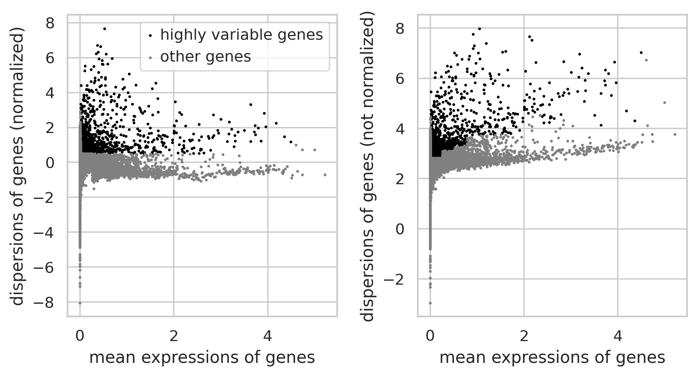
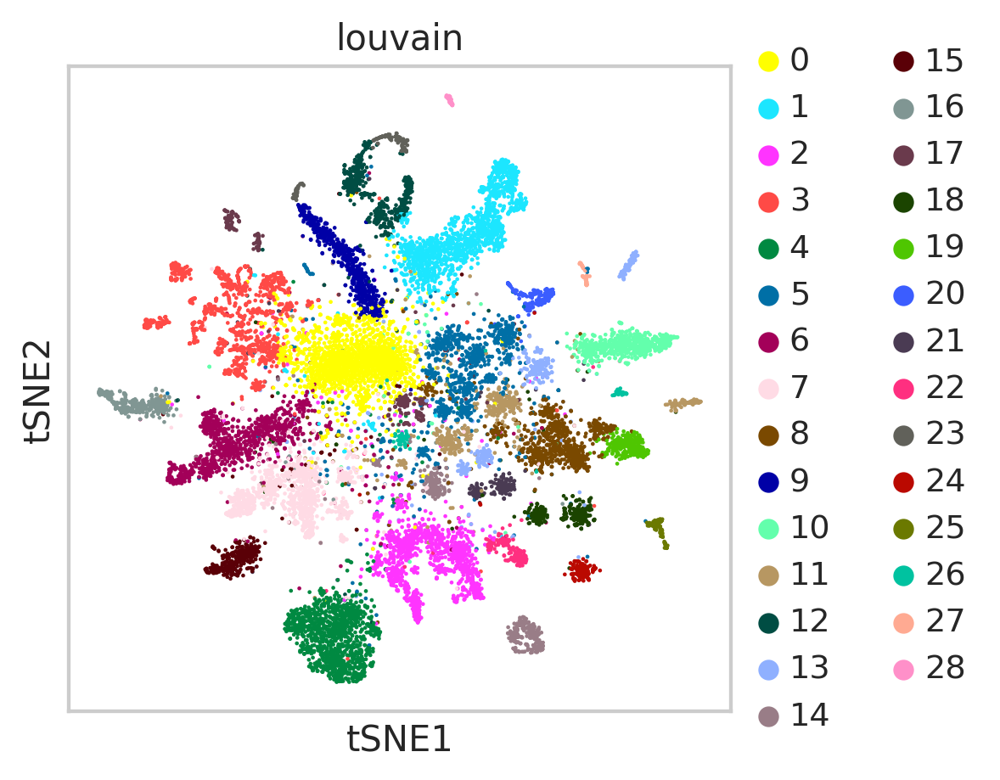

<a href="https://colab.research.google.com/github/pachterlab/CWGFLHGCCHAP_2021/blob/master/notebooks/CellAtlasAnalysis/cellRangerClustering_Starvation.ipynb" target="_parent"></a>

#### **Download Data**


```
import requests
from tqdm import tnrange, tqdm_notebook
def download_file(doi,ext):
    url = 'https://api.datacite.org/dois/'+doi+'/media'
    r = requests.get(url).json()
    netcdf_url = r['data'][0]['attributes']['url']
    r = requests.get(netcdf_url,stream=True)
    #Set file name
    fname = doi.split('/')[-1]+ext
    #Download file with progress bar
    if r.status_code == 403:
        print("File Unavailable")
    if 'content-length' not in r.headers:
        print("Did not get file")
    else:
        with open(fname, 'wb') as f:
            total_length = int(r.headers.get('content-length'))
            pbar = tnrange(int(total_length/1024), unit="B")
            for chunk in r.iter_content(chunk_size=1024):
                if chunk:
                    pbar.update()
                    f.write(chunk)
        return fname
```


```
# Cell Barcodes from ClickTag filtering
download_file('10.22002/D1.1811','.gz')

# Condition/Organism labels per cell
download_file('10.22002/D1.1812','.gz')

#From CellRanger
#matrix
download_file('10.22002/D1.1802','.gz')

#features
download_file('10.22002/D1.1803','.gz')

#barcodes
download_file('10.22002/D1.1801','.gz')
```

    /usr/local/lib/python3.6/dist-packages/ipykernel_launcher.py:18: TqdmDeprecationWarning: Please use `tqdm.notebook.trange` instead of `tqdm.tnrange`


    HBox(children=(FloatProgress(value=0.0, max=65.0), HTML(value='')))


    HBox(children=(FloatProgress(value=0.0, max=49202.0), HTML(value='')))


    HBox(children=(FloatProgress(value=0.0, max=111488.0), HTML(value='')))


    HBox(children=(FloatProgress(value=0.0, max=329.0), HTML(value='')))


    HBox(children=(FloatProgress(value=0.0, max=4453.0), HTML(value='')))


    'D1.1801.gz'


```
!gunzip *.gz
```


```
!pip install --quiet anndata
!pip install --quiet scanpy

!pip install --quiet louvain
```

         |████████████████████████████████| 122kB 6.1MB/s 
         |████████████████████████████████| 7.7MB 3.1MB/s 
         |████████████████████████████████| 51kB 6.1MB/s 
         |████████████████████████████████| 71kB 7.5MB/s 
    [?25h  Building wheel for sinfo (setup.py) ... [?25l[?25hdone
         |████████████████████████████████| 2.4MB 4.4MB/s 
         |████████████████████████████████| 3.2MB 31.7MB/s 
         |████████████████████████████████| 2.2MB 4.2MB/s 
    [?25h

#### **Import Packages**


```
import pandas as pd
import anndata
import scanpy as sc
import numpy as np
import scipy.sparse

import warnings
warnings.filterwarnings('ignore')

from sklearn.neighbors import (KNeighborsClassifier,NeighborhoodComponentsAnalysis)
from sklearn.pipeline import Pipeline
from sklearn.manifold import TSNE
from sklearn.decomposition import PCA

from sklearn.preprocessing import scale

import random

# import scrublet as scr

import matplotlib.pyplot as plt
%matplotlib inline
sc.set_figure_params(dpi=125)

import seaborn as sns
sns.set(style="whitegrid")
%load_ext rpy2.ipython
```

#### **Read in original Cell Ranger Data for clustering analysis**


```
path = "" #/home/jgehring/scRNAseq/clytia/20181229/jelly3_aggr_20181231/outs/raw_feature_bc_matrix/
!mv D1.1802 D1.1802.mtx
!mv D1.1803 D1.1803.tsv
!mv D1.1801 D1.1801.tsv

jelly3trin = sc.read(path+'D1.1802.mtx', cache=True).T
jelly3trin.var_names = pd.read_csv(path+'D1.1803.tsv', header=None, sep='\t')[1]
jelly3trin.obs_names = pd.read_csv(path+'D1.1801.tsv', header=None)[0]
jelly3trin
```


    AnnData object with n_obs × n_vars = 1474560 × 46716


Filter for highly variable genes and filter cells previously selected by ClickTag pre-processing


```
sc.pp.filter_cells(jelly3trin, min_counts=0)

sc.pp.filter_genes(jelly3trin, min_counts=0)

#The dataset has 1.4M cells and 46,716 genes before any filtering
jelly3trin

sc.pp.filter_cells(jelly3trin, min_counts=1)

sc.pp.filter_genes(jelly3trin, min_counts=1)

#Add n_countslog to the data
jelly3trin.obs['n_countslog']=np.log10(jelly3trin.obs['n_counts'])

#Of the possible cells and genes, 9.9M cells and 22149 genes have at least one read
jelly3trin

#True cells were identified in the filterStarvCells notebook, so we'll load that scanpy file and use its cells

!mv D1.1811 D1.1811.csv
HDfilteredbarcodes=pd.read_csv("D1.1811.csv") #DOWNLOAD


len(list(HDfilteredbarcodes.iloc[:,0]))


```


    16813


```
#Filter out low-quality cells as determined from tag sequencing data
ojelly3=jelly3trin[jelly3trin.obs_names.isin(list(HDfilteredbarcodes.iloc[:,0]))]
ojelly3
```


    View of AnnData object with n_obs × n_vars = 16813 × 20937
        obs: 'n_counts', 'n_countslog'
        var: 'n_counts'


```
#sc.pl.violin(ojelly3, keys=['n_countslog'])
```


```
sc.pp.filter_genes(ojelly3,min_cells=3)
print(ojelly3)
```

    Trying to set attribute `.var` of view, copying.


    AnnData object with n_obs × n_vars = 16813 × 16586
        obs: 'n_counts', 'n_countslog'
        var: 'n_counts', 'n_cells'


```
sortedUMIs = ojelly3.obs['n_counts'].sort_values(ascending=False)
#plt.plot(np.log10(range(len(sortedUMIs))), sortedUMIs.apply(np.log10))
#plt.show()

ojelly3.raw = sc.pp.log1p(ojelly3, copy=True)

sc.pp.normalize_per_cell(ojelly3, counts_per_cell_after=1e4)


filter_result = sc.pp.filter_genes_dispersion(
    ojelly3.X,min_mean=0.0125, max_mean=4.5, min_disp=0.50) 
sc.pl.filter_genes_dispersion(filter_result)
print('num genes: '+str(sum(filter_result.gene_subset)))

ojelly3 = ojelly3[:, filter_result.gene_subset]

ojelly3


```





    num genes: 2879


    View of AnnData object with n_obs × n_vars = 16813 × 2879
        obs: 'n_counts', 'n_countslog'
        var: 'n_counts', 'n_cells'


```
sc.pp.scale(ojelly3, max_value=10)

sc.tl.pca(ojelly3, n_comps=60)
```


```
sc.tl.tsne(ojelly3, n_pcs=60)
```

    WARNING: Consider installing the package MulticoreTSNE (https://github.com/DmitryUlyanov/Multicore-TSNE). Even for n_jobs=1 this speeds up the computation considerably and might yield better converged results.


```
sc.pp.neighbors(ojelly3)

sc.tl.louvain(ojelly3) 

sc.pl.tsne(ojelly3, color=['louvain'])
```





```
sc.tl.umap(ojelly3)

sc.pl.umap(ojelly3, color=['louvain'])
```

Filter for low count cells


```
clusterspassingfilter=list(set(ojelly3.obs['louvain']).difference({'0'}))
ojf = ojelly3[ojelly3.obs['louvain'].isin(clusterspassingfilter)]

ojf
```


```
#Choose embedding
sc.tl.umap(ojf)
sc.pl.umap(ojf, color=['louvain', 'XLOC_008048','XLOC_019434'])

tempoj=copy.deepcopy(ojf)

sc.tl.umap(tempoj, random_state=None)
sc.pl.umap(tempoj, color=['louvain', 'XLOC_008048','XLOC_019434'])

tempoj2=copy.deepcopy(tempoj)
sc.tl.umap(tempoj2, random_state=None)
sc.pl.umap(tempoj2, color=['louvain', 'XLOC_008048','XLOC_019434'])

#Test different pc #'s
tempoj16=sc.pp.neighbors(tempoj16, n_pcs=16, copy=True)
tempoj40=sc.pp.neighbors(tempoj16, n_pcs=40, copy=True)
```


```

sc.tl.umap(tempoj40, random_state=None)
sc.pl.umap(tempoj40, color=['louvain', 'XLOC_008048','XLOC_019434'])
```

Save output with all organism labels


```
"""Differential Expression, cluster identification"""
!mv D1.1812 D1.1812.h5ad
trinojelly3 = anndata.read('D1.1812.h5ad') 

trinojelly3

tempoj2.obs['orgID']=trinojelly3.obs['orgID']
tempoj2.obs['fed']=trinojelly3.obs['fed']
tempoj2.obs['starved']=trinojelly3.obs['starved']

tempoj40.obs['orgID']=trinojelly3.obs['orgID']
tempoj40.obs['fed']=trinojelly3.obs['fed']
tempoj40.obs['starved']=trinojelly3.obs['starved']

tempoj40.obs['fed_ord'] = pd.Categorical(tempoj40.obs['fed'])
tempoj40.obs['starved_ord'] = pd.Categorical(tempoj40.obs['starved'])

sc.pl.umap(tempoj40, color=['louvain'])
sc.pl.umap(tempoj40, color=['orgID'])
sc.pl.umap(tempoj40, color=['fed_ord'], palette='viridis_r')
sc.pl.umap(tempoj40, color=['starved_ord'], palette='viridis_r')
```


```
#tempoj40.write('cellRanger_fs.h5ad')
```
