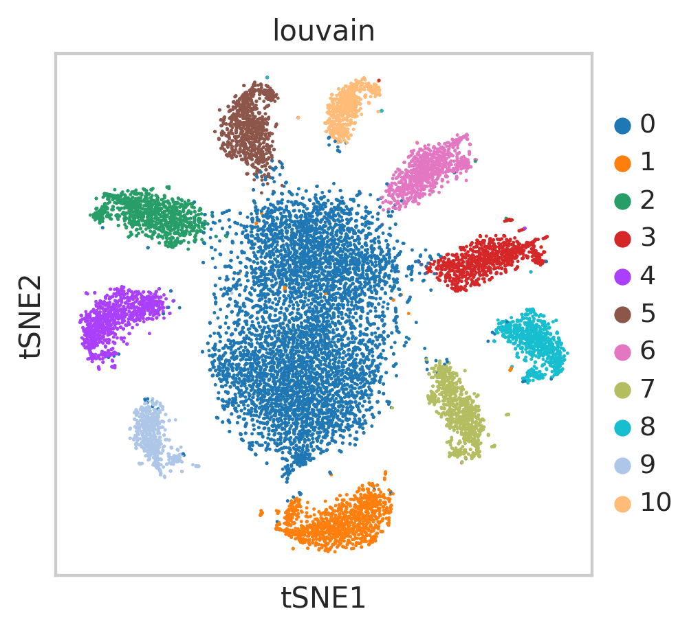
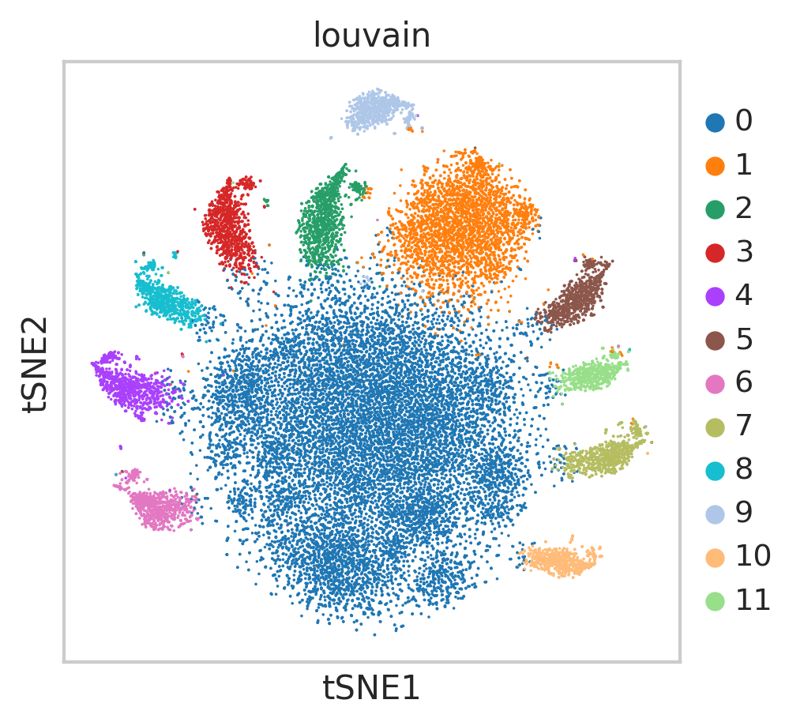

<a href="https://colab.research.google.com/github/pachterlab/CWGFLHGCCHAP_2021/blob/master/notebooks/Preprocessing/cDNAFiltering/filterStarvCells_ClickTags.ipynb" target="_parent"></a>


```
!date
```

    Sat Dec  5 00:33:19 UTC 2020


### **Download Data**


```
import requests
from tqdm import tnrange, tqdm_notebook
def download_file(doi,ext):
    url = 'https://api.datacite.org/dois/'+doi+'/media'
    r = requests.get(url).json()
    netcdf_url = r['data'][0]['attributes']['url']
    r = requests.get(netcdf_url,stream=True)
    #Set file name
    fname = doi.split('/')[-1]+ext
    #Download file with progress bar
    if r.status_code == 403:
        print("File Unavailable")
    if 'content-length' not in r.headers:
        print("Did not get file")
    else:
        with open(fname, 'wb') as f:
            total_length = int(r.headers.get('content-length'))
            pbar = tnrange(int(total_length/1024), unit="B")
            for chunk in r.iter_content(chunk_size=1024):
                if chunk:
                    pbar.update()
                    f.write(chunk)
        return fname
```


```
#From CellRanger (cDNA)
#matrix
download_file('10.22002/D1.1802','.gz')

#features
download_file('10.22002/D1.1803','.gz')

#barcodes
download_file('10.22002/D1.1801','.gz')

#ClickTag lane 1 counts
download_file('10.22002/D1.1799','.gz')

#ClickTag lane 2 counts
download_file('10.22002/D1.1800','.gz')
```

    /usr/local/lib/python3.6/dist-packages/ipykernel_launcher.py:18: TqdmDeprecationWarning: Please use `tqdm.notebook.trange` instead of `tqdm.tnrange`


    HBox(children=(FloatProgress(value=0.0, max=111488.0), HTML(value='')))


    HBox(children=(FloatProgress(value=0.0, max=329.0), HTML(value='')))


    


    HBox(children=(FloatProgress(value=0.0, max=4453.0), HTML(value='')))


    HBox(children=(FloatProgress(value=0.0, max=2984.0), HTML(value='')))


    HBox(children=(FloatProgress(value=0.0, max=2737.0), HTML(value='')))


    'D1.1800.gz'


```
!gunzip *.gz
```


```
!pip install --quiet anndata
!pip install --quiet scanpy
!pip3 install --quiet leidenalg
!pip install --quiet louvain
```

         |████████████████████████████████| 122kB 4.3MB/s 
         |████████████████████████████████| 7.7MB 3.9MB/s 
         |████████████████████████████████| 71kB 9.4MB/s 
         |████████████████████████████████| 51kB 7.1MB/s 
    [?25h  Building wheel for sinfo (setup.py) ... [?25l[?25hdone
         |████████████████████████████████| 2.4MB 4.3MB/s 
         |████████████████████████████████| 3.2MB 43.5MB/s 
         |████████████████████████████████| 2.2MB 4.4MB/s 
    [?25h

### **Import Packages**


```
import pandas as pd
import anndata
import scanpy as sc
import numpy as np
import scipy.sparse

import warnings
warnings.filterwarnings('ignore')

from sklearn.neighbors import (KNeighborsClassifier,NeighborhoodComponentsAnalysis)
from sklearn.pipeline import Pipeline
from sklearn.manifold import TSNE
from sklearn.decomposition import PCA

from sklearn.preprocessing import scale

import random

import matplotlib.pyplot as plt
%matplotlib inline
sc.set_figure_params(dpi=125)

import seaborn as sns
sns.set(style="whitegrid")
%load_ext rpy2.ipython
```

### **Select Cells for Downstream Analysis by Associated ClickTag Counts**

Filtering of CellRanger cDNA data by ClickTag counts


```
path = "" 
!mv D1.1802 D1.1802.mtx
!mv D1.1803 D1.1803.tsv
!mv D1.1801 D1.1801.tsv

jelly3trin = sc.read(path+'D1.1802.mtx', cache=True).T
jelly3trin.var_names = pd.read_csv(path+'D1.1803.tsv', header=None, sep='\t')[1]
jelly3trin.obs_names = pd.read_csv(path+'D1.1801.tsv', header=None)[0]
jelly3trin
```


    AnnData object with n_obs × n_vars = 1474560 × 46716


```
jelly3trin.var_names_make_unique()
sc.pp.filter_cells(jelly3trin,min_counts=1)
jelly3trin.obs['n_countslog']=np.log10(jelly3trin.obs['n_counts'])

```


```
jelly3trin
```


    AnnData object with n_obs × n_vars = 882404 × 46716
        obs: 'n_counts', 'n_countslog'


Selecting well-tagged cells by counts of ClickTags on embedding of cell x ClickTag counts matrix (previously calculated)


```
!mv D1.1799 tag1_counts.csv
adata = sc.read_csv("tag1_counts.csv")
adata=adata.transpose()

sc.pp.filter_cells(adata, min_counts=100)
adata.obs['n_countslog'] = np.log(adata.obs['n_counts'])

sc.pp.log1p(adata)

#For visualization of tag counts
sc.tl.pca(adata)
sc.tl.tsne(adata)
sc.pp.neighbors(adata)
sc.tl.louvain(adata, resolution=0.35)


```

    WARNING: Consider installing the package MulticoreTSNE (https://github.com/DmitryUlyanov/Multicore-TSNE). Even for n_jobs=1 this speeds up the computation considerably and might yield better converged results.


```
sc.tl.louvain(adata, resolution=0.35)
```


```
sc.pl.tsne(adata, color=['louvain'])
```





```
sc.pl.tsne(adata, color=['BC_21', 'BC_22','BC_23','BC_24','BC_25','BC_26','BC_27','BC_28','BC_29','BC_30','BC_31','BC_32','BC_33',
                         'BC_34', 'BC_35','BC_36','BC_37','BC_38','BC_39','BC_40','n_countslog'])
```


```
!mv D1.1800 tag2_counts.csv
adata2 = sc.read_csv("tag2_counts.csv")
adata2=adata2.transpose()

sc.pp.filter_cells(adata2, min_counts=80)
adata2.obs['n_countslog'] = np.log(adata2.obs['n_counts'])

sc.pp.log1p(adata2)

#For visualization of tag counts
sc.tl.pca(adata2)
sc.tl.tsne(adata2)
sc.pp.neighbors(adata2)
sc.tl.louvain(adata2, resolution=0.35)
```

    WARNING: Consider installing the package MulticoreTSNE (https://github.com/DmitryUlyanov/Multicore-TSNE). Even for n_jobs=1 this speeds up the computation considerably and might yield better converged results.


```
sc.pl.tsne(adata2, color=['BC_21', 'BC_22','BC_23','BC_24','BC_25','BC_26','BC_27','BC_28','BC_29','BC_30','BC_31','BC_32','BC_33',
                         'BC_34', 'BC_35','BC_36','BC_37','BC_38','BC_39','BC_40','n_countslog'])
```


```
sc.pl.tsne(adata2,color=['louvain'])
```





Save cell clusters from lane1 and lane2 ClickTag counts


```
#Make names unique (For each lane)
adata.obs_names=adata.obs_names+['-1']
adata2.obs_names=adata2.obs_names+['-2']
```


```
#Based on tsne Plots assign organism IDs/numbers from experiment (1 - 10 jellies)

adataorgIDdict={'7':'1', '4':'2', '6':'3','10':'4', '1':'5', '9':'6', '5':'7', '3':'8', '2':'9', '8':'10' }
adata.obs['filtered_by_oligos'] = adata.obs['louvain'].isin(['3','4','8','7','5','2','9','10','6','11'])


adata2orgIDdict={'8':'2', '5':'8', '7':'1','11':'6', '2':'5', '10':'4', '6':'3', '4':'7', '3':'9', '9':'10', 'louvain':'org'}
adata2.obs['filtered_by_oligos'] = adata2.obs['louvain'].isin(['2','3','4','7','5','9','10','6','11','8'])

```


```
HDfilteradata = adata[adata.obs['louvain'].isin(['3','4','8','7','5','2','9','10','6','1'])]
HDfilteradata2 = adata2[adata2.obs['louvain'].isin(['2','3','4','7','5','9','10','6','11','8'])]

HDfilteradata.obs['orgID']=[adataorgIDdict.get(x) for x in list(HDfilteradata.obs['louvain'])]
HDfilteradata2.obs['orgID']=[adata2orgIDdict.get(x) for x in list(HDfilteradata2.obs['louvain'])]
```

    Trying to set attribute `.obs` of view, copying.
    Trying to set attribute `.obs` of view, copying.


```
ojelly3trin=jelly3trin[jelly3trin.obs_names.isin(list(HDfilteradata.obs_names)+list(HDfilteradata2.obs_names))]
sc.pp.filter_cells(ojelly3trin, min_counts=0)
```


    View of AnnData object with n_obs × n_vars = 16818 × 46716
        obs: 'n_counts', 'n_countslog'


```
holder=pd.DataFrame()
#I need to make dictionaries to map the organismIDs from both 10x lanes back to my experimental conditions
for cell in list(ojelly3trin.obs_names):
    if cell[-1:]=='1':
        holder[cell]=[list(HDfilteradata.obs['orgID'])[list(HDfilteradata.obs_names).index(cell)]]
    elif cell[-1:]=='2':
        holder[cell]=[list(HDfilteradata2.obs['orgID'])[list(HDfilteradata2.obs_names).index(cell)]]
```


```
holder.head()
```


<div>
<style scoped>
    .dataframe tbody tr th:only-of-type {
        vertical-align: middle;
    }

    .dataframe tbody tr th {
        vertical-align: top;
    }

    .dataframe thead th {
        text-align: right;
    }
</style>
<table border="1" class="dataframe">
  <thead>
    <tr style="text-align: right;">
      <th></th>
      <th>AAACCTGAGAGGGCTT-1</th>
      <th>AAACCTGAGAGGTTAT-1</th>
      <th>AAACCTGAGCGAGAAA-1</th>
      <th>AAACCTGAGCGTGTCC-1</th>
      <th>AAACCTGAGGATTCGG-1</th>
      <th>AAACCTGAGGTGATAT-1</th>
      <th>AAACCTGCAAAGTGCG-1</th>
      <th>AAACCTGCAAGCTGGA-1</th>
      <th>AAACCTGCAATCACAC-1</th>
      <th>AAACCTGCATAACCTG-1</th>
      <th>AAACCTGCATGCAACT-1</th>
      <th>AAACCTGCATGCAATC-1</th>
      <th>AAACCTGGTACATGTC-1</th>
      <th>AAACCTGGTAGTACCT-1</th>
      <th>AAACCTGGTCAGGACA-1</th>
      <th>AAACCTGGTCGGCACT-1</th>
      <th>AAACCTGGTCGGCTCA-1</th>
      <th>AAACCTGGTCTTCTCG-1</th>
      <th>AAACCTGGTGCAGTAG-1</th>
      <th>AAACCTGTCAACTCTT-1</th>
      <th>AAACCTGTCAGAAATG-1</th>
      <th>AAACCTGTCAGGTTCA-1</th>
      <th>AAACCTGTCATATCGG-1</th>
      <th>AAACCTGTCCTAGTGA-1</th>
      <th>AAACCTGTCGGAAATA-1</th>
      <th>AAACCTGTCGGATGGA-1</th>
      <th>AAACCTGTCTCTAGGA-1</th>
      <th>AAACGGGAGCTGCCCA-1</th>
      <th>AAACGGGAGTGAACAT-1</th>
      <th>AAACGGGCAAACCCAT-1</th>
      <th>AAACGGGCAAAGCAAT-1</th>
      <th>AAACGGGGTCATATCG-1</th>
      <th>AAACGGGGTCCTGCTT-1</th>
      <th>AAACGGGGTGCATCTA-1</th>
      <th>AAACGGGGTTCCGTCT-1</th>
      <th>AAACGGGGTTCGTGAT-1</th>
      <th>AAACGGGTCATTGCCC-1</th>
      <th>AAACGGGTCCACTGGG-1</th>
      <th>AAACGGGTCTAACGGT-1</th>
      <th>AAACGGGTCTGACCTC-1</th>
      <th>...</th>
      <th>TTTGCGCGTATATGAG-2</th>
      <th>TTTGCGCGTCCAGTAT-2</th>
      <th>TTTGCGCGTCCTCTTG-2</th>
      <th>TTTGCGCGTCTTGATG-2</th>
      <th>TTTGCGCGTTATCCGA-2</th>
      <th>TTTGCGCGTTGGTAAA-2</th>
      <th>TTTGCGCTCAACCAAC-2</th>
      <th>TTTGCGCTCAGCTGGC-2</th>
      <th>TTTGCGCTCAGTCAGT-2</th>
      <th>TTTGCGCTCGCCCTTA-2</th>
      <th>TTTGCGCTCTTAGCCC-2</th>
      <th>TTTGGTTAGACTAGAT-2</th>
      <th>TTTGGTTAGCGCCTTG-2</th>
      <th>TTTGGTTAGCTAACAA-2</th>
      <th>TTTGGTTAGGACTGGT-2</th>
      <th>TTTGGTTCACAACGCC-2</th>
      <th>TTTGGTTCACAAGCCC-2</th>
      <th>TTTGGTTCAGCCAATT-2</th>
      <th>TTTGGTTCATTCACTT-2</th>
      <th>TTTGGTTGTCGAGATG-2</th>
      <th>TTTGGTTGTGTATGGG-2</th>
      <th>TTTGGTTTCAGTGCAT-2</th>
      <th>TTTGGTTTCCAAGCCG-2</th>
      <th>TTTGGTTTCCCGGATG-2</th>
      <th>TTTGTCAAGAGATGAG-2</th>
      <th>TTTGTCAAGCAGGTCA-2</th>
      <th>TTTGTCAAGGGCATGT-2</th>
      <th>TTTGTCACAAACGCGA-2</th>
      <th>TTTGTCACACTCTGTC-2</th>
      <th>TTTGTCACACTTAACG-2</th>
      <th>TTTGTCACAGAAGCAC-2</th>
      <th>TTTGTCAGTACCTACA-2</th>
      <th>TTTGTCAGTATGGTTC-2</th>
      <th>TTTGTCAGTCATTAGC-2</th>
      <th>TTTGTCAGTCTCCACT-2</th>
      <th>TTTGTCAGTGGACGAT-2</th>
      <th>TTTGTCATCATCTGTT-2</th>
      <th>TTTGTCATCGCCTGAG-2</th>
      <th>TTTGTCATCTAACGGT-2</th>
      <th>TTTGTCATCTGAGTGT-2</th>
    </tr>
  </thead>
  <tbody>
    <tr>
      <th>0</th>
      <td>3</td>
      <td>9</td>
      <td>3</td>
      <td>10</td>
      <td>8</td>
      <td>7</td>
      <td>6</td>
      <td>7</td>
      <td>9</td>
      <td>3</td>
      <td>4</td>
      <td>5</td>
      <td>9</td>
      <td>5</td>
      <td>9</td>
      <td>9</td>
      <td>5</td>
      <td>6</td>
      <td>4</td>
      <td>8</td>
      <td>2</td>
      <td>9</td>
      <td>2</td>
      <td>7</td>
      <td>5</td>
      <td>2</td>
      <td>9</td>
      <td>10</td>
      <td>1</td>
      <td>9</td>
      <td>3</td>
      <td>2</td>
      <td>1</td>
      <td>9</td>
      <td>5</td>
      <td>1</td>
      <td>1</td>
      <td>10</td>
      <td>3</td>
      <td>9</td>
      <td>...</td>
      <td>5</td>
      <td>7</td>
      <td>2</td>
      <td>2</td>
      <td>7</td>
      <td>7</td>
      <td>3</td>
      <td>8</td>
      <td>10</td>
      <td>2</td>
      <td>4</td>
      <td>2</td>
      <td>3</td>
      <td>9</td>
      <td>10</td>
      <td>9</td>
      <td>5</td>
      <td>5</td>
      <td>7</td>
      <td>9</td>
      <td>4</td>
      <td>6</td>
      <td>10</td>
      <td>10</td>
      <td>2</td>
      <td>10</td>
      <td>7</td>
      <td>5</td>
      <td>9</td>
      <td>7</td>
      <td>4</td>
      <td>5</td>
      <td>4</td>
      <td>7</td>
      <td>9</td>
      <td>4</td>
      <td>7</td>
      <td>7</td>
      <td>3</td>
      <td>9</td>
    </tr>
  </tbody>
</table>
<p>1 rows × 16818 columns</p>
</div>


Save condition labels for cells based on ClickTag assignment


```
import copy
ojelly3trin.obs['temp']=holder.iloc[0]
ojelly3trin.obs['orgID']=copy.deepcopy(ojelly3trin.obs['temp'])
```


```
#Color by Condition Labels
ojelly3trin.obs['fed']=ojelly3trin.obs['orgID'].isin(['1','2', '3', '4', '5'])

ojelly3trin.obs['starved']=ojelly3trin.obs['orgID'].isin(['6','7', '8', '9', '10'])
```


```
ojelly3trin.write('jelly3trin_conditions.h5ad')
pd.DataFrame(ojelly3trin.obs_names).to_csv("jelly3trin_barcodes.csv", index=None)

```

    ... storing 'temp' as categorical
    ... storing 'orgID' as categorical

