<a href="https://colab.research.google.com/github/pachterlab/CWGFLHGCCHAP_2021/blob/master/notebooks/Preprocessing/ClickTagDemultiplexing/kallistobusStarvClickTags.ipynb" target="_parent"></a>


```
!date
```

### **Download Data**


```
#Install kallisto and bustools

!wget --quiet https://github.com/pachterlab/kallisto/releases/download/v0.46.2/kallisto_linux-v0.46.2.tar.gz
!tar -xf kallisto_linux-v0.46.2.tar.gz
!cp kallisto/kallisto /usr/local/bin/

!wget --quiet https://github.com/BUStools/bustools/releases/download/v0.40.0/bustools_linux-v0.40.0.tar.gz
!tar -xf bustools_linux-v0.40.0.tar.gz
!cp bustools/bustools /usr/local/bin/
```


```
import requests
from tqdm import tnrange, tqdm_notebook
def download_file(doi,ext):
    url = 'https://api.datacite.org/dois/'+doi+'/media'
    r = requests.get(url).json()
    netcdf_url = r['data'][0]['attributes']['url']
    r = requests.get(netcdf_url,stream=True)
    #Set file name
    fname = doi.split('/')[-1]+ext
    #Download file with progress bar
    if r.status_code == 403:
        print("File Unavailable")
    if 'content-length' not in r.headers:
        print("Did not get file")
    else:
        with open(fname, 'wb') as f:
            total_length = int(r.headers.get('content-length'))
            pbar = tnrange(int(total_length/1024), unit="B")
            for chunk in r.iter_content(chunk_size=1024):
                if chunk:
                    pbar.update()
                    f.write(chunk)
        return fname
```


```
# Get ClickTag Barcodes/Sequences
download_file('10.22002/D1.1831','.gz')

#All ClickTag MiSeq fastqs
download_file('10.22002/D1.1856','.tar.gz')

# jelly3tags1counts.csv
download_file('10.22002/D1.1799','.gz')

# jelly3tags2counts.csv
download_file('10.22002/D1.1800','.gz')

# cellRanger fs/h5ad
download_file('10.22002/D1.1798','.gz')
```

    /usr/local/lib/python3.6/dist-packages/ipykernel_launcher.py:18: TqdmDeprecationWarning: Please use `tqdm.notebook.trange` instead of `tqdm.tnrange`


    HBox(children=(FloatProgress(value=1.0, bar_style='info', max=1.0), HTML(value='')))


    HBox(children=(FloatProgress(value=0.0, max=1929774.0), HTML(value='')))


    HBox(children=(FloatProgress(value=0.0, max=2984.0), HTML(value='')))


    HBox(children=(FloatProgress(value=0.0, max=2737.0), HTML(value='')))


    HBox(children=(FloatProgress(value=0.0, max=45376.0), HTML(value='')))


    'D1.1798.gz'


```
!tar -xf D1.1856.tar.gz

```


```
!gunzip D1.1831.gz D1.1799.gz D1.1800.gz D1.1798.gz
```


```
!pip install --quiet anndata
!pip install --quiet scanpy
!pip install --quiet louvain
!pip3 install --quiet biopython
```

         |████████████████████████████████| 122kB 4.9MB/s 
         |████████████████████████████████| 10.2MB 4.5MB/s 
         |████████████████████████████████| 71kB 6.9MB/s 
         |████████████████████████████████| 51kB 4.9MB/s 
    [?25h  Building wheel for sinfo (setup.py) ... [?25l[?25hdone
         |████████████████████████████████| 2.2MB 6.9MB/s 
         |████████████████████████████████| 3.2MB 45.3MB/s 
         |████████████████████████████████| 2.3MB 5.0MB/s 
    [?25h

### **Import Packages**


```
import pandas as pd
import copy
from sklearn.preprocessing import LabelEncoder
from scipy import sparse
import scipy
import numpy as np
import anndata
import matplotlib.pyplot as plt
import seaborn as sns
import scanpy as sc

from collections import OrderedDict
from Bio import SeqIO
import os
from scipy import io
import scipy.io as sio
import time


%matplotlib inline
%config InlineBackend.figure_format = 'retina'
```

### **Quantify ClickTags with kallisto-bustools for Selecting High-Quality (Tagged) Cells**

Create map of all ClickTag barcodes and sequences Hamming distance 1 away from these barcodes


```
## Set parameters - below are parameters for 10x 3' v2 chemistry
## The cell hashing method uses tags of length 12, we included the variable B (T,C,G) in the end to make it lenght 13
cell_barcode_length = 16
UMI_length = 12
sample_tag_length=11

"""
This function returns all sample tags and and their single base mismatches (hamming distance 1).
ClickTag sequences are provided as a fasta file, and the script indexes the barcode region of the fasta
"""

"parse the tags file and output the set of tag sequences"

def parse_tags(filename):
    odict = OrderedDict()
    print('Read the following tags:')
    for record in SeqIO.parse(filename, "fasta"):
        counter=0
        print(record.seq)
        odict[record.name] = str(record.seq)[26:26+sample_tag_length]
        for pos in range(sample_tag_length):
            letter =str(record.seq)[26+pos]
            barcode=list(str(record.seq)[26:26+sample_tag_length])
            if letter=='A':
                barcode[pos]='T'
                odict[record.name+'-'+str(pos)+'-1'] = "".join(barcode)
                barcode[pos]='G'
                odict[record.name+'-'+str(pos)+'-2'] = "".join(barcode)
                barcode[pos]='C'
                odict[record.name+'-'+str(pos)+'-3'] = "".join(barcode)
            elif letter=='G':
                barcode[pos]='T'
                odict[record.name+'-'+str(pos)+'-1'] = "".join(barcode)
                barcode[pos]='A'
                odict[record.name+'-'+str(pos)+'-2'] = "".join(barcode)
                barcode[pos]='C'
                odict[record.name+'-'+str(pos)+'-3'] = "".join(barcode)
            elif letter=='C':
                barcode[pos]='T'
                odict[record.name+'-'+str(pos)+'-1'] = "".join(barcode)
                barcode[pos]='G'
                odict[record.name+'-'+str(pos)+'-2'] = "".join(barcode)
                barcode[pos]='A'
                odict[record.name+'-'+str(pos)+'-3'] = "".join(barcode)
            else:
                barcode[pos]='A'
                odict[record.name+'-'+str(pos)+'-1'] = "".join(barcode)
                barcode[pos]='G'
                odict[record.name+'-'+str(pos)+'-2'] = "".join(barcode)
                barcode[pos]='C'
                odict[record.name+'-'+str(pos)+'-3'] = "".join(barcode)
                
    return odict
```


```
# Make kallisto index from ClickTag sequences

!mv D1.1831 70BPbarcodes.fa
tags_file_path = ("70BPbarcodes.fa") #70BPbarcodes.fa
tag_map=parse_tags(tags_file_path)


work_folder = ''
data_folder = ''
write_folder = ''

#Write the list of barcodes as a fasta, then make a kallisto index
!mkdir barcode_corrected_tags
tagmap_file_path = "barcode_corrected_tags/70BPbarcodes_tagmap.fa"

tagmap_file = open(tagmap_file_path, "w+")
for i in list(tag_map.keys()):
    tagmap_file.write(">" + i + "\n" +tag_map[i] + "\n")
tagmap_file.close()

!kallisto index -i {tagmap_file_path}.idx -k 11 {tagmap_file_path}
!kallisto inspect {tagmap_file_path}.idx
```

    Read the following tags:
    CTGGGTCGTCGGCAGCGTCAGATGTGTAAGCAGTTACAGAAAAAAAAAAAAAAAAAAAAAAAAAAAAAAA
    CTGGGTCGTCGGCAGCGTCAGATGTGTACTTGTACCCAGAAAAAAAAAAAAAAAAAAAAAAAAAAAAAAA
    CTGGGTCGTCGGCAGCGTCAGATGTGTAGAACCCGGCAGAAAAAAAAAAAAAAAAAAAAAAAAAAAAAAA
    CTGGGTCGTCGGCAGCGTCAGATGTGTATCGTAGATCAGAAAAAAAAAAAAAAAAAAAAAAAAAAAAAAA
    CTGGGTCGTCGGCAGCGTCAGATGTGTAACGCGGAACAGAAAAAAAAAAAAAAAAAAAAAAAAAAAAAAA
    CTGGGTCGTCGGCAGCGTCAGATGTGTACGCTATCCCAGAAAAAAAAAAAAAAAAAAAAAAAAAAAAAAA
    CTGGGTCGTCGGCAGCGTCAGATGTGTAGTTGCATGCAGAAAAAAAAAAAAAAAAAAAAAAAAAAAAAAA
    CTGGGTCGTCGGCAGCGTCAGATGTGTATAAATCGTCAGAAAAAAAAAAAAAAAAAAAAAAAAAAAAAAA
    CTGGGTCGTCGGCAGCGTCAGATGTGTAATCGCCATCAGAAAAAAAAAAAAAAAAAAAAAAAAAAAAAAA
    CTGGGTCGTCGGCAGCGTCAGATGTGTACATAAAGGCAGAAAAAAAAAAAAAAAAAAAAAAAAAAAAAAA
    CTGGGTCGTCGGCAGCGTCAGATGTGTATCACGGTACAGAAAAAAAAAAAAAAAAAAAAAAAAAAAAAAA
    CTGGGTCGTCGGCAGCGTCAGATGTGTACACTCAACCAGAAAAAAAAAAAAAAAAAAAAAAAAAAAAAAA
    CTGGGTCGTCGGCAGCGTCAGATGTGTAGCTGTGTACAGAAAAAAAAAAAAAAAAAAAAAAAAAAAAAAA
    CTGGGTCGTCGGCAGCGTCAGATGTGTATTGCGTCGCAGAAAAAAAAAAAAAAAAAAAAAAAAAAAAAAA
    CTGGGTCGTCGGCAGCGTCAGATGTGTAATATGAGACAGAAAAAAAAAAAAAAAAAAAAAAAAAAAAAAA
    CTGGGTCGTCGGCAGCGTCAGATGTGTACACCTCAGCAGAAAAAAAAAAAAAAAAAAAAAAAAAAAAAAA
    CTGGGTCGTCGGCAGCGTCAGATGTGTAGCTACTTCCAGAAAAAAAAAAAAAAAAAAAAAAAAAAAAAAA
    CTGGGTCGTCGGCAGCGTCAGATGTGTATGGGAGCTCAGAAAAAAAAAAAAAAAAAAAAAAAAAAAAAAA
    CTGGGTCGTCGGCAGCGTCAGATGTGTAATCCGGCACAGAAAAAAAAAAAAAAAAAAAAAAAAAAAAAAA
    CTGGGTCGTCGGCAGCGTCAGATGTGTACCGTTATGCAGAAAAAAAAAAAAAAAAAAAAAAAAAAAAAAA
    
    [build] loading fasta file barcode_corrected_tags/70BPbarcodes_tagmap.fa
    [build] k-mer length: 11
    [build] counting k-mers ... done.
    [build] building target de Bruijn graph ...  done 
    [build] creating equivalence classes ...  done
    [build] target de Bruijn graph has 680 contigs and contains 680 k-mers 
    
    [index] k-mer length: 11
    [index] number of targets: 680
    [index] number of k-mers: 680
    [index] number of equivalence classes: 680
    #[inspect] Index version number = 10
    #[inspect] k = 11
    #[inspect] number of targets = 680
    #[inspect] number of equivalence classes = 680
    #[inspect] number of contigs = 680
    #[inspect] Number of k-mers in index = 680
    #EC.size	Num.targets
    1	680
    
    
    #EC.size	Num.kmers
    1	680


Quantify ClickTags with kallisto bustools and barcode whitelist


```
#Run kallisto bus on ClickTag fastqs

!mkdir jelly3fedstarved_1_tags_HiSeq
write_folder = 'jelly3fedstarved_1_tags_HiSeq'

R1_1='Jelly3tags1_S1_L001_R1_001.fastq.gz'
R2_1='Jelly3tags1_S1_L001_R2_001.fastq.gz'

!kallisto bus -i {tagmap_file_path}.idx -o {write_folder} -x 10xv2 -t 20 {R1_1} {R2_1}

#sort bus file
!bustools sort -o {os.path.join(write_folder,'output_sorted.bus')} {os.path.join(write_folder,'output.bus')}

# convert the sorted busfile to txt
!bustools text -o {os.path.join(write_folder,'output_sorted.txt')} {os.path.join(write_folder,'output_sorted.bus')}


!mkdir jelly3fedstarved_2_tags_HiSeq
write_folder = 'jelly3fedstarved_2_tags_HiSeq'

R1_2='Jelly3tags2_S2_L001_R1_001.fastq.gz'
R2_2='Jelly3tags2_S2_L001_R2_001.fastq.gz'

!kallisto bus -i {tagmap_file_path}.idx -o {write_folder} -x 10xv2 -t 20 {R1_2} {R2_2}

#sort bus file
!bustools sort -o {os.path.join(write_folder,'output_sorted.bus')} {os.path.join(write_folder,'output.bus')}

# convert the sorted busfile to txt
!bustools text -o {os.path.join(write_folder,'output_sorted.txt')} {os.path.join(write_folder,'output_sorted.bus')}
```

    
    Warning: you asked for 20, but only 2 cores on the machine
    [index] k-mer length: 11
    [index] number of targets: 680
    [index] number of k-mers: 680
    [index] number of equivalence classes: 680
    [quant] will process sample 1: Jelly3tags1_S1_L001_R1_001.fastq.gz
                                   Jelly3tags1_S1_L001_R2_001.fastq.gz
    [quant] finding pseudoalignments for the reads ... done
    [quant] processed 11,225,060 reads, 10,004,853 reads pseudoaligned
    
    Read in 10004853 BUS records
    Read in 9946557 BUS records
    
    Warning: you asked for 20, but only 2 cores on the machine
    [index] k-mer length: 11
    [index] number of targets: 680
    [index] number of k-mers: 680
    [index] number of equivalence classes: 680
    [quant] will process sample 1: Jelly3tags2_S2_L001_R1_001.fastq.gz
                                   Jelly3tags2_S2_L001_R2_001.fastq.gz
    [quant] finding pseudoalignments for the reads ... done
    [quant] processed 10,090,654 reads, 8,879,356 reads pseudoaligned
    
    Read in 8879356 BUS records
    Read in 8826794 BUS records


```
write_folder = '' 

bus_data_jelly1 = pd.read_csv(os.path.join(write_folder,'jelly3fedstarved_1_tags_HiSeq/output_sorted.txt'), delimiter='\t', header=None, names = ['barcode', 'umi', 'tag_eqclass', 'multiplicity'])
bus_data_jelly1.head()

bus_data_jelly1

bus_data_jelly2 = pd.read_csv(os.path.join(write_folder,'jelly3fedstarved_2_tags_HiSeq/output_sorted.txt'), delimiter='\t', header=None, names = ['barcode', 'umi', 'tag_eqclass', 'multiplicity'])
bus_data_jelly2.head()

tag_map_df = pd.DataFrame.from_dict(tag_map, orient = 'index').reset_index()
tag_map_df.columns=['tagname','tagseq']
tag_map_df['ClickTag'] = tag_map_df['tagname'].str.split('-').str.get(0)
tag_map_df.head()

bus_data_jelly1['tag']= bus_data_jelly1['tag_eqclass'].map(tag_map_df['ClickTag'])
bus_data_jelly1.head()

bus_data_jelly2['tag']= bus_data_jelly2['tag_eqclass'].map(tag_map_df['ClickTag'])
bus_data_jelly2.head()


print('Counting UMIs')
counted_data_jelly1 = bus_data_jelly1.groupby(['barcode', 'tag'])['umi'].count().reset_index()
counted_data_jelly1.rename(columns={'umi':'umi_counts'}, inplace = True)
counted_data_jelly1.head()

print('Counting UMIs')
counted_data_jelly2 = bus_data_jelly2.groupby(['barcode', 'tag'])['umi'].count().reset_index()
counted_data_jelly2.rename(columns={'umi':'umi_counts'}, inplace = True)
counted_data_jelly2.head()
```

    Counting UMIs
    Counting UMIs


<div>
<style scoped>
    .dataframe tbody tr th:only-of-type {
        vertical-align: middle;
    }

    .dataframe tbody tr th {
        vertical-align: top;
    }

    .dataframe thead th {
        text-align: right;
    }
</style>
<table border="1" class="dataframe">
  <thead>
    <tr style="text-align: right;">
      <th></th>
      <th>barcode</th>
      <th>tag</th>
      <th>umi_counts</th>
    </tr>
  </thead>
  <tbody>
    <tr>
      <th>0</th>
      <td>AAAAAAAAAAAAAAAA</td>
      <td>BC_23</td>
      <td>1</td>
    </tr>
    <tr>
      <th>1</th>
      <td>AAAAAAAAAAAAAAAA</td>
      <td>BC_32</td>
      <td>1</td>
    </tr>
    <tr>
      <th>2</th>
      <td>AAAAAAAAAAAAAAAA</td>
      <td>BC_34</td>
      <td>1</td>
    </tr>
    <tr>
      <th>3</th>
      <td>AAAAAAAAAAAAAAAA</td>
      <td>BC_40</td>
      <td>1</td>
    </tr>
    <tr>
      <th>4</th>
      <td>AAAAAAAAAAAAAAAC</td>
      <td>BC_34</td>
      <td>1</td>
    </tr>
  </tbody>
</table>
</div>


```
!mkdir counted_tag_data
```


```
data_dict={'counted_data_jelly1':counted_data_jelly1, 'counted_data_jelly2':counted_data_jelly2}
counted_data_jelly1['barcode']=[x+'-1' for x in counted_data_jelly1['barcode'].values]
counted_data_jelly2['barcode']=[x+'-2' for x in counted_data_jelly2['barcode'].values]


for counted_data in data_dict:

    le_barcode = LabelEncoder()
    barcode_idx =le_barcode.fit_transform(data_dict[counted_data]['barcode'].values)
    print('Barcode index shape:', barcode_idx.shape)

    le_umi = LabelEncoder()
    umi_idx = le_umi.fit_transform(data_dict[counted_data]['umi_counts'].values)
    print('UMI index shape:', umi_idx.shape)

    le_tag = LabelEncoder()
    tag_idx = le_tag.fit_transform(data_dict[counted_data]['tag'].values)
    print('Tag index shape:', tag_idx.shape)
    
    # convert data to csr matrix
    csr_matrix_data = scipy.sparse.csr_matrix((data_dict[counted_data]['umi_counts'].values,(barcode_idx,tag_idx)))
    
    
    scipy.io.mmwrite(os.path.join(write_folder,'counted_tag_data/' + counted_data + '.mtx'),csr_matrix_data)
    print('Saved sparse csr matrix')
    
    pd.DataFrame(le_tag.classes_).to_csv(os.path.join(write_folder,'counted_tag_data/' + counted_data + '_ClickTag_tag_labels.csv'), index = False, header = False)
    pd.DataFrame(le_barcode.classes_).to_csv(os.path.join(write_folder,'counted_tag_data/' + counted_data + '_ClickTag_barcode_labels.csv'), index = False, header = False)
    print('Saved cell barcode and hashtag labels')
    print('Number of unique cell barcodes seen:', len(le_barcode.classes_))
```

    Barcode index shape: (2019238,)
    UMI index shape: (2019238,)
    Tag index shape: (2019238,)
    Saved sparse csr matrix
    Saved cell barcode and hashtag labels
    Number of unique cell barcodes seen: 463514
    Barcode index shape: (1836152,)
    UMI index shape: (1836152,)
    Tag index shape: (1836152,)
    Saved sparse csr matrix
    Saved cell barcode and hashtag labels
    Number of unique cell barcodes seen: 425169


```
# Clicktag for both 10x lanes concatenated

ClickTagCountsmat=scipy.io.mmread(os.path.join(write_folder,'counted_tag_data/counted_data_jelly1.mtx'))
ClickTagCounts=pd.DataFrame(ClickTagCountsmat.toarray(), 
                            index=list(pd.read_csv(os.path.join(write_folder,'counted_tag_data/counted_data_jelly1_ClickTag_barcode_labels.csv'), header=None).loc[:,0]),
                            columns=list(pd.read_csv(os.path.join(write_folder,'counted_tag_data/' + counted_data + '_ClickTag_tag_labels.csv'), header=None).loc[:,0]))

ClickTagCountsmat=scipy.io.mmread(os.path.join(write_folder,'counted_tag_data/counted_data_jelly2.mtx'))
ClickTagCounts=ClickTagCounts.append(pd.DataFrame(ClickTagCountsmat.toarray(), 
                            index=list(pd.read_csv(os.path.join(write_folder,'counted_tag_data/counted_data_jelly2_ClickTag_barcode_labels.csv'), header=None).loc[:,0]),
                            columns=list(pd.read_csv(os.path.join(write_folder,'counted_tag_data/' + counted_data + '_ClickTag_tag_labels.csv'), header=None).loc[:,0])))


ClickTagCounts
```


<div>
<style scoped>
    .dataframe tbody tr th:only-of-type {
        vertical-align: middle;
    }

    .dataframe tbody tr th {
        vertical-align: top;
    }

    .dataframe thead th {
        text-align: right;
    }
</style>
<table border="1" class="dataframe">
  <thead>
    <tr style="text-align: right;">
      <th></th>
      <th>BC_21</th>
      <th>BC_22</th>
      <th>BC_23</th>
      <th>BC_24</th>
      <th>BC_25</th>
      <th>BC_26</th>
      <th>BC_27</th>
      <th>BC_28</th>
      <th>BC_29</th>
      <th>BC_30</th>
      <th>BC_31</th>
      <th>BC_32</th>
      <th>BC_33</th>
      <th>BC_34</th>
      <th>BC_35</th>
      <th>BC_36</th>
      <th>BC_37</th>
      <th>BC_38</th>
      <th>BC_39</th>
      <th>BC_40</th>
    </tr>
  </thead>
  <tbody>
    <tr>
      <th>AAAAAAAAAAAAAAAA-1</th>
      <td>0</td>
      <td>0</td>
      <td>0</td>
      <td>0</td>
      <td>0</td>
      <td>0</td>
      <td>1</td>
      <td>0</td>
      <td>1</td>
      <td>0</td>
      <td>0</td>
      <td>0</td>
      <td>0</td>
      <td>0</td>
      <td>0</td>
      <td>0</td>
      <td>0</td>
      <td>0</td>
      <td>0</td>
      <td>0</td>
    </tr>
    <tr>
      <th>AAAAAAAAAAAAAAAC-1</th>
      <td>0</td>
      <td>0</td>
      <td>1</td>
      <td>0</td>
      <td>0</td>
      <td>0</td>
      <td>0</td>
      <td>0</td>
      <td>0</td>
      <td>0</td>
      <td>0</td>
      <td>0</td>
      <td>0</td>
      <td>1</td>
      <td>0</td>
      <td>0</td>
      <td>1</td>
      <td>0</td>
      <td>0</td>
      <td>0</td>
    </tr>
    <tr>
      <th>AAAAAAAAAAAAAAAG-1</th>
      <td>0</td>
      <td>0</td>
      <td>0</td>
      <td>0</td>
      <td>0</td>
      <td>0</td>
      <td>0</td>
      <td>0</td>
      <td>0</td>
      <td>0</td>
      <td>1</td>
      <td>0</td>
      <td>0</td>
      <td>0</td>
      <td>0</td>
      <td>0</td>
      <td>0</td>
      <td>0</td>
      <td>0</td>
      <td>0</td>
    </tr>
    <tr>
      <th>AAAAAAAAAAAAAAAT-1</th>
      <td>0</td>
      <td>0</td>
      <td>0</td>
      <td>0</td>
      <td>0</td>
      <td>0</td>
      <td>0</td>
      <td>0</td>
      <td>0</td>
      <td>0</td>
      <td>0</td>
      <td>0</td>
      <td>0</td>
      <td>0</td>
      <td>0</td>
      <td>0</td>
      <td>1</td>
      <td>0</td>
      <td>0</td>
      <td>0</td>
    </tr>
    <tr>
      <th>AAAAAAAAAAAAAATT-1</th>
      <td>0</td>
      <td>0</td>
      <td>0</td>
      <td>0</td>
      <td>0</td>
      <td>0</td>
      <td>0</td>
      <td>0</td>
      <td>0</td>
      <td>0</td>
      <td>0</td>
      <td>0</td>
      <td>0</td>
      <td>0</td>
      <td>0</td>
      <td>0</td>
      <td>0</td>
      <td>0</td>
      <td>0</td>
      <td>1</td>
    </tr>
    <tr>
      <th>...</th>
      <td>...</td>
      <td>...</td>
      <td>...</td>
      <td>...</td>
      <td>...</td>
      <td>...</td>
      <td>...</td>
      <td>...</td>
      <td>...</td>
      <td>...</td>
      <td>...</td>
      <td>...</td>
      <td>...</td>
      <td>...</td>
      <td>...</td>
      <td>...</td>
      <td>...</td>
      <td>...</td>
      <td>...</td>
      <td>...</td>
    </tr>
    <tr>
      <th>TTTTTGTCGAAGCGCG-2</th>
      <td>0</td>
      <td>0</td>
      <td>0</td>
      <td>0</td>
      <td>0</td>
      <td>0</td>
      <td>0</td>
      <td>0</td>
      <td>0</td>
      <td>0</td>
      <td>0</td>
      <td>0</td>
      <td>0</td>
      <td>0</td>
      <td>0</td>
      <td>0</td>
      <td>1</td>
      <td>0</td>
      <td>0</td>
      <td>0</td>
    </tr>
    <tr>
      <th>TTTTTGTGTGCCTGAG-2</th>
      <td>0</td>
      <td>0</td>
      <td>0</td>
      <td>0</td>
      <td>0</td>
      <td>0</td>
      <td>0</td>
      <td>0</td>
      <td>0</td>
      <td>0</td>
      <td>0</td>
      <td>0</td>
      <td>0</td>
      <td>0</td>
      <td>0</td>
      <td>0</td>
      <td>1</td>
      <td>0</td>
      <td>0</td>
      <td>0</td>
    </tr>
    <tr>
      <th>TTTTTTACCTTTAGAC-2</th>
      <td>0</td>
      <td>0</td>
      <td>0</td>
      <td>0</td>
      <td>0</td>
      <td>0</td>
      <td>0</td>
      <td>0</td>
      <td>1</td>
      <td>0</td>
      <td>0</td>
      <td>0</td>
      <td>0</td>
      <td>0</td>
      <td>0</td>
      <td>0</td>
      <td>0</td>
      <td>0</td>
      <td>0</td>
      <td>0</td>
    </tr>
    <tr>
      <th>TTTTTTAGGTGGTCCG-2</th>
      <td>0</td>
      <td>0</td>
      <td>0</td>
      <td>0</td>
      <td>0</td>
      <td>0</td>
      <td>0</td>
      <td>0</td>
      <td>0</td>
      <td>0</td>
      <td>1</td>
      <td>0</td>
      <td>0</td>
      <td>0</td>
      <td>0</td>
      <td>0</td>
      <td>0</td>
      <td>0</td>
      <td>0</td>
      <td>0</td>
    </tr>
    <tr>
      <th>TTTTTTTTTTTTTTTT-2</th>
      <td>0</td>
      <td>0</td>
      <td>0</td>
      <td>0</td>
      <td>0</td>
      <td>0</td>
      <td>0</td>
      <td>0</td>
      <td>0</td>
      <td>0</td>
      <td>0</td>
      <td>1</td>
      <td>0</td>
      <td>0</td>
      <td>0</td>
      <td>0</td>
      <td>0</td>
      <td>0</td>
      <td>0</td>
      <td>0</td>
    </tr>
  </tbody>
</table>
<p>888683 rows × 20 columns</p>
</div>


Use knee-plot to set cutoff for real cells with high-quality ClickTags


```
ClickTag_counts_sorted = copy.deepcopy(ClickTagCounts.T.sum())
ClickTag_counts_sorted = ClickTag_counts_sorted.sort_values(ascending=False)
plt.plot(ClickTag_counts_sorted.apply(np.log10),np.log10(range(len(ClickTag_counts_sorted))))
plt.axhline(np.log10(50000))
plt.show()
```

    /usr/local/lib/python3.6/dist-packages/ipykernel_launcher.py:3: RuntimeWarning: divide by zero encountered in log10
      This is separate from the ipykernel package so we can avoid doing imports until


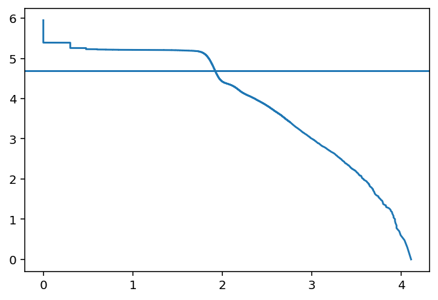


```
ClickTag_counts_filtered=ClickTagCounts.loc[list(ClickTag_counts_sorted[:50000].index)]
filtered_ClickTag_counts=ClickTag_counts_filtered.T
filtered_ClickTag_counts


hits = 0
counter = 1
for barcode in filtered_ClickTag_counts.index:
    for i in filtered_ClickTag_counts:    
        if filtered_ClickTag_counts[i].idxmax() == barcode:
            if hits ==0:
                sortedheatmap_dtf=pd.DataFrame({counter:filtered_ClickTag_counts[i]})
                hits+=1
                counter+=1
            else:
               sortedheatmap_dtf = sortedheatmap_dtf.assign(i = filtered_ClickTag_counts[i])
               sortedheatmap_dtf.rename(columns = {'i':counter}, inplace = True)
               counter+=1

filtered_ClickTag_counts=copy.deepcopy(sortedheatmap_dtf)

percentClickTags_counts = copy.deepcopy(filtered_ClickTag_counts)
for i in filtered_ClickTag_counts:
        percentClickTags_counts[i] = filtered_ClickTag_counts[i]/filtered_ClickTag_counts[i].sum()
```


```
fig, ax = plt.subplots(figsize=(10,10))  
sns.heatmap(np.log1p(filtered_ClickTag_counts), cmap='viridis')
plt.show()

fig, ax = plt.subplots(figsize=(10,10))  
sns.heatmap(percentClickTags_counts, cmap='viridis')
plt.show()

filtered_ClickTag_counts
```


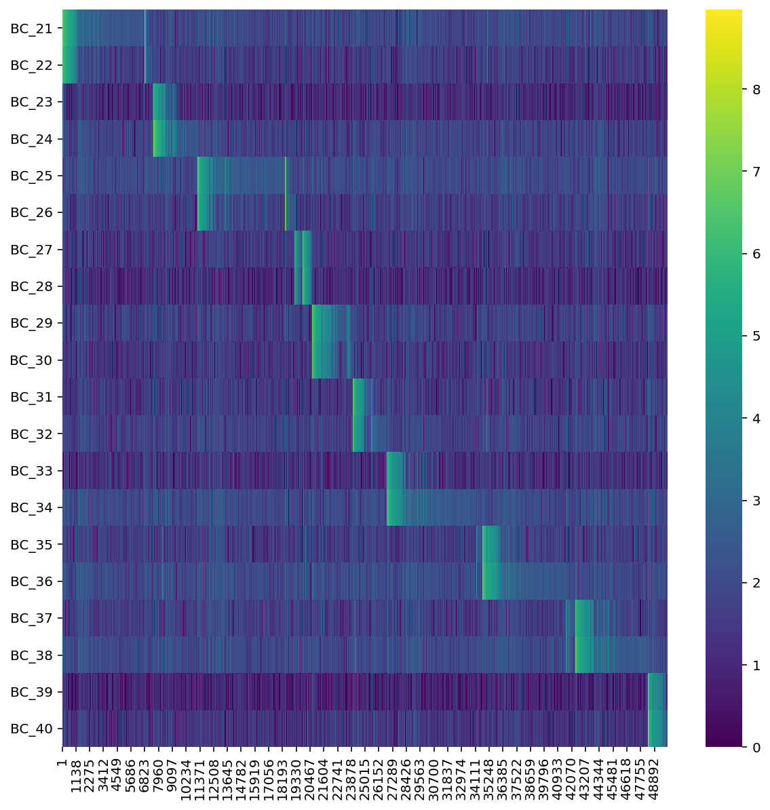


<div>
<style scoped>
    .dataframe tbody tr th:only-of-type {
        vertical-align: middle;
    }

    .dataframe tbody tr th {
        vertical-align: top;
    }

    .dataframe thead th {
        text-align: right;
    }
</style>
<table border="1" class="dataframe">
  <thead>
    <tr style="text-align: right;">
      <th></th>
      <th>1</th>
      <th>2</th>
      <th>3</th>
      <th>4</th>
      <th>5</th>
      <th>6</th>
      <th>7</th>
      <th>8</th>
      <th>9</th>
      <th>10</th>
      <th>11</th>
      <th>12</th>
      <th>13</th>
      <th>14</th>
      <th>15</th>
      <th>16</th>
      <th>17</th>
      <th>18</th>
      <th>19</th>
      <th>20</th>
      <th>21</th>
      <th>22</th>
      <th>23</th>
      <th>24</th>
      <th>25</th>
      <th>26</th>
      <th>27</th>
      <th>28</th>
      <th>29</th>
      <th>30</th>
      <th>31</th>
      <th>32</th>
      <th>33</th>
      <th>34</th>
      <th>35</th>
      <th>36</th>
      <th>37</th>
      <th>38</th>
      <th>39</th>
      <th>40</th>
      <th>...</th>
      <th>49961</th>
      <th>49962</th>
      <th>49963</th>
      <th>49964</th>
      <th>49965</th>
      <th>49966</th>
      <th>49967</th>
      <th>49968</th>
      <th>49969</th>
      <th>49970</th>
      <th>49971</th>
      <th>49972</th>
      <th>49973</th>
      <th>49974</th>
      <th>49975</th>
      <th>49976</th>
      <th>49977</th>
      <th>49978</th>
      <th>49979</th>
      <th>49980</th>
      <th>49981</th>
      <th>49982</th>
      <th>49983</th>
      <th>49984</th>
      <th>49985</th>
      <th>49986</th>
      <th>49987</th>
      <th>49988</th>
      <th>49989</th>
      <th>49990</th>
      <th>49991</th>
      <th>49992</th>
      <th>49993</th>
      <th>49994</th>
      <th>49995</th>
      <th>49996</th>
      <th>49997</th>
      <th>49998</th>
      <th>49999</th>
      <th>50000</th>
    </tr>
  </thead>
  <tbody>
    <tr>
      <th>BC_21</th>
      <td>4838</td>
      <td>4466</td>
      <td>4020</td>
      <td>4029</td>
      <td>3849</td>
      <td>3388</td>
      <td>3145</td>
      <td>3134</td>
      <td>3080</td>
      <td>2732</td>
      <td>2187</td>
      <td>2348</td>
      <td>1854</td>
      <td>2130</td>
      <td>2027</td>
      <td>1845</td>
      <td>1950</td>
      <td>2160</td>
      <td>1688</td>
      <td>1762</td>
      <td>1713</td>
      <td>1578</td>
      <td>1426</td>
      <td>1373</td>
      <td>1460</td>
      <td>1484</td>
      <td>1466</td>
      <td>1264</td>
      <td>1365</td>
      <td>1427</td>
      <td>1209</td>
      <td>1335</td>
      <td>1128</td>
      <td>1257</td>
      <td>1204</td>
      <td>1084</td>
      <td>1140</td>
      <td>909</td>
      <td>1164</td>
      <td>1273</td>
      <td>...</td>
      <td>3</td>
      <td>7</td>
      <td>7</td>
      <td>7</td>
      <td>7</td>
      <td>3</td>
      <td>4</td>
      <td>3</td>
      <td>3</td>
      <td>2</td>
      <td>5</td>
      <td>7</td>
      <td>1</td>
      <td>7</td>
      <td>2</td>
      <td>5</td>
      <td>8</td>
      <td>7</td>
      <td>6</td>
      <td>5</td>
      <td>3</td>
      <td>5</td>
      <td>3</td>
      <td>3</td>
      <td>8</td>
      <td>3</td>
      <td>4</td>
      <td>6</td>
      <td>5</td>
      <td>7</td>
      <td>5</td>
      <td>4</td>
      <td>8</td>
      <td>3</td>
      <td>0</td>
      <td>4</td>
      <td>6</td>
      <td>4</td>
      <td>4</td>
      <td>4</td>
    </tr>
    <tr>
      <th>BC_22</th>
      <td>3502</td>
      <td>3433</td>
      <td>3298</td>
      <td>3142</td>
      <td>3095</td>
      <td>2532</td>
      <td>2738</td>
      <td>2227</td>
      <td>2242</td>
      <td>2120</td>
      <td>2052</td>
      <td>1842</td>
      <td>1771</td>
      <td>1534</td>
      <td>1609</td>
      <td>1609</td>
      <td>1436</td>
      <td>1131</td>
      <td>1468</td>
      <td>1351</td>
      <td>1220</td>
      <td>1260</td>
      <td>1368</td>
      <td>1249</td>
      <td>1142</td>
      <td>1145</td>
      <td>1131</td>
      <td>960</td>
      <td>1099</td>
      <td>1029</td>
      <td>1075</td>
      <td>860</td>
      <td>1036</td>
      <td>950</td>
      <td>976</td>
      <td>992</td>
      <td>972</td>
      <td>531</td>
      <td>932</td>
      <td>827</td>
      <td>...</td>
      <td>1</td>
      <td>7</td>
      <td>4</td>
      <td>4</td>
      <td>4</td>
      <td>4</td>
      <td>1</td>
      <td>4</td>
      <td>2</td>
      <td>5</td>
      <td>1</td>
      <td>2</td>
      <td>2</td>
      <td>1</td>
      <td>2</td>
      <td>3</td>
      <td>4</td>
      <td>5</td>
      <td>0</td>
      <td>3</td>
      <td>4</td>
      <td>6</td>
      <td>1</td>
      <td>2</td>
      <td>5</td>
      <td>6</td>
      <td>4</td>
      <td>3</td>
      <td>3</td>
      <td>2</td>
      <td>1</td>
      <td>7</td>
      <td>1</td>
      <td>3</td>
      <td>2</td>
      <td>2</td>
      <td>4</td>
      <td>4</td>
      <td>2</td>
      <td>2</td>
    </tr>
    <tr>
      <th>BC_23</th>
      <td>9</td>
      <td>10</td>
      <td>10</td>
      <td>10</td>
      <td>9</td>
      <td>12</td>
      <td>13</td>
      <td>3</td>
      <td>7</td>
      <td>13</td>
      <td>4</td>
      <td>8</td>
      <td>4</td>
      <td>5</td>
      <td>6</td>
      <td>7</td>
      <td>5</td>
      <td>8</td>
      <td>7</td>
      <td>2</td>
      <td>8</td>
      <td>6</td>
      <td>2</td>
      <td>6</td>
      <td>2</td>
      <td>1</td>
      <td>3</td>
      <td>2</td>
      <td>3</td>
      <td>3</td>
      <td>1</td>
      <td>5</td>
      <td>3</td>
      <td>1</td>
      <td>5</td>
      <td>0</td>
      <td>7</td>
      <td>171</td>
      <td>1</td>
      <td>3</td>
      <td>...</td>
      <td>1</td>
      <td>4</td>
      <td>0</td>
      <td>3</td>
      <td>3</td>
      <td>1</td>
      <td>3</td>
      <td>2</td>
      <td>2</td>
      <td>2</td>
      <td>1</td>
      <td>1</td>
      <td>2</td>
      <td>2</td>
      <td>4</td>
      <td>2</td>
      <td>0</td>
      <td>0</td>
      <td>3</td>
      <td>4</td>
      <td>3</td>
      <td>0</td>
      <td>0</td>
      <td>0</td>
      <td>1</td>
      <td>0</td>
      <td>3</td>
      <td>3</td>
      <td>5</td>
      <td>2</td>
      <td>0</td>
      <td>2</td>
      <td>0</td>
      <td>0</td>
      <td>1</td>
      <td>2</td>
      <td>3</td>
      <td>1</td>
      <td>3</td>
      <td>4</td>
    </tr>
    <tr>
      <th>BC_24</th>
      <td>25</td>
      <td>25</td>
      <td>22</td>
      <td>18</td>
      <td>17</td>
      <td>22</td>
      <td>19</td>
      <td>26</td>
      <td>16</td>
      <td>23</td>
      <td>19</td>
      <td>10</td>
      <td>8</td>
      <td>17</td>
      <td>15</td>
      <td>11</td>
      <td>13</td>
      <td>15</td>
      <td>6</td>
      <td>14</td>
      <td>10</td>
      <td>6</td>
      <td>12</td>
      <td>14</td>
      <td>21</td>
      <td>11</td>
      <td>7</td>
      <td>10</td>
      <td>8</td>
      <td>14</td>
      <td>5</td>
      <td>2</td>
      <td>5</td>
      <td>6</td>
      <td>14</td>
      <td>13</td>
      <td>13</td>
      <td>472</td>
      <td>9</td>
      <td>9</td>
      <td>...</td>
      <td>2</td>
      <td>8</td>
      <td>2</td>
      <td>4</td>
      <td>5</td>
      <td>6</td>
      <td>3</td>
      <td>6</td>
      <td>4</td>
      <td>0</td>
      <td>2</td>
      <td>3</td>
      <td>5</td>
      <td>5</td>
      <td>1</td>
      <td>8</td>
      <td>5</td>
      <td>4</td>
      <td>4</td>
      <td>6</td>
      <td>7</td>
      <td>6</td>
      <td>3</td>
      <td>5</td>
      <td>5</td>
      <td>3</td>
      <td>3</td>
      <td>7</td>
      <td>4</td>
      <td>2</td>
      <td>4</td>
      <td>6</td>
      <td>4</td>
      <td>6</td>
      <td>4</td>
      <td>3</td>
      <td>6</td>
      <td>2</td>
      <td>3</td>
      <td>7</td>
    </tr>
    <tr>
      <th>BC_25</th>
      <td>31</td>
      <td>29</td>
      <td>22</td>
      <td>27</td>
      <td>30</td>
      <td>35</td>
      <td>30</td>
      <td>24</td>
      <td>13</td>
      <td>25</td>
      <td>20</td>
      <td>12</td>
      <td>23</td>
      <td>19</td>
      <td>13</td>
      <td>15</td>
      <td>13</td>
      <td>19</td>
      <td>20</td>
      <td>13</td>
      <td>17</td>
      <td>10</td>
      <td>18</td>
      <td>13</td>
      <td>22</td>
      <td>11</td>
      <td>9</td>
      <td>11</td>
      <td>11</td>
      <td>16</td>
      <td>18</td>
      <td>17</td>
      <td>15</td>
      <td>13</td>
      <td>10</td>
      <td>14</td>
      <td>10</td>
      <td>24</td>
      <td>7</td>
      <td>11</td>
      <td>...</td>
      <td>4</td>
      <td>3</td>
      <td>5</td>
      <td>5</td>
      <td>4</td>
      <td>6</td>
      <td>4</td>
      <td>3</td>
      <td>5</td>
      <td>5</td>
      <td>1</td>
      <td>4</td>
      <td>6</td>
      <td>8</td>
      <td>2</td>
      <td>4</td>
      <td>4</td>
      <td>7</td>
      <td>5</td>
      <td>4</td>
      <td>5</td>
      <td>8</td>
      <td>2</td>
      <td>4</td>
      <td>5</td>
      <td>1</td>
      <td>6</td>
      <td>3</td>
      <td>7</td>
      <td>5</td>
      <td>5</td>
      <td>5</td>
      <td>3</td>
      <td>3</td>
      <td>8</td>
      <td>3</td>
      <td>8</td>
      <td>6</td>
      <td>5</td>
      <td>7</td>
    </tr>
    <tr>
      <th>BC_26</th>
      <td>30</td>
      <td>23</td>
      <td>23</td>
      <td>19</td>
      <td>29</td>
      <td>20</td>
      <td>21</td>
      <td>20</td>
      <td>20</td>
      <td>18</td>
      <td>9</td>
      <td>18</td>
      <td>16</td>
      <td>8</td>
      <td>10</td>
      <td>10</td>
      <td>11</td>
      <td>9</td>
      <td>10</td>
      <td>17</td>
      <td>14</td>
      <td>11</td>
      <td>15</td>
      <td>14</td>
      <td>12</td>
      <td>13</td>
      <td>17</td>
      <td>9</td>
      <td>13</td>
      <td>10</td>
      <td>9</td>
      <td>8</td>
      <td>10</td>
      <td>9</td>
      <td>8</td>
      <td>14</td>
      <td>10</td>
      <td>16</td>
      <td>13</td>
      <td>10</td>
      <td>...</td>
      <td>2</td>
      <td>5</td>
      <td>8</td>
      <td>0</td>
      <td>4</td>
      <td>4</td>
      <td>2</td>
      <td>5</td>
      <td>2</td>
      <td>6</td>
      <td>1</td>
      <td>4</td>
      <td>4</td>
      <td>3</td>
      <td>0</td>
      <td>6</td>
      <td>5</td>
      <td>4</td>
      <td>3</td>
      <td>2</td>
      <td>1</td>
      <td>6</td>
      <td>0</td>
      <td>4</td>
      <td>2</td>
      <td>9</td>
      <td>8</td>
      <td>7</td>
      <td>5</td>
      <td>4</td>
      <td>2</td>
      <td>4</td>
      <td>3</td>
      <td>3</td>
      <td>3</td>
      <td>5</td>
      <td>4</td>
      <td>6</td>
      <td>3</td>
      <td>3</td>
    </tr>
    <tr>
      <th>BC_27</th>
      <td>15</td>
      <td>19</td>
      <td>10</td>
      <td>17</td>
      <td>11</td>
      <td>7</td>
      <td>10</td>
      <td>8</td>
      <td>17</td>
      <td>13</td>
      <td>10</td>
      <td>14</td>
      <td>14</td>
      <td>6</td>
      <td>8</td>
      <td>12</td>
      <td>5</td>
      <td>7</td>
      <td>12</td>
      <td>12</td>
      <td>6</td>
      <td>7</td>
      <td>2</td>
      <td>11</td>
      <td>11</td>
      <td>10</td>
      <td>12</td>
      <td>9</td>
      <td>11</td>
      <td>3</td>
      <td>9</td>
      <td>1</td>
      <td>10</td>
      <td>6</td>
      <td>6</td>
      <td>7</td>
      <td>1</td>
      <td>10</td>
      <td>4</td>
      <td>4</td>
      <td>...</td>
      <td>0</td>
      <td>1</td>
      <td>9</td>
      <td>4</td>
      <td>3</td>
      <td>1</td>
      <td>2</td>
      <td>0</td>
      <td>2</td>
      <td>1</td>
      <td>2</td>
      <td>3</td>
      <td>2</td>
      <td>0</td>
      <td>4</td>
      <td>2</td>
      <td>4</td>
      <td>2</td>
      <td>7</td>
      <td>2</td>
      <td>4</td>
      <td>2</td>
      <td>3</td>
      <td>3</td>
      <td>1</td>
      <td>0</td>
      <td>1</td>
      <td>1</td>
      <td>4</td>
      <td>0</td>
      <td>6</td>
      <td>4</td>
      <td>3</td>
      <td>2</td>
      <td>0</td>
      <td>4</td>
      <td>4</td>
      <td>5</td>
      <td>7</td>
      <td>4</td>
    </tr>
    <tr>
      <th>BC_28</th>
      <td>19</td>
      <td>12</td>
      <td>15</td>
      <td>14</td>
      <td>17</td>
      <td>9</td>
      <td>12</td>
      <td>10</td>
      <td>13</td>
      <td>5</td>
      <td>10</td>
      <td>9</td>
      <td>12</td>
      <td>8</td>
      <td>7</td>
      <td>5</td>
      <td>5</td>
      <td>6</td>
      <td>6</td>
      <td>10</td>
      <td>6</td>
      <td>4</td>
      <td>4</td>
      <td>1</td>
      <td>5</td>
      <td>8</td>
      <td>8</td>
      <td>3</td>
      <td>6</td>
      <td>4</td>
      <td>10</td>
      <td>5</td>
      <td>3</td>
      <td>2</td>
      <td>2</td>
      <td>12</td>
      <td>7</td>
      <td>6</td>
      <td>6</td>
      <td>9</td>
      <td>...</td>
      <td>1</td>
      <td>0</td>
      <td>1</td>
      <td>5</td>
      <td>2</td>
      <td>6</td>
      <td>1</td>
      <td>0</td>
      <td>1</td>
      <td>2</td>
      <td>0</td>
      <td>1</td>
      <td>2</td>
      <td>5</td>
      <td>1</td>
      <td>1</td>
      <td>3</td>
      <td>2</td>
      <td>5</td>
      <td>3</td>
      <td>0</td>
      <td>1</td>
      <td>2</td>
      <td>2</td>
      <td>6</td>
      <td>1</td>
      <td>1</td>
      <td>1</td>
      <td>1</td>
      <td>2</td>
      <td>0</td>
      <td>1</td>
      <td>1</td>
      <td>0</td>
      <td>1</td>
      <td>1</td>
      <td>0</td>
      <td>3</td>
      <td>2</td>
      <td>2</td>
    </tr>
    <tr>
      <th>BC_29</th>
      <td>9</td>
      <td>21</td>
      <td>22</td>
      <td>19</td>
      <td>13</td>
      <td>14</td>
      <td>14</td>
      <td>12</td>
      <td>20</td>
      <td>22</td>
      <td>12</td>
      <td>11</td>
      <td>10</td>
      <td>10</td>
      <td>12</td>
      <td>11</td>
      <td>10</td>
      <td>12</td>
      <td>15</td>
      <td>11</td>
      <td>13</td>
      <td>8</td>
      <td>12</td>
      <td>8</td>
      <td>10</td>
      <td>7</td>
      <td>11</td>
      <td>9</td>
      <td>9</td>
      <td>10</td>
      <td>8</td>
      <td>13</td>
      <td>9</td>
      <td>7</td>
      <td>6</td>
      <td>16</td>
      <td>10</td>
      <td>6</td>
      <td>11</td>
      <td>6</td>
      <td>...</td>
      <td>1</td>
      <td>7</td>
      <td>3</td>
      <td>4</td>
      <td>8</td>
      <td>3</td>
      <td>4</td>
      <td>15</td>
      <td>1</td>
      <td>4</td>
      <td>2</td>
      <td>4</td>
      <td>7</td>
      <td>8</td>
      <td>3</td>
      <td>6</td>
      <td>3</td>
      <td>4</td>
      <td>3</td>
      <td>1</td>
      <td>3</td>
      <td>4</td>
      <td>0</td>
      <td>7</td>
      <td>6</td>
      <td>6</td>
      <td>4</td>
      <td>3</td>
      <td>4</td>
      <td>4</td>
      <td>3</td>
      <td>1</td>
      <td>9</td>
      <td>3</td>
      <td>9</td>
      <td>2</td>
      <td>4</td>
      <td>4</td>
      <td>4</td>
      <td>3</td>
    </tr>
    <tr>
      <th>BC_30</th>
      <td>13</td>
      <td>5</td>
      <td>17</td>
      <td>9</td>
      <td>13</td>
      <td>12</td>
      <td>11</td>
      <td>7</td>
      <td>5</td>
      <td>10</td>
      <td>11</td>
      <td>9</td>
      <td>6</td>
      <td>3</td>
      <td>5</td>
      <td>4</td>
      <td>8</td>
      <td>4</td>
      <td>7</td>
      <td>6</td>
      <td>8</td>
      <td>5</td>
      <td>9</td>
      <td>7</td>
      <td>6</td>
      <td>6</td>
      <td>7</td>
      <td>7</td>
      <td>5</td>
      <td>4</td>
      <td>6</td>
      <td>8</td>
      <td>5</td>
      <td>5</td>
      <td>4</td>
      <td>12</td>
      <td>4</td>
      <td>2</td>
      <td>9</td>
      <td>1</td>
      <td>...</td>
      <td>5</td>
      <td>2</td>
      <td>1</td>
      <td>2</td>
      <td>1</td>
      <td>2</td>
      <td>2</td>
      <td>13</td>
      <td>4</td>
      <td>3</td>
      <td>2</td>
      <td>0</td>
      <td>3</td>
      <td>3</td>
      <td>1</td>
      <td>3</td>
      <td>2</td>
      <td>2</td>
      <td>2</td>
      <td>3</td>
      <td>3</td>
      <td>5</td>
      <td>2</td>
      <td>4</td>
      <td>1</td>
      <td>2</td>
      <td>2</td>
      <td>2</td>
      <td>2</td>
      <td>0</td>
      <td>4</td>
      <td>3</td>
      <td>6</td>
      <td>2</td>
      <td>7</td>
      <td>7</td>
      <td>5</td>
      <td>6</td>
      <td>0</td>
      <td>3</td>
    </tr>
    <tr>
      <th>BC_31</th>
      <td>9</td>
      <td>15</td>
      <td>9</td>
      <td>13</td>
      <td>14</td>
      <td>14</td>
      <td>19</td>
      <td>10</td>
      <td>18</td>
      <td>16</td>
      <td>14</td>
      <td>15</td>
      <td>22</td>
      <td>9</td>
      <td>13</td>
      <td>10</td>
      <td>9</td>
      <td>7</td>
      <td>12</td>
      <td>11</td>
      <td>11</td>
      <td>8</td>
      <td>7</td>
      <td>9</td>
      <td>16</td>
      <td>6</td>
      <td>9</td>
      <td>11</td>
      <td>11</td>
      <td>3</td>
      <td>8</td>
      <td>8</td>
      <td>10</td>
      <td>4</td>
      <td>4</td>
      <td>8</td>
      <td>8</td>
      <td>8</td>
      <td>11</td>
      <td>6</td>
      <td>...</td>
      <td>5</td>
      <td>1</td>
      <td>2</td>
      <td>4</td>
      <td>3</td>
      <td>4</td>
      <td>3</td>
      <td>1</td>
      <td>2</td>
      <td>4</td>
      <td>2</td>
      <td>0</td>
      <td>3</td>
      <td>3</td>
      <td>4</td>
      <td>2</td>
      <td>1</td>
      <td>6</td>
      <td>2</td>
      <td>1</td>
      <td>2</td>
      <td>1</td>
      <td>2</td>
      <td>5</td>
      <td>2</td>
      <td>5</td>
      <td>2</td>
      <td>4</td>
      <td>6</td>
      <td>3</td>
      <td>3</td>
      <td>3</td>
      <td>3</td>
      <td>1</td>
      <td>3</td>
      <td>4</td>
      <td>1</td>
      <td>2</td>
      <td>2</td>
      <td>6</td>
    </tr>
    <tr>
      <th>BC_32</th>
      <td>23</td>
      <td>20</td>
      <td>10</td>
      <td>18</td>
      <td>14</td>
      <td>13</td>
      <td>9</td>
      <td>8</td>
      <td>13</td>
      <td>15</td>
      <td>5</td>
      <td>10</td>
      <td>20</td>
      <td>13</td>
      <td>12</td>
      <td>9</td>
      <td>14</td>
      <td>9</td>
      <td>12</td>
      <td>11</td>
      <td>7</td>
      <td>9</td>
      <td>12</td>
      <td>15</td>
      <td>8</td>
      <td>6</td>
      <td>5</td>
      <td>5</td>
      <td>7</td>
      <td>9</td>
      <td>13</td>
      <td>8</td>
      <td>12</td>
      <td>9</td>
      <td>7</td>
      <td>8</td>
      <td>7</td>
      <td>8</td>
      <td>5</td>
      <td>5</td>
      <td>...</td>
      <td>0</td>
      <td>4</td>
      <td>4</td>
      <td>5</td>
      <td>4</td>
      <td>4</td>
      <td>4</td>
      <td>0</td>
      <td>6</td>
      <td>5</td>
      <td>1</td>
      <td>3</td>
      <td>3</td>
      <td>2</td>
      <td>3</td>
      <td>4</td>
      <td>3</td>
      <td>6</td>
      <td>5</td>
      <td>5</td>
      <td>7</td>
      <td>6</td>
      <td>5</td>
      <td>3</td>
      <td>5</td>
      <td>7</td>
      <td>2</td>
      <td>2</td>
      <td>3</td>
      <td>2</td>
      <td>4</td>
      <td>6</td>
      <td>6</td>
      <td>4</td>
      <td>6</td>
      <td>6</td>
      <td>5</td>
      <td>3</td>
      <td>4</td>
      <td>6</td>
    </tr>
    <tr>
      <th>BC_33</th>
      <td>15</td>
      <td>11</td>
      <td>13</td>
      <td>9</td>
      <td>13</td>
      <td>10</td>
      <td>17</td>
      <td>10</td>
      <td>12</td>
      <td>8</td>
      <td>11</td>
      <td>9</td>
      <td>7</td>
      <td>9</td>
      <td>9</td>
      <td>5</td>
      <td>7</td>
      <td>5</td>
      <td>8</td>
      <td>5</td>
      <td>7</td>
      <td>6</td>
      <td>6</td>
      <td>6</td>
      <td>4</td>
      <td>6</td>
      <td>3</td>
      <td>122</td>
      <td>7</td>
      <td>6</td>
      <td>7</td>
      <td>9</td>
      <td>5</td>
      <td>5</td>
      <td>5</td>
      <td>9</td>
      <td>10</td>
      <td>7</td>
      <td>3</td>
      <td>6</td>
      <td>...</td>
      <td>0</td>
      <td>2</td>
      <td>1</td>
      <td>2</td>
      <td>0</td>
      <td>1</td>
      <td>3</td>
      <td>0</td>
      <td>1</td>
      <td>2</td>
      <td>1</td>
      <td>2</td>
      <td>6</td>
      <td>3</td>
      <td>3</td>
      <td>2</td>
      <td>5</td>
      <td>0</td>
      <td>1</td>
      <td>1</td>
      <td>3</td>
      <td>0</td>
      <td>2</td>
      <td>4</td>
      <td>2</td>
      <td>1</td>
      <td>2</td>
      <td>1</td>
      <td>3</td>
      <td>3</td>
      <td>3</td>
      <td>0</td>
      <td>3</td>
      <td>3</td>
      <td>2</td>
      <td>0</td>
      <td>3</td>
      <td>2</td>
      <td>4</td>
      <td>1</td>
    </tr>
    <tr>
      <th>BC_34</th>
      <td>19</td>
      <td>24</td>
      <td>29</td>
      <td>22</td>
      <td>23</td>
      <td>23</td>
      <td>19</td>
      <td>19</td>
      <td>20</td>
      <td>24</td>
      <td>14</td>
      <td>16</td>
      <td>21</td>
      <td>14</td>
      <td>7</td>
      <td>13</td>
      <td>23</td>
      <td>15</td>
      <td>16</td>
      <td>10</td>
      <td>14</td>
      <td>9</td>
      <td>14</td>
      <td>14</td>
      <td>7</td>
      <td>8</td>
      <td>9</td>
      <td>183</td>
      <td>7</td>
      <td>15</td>
      <td>13</td>
      <td>14</td>
      <td>14</td>
      <td>6</td>
      <td>10</td>
      <td>17</td>
      <td>8</td>
      <td>7</td>
      <td>8</td>
      <td>11</td>
      <td>...</td>
      <td>1</td>
      <td>7</td>
      <td>1</td>
      <td>8</td>
      <td>4</td>
      <td>7</td>
      <td>10</td>
      <td>2</td>
      <td>3</td>
      <td>10</td>
      <td>4</td>
      <td>6</td>
      <td>6</td>
      <td>6</td>
      <td>6</td>
      <td>9</td>
      <td>5</td>
      <td>7</td>
      <td>8</td>
      <td>6</td>
      <td>8</td>
      <td>5</td>
      <td>4</td>
      <td>6</td>
      <td>5</td>
      <td>4</td>
      <td>4</td>
      <td>7</td>
      <td>6</td>
      <td>8</td>
      <td>2</td>
      <td>7</td>
      <td>4</td>
      <td>7</td>
      <td>5</td>
      <td>4</td>
      <td>7</td>
      <td>5</td>
      <td>3</td>
      <td>3</td>
    </tr>
    <tr>
      <th>BC_35</th>
      <td>18</td>
      <td>20</td>
      <td>16</td>
      <td>20</td>
      <td>9</td>
      <td>19</td>
      <td>23</td>
      <td>12</td>
      <td>24</td>
      <td>13</td>
      <td>14</td>
      <td>19</td>
      <td>25</td>
      <td>7</td>
      <td>12</td>
      <td>12</td>
      <td>9</td>
      <td>8</td>
      <td>11</td>
      <td>9</td>
      <td>28</td>
      <td>6</td>
      <td>9</td>
      <td>11</td>
      <td>7</td>
      <td>7</td>
      <td>5</td>
      <td>10</td>
      <td>9</td>
      <td>14</td>
      <td>10</td>
      <td>4</td>
      <td>9</td>
      <td>3</td>
      <td>7</td>
      <td>10</td>
      <td>5</td>
      <td>9</td>
      <td>10</td>
      <td>7</td>
      <td>...</td>
      <td>2</td>
      <td>5</td>
      <td>6</td>
      <td>2</td>
      <td>2</td>
      <td>6</td>
      <td>2</td>
      <td>0</td>
      <td>4</td>
      <td>4</td>
      <td>0</td>
      <td>6</td>
      <td>6</td>
      <td>5</td>
      <td>2</td>
      <td>4</td>
      <td>2</td>
      <td>2</td>
      <td>3</td>
      <td>3</td>
      <td>3</td>
      <td>3</td>
      <td>3</td>
      <td>6</td>
      <td>7</td>
      <td>1</td>
      <td>2</td>
      <td>6</td>
      <td>2</td>
      <td>4</td>
      <td>4</td>
      <td>4</td>
      <td>1</td>
      <td>5</td>
      <td>1</td>
      <td>4</td>
      <td>0</td>
      <td>2</td>
      <td>8</td>
      <td>3</td>
    </tr>
    <tr>
      <th>BC_36</th>
      <td>21</td>
      <td>28</td>
      <td>22</td>
      <td>20</td>
      <td>23</td>
      <td>11</td>
      <td>22</td>
      <td>20</td>
      <td>19</td>
      <td>26</td>
      <td>18</td>
      <td>16</td>
      <td>25</td>
      <td>10</td>
      <td>15</td>
      <td>17</td>
      <td>15</td>
      <td>14</td>
      <td>15</td>
      <td>9</td>
      <td>45</td>
      <td>10</td>
      <td>14</td>
      <td>10</td>
      <td>6</td>
      <td>8</td>
      <td>10</td>
      <td>12</td>
      <td>15</td>
      <td>9</td>
      <td>15</td>
      <td>12</td>
      <td>15</td>
      <td>7</td>
      <td>11</td>
      <td>18</td>
      <td>8</td>
      <td>9</td>
      <td>12</td>
      <td>12</td>
      <td>...</td>
      <td>2</td>
      <td>5</td>
      <td>5</td>
      <td>6</td>
      <td>9</td>
      <td>5</td>
      <td>5</td>
      <td>2</td>
      <td>3</td>
      <td>6</td>
      <td>3</td>
      <td>5</td>
      <td>7</td>
      <td>5</td>
      <td>7</td>
      <td>2</td>
      <td>4</td>
      <td>6</td>
      <td>4</td>
      <td>6</td>
      <td>7</td>
      <td>5</td>
      <td>10</td>
      <td>4</td>
      <td>5</td>
      <td>9</td>
      <td>5</td>
      <td>4</td>
      <td>5</td>
      <td>7</td>
      <td>8</td>
      <td>3</td>
      <td>5</td>
      <td>6</td>
      <td>9</td>
      <td>7</td>
      <td>7</td>
      <td>6</td>
      <td>6</td>
      <td>5</td>
    </tr>
    <tr>
      <th>BC_37</th>
      <td>20</td>
      <td>14</td>
      <td>18</td>
      <td>15</td>
      <td>17</td>
      <td>15</td>
      <td>16</td>
      <td>10</td>
      <td>10</td>
      <td>10</td>
      <td>16</td>
      <td>9</td>
      <td>16</td>
      <td>10</td>
      <td>8</td>
      <td>8</td>
      <td>6</td>
      <td>9</td>
      <td>7</td>
      <td>10</td>
      <td>10</td>
      <td>8</td>
      <td>6</td>
      <td>9</td>
      <td>13</td>
      <td>9</td>
      <td>8</td>
      <td>5</td>
      <td>5</td>
      <td>9</td>
      <td>10</td>
      <td>14</td>
      <td>4</td>
      <td>2</td>
      <td>4</td>
      <td>8</td>
      <td>4</td>
      <td>5</td>
      <td>2</td>
      <td>7</td>
      <td>...</td>
      <td>2</td>
      <td>3</td>
      <td>5</td>
      <td>4</td>
      <td>3</td>
      <td>2</td>
      <td>5</td>
      <td>0</td>
      <td>4</td>
      <td>5</td>
      <td>0</td>
      <td>6</td>
      <td>7</td>
      <td>2</td>
      <td>5</td>
      <td>6</td>
      <td>3</td>
      <td>4</td>
      <td>2</td>
      <td>8</td>
      <td>3</td>
      <td>4</td>
      <td>4</td>
      <td>6</td>
      <td>5</td>
      <td>5</td>
      <td>8</td>
      <td>4</td>
      <td>3</td>
      <td>8</td>
      <td>2</td>
      <td>7</td>
      <td>2</td>
      <td>7</td>
      <td>5</td>
      <td>6</td>
      <td>4</td>
      <td>3</td>
      <td>6</td>
      <td>5</td>
    </tr>
    <tr>
      <th>BC_38</th>
      <td>17</td>
      <td>24</td>
      <td>36</td>
      <td>26</td>
      <td>16</td>
      <td>32</td>
      <td>26</td>
      <td>16</td>
      <td>23</td>
      <td>20</td>
      <td>15</td>
      <td>16</td>
      <td>17</td>
      <td>12</td>
      <td>21</td>
      <td>20</td>
      <td>16</td>
      <td>15</td>
      <td>14</td>
      <td>15</td>
      <td>13</td>
      <td>12</td>
      <td>13</td>
      <td>12</td>
      <td>16</td>
      <td>13</td>
      <td>9</td>
      <td>26</td>
      <td>13</td>
      <td>8</td>
      <td>13</td>
      <td>12</td>
      <td>8</td>
      <td>11</td>
      <td>8</td>
      <td>26</td>
      <td>8</td>
      <td>14</td>
      <td>9</td>
      <td>7</td>
      <td>...</td>
      <td>1</td>
      <td>5</td>
      <td>7</td>
      <td>7</td>
      <td>6</td>
      <td>7</td>
      <td>7</td>
      <td>2</td>
      <td>1</td>
      <td>8</td>
      <td>1</td>
      <td>4</td>
      <td>5</td>
      <td>5</td>
      <td>7</td>
      <td>2</td>
      <td>5</td>
      <td>4</td>
      <td>3</td>
      <td>7</td>
      <td>8</td>
      <td>6</td>
      <td>4</td>
      <td>6</td>
      <td>5</td>
      <td>4</td>
      <td>7</td>
      <td>5</td>
      <td>3</td>
      <td>8</td>
      <td>4</td>
      <td>7</td>
      <td>7</td>
      <td>11</td>
      <td>5</td>
      <td>8</td>
      <td>3</td>
      <td>6</td>
      <td>5</td>
      <td>4</td>
    </tr>
    <tr>
      <th>BC_39</th>
      <td>12</td>
      <td>13</td>
      <td>8</td>
      <td>7</td>
      <td>9</td>
      <td>6</td>
      <td>6</td>
      <td>6</td>
      <td>7</td>
      <td>4</td>
      <td>8</td>
      <td>4</td>
      <td>6</td>
      <td>5</td>
      <td>4</td>
      <td>6</td>
      <td>6</td>
      <td>2</td>
      <td>2</td>
      <td>5</td>
      <td>7</td>
      <td>3</td>
      <td>4</td>
      <td>5</td>
      <td>2</td>
      <td>4</td>
      <td>4</td>
      <td>2</td>
      <td>2</td>
      <td>9</td>
      <td>3</td>
      <td>7</td>
      <td>2</td>
      <td>2</td>
      <td>2</td>
      <td>10</td>
      <td>2</td>
      <td>8</td>
      <td>4</td>
      <td>2</td>
      <td>...</td>
      <td>19</td>
      <td>0</td>
      <td>4</td>
      <td>1</td>
      <td>4</td>
      <td>5</td>
      <td>9</td>
      <td>9</td>
      <td>11</td>
      <td>1</td>
      <td>20</td>
      <td>12</td>
      <td>1</td>
      <td>3</td>
      <td>6</td>
      <td>5</td>
      <td>3</td>
      <td>3</td>
      <td>6</td>
      <td>4</td>
      <td>1</td>
      <td>2</td>
      <td>7</td>
      <td>3</td>
      <td>0</td>
      <td>4</td>
      <td>7</td>
      <td>1</td>
      <td>4</td>
      <td>4</td>
      <td>6</td>
      <td>2</td>
      <td>3</td>
      <td>2</td>
      <td>2</td>
      <td>1</td>
      <td>0</td>
      <td>5</td>
      <td>1</td>
      <td>3</td>
    </tr>
    <tr>
      <th>BC_40</th>
      <td>14</td>
      <td>12</td>
      <td>10</td>
      <td>7</td>
      <td>17</td>
      <td>11</td>
      <td>9</td>
      <td>8</td>
      <td>7</td>
      <td>14</td>
      <td>11</td>
      <td>6</td>
      <td>9</td>
      <td>13</td>
      <td>7</td>
      <td>9</td>
      <td>8</td>
      <td>5</td>
      <td>8</td>
      <td>8</td>
      <td>15</td>
      <td>10</td>
      <td>8</td>
      <td>8</td>
      <td>4</td>
      <td>1</td>
      <td>2</td>
      <td>5</td>
      <td>5</td>
      <td>5</td>
      <td>8</td>
      <td>5</td>
      <td>7</td>
      <td>4</td>
      <td>8</td>
      <td>7</td>
      <td>1</td>
      <td>4</td>
      <td>5</td>
      <td>5</td>
      <td>...</td>
      <td>35</td>
      <td>11</td>
      <td>12</td>
      <td>10</td>
      <td>11</td>
      <td>10</td>
      <td>12</td>
      <td>19</td>
      <td>25</td>
      <td>11</td>
      <td>37</td>
      <td>13</td>
      <td>8</td>
      <td>10</td>
      <td>23</td>
      <td>10</td>
      <td>17</td>
      <td>10</td>
      <td>13</td>
      <td>11</td>
      <td>10</td>
      <td>10</td>
      <td>28</td>
      <td>8</td>
      <td>9</td>
      <td>13</td>
      <td>9</td>
      <td>14</td>
      <td>9</td>
      <td>9</td>
      <td>18</td>
      <td>8</td>
      <td>12</td>
      <td>12</td>
      <td>10</td>
      <td>10</td>
      <td>9</td>
      <td>8</td>
      <td>11</td>
      <td>8</td>
    </tr>
  </tbody>
</table>
<p>20 rows × 50000 columns</p>
</div>


```
adata = sc.AnnData(ClickTag_counts_filtered)
adata.var_names= list(ClickTag_counts_filtered.columns)
adata.obs_names= list(ClickTag_counts_filtered[:50000].index)
```


```
adata
```


    AnnData object with n_obs × n_vars = 50000 × 20


Cluster ClickTag counts to determine high quality cells (cells strongly marked by the assigned barcodes)


```
adata

sc.pp.filter_genes(adata, min_counts=0)
sc.pp.normalize_per_cell(adata, counts_per_cell_after=10000)
adata.obs['n_countslog']=np.log(adata.obs['n_counts'])
sc.pp.log1p(adata)
sc.pp.regress_out(adata, ['n_counts'])
sc.tl.tsne(adata, perplexity=30, use_rep=None)


sc.pp.neighbors(adata)
sc.tl.umap(adata)
sc.tl.louvain(adata, resolution=2)
sc.pl.tsne(adata, color='n_countslog')

sc.set_figure_params(dpi=120)
sc.pl.tsne(adata,color=['louvain'])


# sc.pl.tsne(adata, color=adata.var_names)

# for i in range(20):
#     sc.pl.violin(adata[adata.obs['louvain'].isin([str(i)])], keys=adata.var_names)

# sc.pl.tsne(adata, color=['louvain'],palette='rainbow',legend_loc='on data')
```

    /usr/local/lib/python3.6/dist-packages/statsmodels/tools/_testing.py:19: FutureWarning: pandas.util.testing is deprecated. Use the functions in the public API at pandas.testing instead.
      import pandas.util.testing as tm


    WARNING: Consider installing the package MulticoreTSNE (https://github.com/DmitryUlyanov/Multicore-TSNE). Even for n_jobs=1 this speeds up the computation considerably and might yield better converged results.


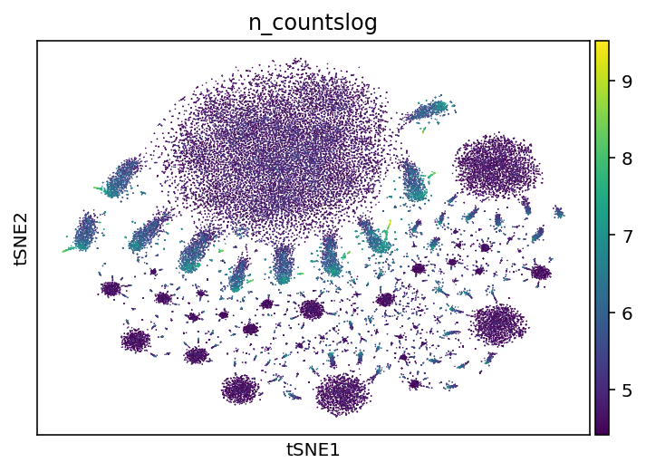


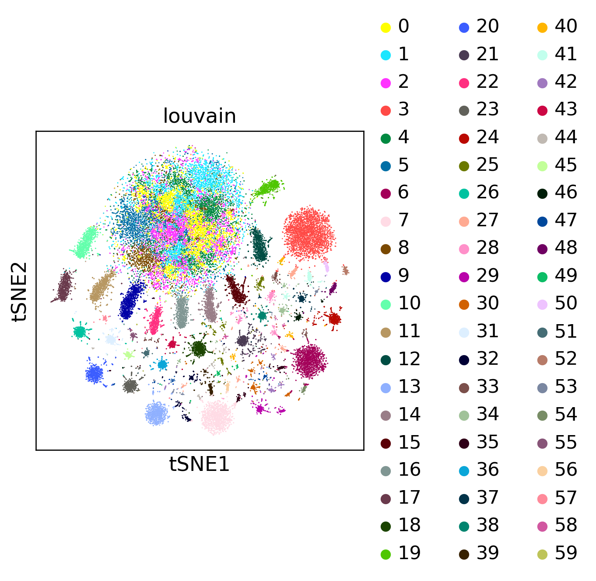


```
sc.pl.umap(adata, color='louvain')
sc.pl.umap(adata, color='n_countslog')
sc.pl.umap(adata, color=adata.var_names)
```


```
sc.tl.louvain(adata, resolution=0.15)#0.15
sc.pl.umap(adata, color='louvain')
```


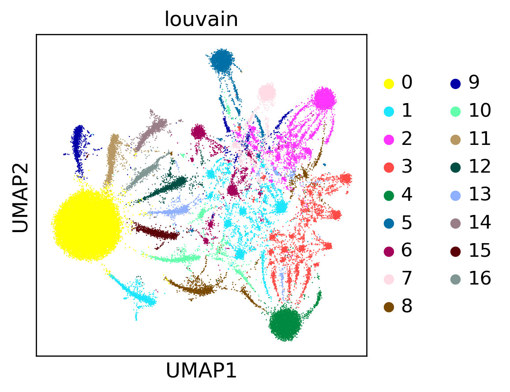


Select ClickTag Clusters with Clean Expression


```
adata_sub = adata[adata.obs['louvain'].isin(['1','8','9','10','11','12','13','14','15','16'])]
adata_sub 
sc.tl.louvain(adata_sub, random_state=42,resolution=0.05, key_added='louvain_new')
sc.tl.umap(adata_sub,random_state = 42,spread=0.5 )
```


```
sc.pl.umap(adata_sub, color=['louvain_new','n_countslog'])
```


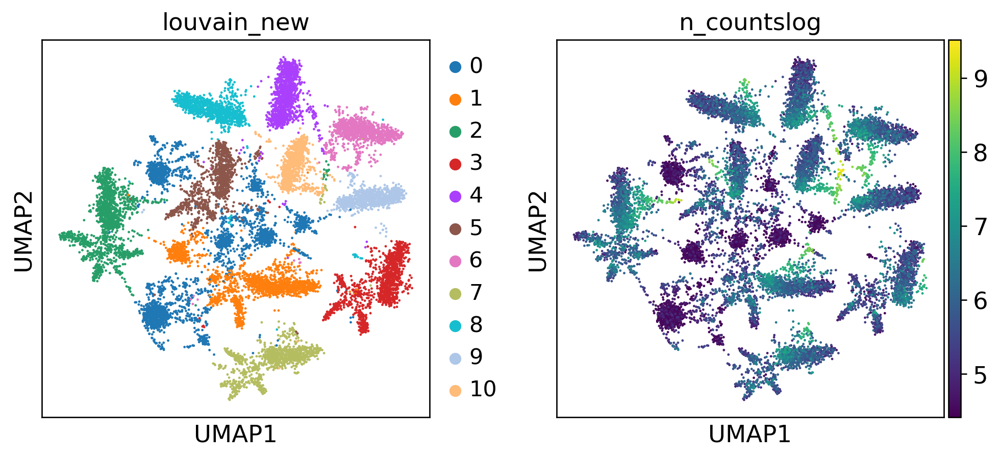


Compare ClickTag Counts/Cell Filtering to Previous Cell Ranger-based Analysis (Found in [this notebook](https://github.com/pachterlab/CWGFLHGCCHAP_2021/blob/master/notebooks/Preprocessing/ClickTagDemultiplexing/cellRangerClickTagCounts.ipynb))


```
adata
```


    AnnData object with n_obs × n_vars = 50000 × 20
        obs: 'n_counts', 'n_countslog', 'louvain'
        var: 'n_counts'
        uns: 'log1p', 'neighbors', 'umap', 'louvain', 'louvain_colors'
        obsm: 'X_tsne', 'X_umap'
        obsp: 'distances', 'connectivities'


```
adata.obs
```


<div>
<style scoped>
    .dataframe tbody tr th:only-of-type {
        vertical-align: middle;
    }

    .dataframe tbody tr th {
        vertical-align: top;
    }

    .dataframe thead th {
        text-align: right;
    }
</style>
<table border="1" class="dataframe">
  <thead>
    <tr style="text-align: right;">
      <th></th>
      <th>n_counts</th>
      <th>n_countslog</th>
      <th>louvain</th>
    </tr>
  </thead>
  <tbody>
    <tr>
      <th>CCATGTCAGTGTTTGC-2</th>
      <td>13584.0</td>
      <td>9.516648</td>
      <td>5</td>
    </tr>
    <tr>
      <th>AGGCCGTCAATCGAAA-2</th>
      <td>12926.0</td>
      <td>9.466996</td>
      <td>5</td>
    </tr>
    <tr>
      <th>CGCTGGACAAGACGTG-1</th>
      <td>11720.0</td>
      <td>9.369052</td>
      <td>5</td>
    </tr>
    <tr>
      <th>CTCGAGGTCACAATGC-1</th>
      <td>10908.0</td>
      <td>9.297252</td>
      <td>5</td>
    </tr>
    <tr>
      <th>CACACCTGTCTGATCA-1</th>
      <td>9881.0</td>
      <td>9.198369</td>
      <td>5</td>
    </tr>
    <tr>
      <th>...</th>
      <td>...</td>
      <td>...</td>
      <td>...</td>
    </tr>
    <tr>
      <th>TGACTAGTCAAACGGG-1</th>
      <td>83.0</td>
      <td>4.418840</td>
      <td>0</td>
    </tr>
    <tr>
      <th>CGGACGTAGTAGCGGT-1</th>
      <td>83.0</td>
      <td>4.418840</td>
      <td>0</td>
    </tr>
    <tr>
      <th>AACTCTTGTTGCCTCT-1</th>
      <td>83.0</td>
      <td>4.418840</td>
      <td>0</td>
    </tr>
    <tr>
      <th>ACGAGGAGTAAGTTCC-1</th>
      <td>83.0</td>
      <td>4.418840</td>
      <td>0</td>
    </tr>
    <tr>
      <th>GGGAATGAGCGTTGCC-2</th>
      <td>83.0</td>
      <td>4.418840</td>
      <td>0</td>
    </tr>
  </tbody>
</table>
<p>50000 rows × 3 columns</p>
</div>


```
#Read in clustered, filtered adata from Cell Ranger analysis of Starvation data
!mv D1.1798 D1.1798.h5ad
old=sc.read('D1.1798.h5ad')
```


```
old.obs
```


<div>
<style scoped>
    .dataframe tbody tr th:only-of-type {
        vertical-align: middle;
    }

    .dataframe tbody tr th {
        vertical-align: top;
    }

    .dataframe thead th {
        text-align: right;
    }
</style>
<table border="1" class="dataframe">
  <thead>
    <tr style="text-align: right;">
      <th></th>
      <th>n_counts</th>
      <th>n_countslog</th>
      <th>louvain</th>
      <th>orgID</th>
      <th>fed</th>
      <th>starved</th>
      <th>fed_ord</th>
      <th>starved_ord</th>
      <th>new_fed</th>
      <th>fed_neighbor_score</th>
    </tr>
    <tr>
      <th>index</th>
      <th></th>
      <th></th>
      <th></th>
      <th></th>
      <th></th>
      <th></th>
      <th></th>
      <th></th>
      <th></th>
      <th></th>
    </tr>
  </thead>
  <tbody>
    <tr>
      <th>AAACCTGAGAGGGCTT-1</th>
      <td>2188.0</td>
      <td>3.340047</td>
      <td>10</td>
      <td>3</td>
      <td>True</td>
      <td>False</td>
      <td>True</td>
      <td>False</td>
      <td>True</td>
      <td>14</td>
    </tr>
    <tr>
      <th>AAACCTGAGAGGTTAT-1</th>
      <td>1565.0</td>
      <td>3.194514</td>
      <td>4</td>
      <td>9</td>
      <td>False</td>
      <td>True</td>
      <td>False</td>
      <td>True</td>
      <td>False</td>
      <td>0</td>
    </tr>
    <tr>
      <th>AAACCTGAGCGAGAAA-1</th>
      <td>342.0</td>
      <td>2.534026</td>
      <td>3</td>
      <td>3</td>
      <td>True</td>
      <td>False</td>
      <td>True</td>
      <td>False</td>
      <td>True</td>
      <td>3</td>
    </tr>
    <tr>
      <th>AAACCTGAGCGTGTCC-1</th>
      <td>4694.0</td>
      <td>3.671543</td>
      <td>15</td>
      <td>10</td>
      <td>False</td>
      <td>True</td>
      <td>False</td>
      <td>True</td>
      <td>False</td>
      <td>5</td>
    </tr>
    <tr>
      <th>AAACCTGAGGATTCGG-1</th>
      <td>4876.0</td>
      <td>3.688064</td>
      <td>3</td>
      <td>8</td>
      <td>False</td>
      <td>True</td>
      <td>False</td>
      <td>True</td>
      <td>False</td>
      <td>2</td>
    </tr>
    <tr>
      <th>...</th>
      <td>...</td>
      <td>...</td>
      <td>...</td>
      <td>...</td>
      <td>...</td>
      <td>...</td>
      <td>...</td>
      <td>...</td>
      <td>...</td>
      <td>...</td>
    </tr>
    <tr>
      <th>TTTGTCAGTGGACGAT-2</th>
      <td>2625.0</td>
      <td>3.419129</td>
      <td>24</td>
      <td>4</td>
      <td>True</td>
      <td>False</td>
      <td>True</td>
      <td>False</td>
      <td>True</td>
      <td>8</td>
    </tr>
    <tr>
      <th>TTTGTCATCATCTGTT-2</th>
      <td>664.0</td>
      <td>2.822168</td>
      <td>2</td>
      <td>7</td>
      <td>False</td>
      <td>True</td>
      <td>False</td>
      <td>True</td>
      <td>False</td>
      <td>8</td>
    </tr>
    <tr>
      <th>TTTGTCATCGCCTGAG-2</th>
      <td>433.0</td>
      <td>2.636488</td>
      <td>6</td>
      <td>7</td>
      <td>False</td>
      <td>True</td>
      <td>False</td>
      <td>True</td>
      <td>False</td>
      <td>4</td>
    </tr>
    <tr>
      <th>TTTGTCATCTAACGGT-2</th>
      <td>31328.0</td>
      <td>4.495933</td>
      <td>22</td>
      <td>3</td>
      <td>True</td>
      <td>False</td>
      <td>True</td>
      <td>False</td>
      <td>True</td>
      <td>6</td>
    </tr>
    <tr>
      <th>TTTGTCATCTGAGTGT-2</th>
      <td>734.0</td>
      <td>2.865696</td>
      <td>0</td>
      <td>9</td>
      <td>False</td>
      <td>True</td>
      <td>False</td>
      <td>True</td>
      <td>False</td>
      <td>2</td>
    </tr>
  </tbody>
</table>
<p>13673 rows × 10 columns</p>
</div>


```
adata['AAACCTGAGAGGGCTT-1'].obs
```


<div>
<style scoped>
    .dataframe tbody tr th:only-of-type {
        vertical-align: middle;
    }

    .dataframe tbody tr th {
        vertical-align: top;
    }

    .dataframe thead th {
        text-align: right;
    }
</style>
<table border="1" class="dataframe">
  <thead>
    <tr style="text-align: right;">
      <th></th>
      <th>n_counts</th>
      <th>n_countslog</th>
      <th>louvain</th>
    </tr>
  </thead>
  <tbody>
    <tr>
      <th>AAACCTGAGAGGGCTT-1</th>
      <td>258.0</td>
      <td>5.552959</td>
      <td>13</td>
    </tr>
  </tbody>
</table>
</div>


```
adata['AAACCTGAGCGAGAAA-1'].obs
```


<div>
<style scoped>
    .dataframe tbody tr th:only-of-type {
        vertical-align: middle;
    }

    .dataframe tbody tr th {
        vertical-align: top;
    }

    .dataframe thead th {
        text-align: right;
    }
</style>
<table border="1" class="dataframe">
  <thead>
    <tr style="text-align: right;">
      <th></th>
      <th>n_counts</th>
      <th>n_countslog</th>
      <th>louvain</th>
    </tr>
  </thead>
  <tbody>
    <tr>
      <th>AAACCTGAGCGAGAAA-1</th>
      <td>279.0</td>
      <td>5.631212</td>
      <td>13</td>
    </tr>
  </tbody>
</table>
</div>


```
adata['TTTGTCATCTAACGGT-2'].obs
```


<div>
<style scoped>
    .dataframe tbody tr th:only-of-type {
        vertical-align: middle;
    }

    .dataframe tbody tr th {
        vertical-align: top;
    }

    .dataframe thead th {
        text-align: right;
    }
</style>
<table border="1" class="dataframe">
  <thead>
    <tr style="text-align: right;">
      <th></th>
      <th>n_counts</th>
      <th>n_countslog</th>
      <th>louvain</th>
    </tr>
  </thead>
  <tbody>
    <tr>
      <th>TTTGTCATCTAACGGT-2</th>
      <td>1815.0</td>
      <td>7.503841</td>
      <td>13</td>
    </tr>
  </tbody>
</table>
</div>


```
counter=0
for x in old[old.obs['orgID']=='2'].obs_names:
  print(adata[x].obs['louvain'][0])
  counter+=1
  if counter==100:break
```

    11
    11
    11
    11
    11
    1
    0
    4
    2
    11
    11
    11
    11
    11
    1
    2
    1
    11
    1
    4
    2
    11
    11
    11
    11
    11
    1
    1
    11
    1
    2
    11
    1
    11
    2
    11
    11
    1
    11
    11
    11
    1
    4
    1
    11
    4
    11
    2
    1
    11
    11
    11
    1
    4
    11
    1
    2
    11
    1
    11
    11
    11
    11
    4
    4
    11
    11
    1
    2
    11
    4
    1
    11
    11
    11
    11
    2
    11
    11
    11
    1
    11
    4
    11
    11
    2
    1
    1
    2
    11
    11
    11
    11
    2
    11
    0
    1
    11
    11
    1


```
old[old.obs['orgID']==3]
```


    View of AnnData object with n_obs × n_vars = 0 × 2657
        obs: 'n_counts', 'n_countslog', 'louvain', 'orgID', 'fed', 'starved', 'fed_ord', 'starved_ord', 'new_fed', 'fed_neighbor_score'
        var: 'n_counts', 'n_cells'
        uns: 'fed_ord_colors', 'louvain', 'louvain_colors', 'louvain_sizes', 'neighbors', 'new_fed_colors', 'orgID_colors', 'paga', 'pca', 'rank_genes_groups', 'starved_ord_colors'
        obsm: 'X_pca', 'X_tsne', 'X_umap'
        varm: 'PCs'
        obsp: 'distances', 'connectivities'


```
adata[x].obs['louvain'][0]
```


    '13'


```
counter=0
for x in old.obs_names:
  if x not in adata.obs_names:
    print(x)
```

    AACTGGTAGGGAAACA-2
    AAGGTTCCACGAAACG-2
    ACCTTTATCCGGCACA-2
    ACGCCGACAGCTCGCA-2
    ATAGACCGTTAAGGGC-2
    CCCTCCTCATCGTCGG-2
    CCTCAGTCAGGAATGC-2
    CGATTGACATACGCTA-2
    CGGAGTCGTTTGGCGC-2
    CTGGTCTGTCAGAGGT-2
    GACAGAGCAAGCCGCT-2
    GATCGTATCCATGAAC-2
    TACTCATCAAGGTTTC-2
    TGGTTAGCATGTCGAT-2
    TTAGTTCTCTCCAACC-2
    TTTGTCAAGGGCATGT-2


```
#ClickTag lane 1 counts estimated from Cell Ranger analysis
jelly1tags=pd.read_csv('D1.1799')
jelly1tags
```


<div>
<style scoped>
    .dataframe tbody tr th:only-of-type {
        vertical-align: middle;
    }

    .dataframe tbody tr th {
        vertical-align: top;
    }

    .dataframe thead th {
        text-align: right;
    }
</style>
<table border="1" class="dataframe">
  <thead>
    <tr style="text-align: right;">
      <th></th>
      <th>Unnamed: 0</th>
      <th>ACACCCTGTCATCGGC</th>
      <th>CGATTGAGTACTCTCC</th>
      <th>GACACGCTCCGAACGC</th>
      <th>AGATCTGCAGGACCCT</th>
      <th>CGATCGGGTGTCGCTG</th>
      <th>CACACCTCATTGTGCA</th>
      <th>CTCCTAGCATCTCGCT</th>
      <th>CCACTACCATATACGC</th>
      <th>ACTATCTCAAGCCGTC</th>
      <th>CCACCTACAAATACAG</th>
      <th>ATAAGAGCAATTCCTT</th>
      <th>CAGAGAGGTACATGTC</th>
      <th>AAAGCAAAGAAAGTGG</th>
      <th>CAGCTAATCCGTTGCT</th>
      <th>AGTGGGAAGATGTGGC</th>
      <th>CAGCCGAAGCGATAGC</th>
      <th>ATCATCTTCGGAGGTA</th>
      <th>GATCGATAGGGTCGAT</th>
      <th>CGTGAGCCACAAGCCC</th>
      <th>TTGGCAACAGTAAGCG</th>
      <th>ACATCAGAGACTGGGT</th>
      <th>AGTCTTTTCTACTTAC</th>
      <th>CTGGTCTCAAGGTTCT</th>
      <th>GTTACAGCAGCGTAAG</th>
      <th>AGCTCTCCATCACAAC</th>
      <th>TGCTACCGTTAAGGGC</th>
      <th>GCGCAACTCATTCACT</th>
      <th>TCCCGATCAAGTTCTG</th>
      <th>GGGTCTGAGCCTCGTG</th>
      <th>GCATACAGTTAGGGTG</th>
      <th>TCAGGATGTGGTAACG</th>
      <th>CGAATGTGTTGCGCAC</th>
      <th>GGGTCTGCACAGACAG</th>
      <th>TCACAAGCAGCCAATT</th>
      <th>GCGAGAAAGCAGCGTA</th>
      <th>CTCACACCATTACCTT</th>
      <th>CAGTAACCAATCCGAT</th>
      <th>ATCGAGTCATTGGTAC</th>
      <th>GTCCTCACATCACAAC</th>
      <th>...</th>
      <th>GCGCAACGTTATCGGT</th>
      <th>AGTGAGGAGCCAGGAT</th>
      <th>CGAACATAGGGTATCG</th>
      <th>TAGCCGGTCGATGAGG</th>
      <th>GACTACAAGCACGCCT</th>
      <th>CATGCCTAGAAACGAG</th>
      <th>CGAGCCAAGTGTACGG</th>
      <th>ACATGGTAGCTAAACA</th>
      <th>GTAACGTCAAAGTGCG</th>
      <th>ATCCGAACAACACCTA</th>
      <th>TAAACCGAGGTGTTAA</th>
      <th>GAATGAAAGGCCATAG</th>
      <th>AGCGTATCATGCGCAC</th>
      <th>CCATGTCAGCTGAACG</th>
      <th>TGCGTGGCATAAAGGT</th>
      <th>ACTGTCCGTAGAGTGC</th>
      <th>GTACGTAAGTTGTAGA</th>
      <th>ACAGCCGCATTTCAGG</th>
      <th>ATTCTACTCCATGCTC</th>
      <th>GGACAAGTCGTTTGCC</th>
      <th>TGACAACAGGACATTA</th>
      <th>CAAGAAAAGTACGTAA</th>
      <th>TGACTTTCATGCAACT</th>
      <th>CTTACCGGTGCAGACA</th>
      <th>TGACTTTGTGCCTGCA</th>
      <th>TGCGCAGCAACCGCCA</th>
      <th>GGACATTAGGGCTCTC</th>
      <th>ACGATGTGTTAGAACA</th>
      <th>TAAACCGTCAACGCTA</th>
      <th>TGTGGTATCAACACGT</th>
      <th>GTTACAGCACCAGGCT</th>
      <th>GTATCTTAGCTGCAAG</th>
      <th>GTACGTAGTATATCCG</th>
      <th>CGTAGCGTCCTATGTT</th>
      <th>TGTCCCAGTCTACCTC</th>
      <th>ATGCGATAGATCCCAT</th>
      <th>AGTGGGATCTGATACG</th>
      <th>TCGGGACGTTTACTCT</th>
      <th>TTTGGTTCATGTCTCC</th>
      <th>CTTTGCGGTAGTACCT</th>
    </tr>
  </thead>
  <tbody>
    <tr>
      <th>0</th>
      <td>BC_21</td>
      <td>0</td>
      <td>5</td>
      <td>0</td>
      <td>1</td>
      <td>0</td>
      <td>3</td>
      <td>7</td>
      <td>0</td>
      <td>0</td>
      <td>4</td>
      <td>0</td>
      <td>8</td>
      <td>0</td>
      <td>0</td>
      <td>0</td>
      <td>4</td>
      <td>4</td>
      <td>0</td>
      <td>5</td>
      <td>0</td>
      <td>0</td>
      <td>0</td>
      <td>5</td>
      <td>0</td>
      <td>0</td>
      <td>4</td>
      <td>0</td>
      <td>0</td>
      <td>8</td>
      <td>0</td>
      <td>0</td>
      <td>0</td>
      <td>0</td>
      <td>1</td>
      <td>0</td>
      <td>0</td>
      <td>0</td>
      <td>0</td>
      <td>1</td>
      <td>...</td>
      <td>0</td>
      <td>9</td>
      <td>0</td>
      <td>0</td>
      <td>0</td>
      <td>0</td>
      <td>0</td>
      <td>0</td>
      <td>0</td>
      <td>7</td>
      <td>0</td>
      <td>0</td>
      <td>0</td>
      <td>0</td>
      <td>0</td>
      <td>0</td>
      <td>3</td>
      <td>3</td>
      <td>0</td>
      <td>0</td>
      <td>0</td>
      <td>0</td>
      <td>0</td>
      <td>2</td>
      <td>5</td>
      <td>0</td>
      <td>0</td>
      <td>4</td>
      <td>5</td>
      <td>0</td>
      <td>0</td>
      <td>3</td>
      <td>0</td>
      <td>0</td>
      <td>3</td>
      <td>9</td>
      <td>0</td>
      <td>0</td>
      <td>0</td>
      <td>0</td>
    </tr>
    <tr>
      <th>1</th>
      <td>BC_22</td>
      <td>0</td>
      <td>1</td>
      <td>0</td>
      <td>4</td>
      <td>0</td>
      <td>1</td>
      <td>2</td>
      <td>0</td>
      <td>0</td>
      <td>2</td>
      <td>0</td>
      <td>7</td>
      <td>0</td>
      <td>0</td>
      <td>0</td>
      <td>7</td>
      <td>6</td>
      <td>0</td>
      <td>7</td>
      <td>0</td>
      <td>0</td>
      <td>0</td>
      <td>3</td>
      <td>0</td>
      <td>0</td>
      <td>6</td>
      <td>0</td>
      <td>0</td>
      <td>4</td>
      <td>0</td>
      <td>0</td>
      <td>0</td>
      <td>0</td>
      <td>2</td>
      <td>0</td>
      <td>1</td>
      <td>0</td>
      <td>0</td>
      <td>0</td>
      <td>...</td>
      <td>0</td>
      <td>3</td>
      <td>0</td>
      <td>0</td>
      <td>0</td>
      <td>0</td>
      <td>0</td>
      <td>0</td>
      <td>0</td>
      <td>1</td>
      <td>0</td>
      <td>0</td>
      <td>0</td>
      <td>0</td>
      <td>0</td>
      <td>1</td>
      <td>2</td>
      <td>1</td>
      <td>0</td>
      <td>0</td>
      <td>0</td>
      <td>0</td>
      <td>1</td>
      <td>4</td>
      <td>2</td>
      <td>0</td>
      <td>0</td>
      <td>6</td>
      <td>9</td>
      <td>0</td>
      <td>0</td>
      <td>1</td>
      <td>0</td>
      <td>0</td>
      <td>7</td>
      <td>3</td>
      <td>0</td>
      <td>0</td>
      <td>0</td>
      <td>0</td>
    </tr>
    <tr>
      <th>2</th>
      <td>BC_23</td>
      <td>0</td>
      <td>1</td>
      <td>0</td>
      <td>7</td>
      <td>0</td>
      <td>1</td>
      <td>5</td>
      <td>0</td>
      <td>0</td>
      <td>0</td>
      <td>0</td>
      <td>2</td>
      <td>0</td>
      <td>0</td>
      <td>0</td>
      <td>4</td>
      <td>2</td>
      <td>0</td>
      <td>2</td>
      <td>0</td>
      <td>0</td>
      <td>0</td>
      <td>1</td>
      <td>0</td>
      <td>0</td>
      <td>0</td>
      <td>0</td>
      <td>0</td>
      <td>1</td>
      <td>0</td>
      <td>0</td>
      <td>0</td>
      <td>0</td>
      <td>1</td>
      <td>0</td>
      <td>0</td>
      <td>0</td>
      <td>0</td>
      <td>0</td>
      <td>...</td>
      <td>0</td>
      <td>2</td>
      <td>0</td>
      <td>0</td>
      <td>0</td>
      <td>0</td>
      <td>0</td>
      <td>0</td>
      <td>0</td>
      <td>2</td>
      <td>0</td>
      <td>0</td>
      <td>0</td>
      <td>0</td>
      <td>0</td>
      <td>0</td>
      <td>4</td>
      <td>4</td>
      <td>1</td>
      <td>0</td>
      <td>0</td>
      <td>0</td>
      <td>0</td>
      <td>2</td>
      <td>5</td>
      <td>0</td>
      <td>0</td>
      <td>3</td>
      <td>1</td>
      <td>0</td>
      <td>0</td>
      <td>5</td>
      <td>0</td>
      <td>0</td>
      <td>0</td>
      <td>2</td>
      <td>0</td>
      <td>0</td>
      <td>0</td>
      <td>0</td>
    </tr>
    <tr>
      <th>3</th>
      <td>BC_24</td>
      <td>0</td>
      <td>6</td>
      <td>0</td>
      <td>1</td>
      <td>0</td>
      <td>5</td>
      <td>8</td>
      <td>0</td>
      <td>0</td>
      <td>2</td>
      <td>0</td>
      <td>3</td>
      <td>0</td>
      <td>0</td>
      <td>0</td>
      <td>4</td>
      <td>4</td>
      <td>0</td>
      <td>1</td>
      <td>0</td>
      <td>0</td>
      <td>0</td>
      <td>1</td>
      <td>0</td>
      <td>0</td>
      <td>7</td>
      <td>0</td>
      <td>0</td>
      <td>3</td>
      <td>0</td>
      <td>0</td>
      <td>0</td>
      <td>0</td>
      <td>1</td>
      <td>0</td>
      <td>0</td>
      <td>0</td>
      <td>0</td>
      <td>0</td>
      <td>...</td>
      <td>0</td>
      <td>1</td>
      <td>0</td>
      <td>1</td>
      <td>1</td>
      <td>0</td>
      <td>0</td>
      <td>0</td>
      <td>2</td>
      <td>7</td>
      <td>0</td>
      <td>0</td>
      <td>0</td>
      <td>0</td>
      <td>0</td>
      <td>0</td>
      <td>5</td>
      <td>1</td>
      <td>0</td>
      <td>0</td>
      <td>0</td>
      <td>0</td>
      <td>0</td>
      <td>3</td>
      <td>11</td>
      <td>0</td>
      <td>0</td>
      <td>4</td>
      <td>5</td>
      <td>0</td>
      <td>0</td>
      <td>5</td>
      <td>0</td>
      <td>0</td>
      <td>7</td>
      <td>4</td>
      <td>1</td>
      <td>0</td>
      <td>0</td>
      <td>0</td>
    </tr>
    <tr>
      <th>4</th>
      <td>BC_25</td>
      <td>0</td>
      <td>13</td>
      <td>0</td>
      <td>6</td>
      <td>0</td>
      <td>4</td>
      <td>2</td>
      <td>0</td>
      <td>0</td>
      <td>9</td>
      <td>0</td>
      <td>16</td>
      <td>0</td>
      <td>0</td>
      <td>0</td>
      <td>8</td>
      <td>3</td>
      <td>1</td>
      <td>6</td>
      <td>0</td>
      <td>0</td>
      <td>0</td>
      <td>4</td>
      <td>0</td>
      <td>0</td>
      <td>10</td>
      <td>0</td>
      <td>0</td>
      <td>2</td>
      <td>0</td>
      <td>0</td>
      <td>0</td>
      <td>0</td>
      <td>2</td>
      <td>0</td>
      <td>0</td>
      <td>0</td>
      <td>0</td>
      <td>0</td>
      <td>...</td>
      <td>0</td>
      <td>7</td>
      <td>0</td>
      <td>0</td>
      <td>0</td>
      <td>0</td>
      <td>0</td>
      <td>0</td>
      <td>0</td>
      <td>3</td>
      <td>0</td>
      <td>0</td>
      <td>0</td>
      <td>0</td>
      <td>0</td>
      <td>0</td>
      <td>4</td>
      <td>5</td>
      <td>0</td>
      <td>0</td>
      <td>0</td>
      <td>0</td>
      <td>0</td>
      <td>6</td>
      <td>5</td>
      <td>0</td>
      <td>0</td>
      <td>8</td>
      <td>6</td>
      <td>0</td>
      <td>0</td>
      <td>4</td>
      <td>0</td>
      <td>0</td>
      <td>6</td>
      <td>7</td>
      <td>0</td>
      <td>0</td>
      <td>0</td>
      <td>0</td>
    </tr>
    <tr>
      <th>5</th>
      <td>BC_26</td>
      <td>1</td>
      <td>2</td>
      <td>0</td>
      <td>5</td>
      <td>0</td>
      <td>5</td>
      <td>3</td>
      <td>0</td>
      <td>0</td>
      <td>6</td>
      <td>0</td>
      <td>7</td>
      <td>0</td>
      <td>0</td>
      <td>0</td>
      <td>5</td>
      <td>1</td>
      <td>0</td>
      <td>4</td>
      <td>1</td>
      <td>0</td>
      <td>0</td>
      <td>1</td>
      <td>0</td>
      <td>0</td>
      <td>9</td>
      <td>0</td>
      <td>0</td>
      <td>3</td>
      <td>0</td>
      <td>0</td>
      <td>0</td>
      <td>0</td>
      <td>5</td>
      <td>0</td>
      <td>0</td>
      <td>0</td>
      <td>0</td>
      <td>0</td>
      <td>...</td>
      <td>0</td>
      <td>5</td>
      <td>0</td>
      <td>0</td>
      <td>0</td>
      <td>0</td>
      <td>0</td>
      <td>0</td>
      <td>0</td>
      <td>1</td>
      <td>0</td>
      <td>0</td>
      <td>0</td>
      <td>0</td>
      <td>0</td>
      <td>0</td>
      <td>5</td>
      <td>9</td>
      <td>0</td>
      <td>0</td>
      <td>0</td>
      <td>0</td>
      <td>0</td>
      <td>8</td>
      <td>8</td>
      <td>0</td>
      <td>0</td>
      <td>4</td>
      <td>3</td>
      <td>0</td>
      <td>0</td>
      <td>8</td>
      <td>0</td>
      <td>1</td>
      <td>2</td>
      <td>4</td>
      <td>0</td>
      <td>1</td>
      <td>1</td>
      <td>0</td>
    </tr>
    <tr>
      <th>6</th>
      <td>BC_27</td>
      <td>0</td>
      <td>4</td>
      <td>0</td>
      <td>2</td>
      <td>0</td>
      <td>1</td>
      <td>3</td>
      <td>0</td>
      <td>0</td>
      <td>1</td>
      <td>0</td>
      <td>2</td>
      <td>0</td>
      <td>0</td>
      <td>0</td>
      <td>2</td>
      <td>1</td>
      <td>0</td>
      <td>3</td>
      <td>0</td>
      <td>0</td>
      <td>0</td>
      <td>0</td>
      <td>0</td>
      <td>0</td>
      <td>5</td>
      <td>0</td>
      <td>0</td>
      <td>0</td>
      <td>0</td>
      <td>0</td>
      <td>0</td>
      <td>0</td>
      <td>1</td>
      <td>0</td>
      <td>0</td>
      <td>0</td>
      <td>0</td>
      <td>0</td>
      <td>...</td>
      <td>0</td>
      <td>1</td>
      <td>1</td>
      <td>0</td>
      <td>0</td>
      <td>0</td>
      <td>1</td>
      <td>0</td>
      <td>0</td>
      <td>5</td>
      <td>0</td>
      <td>0</td>
      <td>0</td>
      <td>0</td>
      <td>0</td>
      <td>0</td>
      <td>1</td>
      <td>4</td>
      <td>0</td>
      <td>1</td>
      <td>0</td>
      <td>0</td>
      <td>0</td>
      <td>2</td>
      <td>2</td>
      <td>1</td>
      <td>0</td>
      <td>4</td>
      <td>5</td>
      <td>0</td>
      <td>0</td>
      <td>1</td>
      <td>0</td>
      <td>0</td>
      <td>3</td>
      <td>3</td>
      <td>0</td>
      <td>0</td>
      <td>0</td>
      <td>0</td>
    </tr>
    <tr>
      <th>7</th>
      <td>BC_28</td>
      <td>0</td>
      <td>2</td>
      <td>0</td>
      <td>2</td>
      <td>0</td>
      <td>0</td>
      <td>5</td>
      <td>0</td>
      <td>0</td>
      <td>3</td>
      <td>0</td>
      <td>4</td>
      <td>0</td>
      <td>0</td>
      <td>0</td>
      <td>2</td>
      <td>0</td>
      <td>0</td>
      <td>6</td>
      <td>0</td>
      <td>0</td>
      <td>0</td>
      <td>2</td>
      <td>0</td>
      <td>0</td>
      <td>2</td>
      <td>0</td>
      <td>0</td>
      <td>4</td>
      <td>0</td>
      <td>0</td>
      <td>0</td>
      <td>0</td>
      <td>1</td>
      <td>0</td>
      <td>0</td>
      <td>0</td>
      <td>0</td>
      <td>0</td>
      <td>...</td>
      <td>0</td>
      <td>0</td>
      <td>0</td>
      <td>0</td>
      <td>0</td>
      <td>0</td>
      <td>0</td>
      <td>0</td>
      <td>0</td>
      <td>4</td>
      <td>0</td>
      <td>0</td>
      <td>0</td>
      <td>0</td>
      <td>0</td>
      <td>0</td>
      <td>3</td>
      <td>1</td>
      <td>0</td>
      <td>0</td>
      <td>0</td>
      <td>0</td>
      <td>0</td>
      <td>2</td>
      <td>3</td>
      <td>0</td>
      <td>0</td>
      <td>2</td>
      <td>1</td>
      <td>0</td>
      <td>0</td>
      <td>3</td>
      <td>0</td>
      <td>0</td>
      <td>1</td>
      <td>1</td>
      <td>0</td>
      <td>0</td>
      <td>0</td>
      <td>0</td>
    </tr>
    <tr>
      <th>8</th>
      <td>BC_29</td>
      <td>0</td>
      <td>7</td>
      <td>1</td>
      <td>1</td>
      <td>0</td>
      <td>1</td>
      <td>9</td>
      <td>1</td>
      <td>0</td>
      <td>2</td>
      <td>0</td>
      <td>7</td>
      <td>0</td>
      <td>0</td>
      <td>0</td>
      <td>6</td>
      <td>3</td>
      <td>0</td>
      <td>5</td>
      <td>0</td>
      <td>0</td>
      <td>0</td>
      <td>3</td>
      <td>1</td>
      <td>0</td>
      <td>8</td>
      <td>0</td>
      <td>0</td>
      <td>2</td>
      <td>0</td>
      <td>0</td>
      <td>0</td>
      <td>0</td>
      <td>2</td>
      <td>0</td>
      <td>0</td>
      <td>0</td>
      <td>0</td>
      <td>0</td>
      <td>...</td>
      <td>0</td>
      <td>3</td>
      <td>0</td>
      <td>0</td>
      <td>0</td>
      <td>0</td>
      <td>0</td>
      <td>0</td>
      <td>0</td>
      <td>1</td>
      <td>0</td>
      <td>0</td>
      <td>0</td>
      <td>0</td>
      <td>0</td>
      <td>0</td>
      <td>6</td>
      <td>4</td>
      <td>0</td>
      <td>0</td>
      <td>0</td>
      <td>0</td>
      <td>0</td>
      <td>4</td>
      <td>8</td>
      <td>0</td>
      <td>0</td>
      <td>1</td>
      <td>5</td>
      <td>0</td>
      <td>1</td>
      <td>4</td>
      <td>0</td>
      <td>0</td>
      <td>6</td>
      <td>8</td>
      <td>0</td>
      <td>0</td>
      <td>0</td>
      <td>0</td>
    </tr>
    <tr>
      <th>9</th>
      <td>BC_30</td>
      <td>0</td>
      <td>4</td>
      <td>0</td>
      <td>0</td>
      <td>0</td>
      <td>3</td>
      <td>3</td>
      <td>0</td>
      <td>0</td>
      <td>5</td>
      <td>0</td>
      <td>3</td>
      <td>1</td>
      <td>0</td>
      <td>0</td>
      <td>4</td>
      <td>1</td>
      <td>0</td>
      <td>3</td>
      <td>0</td>
      <td>0</td>
      <td>0</td>
      <td>0</td>
      <td>0</td>
      <td>0</td>
      <td>1</td>
      <td>0</td>
      <td>0</td>
      <td>2</td>
      <td>1</td>
      <td>0</td>
      <td>0</td>
      <td>1</td>
      <td>2</td>
      <td>0</td>
      <td>0</td>
      <td>0</td>
      <td>0</td>
      <td>0</td>
      <td>...</td>
      <td>0</td>
      <td>1</td>
      <td>0</td>
      <td>0</td>
      <td>0</td>
      <td>0</td>
      <td>0</td>
      <td>0</td>
      <td>0</td>
      <td>3</td>
      <td>0</td>
      <td>0</td>
      <td>0</td>
      <td>0</td>
      <td>0</td>
      <td>0</td>
      <td>2</td>
      <td>1</td>
      <td>0</td>
      <td>0</td>
      <td>0</td>
      <td>0</td>
      <td>0</td>
      <td>1</td>
      <td>2</td>
      <td>0</td>
      <td>0</td>
      <td>3</td>
      <td>2</td>
      <td>0</td>
      <td>0</td>
      <td>4</td>
      <td>0</td>
      <td>0</td>
      <td>0</td>
      <td>5</td>
      <td>0</td>
      <td>0</td>
      <td>0</td>
      <td>0</td>
    </tr>
    <tr>
      <th>10</th>
      <td>BC_31</td>
      <td>0</td>
      <td>7</td>
      <td>0</td>
      <td>4</td>
      <td>0</td>
      <td>2</td>
      <td>2</td>
      <td>0</td>
      <td>0</td>
      <td>5</td>
      <td>0</td>
      <td>5</td>
      <td>0</td>
      <td>0</td>
      <td>0</td>
      <td>4</td>
      <td>2</td>
      <td>0</td>
      <td>8</td>
      <td>0</td>
      <td>0</td>
      <td>0</td>
      <td>0</td>
      <td>0</td>
      <td>0</td>
      <td>2</td>
      <td>0</td>
      <td>0</td>
      <td>1</td>
      <td>0</td>
      <td>0</td>
      <td>0</td>
      <td>0</td>
      <td>82</td>
      <td>0</td>
      <td>0</td>
      <td>0</td>
      <td>0</td>
      <td>0</td>
      <td>...</td>
      <td>0</td>
      <td>5</td>
      <td>0</td>
      <td>0</td>
      <td>0</td>
      <td>0</td>
      <td>0</td>
      <td>0</td>
      <td>0</td>
      <td>4</td>
      <td>0</td>
      <td>0</td>
      <td>0</td>
      <td>0</td>
      <td>1</td>
      <td>0</td>
      <td>2</td>
      <td>3</td>
      <td>0</td>
      <td>0</td>
      <td>0</td>
      <td>1</td>
      <td>0</td>
      <td>3</td>
      <td>5</td>
      <td>0</td>
      <td>0</td>
      <td>4</td>
      <td>2</td>
      <td>0</td>
      <td>0</td>
      <td>2</td>
      <td>0</td>
      <td>0</td>
      <td>1</td>
      <td>5</td>
      <td>0</td>
      <td>0</td>
      <td>0</td>
      <td>0</td>
    </tr>
    <tr>
      <th>11</th>
      <td>BC_32</td>
      <td>1</td>
      <td>2</td>
      <td>0</td>
      <td>5</td>
      <td>0</td>
      <td>2</td>
      <td>2</td>
      <td>0</td>
      <td>1</td>
      <td>5</td>
      <td>0</td>
      <td>5</td>
      <td>0</td>
      <td>1</td>
      <td>0</td>
      <td>3</td>
      <td>11</td>
      <td>0</td>
      <td>5</td>
      <td>0</td>
      <td>0</td>
      <td>0</td>
      <td>0</td>
      <td>0</td>
      <td>0</td>
      <td>5</td>
      <td>0</td>
      <td>0</td>
      <td>3</td>
      <td>0</td>
      <td>1</td>
      <td>0</td>
      <td>0</td>
      <td>109</td>
      <td>0</td>
      <td>0</td>
      <td>1</td>
      <td>0</td>
      <td>0</td>
      <td>...</td>
      <td>0</td>
      <td>3</td>
      <td>0</td>
      <td>0</td>
      <td>0</td>
      <td>0</td>
      <td>0</td>
      <td>0</td>
      <td>0</td>
      <td>7</td>
      <td>0</td>
      <td>0</td>
      <td>0</td>
      <td>0</td>
      <td>0</td>
      <td>0</td>
      <td>4</td>
      <td>5</td>
      <td>0</td>
      <td>0</td>
      <td>0</td>
      <td>0</td>
      <td>0</td>
      <td>4</td>
      <td>6</td>
      <td>0</td>
      <td>0</td>
      <td>4</td>
      <td>4</td>
      <td>0</td>
      <td>0</td>
      <td>3</td>
      <td>0</td>
      <td>0</td>
      <td>0</td>
      <td>10</td>
      <td>0</td>
      <td>0</td>
      <td>0</td>
      <td>0</td>
    </tr>
    <tr>
      <th>12</th>
      <td>BC_33</td>
      <td>0</td>
      <td>1</td>
      <td>0</td>
      <td>0</td>
      <td>0</td>
      <td>3</td>
      <td>2</td>
      <td>0</td>
      <td>0</td>
      <td>2</td>
      <td>0</td>
      <td>1</td>
      <td>0</td>
      <td>0</td>
      <td>0</td>
      <td>2</td>
      <td>3</td>
      <td>0</td>
      <td>1</td>
      <td>0</td>
      <td>0</td>
      <td>0</td>
      <td>2</td>
      <td>0</td>
      <td>0</td>
      <td>4</td>
      <td>0</td>
      <td>0</td>
      <td>6</td>
      <td>0</td>
      <td>0</td>
      <td>0</td>
      <td>0</td>
      <td>4</td>
      <td>1</td>
      <td>0</td>
      <td>0</td>
      <td>0</td>
      <td>0</td>
      <td>...</td>
      <td>0</td>
      <td>2</td>
      <td>0</td>
      <td>0</td>
      <td>0</td>
      <td>0</td>
      <td>0</td>
      <td>0</td>
      <td>0</td>
      <td>3</td>
      <td>0</td>
      <td>0</td>
      <td>0</td>
      <td>0</td>
      <td>0</td>
      <td>0</td>
      <td>0</td>
      <td>4</td>
      <td>0</td>
      <td>0</td>
      <td>0</td>
      <td>0</td>
      <td>0</td>
      <td>1</td>
      <td>1</td>
      <td>0</td>
      <td>0</td>
      <td>4</td>
      <td>3</td>
      <td>0</td>
      <td>0</td>
      <td>4</td>
      <td>0</td>
      <td>0</td>
      <td>4</td>
      <td>4</td>
      <td>0</td>
      <td>0</td>
      <td>0</td>
      <td>0</td>
    </tr>
    <tr>
      <th>13</th>
      <td>BC_34</td>
      <td>0</td>
      <td>11</td>
      <td>0</td>
      <td>6</td>
      <td>0</td>
      <td>8</td>
      <td>3</td>
      <td>0</td>
      <td>0</td>
      <td>7</td>
      <td>0</td>
      <td>4</td>
      <td>0</td>
      <td>0</td>
      <td>1</td>
      <td>5</td>
      <td>5</td>
      <td>0</td>
      <td>7</td>
      <td>0</td>
      <td>1</td>
      <td>0</td>
      <td>4</td>
      <td>0</td>
      <td>0</td>
      <td>5</td>
      <td>1</td>
      <td>0</td>
      <td>2</td>
      <td>0</td>
      <td>0</td>
      <td>0</td>
      <td>0</td>
      <td>4</td>
      <td>0</td>
      <td>0</td>
      <td>0</td>
      <td>0</td>
      <td>0</td>
      <td>...</td>
      <td>0</td>
      <td>3</td>
      <td>0</td>
      <td>0</td>
      <td>1</td>
      <td>0</td>
      <td>0</td>
      <td>0</td>
      <td>0</td>
      <td>3</td>
      <td>1</td>
      <td>0</td>
      <td>0</td>
      <td>0</td>
      <td>0</td>
      <td>0</td>
      <td>5</td>
      <td>4</td>
      <td>0</td>
      <td>0</td>
      <td>0</td>
      <td>0</td>
      <td>0</td>
      <td>7</td>
      <td>4</td>
      <td>0</td>
      <td>0</td>
      <td>3</td>
      <td>5</td>
      <td>0</td>
      <td>0</td>
      <td>2</td>
      <td>1</td>
      <td>0</td>
      <td>6</td>
      <td>7</td>
      <td>0</td>
      <td>0</td>
      <td>1</td>
      <td>0</td>
    </tr>
    <tr>
      <th>14</th>
      <td>BC_35</td>
      <td>0</td>
      <td>6</td>
      <td>0</td>
      <td>2</td>
      <td>0</td>
      <td>2</td>
      <td>2</td>
      <td>0</td>
      <td>0</td>
      <td>2</td>
      <td>1</td>
      <td>1</td>
      <td>0</td>
      <td>0</td>
      <td>0</td>
      <td>5</td>
      <td>1</td>
      <td>0</td>
      <td>5</td>
      <td>0</td>
      <td>0</td>
      <td>0</td>
      <td>1</td>
      <td>0</td>
      <td>0</td>
      <td>1</td>
      <td>0</td>
      <td>0</td>
      <td>1</td>
      <td>0</td>
      <td>0</td>
      <td>0</td>
      <td>0</td>
      <td>2</td>
      <td>0</td>
      <td>0</td>
      <td>0</td>
      <td>1</td>
      <td>0</td>
      <td>...</td>
      <td>0</td>
      <td>8</td>
      <td>0</td>
      <td>0</td>
      <td>0</td>
      <td>0</td>
      <td>0</td>
      <td>0</td>
      <td>0</td>
      <td>6</td>
      <td>0</td>
      <td>0</td>
      <td>0</td>
      <td>0</td>
      <td>0</td>
      <td>0</td>
      <td>3</td>
      <td>2</td>
      <td>0</td>
      <td>0</td>
      <td>0</td>
      <td>0</td>
      <td>0</td>
      <td>3</td>
      <td>3</td>
      <td>0</td>
      <td>1</td>
      <td>2</td>
      <td>5</td>
      <td>0</td>
      <td>0</td>
      <td>1</td>
      <td>0</td>
      <td>0</td>
      <td>3</td>
      <td>6</td>
      <td>0</td>
      <td>0</td>
      <td>0</td>
      <td>0</td>
    </tr>
    <tr>
      <th>15</th>
      <td>BC_36</td>
      <td>0</td>
      <td>4</td>
      <td>0</td>
      <td>6</td>
      <td>0</td>
      <td>7</td>
      <td>5</td>
      <td>0</td>
      <td>1</td>
      <td>8</td>
      <td>0</td>
      <td>8</td>
      <td>0</td>
      <td>0</td>
      <td>0</td>
      <td>6</td>
      <td>8</td>
      <td>0</td>
      <td>13</td>
      <td>0</td>
      <td>0</td>
      <td>0</td>
      <td>3</td>
      <td>0</td>
      <td>0</td>
      <td>3</td>
      <td>0</td>
      <td>1</td>
      <td>5</td>
      <td>0</td>
      <td>0</td>
      <td>0</td>
      <td>0</td>
      <td>8</td>
      <td>0</td>
      <td>0</td>
      <td>0</td>
      <td>0</td>
      <td>0</td>
      <td>...</td>
      <td>0</td>
      <td>4</td>
      <td>0</td>
      <td>0</td>
      <td>0</td>
      <td>1</td>
      <td>0</td>
      <td>0</td>
      <td>0</td>
      <td>8</td>
      <td>0</td>
      <td>1</td>
      <td>0</td>
      <td>0</td>
      <td>0</td>
      <td>0</td>
      <td>3</td>
      <td>7</td>
      <td>0</td>
      <td>0</td>
      <td>1</td>
      <td>0</td>
      <td>0</td>
      <td>4</td>
      <td>5</td>
      <td>0</td>
      <td>0</td>
      <td>8</td>
      <td>7</td>
      <td>0</td>
      <td>0</td>
      <td>6</td>
      <td>0</td>
      <td>0</td>
      <td>0</td>
      <td>8</td>
      <td>0</td>
      <td>0</td>
      <td>0</td>
      <td>1</td>
    </tr>
    <tr>
      <th>16</th>
      <td>BC_37</td>
      <td>0</td>
      <td>6</td>
      <td>0</td>
      <td>4</td>
      <td>0</td>
      <td>1</td>
      <td>5</td>
      <td>0</td>
      <td>0</td>
      <td>5</td>
      <td>0</td>
      <td>3</td>
      <td>0</td>
      <td>0</td>
      <td>0</td>
      <td>3</td>
      <td>5</td>
      <td>0</td>
      <td>6</td>
      <td>0</td>
      <td>0</td>
      <td>0</td>
      <td>13</td>
      <td>0</td>
      <td>0</td>
      <td>1</td>
      <td>0</td>
      <td>0</td>
      <td>4</td>
      <td>0</td>
      <td>0</td>
      <td>0</td>
      <td>0</td>
      <td>3</td>
      <td>0</td>
      <td>0</td>
      <td>0</td>
      <td>0</td>
      <td>0</td>
      <td>...</td>
      <td>0</td>
      <td>7</td>
      <td>0</td>
      <td>0</td>
      <td>0</td>
      <td>0</td>
      <td>0</td>
      <td>1</td>
      <td>0</td>
      <td>4</td>
      <td>0</td>
      <td>0</td>
      <td>1</td>
      <td>0</td>
      <td>0</td>
      <td>0</td>
      <td>2</td>
      <td>2</td>
      <td>0</td>
      <td>0</td>
      <td>0</td>
      <td>0</td>
      <td>0</td>
      <td>8</td>
      <td>1</td>
      <td>0</td>
      <td>0</td>
      <td>6</td>
      <td>6</td>
      <td>0</td>
      <td>0</td>
      <td>15</td>
      <td>0</td>
      <td>0</td>
      <td>7</td>
      <td>1</td>
      <td>0</td>
      <td>0</td>
      <td>0</td>
      <td>0</td>
    </tr>
    <tr>
      <th>17</th>
      <td>BC_38</td>
      <td>0</td>
      <td>10</td>
      <td>0</td>
      <td>6</td>
      <td>0</td>
      <td>4</td>
      <td>6</td>
      <td>0</td>
      <td>0</td>
      <td>8</td>
      <td>0</td>
      <td>4</td>
      <td>0</td>
      <td>0</td>
      <td>0</td>
      <td>8</td>
      <td>10</td>
      <td>0</td>
      <td>12</td>
      <td>0</td>
      <td>0</td>
      <td>1</td>
      <td>12</td>
      <td>0</td>
      <td>0</td>
      <td>7</td>
      <td>0</td>
      <td>0</td>
      <td>3</td>
      <td>0</td>
      <td>0</td>
      <td>1</td>
      <td>0</td>
      <td>4</td>
      <td>0</td>
      <td>0</td>
      <td>0</td>
      <td>0</td>
      <td>0</td>
      <td>...</td>
      <td>0</td>
      <td>7</td>
      <td>0</td>
      <td>0</td>
      <td>0</td>
      <td>0</td>
      <td>0</td>
      <td>0</td>
      <td>0</td>
      <td>2</td>
      <td>0</td>
      <td>0</td>
      <td>1</td>
      <td>0</td>
      <td>0</td>
      <td>0</td>
      <td>7</td>
      <td>5</td>
      <td>0</td>
      <td>0</td>
      <td>0</td>
      <td>0</td>
      <td>0</td>
      <td>3</td>
      <td>5</td>
      <td>0</td>
      <td>0</td>
      <td>6</td>
      <td>6</td>
      <td>0</td>
      <td>0</td>
      <td>18</td>
      <td>0</td>
      <td>0</td>
      <td>8</td>
      <td>2</td>
      <td>0</td>
      <td>0</td>
      <td>0</td>
      <td>0</td>
    </tr>
    <tr>
      <th>18</th>
      <td>BC_39</td>
      <td>0</td>
      <td>0</td>
      <td>0</td>
      <td>1</td>
      <td>0</td>
      <td>2</td>
      <td>0</td>
      <td>0</td>
      <td>0</td>
      <td>0</td>
      <td>0</td>
      <td>1</td>
      <td>0</td>
      <td>0</td>
      <td>0</td>
      <td>2</td>
      <td>0</td>
      <td>0</td>
      <td>3</td>
      <td>0</td>
      <td>0</td>
      <td>0</td>
      <td>2</td>
      <td>0</td>
      <td>0</td>
      <td>1</td>
      <td>0</td>
      <td>0</td>
      <td>0</td>
      <td>0</td>
      <td>0</td>
      <td>0</td>
      <td>0</td>
      <td>0</td>
      <td>0</td>
      <td>0</td>
      <td>0</td>
      <td>0</td>
      <td>0</td>
      <td>...</td>
      <td>0</td>
      <td>2</td>
      <td>0</td>
      <td>0</td>
      <td>0</td>
      <td>0</td>
      <td>0</td>
      <td>0</td>
      <td>0</td>
      <td>0</td>
      <td>0</td>
      <td>0</td>
      <td>0</td>
      <td>1</td>
      <td>0</td>
      <td>0</td>
      <td>1</td>
      <td>1</td>
      <td>0</td>
      <td>0</td>
      <td>0</td>
      <td>0</td>
      <td>0</td>
      <td>3</td>
      <td>2</td>
      <td>1</td>
      <td>0</td>
      <td>1</td>
      <td>1</td>
      <td>0</td>
      <td>0</td>
      <td>2</td>
      <td>0</td>
      <td>0</td>
      <td>4</td>
      <td>1</td>
      <td>0</td>
      <td>0</td>
      <td>0</td>
      <td>0</td>
    </tr>
    <tr>
      <th>19</th>
      <td>BC_40</td>
      <td>0</td>
      <td>2</td>
      <td>0</td>
      <td>0</td>
      <td>0</td>
      <td>3</td>
      <td>7</td>
      <td>0</td>
      <td>0</td>
      <td>4</td>
      <td>0</td>
      <td>2</td>
      <td>0</td>
      <td>0</td>
      <td>0</td>
      <td>2</td>
      <td>2</td>
      <td>0</td>
      <td>4</td>
      <td>0</td>
      <td>0</td>
      <td>0</td>
      <td>1</td>
      <td>0</td>
      <td>1</td>
      <td>1</td>
      <td>0</td>
      <td>0</td>
      <td>2</td>
      <td>0</td>
      <td>0</td>
      <td>0</td>
      <td>0</td>
      <td>4</td>
      <td>0</td>
      <td>0</td>
      <td>0</td>
      <td>0</td>
      <td>0</td>
      <td>...</td>
      <td>0</td>
      <td>4</td>
      <td>0</td>
      <td>0</td>
      <td>0</td>
      <td>0</td>
      <td>0</td>
      <td>0</td>
      <td>0</td>
      <td>2</td>
      <td>0</td>
      <td>0</td>
      <td>0</td>
      <td>0</td>
      <td>0</td>
      <td>0</td>
      <td>4</td>
      <td>0</td>
      <td>0</td>
      <td>0</td>
      <td>0</td>
      <td>0</td>
      <td>0</td>
      <td>4</td>
      <td>1</td>
      <td>0</td>
      <td>0</td>
      <td>2</td>
      <td>1</td>
      <td>1</td>
      <td>0</td>
      <td>4</td>
      <td>0</td>
      <td>0</td>
      <td>2</td>
      <td>1</td>
      <td>0</td>
      <td>0</td>
      <td>0</td>
      <td>0</td>
    </tr>
  </tbody>
</table>
<p>20 rows × 234269 columns</p>
</div>


```
#ClickTag lane 2 counts estimated from Cell Ranger analysis
jelly2tags=pd.read_csv('D1.1800')
jelly2tags
```


<div>
<style scoped>
    .dataframe tbody tr th:only-of-type {
        vertical-align: middle;
    }

    .dataframe tbody tr th {
        vertical-align: top;
    }

    .dataframe thead th {
        text-align: right;
    }
</style>
<table border="1" class="dataframe">
  <thead>
    <tr style="text-align: right;">
      <th></th>
      <th>Unnamed: 0</th>
      <th>GATTCAGAGGCATGGT</th>
      <th>GCAGCCAAGTGGGCTA</th>
      <th>CTAATGGGTGCTGTAT</th>
      <th>CAAGGCCAGAAGGGTA</th>
      <th>CGCTTCAGTATCAGTC</th>
      <th>AACACGTGTTGCGTTA</th>
      <th>CTAGAGTCACCAGGCT</th>
      <th>CCATGTCCACAAGCCC</th>
      <th>GGCTGGTGTCTCTTAT</th>
      <th>TCACAAGCACCCATTC</th>
      <th>TTCTACAAGCCTCGTG</th>
      <th>GCGAGAACAAGGTTCT</th>
      <th>TGGGCGTAGAGTGAGA</th>
      <th>AGTTGGTGTGTGGCTC</th>
      <th>GCTCCTAGTGATAAGT</th>
      <th>GGATTACCAGTATCTG</th>
      <th>GGTGCGTCAATGGAAT</th>
      <th>ATCCACCCACCAGTTA</th>
      <th>TCGAGGCAGCCACTAT</th>
      <th>AAACCTGTCCTGTACC</th>
      <th>CAGCTAACACGGTAGA</th>
      <th>GTTACAGCACAACGTT</th>
      <th>CGTGTAACAGTGGAGT</th>
      <th>CCTATTATCACCATAG</th>
      <th>CGAGAAGGTCGAAAGC</th>
      <th>CAAGGCCGTGTGGTTT</th>
      <th>CGCTGGACAATCCGAT</th>
      <th>GAAATGATCATTATCC</th>
      <th>CAGTCCTTCCTTGGTC</th>
      <th>TTGCCGTTCGCATGGC</th>
      <th>CTCGAGGAGTCATCCA</th>
      <th>GGCTCGAGTGCCTGTG</th>
      <th>CAGCCGACAGTGGAGT</th>
      <th>CACACTCTCTAACCGA</th>
      <th>GTGGGTCCACCGCTAG</th>
      <th>TCAACGAAGGTCATCT</th>
      <th>ACGAGGAGTATCTGCA</th>
      <th>CTCACACAGCCTATGT</th>
      <th>CGTCTACGTAGAGTGC</th>
      <th>...</th>
      <th>AAAGCAAAGCGGATCA</th>
      <th>CGAGCACAGGGTATCG</th>
      <th>TGCGCAGCACAACGTT</th>
      <th>TTTCCTCCAGATGGCA</th>
      <th>CTCCTAGCAGCATACT</th>
      <th>AGCTCCTGTTACGACT</th>
      <th>TCAGGATTCCCTCTTT</th>
      <th>ATTACTCGTTTGCATG</th>
      <th>ATCATGGTCTTGGGTA</th>
      <th>GATCAGTAGAACAATC</th>
      <th>CAGCTAAGTTTGTGTG</th>
      <th>CGTGTCTTCCCTGACT</th>
      <th>TCTCTAAGTGGTCCGT</th>
      <th>ACGTCAAGTCTTCTCG</th>
      <th>CCTAGCTGTTTGTTGG</th>
      <th>CTGAAACAGCGATTCT</th>
      <th>CGCCAAGTCCACGTTC</th>
      <th>GACTACAGTAGGGTAC</th>
      <th>GTAGTCAGTAGAAAGG</th>
      <th>AGGGTGACAGATGGGT</th>
      <th>CCTATTAGTCGCTTCT</th>
      <th>CTTCTCTAGCGCCTCA</th>
      <th>CCGTACTCACAGACTT</th>
      <th>AAACGGGCACTTCGAA</th>
      <th>AACCGCGGTCAGTGGA</th>
      <th>CTGGTCTTCCATGAAC</th>
      <th>CGAGCACAGCCACGTC</th>
      <th>CTCTAATGTAAACCTC</th>
      <th>ACAGCTAAGGCAAAGA</th>
      <th>CTCTACGGTGGTGTAG</th>
      <th>TCACGAAGTGAGGGAG</th>
      <th>CTGATCCGTCTGCCAG</th>
      <th>CTACACCTCCGCGCAA</th>
      <th>AAAGCAAGTCCGAGTC</th>
      <th>ATTGGTGAGAGACGAA</th>
      <th>ATGGGAGAGGCTCATT</th>
      <th>CGATCGGCACACCGAC</th>
      <th>AGCGTATTCTGTCTCG</th>
      <th>CGCGTTTCAGCATACT</th>
      <th>ACGCCGACAAGAGTCG</th>
    </tr>
  </thead>
  <tbody>
    <tr>
      <th>0</th>
      <td>BC_21</td>
      <td>0</td>
      <td>0</td>
      <td>0</td>
      <td>5</td>
      <td>0</td>
      <td>0</td>
      <td>4</td>
      <td>6</td>
      <td>0</td>
      <td>0</td>
      <td>0</td>
      <td>0</td>
      <td>0</td>
      <td>4</td>
      <td>11</td>
      <td>0</td>
      <td>0</td>
      <td>4</td>
      <td>1</td>
      <td>4</td>
      <td>0</td>
      <td>0</td>
      <td>0</td>
      <td>0</td>
      <td>0</td>
      <td>11</td>
      <td>9</td>
      <td>6</td>
      <td>3</td>
      <td>5</td>
      <td>7</td>
      <td>0</td>
      <td>0</td>
      <td>0</td>
      <td>0</td>
      <td>0</td>
      <td>8</td>
      <td>0</td>
      <td>0</td>
      <td>...</td>
      <td>4</td>
      <td>0</td>
      <td>7</td>
      <td>0</td>
      <td>0</td>
      <td>0</td>
      <td>4</td>
      <td>1</td>
      <td>1</td>
      <td>0</td>
      <td>0</td>
      <td>0</td>
      <td>0</td>
      <td>0</td>
      <td>4</td>
      <td>0</td>
      <td>0</td>
      <td>0</td>
      <td>1</td>
      <td>1</td>
      <td>2</td>
      <td>0</td>
      <td>8</td>
      <td>0</td>
      <td>0</td>
      <td>8</td>
      <td>0</td>
      <td>7</td>
      <td>0</td>
      <td>0</td>
      <td>0</td>
      <td>0</td>
      <td>0</td>
      <td>0</td>
      <td>0</td>
      <td>0</td>
      <td>0</td>
      <td>1</td>
      <td>0</td>
      <td>0</td>
    </tr>
    <tr>
      <th>1</th>
      <td>BC_22</td>
      <td>0</td>
      <td>1</td>
      <td>0</td>
      <td>5</td>
      <td>0</td>
      <td>0</td>
      <td>1</td>
      <td>4</td>
      <td>0</td>
      <td>0</td>
      <td>0</td>
      <td>0</td>
      <td>0</td>
      <td>2</td>
      <td>9</td>
      <td>0</td>
      <td>0</td>
      <td>5</td>
      <td>4</td>
      <td>1</td>
      <td>0</td>
      <td>0</td>
      <td>0</td>
      <td>1</td>
      <td>0</td>
      <td>2</td>
      <td>3</td>
      <td>6</td>
      <td>5</td>
      <td>2</td>
      <td>2</td>
      <td>0</td>
      <td>0</td>
      <td>0</td>
      <td>0</td>
      <td>0</td>
      <td>4</td>
      <td>0</td>
      <td>0</td>
      <td>...</td>
      <td>3</td>
      <td>0</td>
      <td>4</td>
      <td>0</td>
      <td>0</td>
      <td>0</td>
      <td>3</td>
      <td>0</td>
      <td>0</td>
      <td>1</td>
      <td>0</td>
      <td>0</td>
      <td>0</td>
      <td>0</td>
      <td>3</td>
      <td>0</td>
      <td>0</td>
      <td>0</td>
      <td>0</td>
      <td>3</td>
      <td>0</td>
      <td>0</td>
      <td>2</td>
      <td>0</td>
      <td>0</td>
      <td>1</td>
      <td>0</td>
      <td>1</td>
      <td>0</td>
      <td>1</td>
      <td>0</td>
      <td>0</td>
      <td>0</td>
      <td>0</td>
      <td>0</td>
      <td>0</td>
      <td>0</td>
      <td>0</td>
      <td>0</td>
      <td>0</td>
    </tr>
    <tr>
      <th>2</th>
      <td>BC_23</td>
      <td>0</td>
      <td>0</td>
      <td>0</td>
      <td>4</td>
      <td>0</td>
      <td>0</td>
      <td>1</td>
      <td>0</td>
      <td>0</td>
      <td>0</td>
      <td>0</td>
      <td>0</td>
      <td>0</td>
      <td>2</td>
      <td>1</td>
      <td>0</td>
      <td>0</td>
      <td>2</td>
      <td>1</td>
      <td>2</td>
      <td>0</td>
      <td>0</td>
      <td>0</td>
      <td>0</td>
      <td>0</td>
      <td>6</td>
      <td>2</td>
      <td>1</td>
      <td>4</td>
      <td>0</td>
      <td>0</td>
      <td>0</td>
      <td>0</td>
      <td>0</td>
      <td>0</td>
      <td>0</td>
      <td>3</td>
      <td>0</td>
      <td>0</td>
      <td>...</td>
      <td>2</td>
      <td>0</td>
      <td>3</td>
      <td>0</td>
      <td>0</td>
      <td>1</td>
      <td>1</td>
      <td>0</td>
      <td>0</td>
      <td>0</td>
      <td>0</td>
      <td>0</td>
      <td>0</td>
      <td>0</td>
      <td>3</td>
      <td>0</td>
      <td>0</td>
      <td>1</td>
      <td>0</td>
      <td>4</td>
      <td>1</td>
      <td>1</td>
      <td>1</td>
      <td>1</td>
      <td>1</td>
      <td>3</td>
      <td>0</td>
      <td>1</td>
      <td>0</td>
      <td>0</td>
      <td>0</td>
      <td>0</td>
      <td>0</td>
      <td>0</td>
      <td>0</td>
      <td>0</td>
      <td>0</td>
      <td>0</td>
      <td>0</td>
      <td>0</td>
    </tr>
    <tr>
      <th>3</th>
      <td>BC_24</td>
      <td>0</td>
      <td>0</td>
      <td>0</td>
      <td>0</td>
      <td>0</td>
      <td>0</td>
      <td>4</td>
      <td>4</td>
      <td>0</td>
      <td>1</td>
      <td>0</td>
      <td>0</td>
      <td>1</td>
      <td>4</td>
      <td>2</td>
      <td>0</td>
      <td>0</td>
      <td>10</td>
      <td>3</td>
      <td>6</td>
      <td>0</td>
      <td>0</td>
      <td>0</td>
      <td>0</td>
      <td>0</td>
      <td>6</td>
      <td>4</td>
      <td>4</td>
      <td>2</td>
      <td>7</td>
      <td>6</td>
      <td>0</td>
      <td>0</td>
      <td>0</td>
      <td>0</td>
      <td>0</td>
      <td>4</td>
      <td>0</td>
      <td>0</td>
      <td>...</td>
      <td>1</td>
      <td>0</td>
      <td>2</td>
      <td>0</td>
      <td>0</td>
      <td>0</td>
      <td>6</td>
      <td>0</td>
      <td>0</td>
      <td>0</td>
      <td>0</td>
      <td>0</td>
      <td>0</td>
      <td>0</td>
      <td>0</td>
      <td>0</td>
      <td>0</td>
      <td>0</td>
      <td>0</td>
      <td>1</td>
      <td>2</td>
      <td>0</td>
      <td>6</td>
      <td>0</td>
      <td>0</td>
      <td>4</td>
      <td>0</td>
      <td>3</td>
      <td>0</td>
      <td>0</td>
      <td>0</td>
      <td>0</td>
      <td>0</td>
      <td>0</td>
      <td>0</td>
      <td>0</td>
      <td>0</td>
      <td>0</td>
      <td>0</td>
      <td>0</td>
    </tr>
    <tr>
      <th>4</th>
      <td>BC_25</td>
      <td>0</td>
      <td>0</td>
      <td>0</td>
      <td>6</td>
      <td>0</td>
      <td>0</td>
      <td>9</td>
      <td>3</td>
      <td>0</td>
      <td>0</td>
      <td>0</td>
      <td>0</td>
      <td>0</td>
      <td>3</td>
      <td>5</td>
      <td>0</td>
      <td>0</td>
      <td>5</td>
      <td>4</td>
      <td>7</td>
      <td>1</td>
      <td>0</td>
      <td>0</td>
      <td>0</td>
      <td>0</td>
      <td>8</td>
      <td>7</td>
      <td>8</td>
      <td>1</td>
      <td>3</td>
      <td>3</td>
      <td>0</td>
      <td>0</td>
      <td>0</td>
      <td>1</td>
      <td>0</td>
      <td>3</td>
      <td>0</td>
      <td>1</td>
      <td>...</td>
      <td>4</td>
      <td>0</td>
      <td>2</td>
      <td>1</td>
      <td>0</td>
      <td>0</td>
      <td>8</td>
      <td>0</td>
      <td>0</td>
      <td>0</td>
      <td>0</td>
      <td>0</td>
      <td>0</td>
      <td>0</td>
      <td>6</td>
      <td>0</td>
      <td>0</td>
      <td>0</td>
      <td>0</td>
      <td>2</td>
      <td>6</td>
      <td>0</td>
      <td>12</td>
      <td>0</td>
      <td>0</td>
      <td>6</td>
      <td>0</td>
      <td>8</td>
      <td>0</td>
      <td>0</td>
      <td>0</td>
      <td>0</td>
      <td>0</td>
      <td>1</td>
      <td>0</td>
      <td>0</td>
      <td>0</td>
      <td>0</td>
      <td>1</td>
      <td>0</td>
    </tr>
    <tr>
      <th>5</th>
      <td>BC_26</td>
      <td>0</td>
      <td>0</td>
      <td>0</td>
      <td>5</td>
      <td>0</td>
      <td>0</td>
      <td>2</td>
      <td>1</td>
      <td>0</td>
      <td>0</td>
      <td>0</td>
      <td>0</td>
      <td>0</td>
      <td>3</td>
      <td>7</td>
      <td>0</td>
      <td>0</td>
      <td>3</td>
      <td>6</td>
      <td>5</td>
      <td>0</td>
      <td>0</td>
      <td>0</td>
      <td>0</td>
      <td>0</td>
      <td>6</td>
      <td>3</td>
      <td>8</td>
      <td>4</td>
      <td>9</td>
      <td>1</td>
      <td>0</td>
      <td>0</td>
      <td>0</td>
      <td>0</td>
      <td>0</td>
      <td>2</td>
      <td>0</td>
      <td>0</td>
      <td>...</td>
      <td>3</td>
      <td>0</td>
      <td>2</td>
      <td>0</td>
      <td>1</td>
      <td>0</td>
      <td>4</td>
      <td>0</td>
      <td>0</td>
      <td>0</td>
      <td>0</td>
      <td>0</td>
      <td>0</td>
      <td>1</td>
      <td>4</td>
      <td>0</td>
      <td>0</td>
      <td>0</td>
      <td>0</td>
      <td>2</td>
      <td>2</td>
      <td>0</td>
      <td>1</td>
      <td>0</td>
      <td>0</td>
      <td>3</td>
      <td>0</td>
      <td>2</td>
      <td>0</td>
      <td>0</td>
      <td>1</td>
      <td>0</td>
      <td>0</td>
      <td>0</td>
      <td>0</td>
      <td>0</td>
      <td>0</td>
      <td>0</td>
      <td>0</td>
      <td>0</td>
    </tr>
    <tr>
      <th>6</th>
      <td>BC_27</td>
      <td>0</td>
      <td>0</td>
      <td>0</td>
      <td>5</td>
      <td>0</td>
      <td>0</td>
      <td>2</td>
      <td>2</td>
      <td>0</td>
      <td>0</td>
      <td>1</td>
      <td>0</td>
      <td>0</td>
      <td>0</td>
      <td>1</td>
      <td>0</td>
      <td>0</td>
      <td>1</td>
      <td>5</td>
      <td>5</td>
      <td>0</td>
      <td>0</td>
      <td>0</td>
      <td>0</td>
      <td>0</td>
      <td>5</td>
      <td>4</td>
      <td>7</td>
      <td>3</td>
      <td>3</td>
      <td>4</td>
      <td>0</td>
      <td>0</td>
      <td>0</td>
      <td>0</td>
      <td>0</td>
      <td>3</td>
      <td>0</td>
      <td>0</td>
      <td>...</td>
      <td>4</td>
      <td>0</td>
      <td>3</td>
      <td>0</td>
      <td>0</td>
      <td>0</td>
      <td>5</td>
      <td>0</td>
      <td>0</td>
      <td>0</td>
      <td>0</td>
      <td>0</td>
      <td>0</td>
      <td>0</td>
      <td>3</td>
      <td>0</td>
      <td>0</td>
      <td>0</td>
      <td>1</td>
      <td>4</td>
      <td>1</td>
      <td>0</td>
      <td>2</td>
      <td>0</td>
      <td>0</td>
      <td>2</td>
      <td>1</td>
      <td>4</td>
      <td>0</td>
      <td>0</td>
      <td>0</td>
      <td>0</td>
      <td>0</td>
      <td>0</td>
      <td>0</td>
      <td>0</td>
      <td>0</td>
      <td>0</td>
      <td>0</td>
      <td>0</td>
    </tr>
    <tr>
      <th>7</th>
      <td>BC_28</td>
      <td>0</td>
      <td>0</td>
      <td>0</td>
      <td>2</td>
      <td>0</td>
      <td>0</td>
      <td>0</td>
      <td>0</td>
      <td>0</td>
      <td>0</td>
      <td>0</td>
      <td>0</td>
      <td>0</td>
      <td>3</td>
      <td>2</td>
      <td>0</td>
      <td>0</td>
      <td>2</td>
      <td>0</td>
      <td>0</td>
      <td>0</td>
      <td>0</td>
      <td>0</td>
      <td>0</td>
      <td>0</td>
      <td>2</td>
      <td>2</td>
      <td>4</td>
      <td>2</td>
      <td>3</td>
      <td>2</td>
      <td>0</td>
      <td>0</td>
      <td>0</td>
      <td>0</td>
      <td>0</td>
      <td>2</td>
      <td>0</td>
      <td>0</td>
      <td>...</td>
      <td>2</td>
      <td>0</td>
      <td>0</td>
      <td>0</td>
      <td>0</td>
      <td>0</td>
      <td>1</td>
      <td>0</td>
      <td>0</td>
      <td>0</td>
      <td>0</td>
      <td>0</td>
      <td>0</td>
      <td>0</td>
      <td>1</td>
      <td>0</td>
      <td>0</td>
      <td>0</td>
      <td>0</td>
      <td>1</td>
      <td>0</td>
      <td>0</td>
      <td>2</td>
      <td>0</td>
      <td>0</td>
      <td>0</td>
      <td>0</td>
      <td>2</td>
      <td>0</td>
      <td>0</td>
      <td>0</td>
      <td>0</td>
      <td>0</td>
      <td>0</td>
      <td>0</td>
      <td>0</td>
      <td>0</td>
      <td>0</td>
      <td>0</td>
      <td>0</td>
    </tr>
    <tr>
      <th>8</th>
      <td>BC_29</td>
      <td>0</td>
      <td>0</td>
      <td>0</td>
      <td>4</td>
      <td>0</td>
      <td>0</td>
      <td>6</td>
      <td>4</td>
      <td>1</td>
      <td>0</td>
      <td>0</td>
      <td>1</td>
      <td>0</td>
      <td>2</td>
      <td>7</td>
      <td>0</td>
      <td>0</td>
      <td>4</td>
      <td>2</td>
      <td>4</td>
      <td>0</td>
      <td>0</td>
      <td>0</td>
      <td>0</td>
      <td>0</td>
      <td>5</td>
      <td>5</td>
      <td>8</td>
      <td>6</td>
      <td>6</td>
      <td>2</td>
      <td>0</td>
      <td>0</td>
      <td>0</td>
      <td>0</td>
      <td>0</td>
      <td>1</td>
      <td>0</td>
      <td>0</td>
      <td>...</td>
      <td>8</td>
      <td>0</td>
      <td>3</td>
      <td>0</td>
      <td>0</td>
      <td>0</td>
      <td>2</td>
      <td>0</td>
      <td>0</td>
      <td>0</td>
      <td>0</td>
      <td>0</td>
      <td>0</td>
      <td>0</td>
      <td>4</td>
      <td>0</td>
      <td>0</td>
      <td>0</td>
      <td>0</td>
      <td>5</td>
      <td>4</td>
      <td>0</td>
      <td>7</td>
      <td>0</td>
      <td>0</td>
      <td>3</td>
      <td>0</td>
      <td>3</td>
      <td>0</td>
      <td>0</td>
      <td>0</td>
      <td>1</td>
      <td>1</td>
      <td>0</td>
      <td>0</td>
      <td>0</td>
      <td>0</td>
      <td>0</td>
      <td>0</td>
      <td>0</td>
    </tr>
    <tr>
      <th>9</th>
      <td>BC_30</td>
      <td>0</td>
      <td>0</td>
      <td>0</td>
      <td>3</td>
      <td>1</td>
      <td>0</td>
      <td>2</td>
      <td>3</td>
      <td>0</td>
      <td>0</td>
      <td>0</td>
      <td>0</td>
      <td>0</td>
      <td>1</td>
      <td>2</td>
      <td>0</td>
      <td>0</td>
      <td>2</td>
      <td>2</td>
      <td>4</td>
      <td>0</td>
      <td>0</td>
      <td>0</td>
      <td>0</td>
      <td>0</td>
      <td>5</td>
      <td>1</td>
      <td>2</td>
      <td>3</td>
      <td>3</td>
      <td>5</td>
      <td>0</td>
      <td>0</td>
      <td>1</td>
      <td>0</td>
      <td>1</td>
      <td>4</td>
      <td>0</td>
      <td>0</td>
      <td>...</td>
      <td>4</td>
      <td>0</td>
      <td>1</td>
      <td>0</td>
      <td>0</td>
      <td>0</td>
      <td>2</td>
      <td>0</td>
      <td>0</td>
      <td>0</td>
      <td>0</td>
      <td>0</td>
      <td>0</td>
      <td>0</td>
      <td>2</td>
      <td>1</td>
      <td>0</td>
      <td>0</td>
      <td>0</td>
      <td>1</td>
      <td>4</td>
      <td>0</td>
      <td>4</td>
      <td>0</td>
      <td>0</td>
      <td>3</td>
      <td>0</td>
      <td>5</td>
      <td>0</td>
      <td>0</td>
      <td>0</td>
      <td>0</td>
      <td>0</td>
      <td>0</td>
      <td>0</td>
      <td>1</td>
      <td>0</td>
      <td>0</td>
      <td>0</td>
      <td>0</td>
    </tr>
    <tr>
      <th>10</th>
      <td>BC_31</td>
      <td>0</td>
      <td>1</td>
      <td>0</td>
      <td>2</td>
      <td>0</td>
      <td>0</td>
      <td>3</td>
      <td>3</td>
      <td>0</td>
      <td>0</td>
      <td>0</td>
      <td>0</td>
      <td>0</td>
      <td>3</td>
      <td>5</td>
      <td>1</td>
      <td>0</td>
      <td>3</td>
      <td>2</td>
      <td>3</td>
      <td>0</td>
      <td>0</td>
      <td>0</td>
      <td>0</td>
      <td>0</td>
      <td>9</td>
      <td>3</td>
      <td>3</td>
      <td>3</td>
      <td>4</td>
      <td>3</td>
      <td>0</td>
      <td>0</td>
      <td>0</td>
      <td>0</td>
      <td>0</td>
      <td>6</td>
      <td>0</td>
      <td>0</td>
      <td>...</td>
      <td>2</td>
      <td>0</td>
      <td>5</td>
      <td>0</td>
      <td>0</td>
      <td>0</td>
      <td>2</td>
      <td>0</td>
      <td>0</td>
      <td>0</td>
      <td>0</td>
      <td>0</td>
      <td>0</td>
      <td>0</td>
      <td>2</td>
      <td>0</td>
      <td>0</td>
      <td>0</td>
      <td>0</td>
      <td>2</td>
      <td>0</td>
      <td>0</td>
      <td>5</td>
      <td>0</td>
      <td>0</td>
      <td>3</td>
      <td>0</td>
      <td>1</td>
      <td>0</td>
      <td>0</td>
      <td>0</td>
      <td>0</td>
      <td>0</td>
      <td>0</td>
      <td>0</td>
      <td>0</td>
      <td>0</td>
      <td>0</td>
      <td>0</td>
      <td>0</td>
    </tr>
    <tr>
      <th>11</th>
      <td>BC_32</td>
      <td>0</td>
      <td>0</td>
      <td>0</td>
      <td>2</td>
      <td>0</td>
      <td>0</td>
      <td>7</td>
      <td>5</td>
      <td>0</td>
      <td>0</td>
      <td>0</td>
      <td>0</td>
      <td>0</td>
      <td>3</td>
      <td>3</td>
      <td>0</td>
      <td>0</td>
      <td>4</td>
      <td>1</td>
      <td>10</td>
      <td>0</td>
      <td>0</td>
      <td>0</td>
      <td>0</td>
      <td>0</td>
      <td>9</td>
      <td>4</td>
      <td>9</td>
      <td>5</td>
      <td>3</td>
      <td>8</td>
      <td>0</td>
      <td>0</td>
      <td>0</td>
      <td>0</td>
      <td>0</td>
      <td>4</td>
      <td>0</td>
      <td>0</td>
      <td>...</td>
      <td>4</td>
      <td>0</td>
      <td>2</td>
      <td>0</td>
      <td>0</td>
      <td>0</td>
      <td>5</td>
      <td>0</td>
      <td>0</td>
      <td>0</td>
      <td>0</td>
      <td>0</td>
      <td>1</td>
      <td>0</td>
      <td>5</td>
      <td>0</td>
      <td>0</td>
      <td>0</td>
      <td>0</td>
      <td>6</td>
      <td>6</td>
      <td>0</td>
      <td>5</td>
      <td>0</td>
      <td>0</td>
      <td>4</td>
      <td>0</td>
      <td>7</td>
      <td>0</td>
      <td>0</td>
      <td>0</td>
      <td>0</td>
      <td>0</td>
      <td>0</td>
      <td>0</td>
      <td>0</td>
      <td>0</td>
      <td>0</td>
      <td>0</td>
      <td>0</td>
    </tr>
    <tr>
      <th>12</th>
      <td>BC_33</td>
      <td>1</td>
      <td>0</td>
      <td>0</td>
      <td>1</td>
      <td>0</td>
      <td>0</td>
      <td>2</td>
      <td>1</td>
      <td>0</td>
      <td>0</td>
      <td>0</td>
      <td>0</td>
      <td>0</td>
      <td>3</td>
      <td>2</td>
      <td>0</td>
      <td>0</td>
      <td>1</td>
      <td>2</td>
      <td>1</td>
      <td>0</td>
      <td>1</td>
      <td>0</td>
      <td>0</td>
      <td>0</td>
      <td>3</td>
      <td>6</td>
      <td>3</td>
      <td>1</td>
      <td>3</td>
      <td>2</td>
      <td>0</td>
      <td>0</td>
      <td>0</td>
      <td>0</td>
      <td>0</td>
      <td>1</td>
      <td>0</td>
      <td>0</td>
      <td>...</td>
      <td>4</td>
      <td>0</td>
      <td>1</td>
      <td>0</td>
      <td>0</td>
      <td>0</td>
      <td>0</td>
      <td>0</td>
      <td>0</td>
      <td>0</td>
      <td>0</td>
      <td>1</td>
      <td>0</td>
      <td>0</td>
      <td>0</td>
      <td>0</td>
      <td>0</td>
      <td>0</td>
      <td>0</td>
      <td>2</td>
      <td>3</td>
      <td>0</td>
      <td>2</td>
      <td>0</td>
      <td>0</td>
      <td>4</td>
      <td>0</td>
      <td>6</td>
      <td>0</td>
      <td>0</td>
      <td>0</td>
      <td>0</td>
      <td>0</td>
      <td>0</td>
      <td>0</td>
      <td>0</td>
      <td>0</td>
      <td>0</td>
      <td>0</td>
      <td>0</td>
    </tr>
    <tr>
      <th>13</th>
      <td>BC_34</td>
      <td>0</td>
      <td>0</td>
      <td>0</td>
      <td>6</td>
      <td>0</td>
      <td>0</td>
      <td>10</td>
      <td>4</td>
      <td>0</td>
      <td>0</td>
      <td>0</td>
      <td>0</td>
      <td>0</td>
      <td>7</td>
      <td>9</td>
      <td>0</td>
      <td>0</td>
      <td>5</td>
      <td>8</td>
      <td>9</td>
      <td>0</td>
      <td>0</td>
      <td>0</td>
      <td>1</td>
      <td>0</td>
      <td>9</td>
      <td>8</td>
      <td>4</td>
      <td>3</td>
      <td>3</td>
      <td>11</td>
      <td>0</td>
      <td>0</td>
      <td>0</td>
      <td>0</td>
      <td>0</td>
      <td>6</td>
      <td>0</td>
      <td>0</td>
      <td>...</td>
      <td>7</td>
      <td>1</td>
      <td>7</td>
      <td>0</td>
      <td>0</td>
      <td>0</td>
      <td>1</td>
      <td>0</td>
      <td>0</td>
      <td>0</td>
      <td>0</td>
      <td>0</td>
      <td>0</td>
      <td>0</td>
      <td>6</td>
      <td>0</td>
      <td>0</td>
      <td>0</td>
      <td>0</td>
      <td>8</td>
      <td>1</td>
      <td>0</td>
      <td>4</td>
      <td>0</td>
      <td>0</td>
      <td>5</td>
      <td>0</td>
      <td>6</td>
      <td>1</td>
      <td>0</td>
      <td>0</td>
      <td>0</td>
      <td>0</td>
      <td>0</td>
      <td>1</td>
      <td>0</td>
      <td>0</td>
      <td>0</td>
      <td>0</td>
      <td>0</td>
    </tr>
    <tr>
      <th>14</th>
      <td>BC_35</td>
      <td>0</td>
      <td>0</td>
      <td>0</td>
      <td>5</td>
      <td>0</td>
      <td>0</td>
      <td>3</td>
      <td>3</td>
      <td>0</td>
      <td>0</td>
      <td>0</td>
      <td>0</td>
      <td>0</td>
      <td>4</td>
      <td>5</td>
      <td>0</td>
      <td>0</td>
      <td>2</td>
      <td>2</td>
      <td>5</td>
      <td>0</td>
      <td>0</td>
      <td>1</td>
      <td>0</td>
      <td>0</td>
      <td>5</td>
      <td>3</td>
      <td>4</td>
      <td>5</td>
      <td>8</td>
      <td>1</td>
      <td>0</td>
      <td>0</td>
      <td>0</td>
      <td>0</td>
      <td>0</td>
      <td>0</td>
      <td>0</td>
      <td>0</td>
      <td>...</td>
      <td>0</td>
      <td>0</td>
      <td>2</td>
      <td>0</td>
      <td>0</td>
      <td>0</td>
      <td>4</td>
      <td>0</td>
      <td>0</td>
      <td>0</td>
      <td>0</td>
      <td>0</td>
      <td>0</td>
      <td>0</td>
      <td>5</td>
      <td>0</td>
      <td>0</td>
      <td>0</td>
      <td>0</td>
      <td>2</td>
      <td>2</td>
      <td>0</td>
      <td>1</td>
      <td>0</td>
      <td>0</td>
      <td>7</td>
      <td>0</td>
      <td>3</td>
      <td>0</td>
      <td>0</td>
      <td>0</td>
      <td>0</td>
      <td>0</td>
      <td>0</td>
      <td>0</td>
      <td>0</td>
      <td>0</td>
      <td>0</td>
      <td>0</td>
      <td>0</td>
    </tr>
    <tr>
      <th>15</th>
      <td>BC_36</td>
      <td>0</td>
      <td>0</td>
      <td>0</td>
      <td>5</td>
      <td>0</td>
      <td>0</td>
      <td>7</td>
      <td>7</td>
      <td>0</td>
      <td>0</td>
      <td>0</td>
      <td>0</td>
      <td>0</td>
      <td>7</td>
      <td>6</td>
      <td>0</td>
      <td>0</td>
      <td>9</td>
      <td>6</td>
      <td>10</td>
      <td>0</td>
      <td>0</td>
      <td>0</td>
      <td>0</td>
      <td>0</td>
      <td>22</td>
      <td>5</td>
      <td>10</td>
      <td>7</td>
      <td>6</td>
      <td>4</td>
      <td>0</td>
      <td>0</td>
      <td>0</td>
      <td>0</td>
      <td>0</td>
      <td>3</td>
      <td>0</td>
      <td>0</td>
      <td>...</td>
      <td>8</td>
      <td>0</td>
      <td>7</td>
      <td>0</td>
      <td>0</td>
      <td>0</td>
      <td>12</td>
      <td>0</td>
      <td>0</td>
      <td>0</td>
      <td>0</td>
      <td>0</td>
      <td>0</td>
      <td>0</td>
      <td>11</td>
      <td>0</td>
      <td>0</td>
      <td>0</td>
      <td>0</td>
      <td>4</td>
      <td>1</td>
      <td>0</td>
      <td>7</td>
      <td>0</td>
      <td>0</td>
      <td>6</td>
      <td>0</td>
      <td>9</td>
      <td>0</td>
      <td>0</td>
      <td>0</td>
      <td>0</td>
      <td>0</td>
      <td>0</td>
      <td>0</td>
      <td>0</td>
      <td>0</td>
      <td>0</td>
      <td>0</td>
      <td>0</td>
    </tr>
    <tr>
      <th>16</th>
      <td>BC_37</td>
      <td>0</td>
      <td>0</td>
      <td>0</td>
      <td>6</td>
      <td>0</td>
      <td>0</td>
      <td>9</td>
      <td>3</td>
      <td>0</td>
      <td>0</td>
      <td>0</td>
      <td>0</td>
      <td>0</td>
      <td>8</td>
      <td>9</td>
      <td>0</td>
      <td>0</td>
      <td>3</td>
      <td>4</td>
      <td>7</td>
      <td>0</td>
      <td>0</td>
      <td>0</td>
      <td>0</td>
      <td>0</td>
      <td>6</td>
      <td>7</td>
      <td>5</td>
      <td>4</td>
      <td>2</td>
      <td>2</td>
      <td>0</td>
      <td>0</td>
      <td>0</td>
      <td>0</td>
      <td>0</td>
      <td>3</td>
      <td>0</td>
      <td>0</td>
      <td>...</td>
      <td>2</td>
      <td>0</td>
      <td>2</td>
      <td>0</td>
      <td>0</td>
      <td>1</td>
      <td>71</td>
      <td>0</td>
      <td>0</td>
      <td>0</td>
      <td>0</td>
      <td>0</td>
      <td>0</td>
      <td>0</td>
      <td>1</td>
      <td>0</td>
      <td>0</td>
      <td>0</td>
      <td>0</td>
      <td>2</td>
      <td>7</td>
      <td>0</td>
      <td>5</td>
      <td>0</td>
      <td>0</td>
      <td>7</td>
      <td>0</td>
      <td>3</td>
      <td>0</td>
      <td>0</td>
      <td>0</td>
      <td>0</td>
      <td>0</td>
      <td>0</td>
      <td>0</td>
      <td>0</td>
      <td>1</td>
      <td>0</td>
      <td>0</td>
      <td>0</td>
    </tr>
    <tr>
      <th>17</th>
      <td>BC_38</td>
      <td>0</td>
      <td>0</td>
      <td>0</td>
      <td>5</td>
      <td>0</td>
      <td>0</td>
      <td>5</td>
      <td>8</td>
      <td>0</td>
      <td>0</td>
      <td>0</td>
      <td>0</td>
      <td>0</td>
      <td>13</td>
      <td>8</td>
      <td>0</td>
      <td>1</td>
      <td>3</td>
      <td>3</td>
      <td>5</td>
      <td>0</td>
      <td>0</td>
      <td>0</td>
      <td>0</td>
      <td>0</td>
      <td>12</td>
      <td>5</td>
      <td>10</td>
      <td>6</td>
      <td>6</td>
      <td>7</td>
      <td>0</td>
      <td>0</td>
      <td>0</td>
      <td>0</td>
      <td>0</td>
      <td>10</td>
      <td>1</td>
      <td>0</td>
      <td>...</td>
      <td>4</td>
      <td>0</td>
      <td>3</td>
      <td>0</td>
      <td>0</td>
      <td>0</td>
      <td>116</td>
      <td>0</td>
      <td>0</td>
      <td>0</td>
      <td>1</td>
      <td>0</td>
      <td>0</td>
      <td>0</td>
      <td>6</td>
      <td>0</td>
      <td>1</td>
      <td>0</td>
      <td>0</td>
      <td>6</td>
      <td>5</td>
      <td>0</td>
      <td>11</td>
      <td>0</td>
      <td>0</td>
      <td>10</td>
      <td>0</td>
      <td>10</td>
      <td>0</td>
      <td>0</td>
      <td>0</td>
      <td>0</td>
      <td>0</td>
      <td>0</td>
      <td>0</td>
      <td>0</td>
      <td>0</td>
      <td>0</td>
      <td>0</td>
      <td>0</td>
    </tr>
    <tr>
      <th>18</th>
      <td>BC_39</td>
      <td>0</td>
      <td>0</td>
      <td>0</td>
      <td>4</td>
      <td>0</td>
      <td>0</td>
      <td>0</td>
      <td>21</td>
      <td>0</td>
      <td>0</td>
      <td>0</td>
      <td>0</td>
      <td>0</td>
      <td>0</td>
      <td>2</td>
      <td>0</td>
      <td>0</td>
      <td>2</td>
      <td>1</td>
      <td>8</td>
      <td>0</td>
      <td>0</td>
      <td>0</td>
      <td>0</td>
      <td>0</td>
      <td>3</td>
      <td>0</td>
      <td>1</td>
      <td>0</td>
      <td>1</td>
      <td>0</td>
      <td>0</td>
      <td>0</td>
      <td>0</td>
      <td>0</td>
      <td>0</td>
      <td>0</td>
      <td>0</td>
      <td>0</td>
      <td>...</td>
      <td>4</td>
      <td>0</td>
      <td>1</td>
      <td>0</td>
      <td>0</td>
      <td>0</td>
      <td>2</td>
      <td>0</td>
      <td>0</td>
      <td>0</td>
      <td>0</td>
      <td>0</td>
      <td>0</td>
      <td>0</td>
      <td>4</td>
      <td>0</td>
      <td>0</td>
      <td>0</td>
      <td>0</td>
      <td>0</td>
      <td>2</td>
      <td>0</td>
      <td>2</td>
      <td>0</td>
      <td>0</td>
      <td>2</td>
      <td>0</td>
      <td>52</td>
      <td>0</td>
      <td>0</td>
      <td>0</td>
      <td>0</td>
      <td>0</td>
      <td>0</td>
      <td>0</td>
      <td>0</td>
      <td>0</td>
      <td>0</td>
      <td>0</td>
      <td>0</td>
    </tr>
    <tr>
      <th>19</th>
      <td>BC_40</td>
      <td>0</td>
      <td>0</td>
      <td>0</td>
      <td>3</td>
      <td>0</td>
      <td>0</td>
      <td>4</td>
      <td>32</td>
      <td>0</td>
      <td>0</td>
      <td>0</td>
      <td>0</td>
      <td>0</td>
      <td>6</td>
      <td>3</td>
      <td>0</td>
      <td>0</td>
      <td>1</td>
      <td>1</td>
      <td>8</td>
      <td>0</td>
      <td>0</td>
      <td>0</td>
      <td>0</td>
      <td>0</td>
      <td>5</td>
      <td>3</td>
      <td>4</td>
      <td>2</td>
      <td>3</td>
      <td>7</td>
      <td>0</td>
      <td>1</td>
      <td>0</td>
      <td>0</td>
      <td>0</td>
      <td>4</td>
      <td>0</td>
      <td>0</td>
      <td>...</td>
      <td>2</td>
      <td>0</td>
      <td>2</td>
      <td>0</td>
      <td>0</td>
      <td>0</td>
      <td>2</td>
      <td>0</td>
      <td>0</td>
      <td>0</td>
      <td>0</td>
      <td>0</td>
      <td>0</td>
      <td>0</td>
      <td>6</td>
      <td>0</td>
      <td>0</td>
      <td>0</td>
      <td>0</td>
      <td>2</td>
      <td>1</td>
      <td>0</td>
      <td>2</td>
      <td>1</td>
      <td>0</td>
      <td>1</td>
      <td>0</td>
      <td>98</td>
      <td>0</td>
      <td>0</td>
      <td>0</td>
      <td>0</td>
      <td>0</td>
      <td>0</td>
      <td>0</td>
      <td>0</td>
      <td>0</td>
      <td>0</td>
      <td>0</td>
      <td>1</td>
    </tr>
  </tbody>
</table>
<p>20 rows × 217582 columns</p>
</div>


```
jelly2tags['CCATGTCAGTGTTTGC']
```


    0       77
    1       39
    2       15
    3       75
    4     7114
    5     5928
    6       35
    7       45
    8       45
    9       25
    10      45
    11      51
    12      27
    13      49
    14      23
    15      53
    16      38
    17      55
    18      20
    19      28
    Name: CCATGTCAGTGTTTGC, dtype: int64


```
adata['CCATGTCAGTGTTTGC-2'].X
```


    ArrayView([[ 7.832645 ,  6.9506545,  6.153693 ,  8.8333645, 13.878383 ,
                13.557319 ,  9.487391 ,  7.2928925,  7.6783485,  6.5176826,
                 7.2424545,  8.551719 ,  7.2883577,  9.619349 ,  6.4227967,
                 7.5293713,  8.727089 ,  9.155742 ,  5.0387535,  7.7183394]],
              dtype=float32)


```
ClickTag_counts_filtered.T['CCATGTCAGTGTTTGC-2']
```


    BC_21      73
    BC_22      40
    BC_23      14
    BC_24      74
    BC_25    6992
    BC_26    5863
    BC_27      36
    BC_28      45
    BC_29      41
    BC_30      25
    BC_31      43
    BC_32      50
    BC_33      26
    BC_34      48
    BC_35      24
    BC_36      50
    BC_37      38
    BC_38      56
    BC_39      19
    BC_40      27
    Name: CCATGTCAGTGTTTGC-2, dtype: int64


```
ClickTag_counts_filtered
```


<div>
<style scoped>
    .dataframe tbody tr th:only-of-type {
        vertical-align: middle;
    }

    .dataframe tbody tr th {
        vertical-align: top;
    }

    .dataframe thead th {
        text-align: right;
    }
</style>
<table border="1" class="dataframe">
  <thead>
    <tr style="text-align: right;">
      <th></th>
      <th>BC_21</th>
      <th>BC_22</th>
      <th>BC_23</th>
      <th>BC_24</th>
      <th>BC_25</th>
      <th>BC_26</th>
      <th>BC_27</th>
      <th>BC_28</th>
      <th>BC_29</th>
      <th>BC_30</th>
      <th>BC_31</th>
      <th>BC_32</th>
      <th>BC_33</th>
      <th>BC_34</th>
      <th>BC_35</th>
      <th>BC_36</th>
      <th>BC_37</th>
      <th>BC_38</th>
      <th>BC_39</th>
      <th>BC_40</th>
    </tr>
  </thead>
  <tbody>
    <tr>
      <th>CCATGTCAGTGTTTGC-2</th>
      <td>73</td>
      <td>40</td>
      <td>14</td>
      <td>74</td>
      <td>6992</td>
      <td>5863</td>
      <td>36</td>
      <td>45</td>
      <td>41</td>
      <td>25</td>
      <td>43</td>
      <td>50</td>
      <td>26</td>
      <td>48</td>
      <td>24</td>
      <td>50</td>
      <td>38</td>
      <td>56</td>
      <td>19</td>
      <td>27</td>
    </tr>
    <tr>
      <th>AGGCCGTCAATCGAAA-2</th>
      <td>35</td>
      <td>23</td>
      <td>18</td>
      <td>36</td>
      <td>52</td>
      <td>25</td>
      <td>30</td>
      <td>18</td>
      <td>33</td>
      <td>29</td>
      <td>47</td>
      <td>26</td>
      <td>4530</td>
      <td>7795</td>
      <td>46</td>
      <td>58</td>
      <td>25</td>
      <td>43</td>
      <td>26</td>
      <td>31</td>
    </tr>
    <tr>
      <th>CGCTGGACAAGACGTG-1</th>
      <td>30</td>
      <td>28</td>
      <td>20</td>
      <td>24</td>
      <td>36</td>
      <td>38</td>
      <td>14</td>
      <td>42</td>
      <td>18</td>
      <td>34</td>
      <td>16</td>
      <td>43</td>
      <td>15</td>
      <td>30</td>
      <td>5000</td>
      <td>6260</td>
      <td>18</td>
      <td>32</td>
      <td>8</td>
      <td>14</td>
    </tr>
    <tr>
      <th>CTCGAGGTCACAATGC-1</th>
      <td>35</td>
      <td>19</td>
      <td>53</td>
      <td>135</td>
      <td>41</td>
      <td>23</td>
      <td>20</td>
      <td>14</td>
      <td>34</td>
      <td>35</td>
      <td>51</td>
      <td>36</td>
      <td>4344</td>
      <td>5855</td>
      <td>29</td>
      <td>54</td>
      <td>33</td>
      <td>47</td>
      <td>15</td>
      <td>35</td>
    </tr>
    <tr>
      <th>CACACCTGTCTGATCA-1</th>
      <td>72</td>
      <td>37</td>
      <td>14</td>
      <td>58</td>
      <td>5111</td>
      <td>3898</td>
      <td>31</td>
      <td>51</td>
      <td>31</td>
      <td>23</td>
      <td>33</td>
      <td>25</td>
      <td>137</td>
      <td>199</td>
      <td>27</td>
      <td>32</td>
      <td>33</td>
      <td>32</td>
      <td>18</td>
      <td>19</td>
    </tr>
    <tr>
      <th>...</th>
      <td>...</td>
      <td>...</td>
      <td>...</td>
      <td>...</td>
      <td>...</td>
      <td>...</td>
      <td>...</td>
      <td>...</td>
      <td>...</td>
      <td>...</td>
      <td>...</td>
      <td>...</td>
      <td>...</td>
      <td>...</td>
      <td>...</td>
      <td>...</td>
      <td>...</td>
      <td>...</td>
      <td>...</td>
      <td>...</td>
    </tr>
    <tr>
      <th>TGACTAGTCAAACGGG-1</th>
      <td>7</td>
      <td>6</td>
      <td>1</td>
      <td>4</td>
      <td>8</td>
      <td>1</td>
      <td>5</td>
      <td>4</td>
      <td>8</td>
      <td>4</td>
      <td>2</td>
      <td>5</td>
      <td>1</td>
      <td>6</td>
      <td>4</td>
      <td>4</td>
      <td>5</td>
      <td>4</td>
      <td>3</td>
      <td>1</td>
    </tr>
    <tr>
      <th>CGGACGTAGTAGCGGT-1</th>
      <td>7</td>
      <td>6</td>
      <td>3</td>
      <td>5</td>
      <td>5</td>
      <td>5</td>
      <td>2</td>
      <td>1</td>
      <td>8</td>
      <td>4</td>
      <td>2</td>
      <td>4</td>
      <td>4</td>
      <td>6</td>
      <td>6</td>
      <td>5</td>
      <td>3</td>
      <td>1</td>
      <td>3</td>
      <td>3</td>
    </tr>
    <tr>
      <th>AACTCTTGTTGCCTCT-1</th>
      <td>5</td>
      <td>5</td>
      <td>3</td>
      <td>4</td>
      <td>4</td>
      <td>3</td>
      <td>5</td>
      <td>1</td>
      <td>10</td>
      <td>3</td>
      <td>3</td>
      <td>4</td>
      <td>3</td>
      <td>5</td>
      <td>2</td>
      <td>7</td>
      <td>4</td>
      <td>9</td>
      <td>1</td>
      <td>2</td>
    </tr>
    <tr>
      <th>ACGAGGAGTAAGTTCC-1</th>
      <td>10</td>
      <td>5</td>
      <td>3</td>
      <td>5</td>
      <td>6</td>
      <td>2</td>
      <td>5</td>
      <td>1</td>
      <td>3</td>
      <td>3</td>
      <td>3</td>
      <td>5</td>
      <td>1</td>
      <td>4</td>
      <td>3</td>
      <td>7</td>
      <td>7</td>
      <td>4</td>
      <td>4</td>
      <td>2</td>
    </tr>
    <tr>
      <th>GGGAATGAGCGTTGCC-2</th>
      <td>4</td>
      <td>5</td>
      <td>2</td>
      <td>10</td>
      <td>7</td>
      <td>6</td>
      <td>3</td>
      <td>2</td>
      <td>3</td>
      <td>2</td>
      <td>2</td>
      <td>6</td>
      <td>2</td>
      <td>5</td>
      <td>3</td>
      <td>7</td>
      <td>4</td>
      <td>6</td>
      <td>1</td>
      <td>3</td>
    </tr>
  </tbody>
</table>
<p>50000 rows × 20 columns</p>
</div>


```
ClickTag_counts_filtered.T.sum()
```


    CCATGTCAGTGTTTGC-2    13584
    AGGCCGTCAATCGAAA-2    12926
    CGCTGGACAAGACGTG-1    11720
    CTCGAGGTCACAATGC-1    10908
    CACACCTGTCTGATCA-1     9881
                          ...  
    TGACTAGTCAAACGGG-1       83
    CGGACGTAGTAGCGGT-1       83
    AACTCTTGTTGCCTCT-1       83
    ACGAGGAGTAAGTTCC-1       83
    GGGAATGAGCGTTGCC-2       83
    Length: 50000, dtype: int64


```
old.obs_names[:][:]
```


    Index(['AAACCTGAGAGGGCTT-1', 'AAACCTGAGAGGTTAT-1', 'AAACCTGAGCGAGAAA-1',
           'AAACCTGAGCGTGTCC-1', 'AAACCTGAGGATTCGG-1', 'AAACCTGCAAAGTGCG-1',
           'AAACCTGCAAGCTGGA-1', 'AAACCTGCAATCACAC-1', 'AAACCTGCATAACCTG-1',
           'AAACCTGCATGCAACT-1',
           ...
           'TTTGTCACACTTAACG-2', 'TTTGTCAGTACCTACA-2', 'TTTGTCAGTATGGTTC-2',
           'TTTGTCAGTCATTAGC-2', 'TTTGTCAGTCTCCACT-2', 'TTTGTCAGTGGACGAT-2',
           'TTTGTCATCATCTGTT-2', 'TTTGTCATCGCCTGAG-2', 'TTTGTCATCTAACGGT-2',
           'TTTGTCATCTGAGTGT-2'],
          dtype='object', name='index', length=13673)


```
counter=0
for x in old.obs_names[:]:
  if x[-1]=='2':
    print(counter)
    break
  counter+=1
```

    6853


```
old.obs_names[6850:6860]
```


    Index(['TTTGTCAGTGTGAAAT-1', 'TTTGTCAGTTCCACAA-1', 'TTTGTCATCCGGGTGT-1',
           'AAACCTGAGCAGCGTA-2', 'AAACCTGAGCTGAACG-2', 'AAACCTGCAAGCCATT-2',
           'AAACCTGCAGGGAGAG-2', 'AAACCTGCATGAGCGA-2', 'AAACCTGGTCTGCCAG-2',
           'AAACCTGTCAATCTCT-2'],
          dtype='object', name='index')


```
kallistocounts=[]
cellrangercounts=[]
counter=0
for x in old.obs_names[:6853]:
  kallistocounts+=[ClickTag_counts_filtered.T[x]]
  cellrangercounts+=[jelly1tags[x[:-2]]]
  counter+=1
```


```
counter
```


    6853


```
for tag in list(range(10)):
  plt.scatter(np.log10([x[tag] for x in kallistocounts]), np.log10([x[tag] for x in cellrangercounts]), alpha=0.3)
  plt.show()
```

    /usr/local/lib/python3.6/dist-packages/ipykernel_launcher.py:2: RuntimeWarning: divide by zero encountered in log10
      


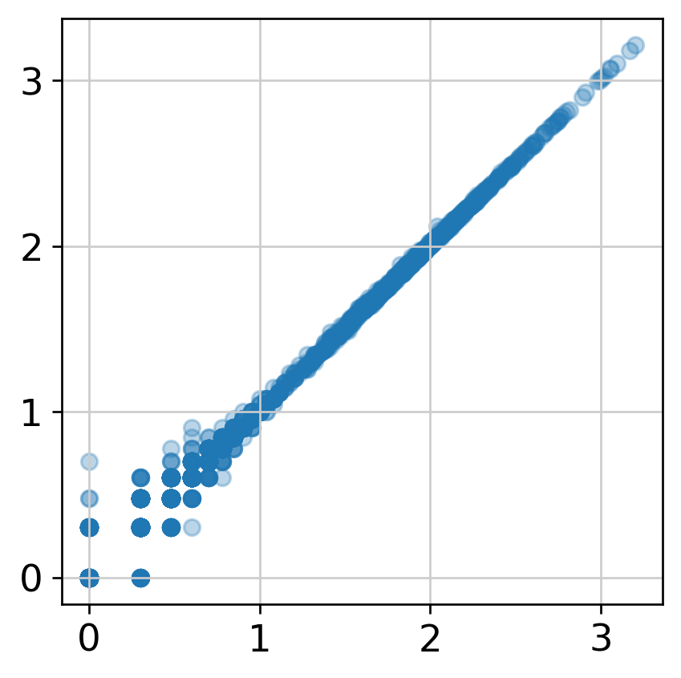


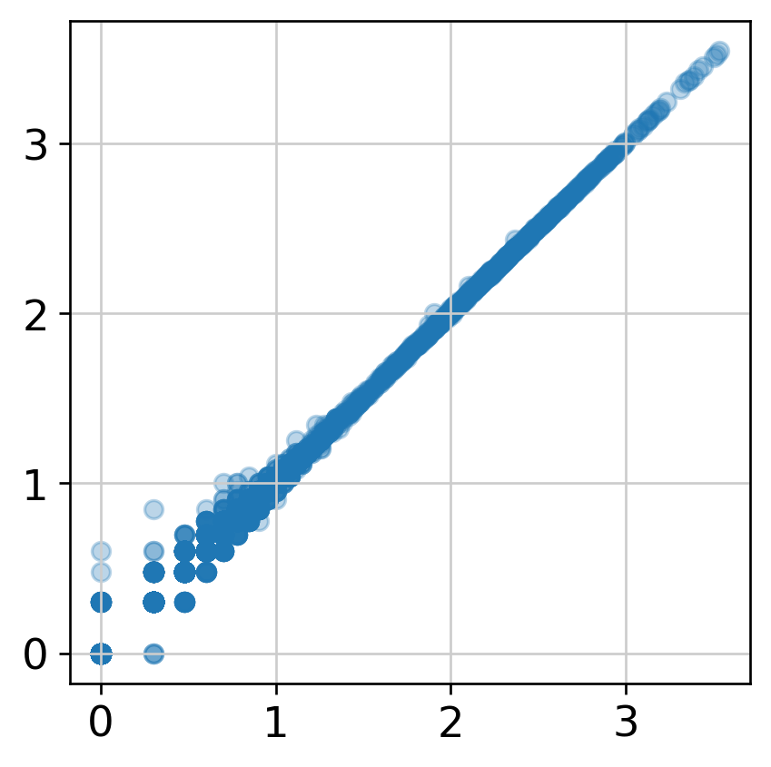


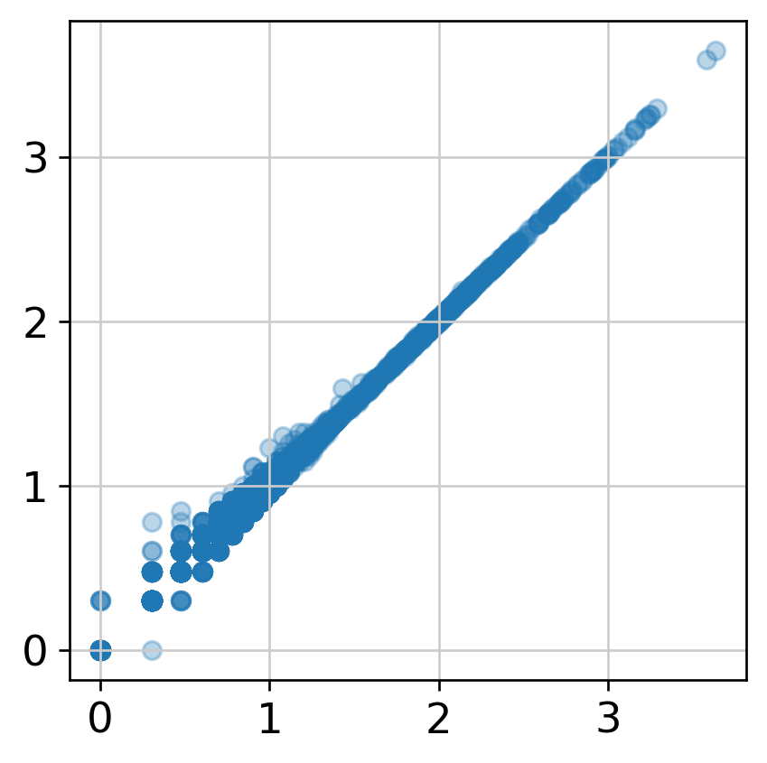


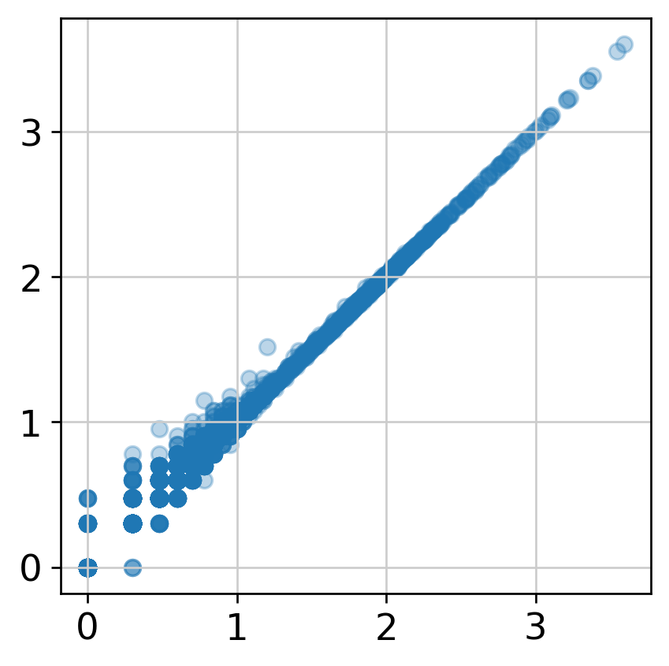


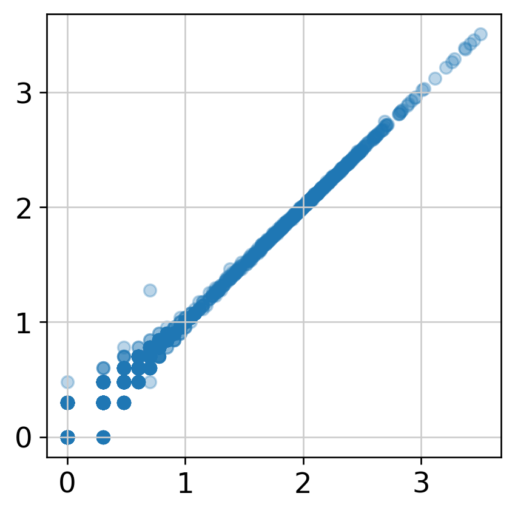


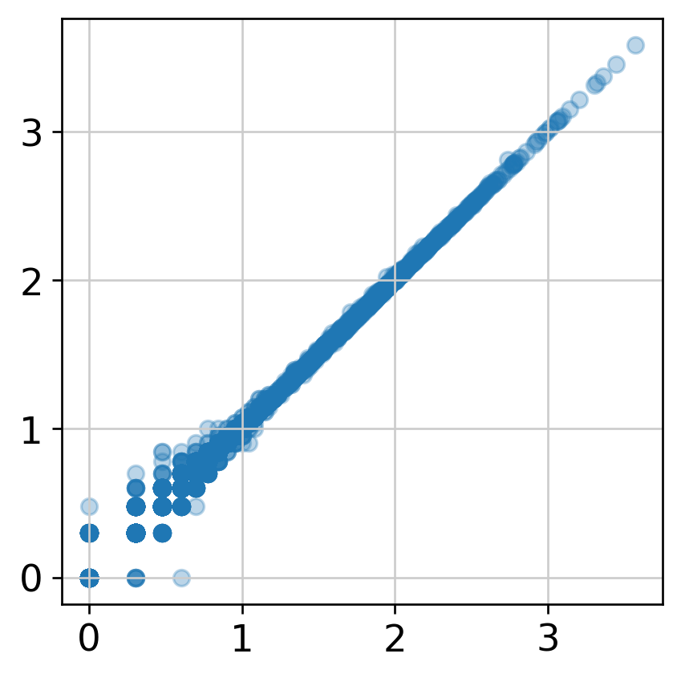

