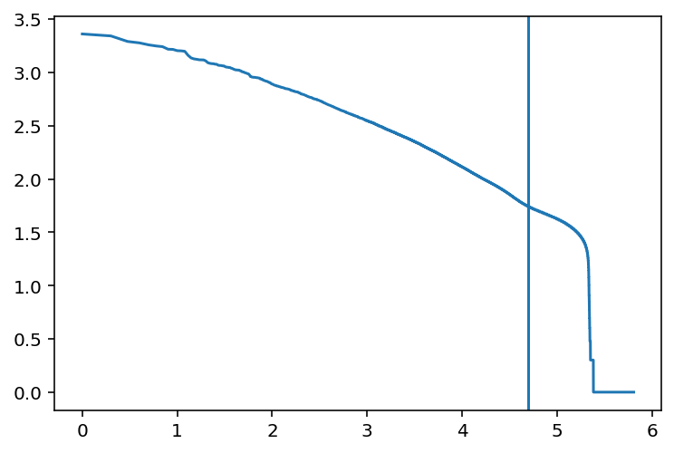
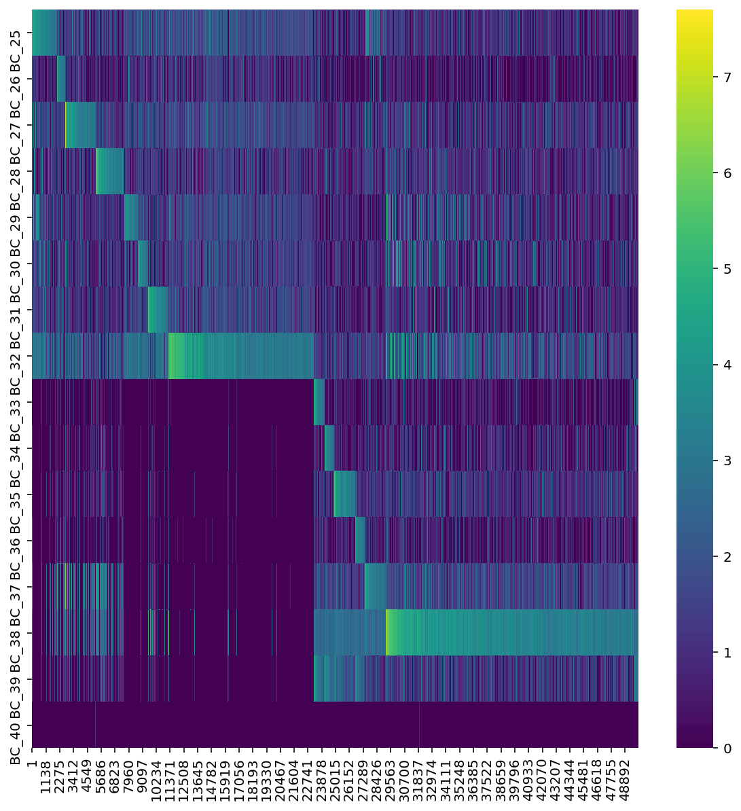
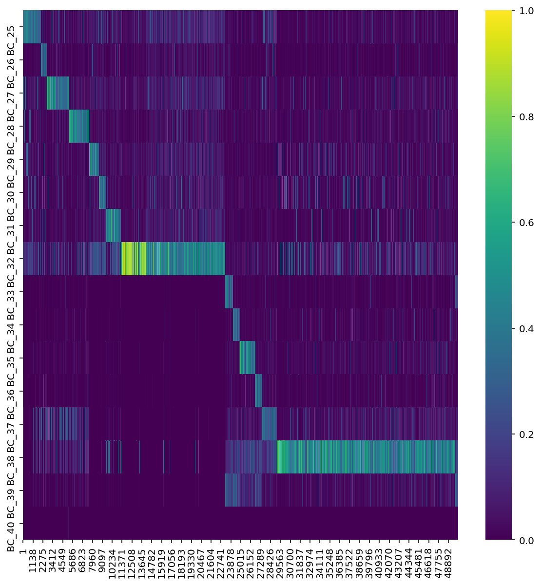
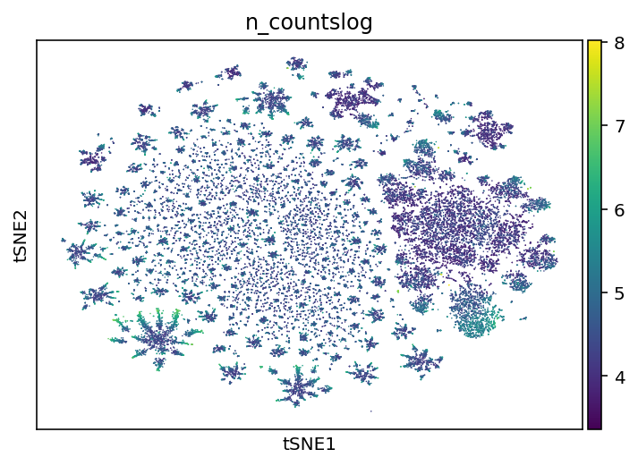
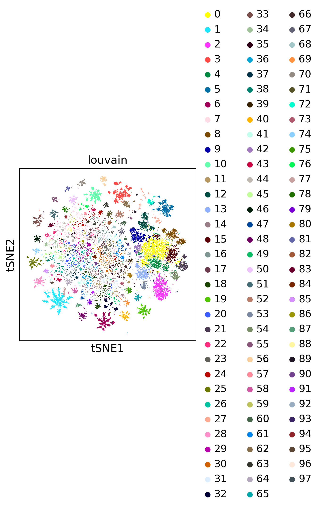
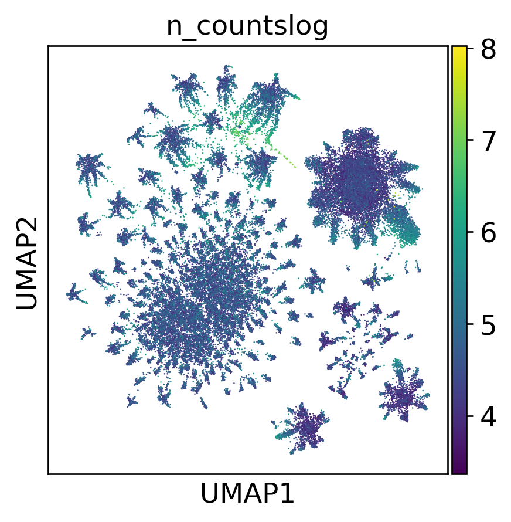
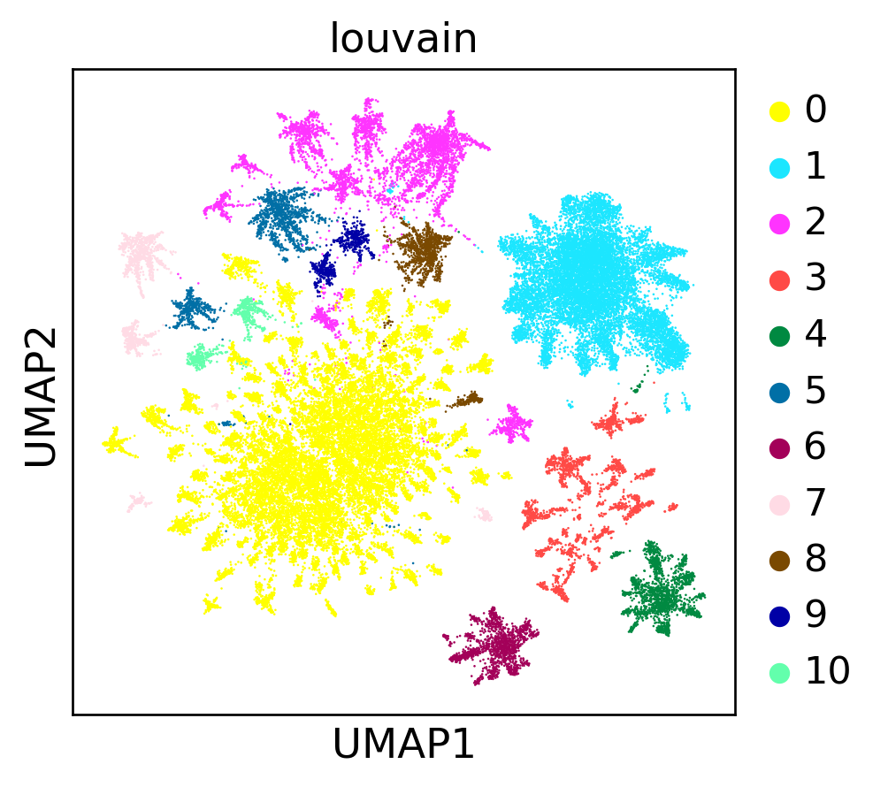
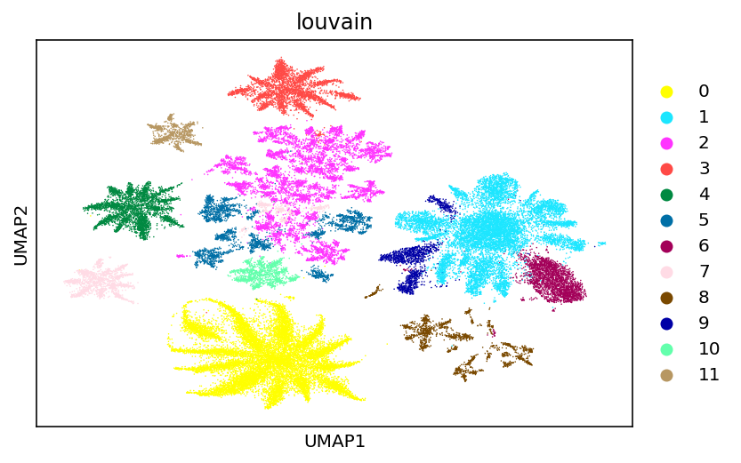
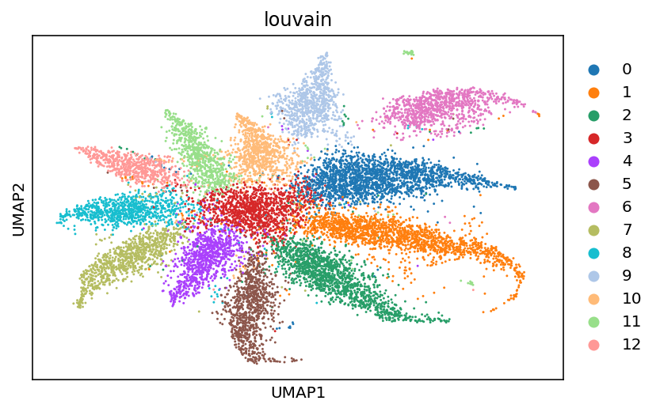

<a href="https://colab.research.google.com/github/pachterlab/CWGFLHGCCHAP_2021/blob/master/notebooks/Preprocessing/ClickTagDemultiplexing/kallistobusStimClickTags.ipynb" target="_parent"></a>

### **Download Data**


```
#Install kallisto and bustools

!wget --quiet https://github.com/pachterlab/kallisto/releases/download/v0.46.2/kallisto_linux-v0.46.2.tar.gz
!tar -xf kallisto_linux-v0.46.2.tar.gz
!cp kallisto/kallisto /usr/local/bin/

!wget --quiet https://github.com/BUStools/bustools/releases/download/v0.40.0/bustools_linux-v0.40.0.tar.gz
!tar -xf bustools_linux-v0.40.0.tar.gz
!cp bustools/bustools /usr/local/bin/
```


```
import requests
from tqdm import tnrange, tqdm_notebook
def download_file(doi,ext):
    url = 'https://api.datacite.org/dois/'+doi+'/media'
    r = requests.get(url).json()
    netcdf_url = r['data'][0]['attributes']['url']
    r = requests.get(netcdf_url,stream=True)
    #Set file name
    fname = doi.split('/')[-1]+ext
    #Download file with progress bar
    if r.status_code == 403:
        print("File Unavailable")
    if 'content-length' not in r.headers:
        print("Did not get file")
    else:
        with open(fname, 'wb') as f:
            total_length = int(r.headers.get('content-length'))
            pbar = tnrange(int(total_length/1024), unit="B")
            for chunk in r.iter_content(chunk_size=1024):
                if chunk:
                    pbar.update()
                    f.write(chunk)
        return fname
```


```
#Get HiSeq/MiSeq sequencing of ClickTags

download_file('10.22002/D1.1793','.tar.gz')
!tar -xf  D1.1793.tar.gz

```

    /usr/local/lib/python3.6/dist-packages/ipykernel_launcher.py:18: TqdmDeprecationWarning: Please use `tqdm.notebook.trange` instead of `tqdm.tnrange`


    HBox(children=(FloatProgress(value=0.0, max=2585793.0), HTML(value='')))


```
# Get ClickTag Barcodes/Sequences
download_file('10.22002/D1.1831','.gz')

#Get saved embedding of ClickTags
download_file('10.22002/D1.1838','.gz')

!gunzip *.gz
```

    /usr/local/lib/python3.6/dist-packages/ipykernel_launcher.py:18: TqdmDeprecationWarning: Please use `tqdm.notebook.trange` instead of `tqdm.tnrange`


    HBox(children=(FloatProgress(value=1.0, bar_style='info', max=1.0), HTML(value='')))


    


    HBox(children=(FloatProgress(value=0.0, max=19732.0), HTML(value='')))


```
!pip install --quiet anndata
!pip install --quiet scanpy
!pip3 install --quiet leidenalg
!pip install --quiet louvain
!pip3 install --quiet biopython
```

         |████████████████████████████████| 122kB 4.9MB/s 
         |████████████████████████████████| 7.7MB 4.0MB/s 
         |████████████████████████████████| 71kB 9.4MB/s 
         |████████████████████████████████| 51kB 6.8MB/s 
    [?25h  Building wheel for sinfo (setup.py) ... [?25l[?25hdone
         |████████████████████████████████| 2.4MB 4.2MB/s 
         |████████████████████████████████| 3.2MB 32.8MB/s 
         |████████████████████████████████| 2.2MB 4.3MB/s 
         |████████████████████████████████| 2.3MB 4.0MB/s 
    [?25h

### **Import Packages**


```
import pandas as pd
import copy
from sklearn.preprocessing import LabelEncoder
from scipy import sparse
import scipy
import numpy as np
import anndata
import matplotlib.pyplot as plt
import seaborn as sns
import scanpy as sc

from collections import OrderedDict
from Bio import SeqIO
import os
from scipy import io
import scipy.io as sio
import time


%matplotlib inline
%config InlineBackend.figure_format = 'retina'


```

### **How ClickTag counts and Clustering Are Generated**

Use kallisto-bustools to align reads to kallisto index of ClickTag barcode whitelist consisting of sequences hamming distance 1 away from original barcodes


```
## Set parameters - below are parameters for 10x 3' v3 chemistry
## The cell hashing method uses tags of length 12, we included the variable B (T,C,G) in the end to make it lenght 13
cell_barcode_length = 16
UMI_length = 12
sample_tag_length=11

"""
This function returns all sample tags and and their single base mismatches (hamming distance 1).
ClickTag sequences are provided as a fasta file, and the script indexes the barcode region of the fasta
"""

"parse the tags file and output the set of tag sequences"

def parse_tags(filename):
    odict = OrderedDict()
    print('Read the following tags:')
    for record in SeqIO.parse(filename, "fasta"):
        counter=0
        print(record.seq)
        odict[record.name] = str(record.seq)[26:26+sample_tag_length]
        for pos in range(sample_tag_length):
            letter =str(record.seq)[26+pos]
            barcode=list(str(record.seq)[26:26+sample_tag_length])
            if letter=='A':
                barcode[pos]='T'
                odict[record.name+'-'+str(pos)+'-1'] = "".join(barcode)
                barcode[pos]='G'
                odict[record.name+'-'+str(pos)+'-2'] = "".join(barcode)
                barcode[pos]='C'
                odict[record.name+'-'+str(pos)+'-3'] = "".join(barcode)
            elif letter=='G':
                barcode[pos]='T'
                odict[record.name+'-'+str(pos)+'-1'] = "".join(barcode)
                barcode[pos]='A'
                odict[record.name+'-'+str(pos)+'-2'] = "".join(barcode)
                barcode[pos]='C'
                odict[record.name+'-'+str(pos)+'-3'] = "".join(barcode)
            elif letter=='C':
                barcode[pos]='T'
                odict[record.name+'-'+str(pos)+'-1'] = "".join(barcode)
                barcode[pos]='G'
                odict[record.name+'-'+str(pos)+'-2'] = "".join(barcode)
                barcode[pos]='A'
                odict[record.name+'-'+str(pos)+'-3'] = "".join(barcode)
            else:
                barcode[pos]='A'
                odict[record.name+'-'+str(pos)+'-1'] = "".join(barcode)
                barcode[pos]='G'
                odict[record.name+'-'+str(pos)+'-2'] = "".join(barcode)
                barcode[pos]='C'
                odict[record.name+'-'+str(pos)+'-3'] = "".join(barcode)
                
    return odict


```


```
# Make kallisto index from ClickTag sequences

!mv D1.1831 70BPbarcodes.fa
tags_file_path = ("70BPbarcodes.fa") #70BPbarcodes.fa
tag_map=parse_tags(tags_file_path)


work_folder = ''
data_folder = ''#/home/jgehring/scRNAseq/clytia/20190405/all_tag_fastqs//
write_folder = ''

#Write the list of barcodes as a fasta, then make a kallisto index
!mkdir barcode_corrected_tags
tagmap_file_path = "barcode_corrected_tags/70BPbarcodes_tagmap.fa"

tagmap_file = open(tagmap_file_path, "w+")
for i in list(tag_map.keys()):
    tagmap_file.write(">" + i + "\n" +tag_map[i] + "\n")
tagmap_file.close()

!kallisto index -i {tagmap_file_path}.idx -k 11 {tagmap_file_path}
!kallisto inspect {tagmap_file_path}.idx

```

Run kallisto bus on ClickTag fastqs


```
#Run kallisto bus on ClickTag fastqs

!mkdir jelly4stim_1_tags_HiSeq

write_folder = 'jelly4stim_1_tags_HiSeq'

!kallisto bus -i {tagmap_file_path}.idx -o {write_folder} -x 10xv3 -t 20 {os.path.join(data_folder,'jelly4stim1MiSeqHiSeq_tags_R1.fastq')} {os.path.join(data_folder,'jelly4stim1MiSeqHiSeq_tags_R2.fastq')}

#sort bus file
!bustools sort -o {os.path.join(write_folder,'output_sorted.bus')} {os.path.join(write_folder,'output.bus')}

# convert the sorted busfile to txt
!bustools text -o {os.path.join(write_folder,'output_sorted.txt')} {os.path.join(write_folder,'output_sorted.bus')}


!mkdir jelly4stim_2_tags_HiSeq

write_folder = 'jelly4stim_2_tags_HiSeq'

!kallisto bus -i {tagmap_file_path}.idx -o {write_folder} -x 10xv3 -t 20 {os.path.join(data_folder,'jelly4stim2MiSeqHiSeq_tags_R1.fastq')} {os.path.join(data_folder,'jelly4stim2MiSeqHiSeq_tags_R2.fastq')} \

#sort bus file
!bustools sort -o {os.path.join(write_folder,'output_sorted.bus')} {os.path.join(write_folder,'output.bus')}

# convert the sorted busfile to txt
!bustools text -o {os.path.join(write_folder,'output_sorted.txt')} {os.path.join(write_folder,'output_sorted.bus')}

```

    mkdir: cannot create directory ‘jelly4stim_1_tags_HiSeq’: File exists
    mv: cannot stat 'tw7h9xi94348gsultf0owb6q4mp1ehlf': No such file or directory
    mv: cannot stat 'bmu19su5ouc6vze3p00pobb665q1pi3z': No such file or directory
    
    Warning: you asked for 20, but only 2 cores on the machine
    [index] k-mer length: 11
    [index] number of targets: 680
    [index] number of k-mers: 680
    [index] number of equivalence classes: 680
    [quant] will process sample 1: jelly4stim1MiSeqHiSeq_tags_R1.fastq
                                   jelly4stim1MiSeqHiSeq_tags_R2.fastq
    [quant] finding pseudoalignments for the reads ... done
    [quant] processed 16,904,784 reads, 8,500,027 reads pseudoaligned
    
    Read in 8500027 BUS records
    Read in 7801303 BUS records
    mkdir: cannot create directory ‘jelly4stim_2_tags_HiSeq’: File exists
    mv: cannot stat 'pmsgi1o664n5gynqggnulstje1djxcwb': No such file or directory
    mv: cannot stat '6ogvqwclzev3dsri2zv46yqrlutucrl1': No such file or directory
    
    Warning: you asked for 20, but only 2 cores on the machine
    [index] k-mer length: 11
    [index] number of targets: 680
    [index] number of k-mers: 680
    [index] number of equivalence classes: 680
    [quant] will process sample 1: jelly4stim2MiSeqHiSeq_tags_R1.fastq
                                   jelly4stim2MiSeqHiSeq_tags_R2.fastq
    [quant] finding pseudoalignments for the reads ... done
    [quant] processed 10,085,603 reads, 4,366,055 reads pseudoaligned
    
    Read in 4366055 BUS records
    Read in 4116905 BUS records


```
write_folder = '' #/home/jgehring/scRNAseq/clytia/20190405/

bus_data_jelly1 = pd.read_csv(os.path.join(write_folder,'jelly4stim_1_tags_HiSeq/output_sorted.txt'), delimiter='\t', header=None, names = ['barcode', 'umi', 'tag_eqclass', 'multiplicity'])
bus_data_jelly1.head()

bus_data_jelly1

bus_data_jelly2 = pd.read_csv(os.path.join(write_folder,'jelly4stim_2_tags_HiSeq/output_sorted.txt'), delimiter='\t', header=None, names = ['barcode', 'umi', 'tag_eqclass', 'multiplicity'])
bus_data_jelly2.head()

tag_map_df = pd.DataFrame.from_dict(tag_map, orient = 'index').reset_index()
tag_map_df.columns=['tagname','tagseq']
tag_map_df['ClickTag'] = tag_map_df['tagname'].str.split('-').str.get(0)
tag_map_df.head()

bus_data_jelly1['tag']= bus_data_jelly1['tag_eqclass'].map(tag_map_df['ClickTag'])
bus_data_jelly1.head()

bus_data_jelly2['tag']= bus_data_jelly2['tag_eqclass'].map(tag_map_df['ClickTag'])
bus_data_jelly2.head()


print('Counting UMIs')
counted_data_jelly1 = bus_data_jelly1.groupby(['barcode', 'tag'])['umi'].count().reset_index()
counted_data_jelly1.rename(columns={'umi':'umi_counts'}, inplace = True)
counted_data_jelly1.head()

print('Counting UMIs')
counted_data_jelly2 = bus_data_jelly2.groupby(['barcode', 'tag'])['umi'].count().reset_index()
counted_data_jelly2.rename(columns={'umi':'umi_counts'}, inplace = True)
counted_data_jelly2.head()


```

    Counting UMIs
    Counting UMIs


<div>
<style scoped>
    .dataframe tbody tr th:only-of-type {
        vertical-align: middle;
    }

    .dataframe tbody tr th {
        vertical-align: top;
    }

    .dataframe thead th {
        text-align: right;
    }
</style>
<table border="1" class="dataframe">
  <thead>
    <tr style="text-align: right;">
      <th></th>
      <th>barcode</th>
      <th>tag</th>
      <th>umi_counts</th>
    </tr>
  </thead>
  <tbody>
    <tr>
      <th>0</th>
      <td>AAAAAAAAAAAAAAAA</td>
      <td>BC_36</td>
      <td>1</td>
    </tr>
    <tr>
      <th>1</th>
      <td>AAAAACAGCTACGTTT</td>
      <td>BC_38</td>
      <td>1</td>
    </tr>
    <tr>
      <th>2</th>
      <td>AAAAACAGGCACTAGT</td>
      <td>BC_30</td>
      <td>1</td>
    </tr>
    <tr>
      <th>3</th>
      <td>AAAAACATTTTTTTTT</td>
      <td>BC_38</td>
      <td>1</td>
    </tr>
    <tr>
      <th>4</th>
      <td>AAAAACCACATGAAAA</td>
      <td>BC_38</td>
      <td>1</td>
    </tr>
  </tbody>
</table>
</div>


```
!mkdir counted_tag_data
```

    mkdir: cannot create directory ‘counted_tag_data’: File exists


```
data_dict={'counted_data_jelly1':counted_data_jelly1, 'counted_data_jelly2':counted_data_jelly2}
counted_data_jelly1['barcode']=[x+'-1' for x in counted_data_jelly1['barcode'].values]
counted_data_jelly2['barcode']=[x+'-2' for x in counted_data_jelly2['barcode'].values]


for counted_data in data_dict:

    le_barcode = LabelEncoder()
    barcode_idx =le_barcode.fit_transform(data_dict[counted_data]['barcode'].values)
    print('Barcode index shape:', barcode_idx.shape)

    le_umi = LabelEncoder()
    umi_idx = le_umi.fit_transform(data_dict[counted_data]['umi_counts'].values)
    print('UMI index shape:', umi_idx.shape)

    le_tag = LabelEncoder()
    tag_idx = le_tag.fit_transform(data_dict[counted_data]['tag'].values)
    print('Tag index shape:', tag_idx.shape)
    
    # convert data to csr matrix
    csr_matrix_data = scipy.sparse.csr_matrix((data_dict[counted_data]['umi_counts'].values,(barcode_idx,tag_idx)))
    
    
    scipy.io.mmwrite(os.path.join(write_folder,'counted_tag_data/' + counted_data + '.mtx'),csr_matrix_data)
    print('Saved sparse csr matrix')
    
    pd.DataFrame(le_tag.classes_).to_csv(os.path.join(write_folder,'counted_tag_data/' + counted_data + '_ClickTag_tag_labels.csv'), index = False, header = False)
    pd.DataFrame(le_barcode.classes_).to_csv(os.path.join(write_folder,'counted_tag_data/' + counted_data + '_ClickTag_barcode_labels.csv'), index = False, header = False)
    print('Saved cell barcode and hashtag labels')
    print('Number of unique cell barcodes seen:', len(le_barcode.classes_))


```

    Barcode index shape: (1853354,)
    UMI index shape: (1853354,)
    Tag index shape: (1853354,)
    Saved sparse csr matrix
    Saved cell barcode and hashtag labels
    Number of unique cell barcodes seen: 439363
    Barcode index shape: (977213,)
    UMI index shape: (977213,)
    Tag index shape: (977213,)
    Saved sparse csr matrix
    Saved cell barcode and hashtag labels
    Number of unique cell barcodes seen: 202035


```
# Clicktag for both 10x lanes concatenated

ClickTagCountsmat=scipy.io.mmread(os.path.join(write_folder,'counted_tag_data/counted_data_jelly1.mtx'))
ClickTagCounts=pd.DataFrame(ClickTagCountsmat.toarray(), 
                            index=list(pd.read_csv(os.path.join(write_folder,'counted_tag_data/counted_data_jelly1_ClickTag_barcode_labels.csv'), header=None).loc[:,0]),
                            columns=list(pd.read_csv(os.path.join(write_folder,'counted_tag_data/' + counted_data + '_ClickTag_tag_labels.csv'), header=None).loc[:,0]))

ClickTagCountsmat=scipy.io.mmread(os.path.join(write_folder,'counted_tag_data/counted_data_jelly2.mtx'))
ClickTagCounts=ClickTagCounts.append(pd.DataFrame(ClickTagCountsmat.toarray(), 
                            index=list(pd.read_csv(os.path.join(write_folder,'counted_tag_data/counted_data_jelly2_ClickTag_barcode_labels.csv'), header=None).loc[:,0]),
                            columns=list(pd.read_csv(os.path.join(write_folder,'counted_tag_data/' + counted_data + '_ClickTag_tag_labels.csv'), header=None).loc[:,0])))


ClickTagCounts


```


<div>
<style scoped>
    .dataframe tbody tr th:only-of-type {
        vertical-align: middle;
    }

    .dataframe tbody tr th {
        vertical-align: top;
    }

    .dataframe thead th {
        text-align: right;
    }
</style>
<table border="1" class="dataframe">
  <thead>
    <tr style="text-align: right;">
      <th></th>
      <th>BC_21</th>
      <th>BC_22</th>
      <th>BC_23</th>
      <th>BC_24</th>
      <th>BC_25</th>
      <th>BC_26</th>
      <th>BC_27</th>
      <th>BC_28</th>
      <th>BC_29</th>
      <th>BC_30</th>
      <th>BC_31</th>
      <th>BC_32</th>
      <th>BC_33</th>
      <th>BC_34</th>
      <th>BC_35</th>
      <th>BC_36</th>
      <th>BC_37</th>
      <th>BC_38</th>
      <th>BC_39</th>
      <th>BC_40</th>
    </tr>
  </thead>
  <tbody>
    <tr>
      <th>AAAAAAAGTTTGAATT-1</th>
      <td>0</td>
      <td>0</td>
      <td>0</td>
      <td>0</td>
      <td>0</td>
      <td>0</td>
      <td>0</td>
      <td>0</td>
      <td>0</td>
      <td>0</td>
      <td>0</td>
      <td>0</td>
      <td>0</td>
      <td>0</td>
      <td>0</td>
      <td>0</td>
      <td>0</td>
      <td>0</td>
      <td>0</td>
      <td>1</td>
    </tr>
    <tr>
      <th>AAAAAACGTTTTGGCC-1</th>
      <td>0</td>
      <td>0</td>
      <td>0</td>
      <td>0</td>
      <td>0</td>
      <td>0</td>
      <td>0</td>
      <td>0</td>
      <td>0</td>
      <td>0</td>
      <td>0</td>
      <td>1</td>
      <td>0</td>
      <td>0</td>
      <td>0</td>
      <td>0</td>
      <td>0</td>
      <td>0</td>
      <td>0</td>
      <td>0</td>
    </tr>
    <tr>
      <th>AAAAACGTCGCAGTCC-1</th>
      <td>0</td>
      <td>0</td>
      <td>0</td>
      <td>0</td>
      <td>0</td>
      <td>0</td>
      <td>0</td>
      <td>0</td>
      <td>0</td>
      <td>0</td>
      <td>0</td>
      <td>0</td>
      <td>0</td>
      <td>0</td>
      <td>0</td>
      <td>0</td>
      <td>0</td>
      <td>1</td>
      <td>0</td>
      <td>0</td>
    </tr>
    <tr>
      <th>AAAAACGTTGTGGCCT-1</th>
      <td>0</td>
      <td>0</td>
      <td>0</td>
      <td>0</td>
      <td>0</td>
      <td>0</td>
      <td>0</td>
      <td>0</td>
      <td>0</td>
      <td>0</td>
      <td>0</td>
      <td>0</td>
      <td>0</td>
      <td>0</td>
      <td>0</td>
      <td>0</td>
      <td>0</td>
      <td>1</td>
      <td>0</td>
      <td>0</td>
    </tr>
    <tr>
      <th>AAAAATCTTTTTTTTT-1</th>
      <td>0</td>
      <td>0</td>
      <td>0</td>
      <td>0</td>
      <td>0</td>
      <td>0</td>
      <td>0</td>
      <td>0</td>
      <td>0</td>
      <td>0</td>
      <td>0</td>
      <td>1</td>
      <td>0</td>
      <td>0</td>
      <td>0</td>
      <td>0</td>
      <td>0</td>
      <td>0</td>
      <td>0</td>
      <td>0</td>
    </tr>
    <tr>
      <th>...</th>
      <td>...</td>
      <td>...</td>
      <td>...</td>
      <td>...</td>
      <td>...</td>
      <td>...</td>
      <td>...</td>
      <td>...</td>
      <td>...</td>
      <td>...</td>
      <td>...</td>
      <td>...</td>
      <td>...</td>
      <td>...</td>
      <td>...</td>
      <td>...</td>
      <td>...</td>
      <td>...</td>
      <td>...</td>
      <td>...</td>
    </tr>
    <tr>
      <th>TTTTTTGAGGCTCTAT-2</th>
      <td>0</td>
      <td>0</td>
      <td>0</td>
      <td>0</td>
      <td>0</td>
      <td>0</td>
      <td>0</td>
      <td>0</td>
      <td>0</td>
      <td>0</td>
      <td>0</td>
      <td>0</td>
      <td>0</td>
      <td>0</td>
      <td>0</td>
      <td>0</td>
      <td>0</td>
      <td>0</td>
      <td>1</td>
      <td>0</td>
    </tr>
    <tr>
      <th>TTTTTTGCAGAATGTA-2</th>
      <td>0</td>
      <td>0</td>
      <td>0</td>
      <td>0</td>
      <td>0</td>
      <td>0</td>
      <td>0</td>
      <td>0</td>
      <td>0</td>
      <td>0</td>
      <td>0</td>
      <td>0</td>
      <td>0</td>
      <td>0</td>
      <td>0</td>
      <td>0</td>
      <td>0</td>
      <td>1</td>
      <td>0</td>
      <td>0</td>
    </tr>
    <tr>
      <th>TTTTTTTTTAACATCC-2</th>
      <td>0</td>
      <td>0</td>
      <td>0</td>
      <td>0</td>
      <td>0</td>
      <td>0</td>
      <td>0</td>
      <td>0</td>
      <td>0</td>
      <td>0</td>
      <td>0</td>
      <td>0</td>
      <td>0</td>
      <td>0</td>
      <td>0</td>
      <td>0</td>
      <td>0</td>
      <td>0</td>
      <td>1</td>
      <td>0</td>
    </tr>
    <tr>
      <th>TTTTTTTTTTGTTTTT-2</th>
      <td>0</td>
      <td>0</td>
      <td>0</td>
      <td>0</td>
      <td>1</td>
      <td>0</td>
      <td>0</td>
      <td>0</td>
      <td>0</td>
      <td>0</td>
      <td>0</td>
      <td>0</td>
      <td>0</td>
      <td>0</td>
      <td>0</td>
      <td>0</td>
      <td>0</td>
      <td>0</td>
      <td>0</td>
      <td>0</td>
    </tr>
    <tr>
      <th>TTTTTTTTTTTTTTTT-2</th>
      <td>0</td>
      <td>0</td>
      <td>0</td>
      <td>0</td>
      <td>1</td>
      <td>0</td>
      <td>0</td>
      <td>0</td>
      <td>0</td>
      <td>0</td>
      <td>0</td>
      <td>0</td>
      <td>0</td>
      <td>1</td>
      <td>0</td>
      <td>0</td>
      <td>1</td>
      <td>5</td>
      <td>1</td>
      <td>0</td>
    </tr>
  </tbody>
</table>
<p>641398 rows × 20 columns</p>
</div>


Use UMI count knee-plot to filter for high-quality ClickTagged cells


```
ClickTag_counts_sorted = copy.deepcopy(ClickTagCounts.T.sum())
ClickTag_counts_sorted = ClickTag_counts_sorted.sort_values(ascending=False)
plt.plot(ClickTag_counts_sorted.apply(np.log10),np.log10(range(len(ClickTag_counts_sorted))))
plt.axhline(np.log10(50000))
plt.show()
```


```


ClickTag_counts_filtered=ClickTagCounts.loc[list(ClickTag_counts_sorted[:50000].index)]
ClickTag_counts_filtered=ClickTag_counts_filtered.iloc[:,4:]
filtered_ClickTag_counts=ClickTag_counts_filtered.T
filtered_ClickTag_counts


hits = 0
counter = 1
for barcode in filtered_ClickTag_counts.index:
    for i in filtered_ClickTag_counts:    
        if filtered_ClickTag_counts[i].idxmax() == barcode:
            if hits ==0:
                sortedheatmap_dtf=pd.DataFrame({counter:filtered_ClickTag_counts[i]})
                hits+=1
                counter+=1
            else:
               sortedheatmap_dtf = sortedheatmap_dtf.assign(i = filtered_ClickTag_counts[i])
               sortedheatmap_dtf.rename(columns = {'i':counter}, inplace = True)
               counter+=1

filtered_ClickTag_counts=copy.deepcopy(sortedheatmap_dtf)

percentClickTags_counts = copy.deepcopy(filtered_ClickTag_counts)
for i in filtered_ClickTag_counts:
        percentClickTags_counts[i] = filtered_ClickTag_counts[i]/filtered_ClickTag_counts[i].sum()
        

```

    /usr/local/lib/python3.6/dist-packages/ipykernel_launcher.py:3: RuntimeWarning: divide by zero encountered in log10
      This is separate from the ipykernel package so we can avoid doing imports until





```
fig, ax = plt.subplots(figsize=(10,10))  
sns.heatmap(np.log1p(filtered_ClickTag_counts), cmap='viridis')
plt.show()

fig, ax = plt.subplots(figsize=(10,10))  
sns.heatmap(percentClickTags_counts, cmap='viridis')
plt.show()

filtered_ClickTag_counts


```








<div>
<style scoped>
    .dataframe tbody tr th:only-of-type {
        vertical-align: middle;
    }

    .dataframe tbody tr th {
        vertical-align: top;
    }

    .dataframe thead th {
        text-align: right;
    }
</style>
<table border="1" class="dataframe">
  <thead>
    <tr style="text-align: right;">
      <th></th>
      <th>1</th>
      <th>2</th>
      <th>3</th>
      <th>4</th>
      <th>5</th>
      <th>6</th>
      <th>7</th>
      <th>8</th>
      <th>9</th>
      <th>10</th>
      <th>11</th>
      <th>12</th>
      <th>13</th>
      <th>14</th>
      <th>15</th>
      <th>16</th>
      <th>17</th>
      <th>18</th>
      <th>19</th>
      <th>20</th>
      <th>21</th>
      <th>22</th>
      <th>23</th>
      <th>24</th>
      <th>25</th>
      <th>26</th>
      <th>27</th>
      <th>28</th>
      <th>29</th>
      <th>30</th>
      <th>31</th>
      <th>32</th>
      <th>33</th>
      <th>34</th>
      <th>35</th>
      <th>36</th>
      <th>37</th>
      <th>38</th>
      <th>39</th>
      <th>40</th>
      <th>...</th>
      <th>49961</th>
      <th>49962</th>
      <th>49963</th>
      <th>49964</th>
      <th>49965</th>
      <th>49966</th>
      <th>49967</th>
      <th>49968</th>
      <th>49969</th>
      <th>49970</th>
      <th>49971</th>
      <th>49972</th>
      <th>49973</th>
      <th>49974</th>
      <th>49975</th>
      <th>49976</th>
      <th>49977</th>
      <th>49978</th>
      <th>49979</th>
      <th>49980</th>
      <th>49981</th>
      <th>49982</th>
      <th>49983</th>
      <th>49984</th>
      <th>49985</th>
      <th>49986</th>
      <th>49987</th>
      <th>49988</th>
      <th>49989</th>
      <th>49990</th>
      <th>49991</th>
      <th>49992</th>
      <th>49993</th>
      <th>49994</th>
      <th>49995</th>
      <th>49996</th>
      <th>49997</th>
      <th>49998</th>
      <th>49999</th>
      <th>50000</th>
    </tr>
  </thead>
  <tbody>
    <tr>
      <th>BC_25</th>
      <td>1025</td>
      <td>435</td>
      <td>344</td>
      <td>235</td>
      <td>231</td>
      <td>205</td>
      <td>220</td>
      <td>204</td>
      <td>199</td>
      <td>226</td>
      <td>171</td>
      <td>236</td>
      <td>183</td>
      <td>172</td>
      <td>128</td>
      <td>127</td>
      <td>163</td>
      <td>171</td>
      <td>180</td>
      <td>135</td>
      <td>174</td>
      <td>152</td>
      <td>188</td>
      <td>110</td>
      <td>134</td>
      <td>185</td>
      <td>162</td>
      <td>201</td>
      <td>172</td>
      <td>165</td>
      <td>137</td>
      <td>171</td>
      <td>144</td>
      <td>133</td>
      <td>146</td>
      <td>121</td>
      <td>145</td>
      <td>137</td>
      <td>133</td>
      <td>142</td>
      <td>...</td>
      <td>1</td>
      <td>2</td>
      <td>0</td>
      <td>1</td>
      <td>2</td>
      <td>3</td>
      <td>1</td>
      <td>1</td>
      <td>2</td>
      <td>0</td>
      <td>1</td>
      <td>2</td>
      <td>3</td>
      <td>1</td>
      <td>3</td>
      <td>0</td>
      <td>3</td>
      <td>3</td>
      <td>3</td>
      <td>2</td>
      <td>0</td>
      <td>0</td>
      <td>0</td>
      <td>4</td>
      <td>1</td>
      <td>3</td>
      <td>1</td>
      <td>0</td>
      <td>0</td>
      <td>2</td>
      <td>1</td>
      <td>0</td>
      <td>0</td>
      <td>2</td>
      <td>0</td>
      <td>2</td>
      <td>1</td>
      <td>2</td>
      <td>0</td>
      <td>4</td>
    </tr>
    <tr>
      <th>BC_26</th>
      <td>2</td>
      <td>9</td>
      <td>3</td>
      <td>2</td>
      <td>3</td>
      <td>0</td>
      <td>5</td>
      <td>3</td>
      <td>0</td>
      <td>0</td>
      <td>0</td>
      <td>4</td>
      <td>1</td>
      <td>1</td>
      <td>2</td>
      <td>2</td>
      <td>3</td>
      <td>1</td>
      <td>5</td>
      <td>7</td>
      <td>2</td>
      <td>3</td>
      <td>4</td>
      <td>47</td>
      <td>4</td>
      <td>3</td>
      <td>0</td>
      <td>1</td>
      <td>2</td>
      <td>4</td>
      <td>2</td>
      <td>3</td>
      <td>0</td>
      <td>3</td>
      <td>4</td>
      <td>2</td>
      <td>3</td>
      <td>0</td>
      <td>2</td>
      <td>3</td>
      <td>...</td>
      <td>1</td>
      <td>0</td>
      <td>1</td>
      <td>1</td>
      <td>1</td>
      <td>0</td>
      <td>0</td>
      <td>1</td>
      <td>0</td>
      <td>0</td>
      <td>0</td>
      <td>0</td>
      <td>1</td>
      <td>0</td>
      <td>0</td>
      <td>0</td>
      <td>1</td>
      <td>0</td>
      <td>1</td>
      <td>0</td>
      <td>0</td>
      <td>1</td>
      <td>1</td>
      <td>0</td>
      <td>0</td>
      <td>1</td>
      <td>1</td>
      <td>2</td>
      <td>0</td>
      <td>1</td>
      <td>0</td>
      <td>1</td>
      <td>0</td>
      <td>0</td>
      <td>0</td>
      <td>0</td>
      <td>0</td>
      <td>0</td>
      <td>8</td>
      <td>0</td>
    </tr>
    <tr>
      <th>BC_27</th>
      <td>10</td>
      <td>4</td>
      <td>8</td>
      <td>26</td>
      <td>11</td>
      <td>3</td>
      <td>6</td>
      <td>14</td>
      <td>13</td>
      <td>7</td>
      <td>0</td>
      <td>9</td>
      <td>6</td>
      <td>14</td>
      <td>7</td>
      <td>5</td>
      <td>6</td>
      <td>5</td>
      <td>4</td>
      <td>5</td>
      <td>157</td>
      <td>38</td>
      <td>1</td>
      <td>4</td>
      <td>10</td>
      <td>2</td>
      <td>7</td>
      <td>7</td>
      <td>5</td>
      <td>6</td>
      <td>2</td>
      <td>3</td>
      <td>7</td>
      <td>1</td>
      <td>2</td>
      <td>4</td>
      <td>3</td>
      <td>4</td>
      <td>45</td>
      <td>123</td>
      <td>...</td>
      <td>1</td>
      <td>2</td>
      <td>5</td>
      <td>3</td>
      <td>0</td>
      <td>6</td>
      <td>1</td>
      <td>0</td>
      <td>2</td>
      <td>0</td>
      <td>1</td>
      <td>4</td>
      <td>1</td>
      <td>0</td>
      <td>1</td>
      <td>1</td>
      <td>0</td>
      <td>1</td>
      <td>1</td>
      <td>5</td>
      <td>2</td>
      <td>1</td>
      <td>1</td>
      <td>2</td>
      <td>1</td>
      <td>5</td>
      <td>2</td>
      <td>2</td>
      <td>2</td>
      <td>2</td>
      <td>3</td>
      <td>3</td>
      <td>3</td>
      <td>0</td>
      <td>1</td>
      <td>3</td>
      <td>3</td>
      <td>1</td>
      <td>2</td>
      <td>2</td>
    </tr>
    <tr>
      <th>BC_28</th>
      <td>15</td>
      <td>11</td>
      <td>5</td>
      <td>5</td>
      <td>4</td>
      <td>9</td>
      <td>0</td>
      <td>5</td>
      <td>3</td>
      <td>4</td>
      <td>3</td>
      <td>4</td>
      <td>2</td>
      <td>6</td>
      <td>3</td>
      <td>6</td>
      <td>11</td>
      <td>7</td>
      <td>1</td>
      <td>1</td>
      <td>2</td>
      <td>6</td>
      <td>1</td>
      <td>2</td>
      <td>109</td>
      <td>3</td>
      <td>2</td>
      <td>2</td>
      <td>4</td>
      <td>2</td>
      <td>7</td>
      <td>6</td>
      <td>2</td>
      <td>3</td>
      <td>4</td>
      <td>13</td>
      <td>2</td>
      <td>4</td>
      <td>2</td>
      <td>6</td>
      <td>...</td>
      <td>1</td>
      <td>1</td>
      <td>2</td>
      <td>1</td>
      <td>2</td>
      <td>2</td>
      <td>1</td>
      <td>3</td>
      <td>1</td>
      <td>1</td>
      <td>3</td>
      <td>2</td>
      <td>1</td>
      <td>2</td>
      <td>1</td>
      <td>2</td>
      <td>1</td>
      <td>1</td>
      <td>0</td>
      <td>1</td>
      <td>3</td>
      <td>1</td>
      <td>2</td>
      <td>0</td>
      <td>6</td>
      <td>5</td>
      <td>4</td>
      <td>1</td>
      <td>1</td>
      <td>3</td>
      <td>2</td>
      <td>2</td>
      <td>2</td>
      <td>1</td>
      <td>0</td>
      <td>1</td>
      <td>1</td>
      <td>2</td>
      <td>3</td>
      <td>0</td>
    </tr>
    <tr>
      <th>BC_29</th>
      <td>7</td>
      <td>5</td>
      <td>8</td>
      <td>223</td>
      <td>11</td>
      <td>14</td>
      <td>8</td>
      <td>1</td>
      <td>10</td>
      <td>3</td>
      <td>7</td>
      <td>7</td>
      <td>4</td>
      <td>3</td>
      <td>125</td>
      <td>1</td>
      <td>3</td>
      <td>3</td>
      <td>158</td>
      <td>6</td>
      <td>4</td>
      <td>12</td>
      <td>136</td>
      <td>4</td>
      <td>33</td>
      <td>131</td>
      <td>3</td>
      <td>4</td>
      <td>4</td>
      <td>112</td>
      <td>3</td>
      <td>115</td>
      <td>3</td>
      <td>1</td>
      <td>50</td>
      <td>6</td>
      <td>3</td>
      <td>3</td>
      <td>47</td>
      <td>1</td>
      <td>...</td>
      <td>0</td>
      <td>0</td>
      <td>1</td>
      <td>1</td>
      <td>4</td>
      <td>2</td>
      <td>1</td>
      <td>2</td>
      <td>3</td>
      <td>3</td>
      <td>1</td>
      <td>5</td>
      <td>0</td>
      <td>0</td>
      <td>2</td>
      <td>1</td>
      <td>2</td>
      <td>1</td>
      <td>2</td>
      <td>1</td>
      <td>1</td>
      <td>2</td>
      <td>3</td>
      <td>0</td>
      <td>0</td>
      <td>2</td>
      <td>1</td>
      <td>1</td>
      <td>1</td>
      <td>2</td>
      <td>0</td>
      <td>0</td>
      <td>0</td>
      <td>1</td>
      <td>1</td>
      <td>2</td>
      <td>3</td>
      <td>2</td>
      <td>0</td>
      <td>0</td>
    </tr>
    <tr>
      <th>BC_30</th>
      <td>14</td>
      <td>4</td>
      <td>7</td>
      <td>1</td>
      <td>2</td>
      <td>4</td>
      <td>3</td>
      <td>5</td>
      <td>4</td>
      <td>1</td>
      <td>4</td>
      <td>132</td>
      <td>1</td>
      <td>4</td>
      <td>64</td>
      <td>2</td>
      <td>2</td>
      <td>1</td>
      <td>6</td>
      <td>7</td>
      <td>7</td>
      <td>96</td>
      <td>3</td>
      <td>48</td>
      <td>4</td>
      <td>0</td>
      <td>2</td>
      <td>2</td>
      <td>1</td>
      <td>9</td>
      <td>8</td>
      <td>3</td>
      <td>3</td>
      <td>2</td>
      <td>6</td>
      <td>4</td>
      <td>2</td>
      <td>1</td>
      <td>10</td>
      <td>5</td>
      <td>...</td>
      <td>1</td>
      <td>0</td>
      <td>0</td>
      <td>1</td>
      <td>2</td>
      <td>3</td>
      <td>0</td>
      <td>0</td>
      <td>1</td>
      <td>1</td>
      <td>1</td>
      <td>0</td>
      <td>0</td>
      <td>1</td>
      <td>2</td>
      <td>1</td>
      <td>1</td>
      <td>2</td>
      <td>1</td>
      <td>0</td>
      <td>0</td>
      <td>1</td>
      <td>1</td>
      <td>0</td>
      <td>0</td>
      <td>2</td>
      <td>1</td>
      <td>1</td>
      <td>0</td>
      <td>1</td>
      <td>0</td>
      <td>0</td>
      <td>2</td>
      <td>1</td>
      <td>1</td>
      <td>6</td>
      <td>0</td>
      <td>1</td>
      <td>0</td>
      <td>0</td>
    </tr>
    <tr>
      <th>BC_31</th>
      <td>7</td>
      <td>9</td>
      <td>269</td>
      <td>5</td>
      <td>225</td>
      <td>3</td>
      <td>138</td>
      <td>2</td>
      <td>4</td>
      <td>1</td>
      <td>5</td>
      <td>9</td>
      <td>6</td>
      <td>4</td>
      <td>7</td>
      <td>37</td>
      <td>1</td>
      <td>1</td>
      <td>3</td>
      <td>4</td>
      <td>8</td>
      <td>11</td>
      <td>5</td>
      <td>106</td>
      <td>3</td>
      <td>5</td>
      <td>4</td>
      <td>3</td>
      <td>0</td>
      <td>6</td>
      <td>8</td>
      <td>13</td>
      <td>6</td>
      <td>2</td>
      <td>81</td>
      <td>2</td>
      <td>126</td>
      <td>1</td>
      <td>28</td>
      <td>2</td>
      <td>...</td>
      <td>1</td>
      <td>4</td>
      <td>1</td>
      <td>1</td>
      <td>0</td>
      <td>3</td>
      <td>1</td>
      <td>0</td>
      <td>1</td>
      <td>2</td>
      <td>3</td>
      <td>3</td>
      <td>5</td>
      <td>2</td>
      <td>1</td>
      <td>2</td>
      <td>1</td>
      <td>0</td>
      <td>2</td>
      <td>1</td>
      <td>0</td>
      <td>0</td>
      <td>3</td>
      <td>2</td>
      <td>2</td>
      <td>1</td>
      <td>1</td>
      <td>0</td>
      <td>1</td>
      <td>1</td>
      <td>3</td>
      <td>0</td>
      <td>1</td>
      <td>1</td>
      <td>1</td>
      <td>0</td>
      <td>1</td>
      <td>0</td>
      <td>1</td>
      <td>2</td>
    </tr>
    <tr>
      <th>BC_32</th>
      <td>16</td>
      <td>20</td>
      <td>11</td>
      <td>26</td>
      <td>41</td>
      <td>10</td>
      <td>91</td>
      <td>5</td>
      <td>8</td>
      <td>8</td>
      <td>18</td>
      <td>18</td>
      <td>7</td>
      <td>5</td>
      <td>20</td>
      <td>10</td>
      <td>7</td>
      <td>4</td>
      <td>19</td>
      <td>21</td>
      <td>23</td>
      <td>33</td>
      <td>19</td>
      <td>25</td>
      <td>19</td>
      <td>16</td>
      <td>6</td>
      <td>4</td>
      <td>5</td>
      <td>27</td>
      <td>8</td>
      <td>17</td>
      <td>5</td>
      <td>5</td>
      <td>19</td>
      <td>8</td>
      <td>22</td>
      <td>4</td>
      <td>39</td>
      <td>22</td>
      <td>...</td>
      <td>3</td>
      <td>3</td>
      <td>3</td>
      <td>4</td>
      <td>1</td>
      <td>2</td>
      <td>0</td>
      <td>2</td>
      <td>5</td>
      <td>5</td>
      <td>5</td>
      <td>0</td>
      <td>2</td>
      <td>4</td>
      <td>3</td>
      <td>2</td>
      <td>1</td>
      <td>0</td>
      <td>0</td>
      <td>4</td>
      <td>1</td>
      <td>3</td>
      <td>0</td>
      <td>4</td>
      <td>6</td>
      <td>4</td>
      <td>4</td>
      <td>5</td>
      <td>3</td>
      <td>3</td>
      <td>7</td>
      <td>5</td>
      <td>2</td>
      <td>1</td>
      <td>1</td>
      <td>2</td>
      <td>3</td>
      <td>2</td>
      <td>3</td>
      <td>2</td>
    </tr>
    <tr>
      <th>BC_33</th>
      <td>4</td>
      <td>4</td>
      <td>0</td>
      <td>0</td>
      <td>0</td>
      <td>4</td>
      <td>0</td>
      <td>2</td>
      <td>5</td>
      <td>2</td>
      <td>1</td>
      <td>0</td>
      <td>5</td>
      <td>0</td>
      <td>0</td>
      <td>2</td>
      <td>2</td>
      <td>1</td>
      <td>0</td>
      <td>1</td>
      <td>0</td>
      <td>0</td>
      <td>0</td>
      <td>0</td>
      <td>0</td>
      <td>0</td>
      <td>1</td>
      <td>2</td>
      <td>3</td>
      <td>0</td>
      <td>0</td>
      <td>0</td>
      <td>2</td>
      <td>0</td>
      <td>0</td>
      <td>7</td>
      <td>0</td>
      <td>1</td>
      <td>0</td>
      <td>0</td>
      <td>...</td>
      <td>0</td>
      <td>13</td>
      <td>15</td>
      <td>0</td>
      <td>0</td>
      <td>1</td>
      <td>17</td>
      <td>7</td>
      <td>1</td>
      <td>4</td>
      <td>0</td>
      <td>0</td>
      <td>0</td>
      <td>11</td>
      <td>2</td>
      <td>14</td>
      <td>1</td>
      <td>8</td>
      <td>13</td>
      <td>3</td>
      <td>1</td>
      <td>0</td>
      <td>12</td>
      <td>13</td>
      <td>0</td>
      <td>0</td>
      <td>0</td>
      <td>9</td>
      <td>13</td>
      <td>1</td>
      <td>7</td>
      <td>10</td>
      <td>15</td>
      <td>1</td>
      <td>0</td>
      <td>0</td>
      <td>1</td>
      <td>10</td>
      <td>8</td>
      <td>11</td>
    </tr>
    <tr>
      <th>BC_34</th>
      <td>10</td>
      <td>7</td>
      <td>0</td>
      <td>0</td>
      <td>0</td>
      <td>2</td>
      <td>0</td>
      <td>3</td>
      <td>2</td>
      <td>2</td>
      <td>8</td>
      <td>0</td>
      <td>1</td>
      <td>5</td>
      <td>0</td>
      <td>4</td>
      <td>2</td>
      <td>3</td>
      <td>0</td>
      <td>8</td>
      <td>0</td>
      <td>0</td>
      <td>0</td>
      <td>0</td>
      <td>0</td>
      <td>0</td>
      <td>1</td>
      <td>1</td>
      <td>1</td>
      <td>0</td>
      <td>1</td>
      <td>0</td>
      <td>0</td>
      <td>4</td>
      <td>0</td>
      <td>2</td>
      <td>0</td>
      <td>1</td>
      <td>0</td>
      <td>0</td>
      <td>...</td>
      <td>14</td>
      <td>2</td>
      <td>0</td>
      <td>1</td>
      <td>13</td>
      <td>9</td>
      <td>2</td>
      <td>1</td>
      <td>7</td>
      <td>11</td>
      <td>11</td>
      <td>8</td>
      <td>2</td>
      <td>0</td>
      <td>12</td>
      <td>1</td>
      <td>2</td>
      <td>5</td>
      <td>2</td>
      <td>1</td>
      <td>14</td>
      <td>15</td>
      <td>0</td>
      <td>2</td>
      <td>1</td>
      <td>9</td>
      <td>12</td>
      <td>1</td>
      <td>2</td>
      <td>11</td>
      <td>2</td>
      <td>2</td>
      <td>0</td>
      <td>15</td>
      <td>15</td>
      <td>9</td>
      <td>3</td>
      <td>0</td>
      <td>1</td>
      <td>2</td>
    </tr>
    <tr>
      <th>BC_35</th>
      <td>19</td>
      <td>10</td>
      <td>0</td>
      <td>0</td>
      <td>0</td>
      <td>6</td>
      <td>0</td>
      <td>2</td>
      <td>5</td>
      <td>5</td>
      <td>6</td>
      <td>0</td>
      <td>1</td>
      <td>3</td>
      <td>0</td>
      <td>13</td>
      <td>9</td>
      <td>6</td>
      <td>0</td>
      <td>3</td>
      <td>0</td>
      <td>0</td>
      <td>0</td>
      <td>0</td>
      <td>0</td>
      <td>0</td>
      <td>3</td>
      <td>0</td>
      <td>2</td>
      <td>0</td>
      <td>5</td>
      <td>0</td>
      <td>4</td>
      <td>2</td>
      <td>0</td>
      <td>2</td>
      <td>0</td>
      <td>7</td>
      <td>0</td>
      <td>0</td>
      <td>...</td>
      <td>3</td>
      <td>2</td>
      <td>1</td>
      <td>0</td>
      <td>0</td>
      <td>4</td>
      <td>0</td>
      <td>12</td>
      <td>4</td>
      <td>3</td>
      <td>1</td>
      <td>4</td>
      <td>7</td>
      <td>3</td>
      <td>0</td>
      <td>3</td>
      <td>1</td>
      <td>2</td>
      <td>0</td>
      <td>2</td>
      <td>4</td>
      <td>6</td>
      <td>4</td>
      <td>2</td>
      <td>1</td>
      <td>2</td>
      <td>2</td>
      <td>2</td>
      <td>1</td>
      <td>1</td>
      <td>6</td>
      <td>0</td>
      <td>0</td>
      <td>2</td>
      <td>2</td>
      <td>1</td>
      <td>1</td>
      <td>2</td>
      <td>3</td>
      <td>2</td>
    </tr>
    <tr>
      <th>BC_36</th>
      <td>5</td>
      <td>1</td>
      <td>0</td>
      <td>0</td>
      <td>0</td>
      <td>2</td>
      <td>0</td>
      <td>4</td>
      <td>0</td>
      <td>2</td>
      <td>1</td>
      <td>0</td>
      <td>0</td>
      <td>2</td>
      <td>1</td>
      <td>11</td>
      <td>3</td>
      <td>1</td>
      <td>0</td>
      <td>1</td>
      <td>0</td>
      <td>0</td>
      <td>0</td>
      <td>0</td>
      <td>0</td>
      <td>0</td>
      <td>2</td>
      <td>0</td>
      <td>2</td>
      <td>0</td>
      <td>2</td>
      <td>0</td>
      <td>5</td>
      <td>17</td>
      <td>0</td>
      <td>4</td>
      <td>0</td>
      <td>0</td>
      <td>0</td>
      <td>0</td>
      <td>...</td>
      <td>2</td>
      <td>0</td>
      <td>0</td>
      <td>16</td>
      <td>3</td>
      <td>0</td>
      <td>1</td>
      <td>1</td>
      <td>0</td>
      <td>1</td>
      <td>4</td>
      <td>8</td>
      <td>14</td>
      <td>1</td>
      <td>1</td>
      <td>1</td>
      <td>13</td>
      <td>0</td>
      <td>1</td>
      <td>10</td>
      <td>0</td>
      <td>0</td>
      <td>1</td>
      <td>1</td>
      <td>7</td>
      <td>0</td>
      <td>2</td>
      <td>1</td>
      <td>1</td>
      <td>1</td>
      <td>2</td>
      <td>2</td>
      <td>1</td>
      <td>0</td>
      <td>0</td>
      <td>2</td>
      <td>10</td>
      <td>0</td>
      <td>1</td>
      <td>2</td>
    </tr>
    <tr>
      <th>BC_37</th>
      <td>697</td>
      <td>396</td>
      <td>0</td>
      <td>0</td>
      <td>0</td>
      <td>181</td>
      <td>0</td>
      <td>182</td>
      <td>182</td>
      <td>181</td>
      <td>171</td>
      <td>0</td>
      <td>182</td>
      <td>168</td>
      <td>0</td>
      <td>116</td>
      <td>157</td>
      <td>171</td>
      <td>0</td>
      <td>133</td>
      <td>0</td>
      <td>0</td>
      <td>0</td>
      <td>0</td>
      <td>0</td>
      <td>0</td>
      <td>137</td>
      <td>104</td>
      <td>123</td>
      <td>0</td>
      <td>132</td>
      <td>0</td>
      <td>132</td>
      <td>126</td>
      <td>0</td>
      <td>108</td>
      <td>0</td>
      <td>127</td>
      <td>0</td>
      <td>0</td>
      <td>...</td>
      <td>5</td>
      <td>4</td>
      <td>3</td>
      <td>2</td>
      <td>1</td>
      <td>5</td>
      <td>3</td>
      <td>1</td>
      <td>6</td>
      <td>1</td>
      <td>4</td>
      <td>4</td>
      <td>3</td>
      <td>3</td>
      <td>4</td>
      <td>3</td>
      <td>3</td>
      <td>4</td>
      <td>6</td>
      <td>7</td>
      <td>0</td>
      <td>2</td>
      <td>3</td>
      <td>2</td>
      <td>4</td>
      <td>2</td>
      <td>0</td>
      <td>4</td>
      <td>6</td>
      <td>2</td>
      <td>0</td>
      <td>8</td>
      <td>2</td>
      <td>1</td>
      <td>4</td>
      <td>2</td>
      <td>5</td>
      <td>4</td>
      <td>8</td>
      <td>2</td>
    </tr>
    <tr>
      <th>BC_38</th>
      <td>103</td>
      <td>51</td>
      <td>0</td>
      <td>0</td>
      <td>0</td>
      <td>70</td>
      <td>0</td>
      <td>35</td>
      <td>25</td>
      <td>19</td>
      <td>32</td>
      <td>0</td>
      <td>28</td>
      <td>39</td>
      <td>0</td>
      <td>59</td>
      <td>30</td>
      <td>26</td>
      <td>0</td>
      <td>38</td>
      <td>0</td>
      <td>0</td>
      <td>0</td>
      <td>0</td>
      <td>0</td>
      <td>0</td>
      <td>20</td>
      <td>17</td>
      <td>16</td>
      <td>0</td>
      <td>22</td>
      <td>0</td>
      <td>19</td>
      <td>19</td>
      <td>0</td>
      <td>36</td>
      <td>0</td>
      <td>22</td>
      <td>0</td>
      <td>0</td>
      <td>...</td>
      <td>9</td>
      <td>11</td>
      <td>10</td>
      <td>10</td>
      <td>11</td>
      <td>7</td>
      <td>13</td>
      <td>13</td>
      <td>12</td>
      <td>11</td>
      <td>10</td>
      <td>8</td>
      <td>4</td>
      <td>13</td>
      <td>12</td>
      <td>9</td>
      <td>12</td>
      <td>14</td>
      <td>11</td>
      <td>9</td>
      <td>15</td>
      <td>8</td>
      <td>11</td>
      <td>9</td>
      <td>12</td>
      <td>6</td>
      <td>12</td>
      <td>13</td>
      <td>9</td>
      <td>11</td>
      <td>11</td>
      <td>8</td>
      <td>8</td>
      <td>10</td>
      <td>14</td>
      <td>11</td>
      <td>8</td>
      <td>14</td>
      <td>8</td>
      <td>10</td>
    </tr>
    <tr>
      <th>BC_39</th>
      <td>15</td>
      <td>6</td>
      <td>0</td>
      <td>0</td>
      <td>0</td>
      <td>4</td>
      <td>0</td>
      <td>5</td>
      <td>8</td>
      <td>4</td>
      <td>13</td>
      <td>0</td>
      <td>10</td>
      <td>2</td>
      <td>0</td>
      <td>11</td>
      <td>6</td>
      <td>2</td>
      <td>0</td>
      <td>19</td>
      <td>0</td>
      <td>0</td>
      <td>0</td>
      <td>0</td>
      <td>0</td>
      <td>0</td>
      <td>3</td>
      <td>1</td>
      <td>5</td>
      <td>0</td>
      <td>5</td>
      <td>0</td>
      <td>2</td>
      <td>9</td>
      <td>1</td>
      <td>7</td>
      <td>0</td>
      <td>6</td>
      <td>0</td>
      <td>0</td>
      <td>...</td>
      <td>17</td>
      <td>15</td>
      <td>17</td>
      <td>17</td>
      <td>19</td>
      <td>12</td>
      <td>18</td>
      <td>14</td>
      <td>13</td>
      <td>14</td>
      <td>13</td>
      <td>10</td>
      <td>15</td>
      <td>16</td>
      <td>13</td>
      <td>17</td>
      <td>15</td>
      <td>16</td>
      <td>14</td>
      <td>11</td>
      <td>16</td>
      <td>17</td>
      <td>15</td>
      <td>16</td>
      <td>16</td>
      <td>15</td>
      <td>14</td>
      <td>15</td>
      <td>17</td>
      <td>14</td>
      <td>12</td>
      <td>15</td>
      <td>20</td>
      <td>20</td>
      <td>16</td>
      <td>14</td>
      <td>15</td>
      <td>15</td>
      <td>9</td>
      <td>16</td>
    </tr>
    <tr>
      <th>BC_40</th>
      <td>0</td>
      <td>0</td>
      <td>0</td>
      <td>0</td>
      <td>0</td>
      <td>0</td>
      <td>0</td>
      <td>0</td>
      <td>0</td>
      <td>0</td>
      <td>0</td>
      <td>0</td>
      <td>0</td>
      <td>0</td>
      <td>0</td>
      <td>0</td>
      <td>0</td>
      <td>0</td>
      <td>0</td>
      <td>0</td>
      <td>0</td>
      <td>0</td>
      <td>0</td>
      <td>0</td>
      <td>0</td>
      <td>0</td>
      <td>0</td>
      <td>0</td>
      <td>0</td>
      <td>0</td>
      <td>0</td>
      <td>0</td>
      <td>0</td>
      <td>0</td>
      <td>0</td>
      <td>0</td>
      <td>0</td>
      <td>0</td>
      <td>0</td>
      <td>0</td>
      <td>...</td>
      <td>0</td>
      <td>0</td>
      <td>0</td>
      <td>0</td>
      <td>0</td>
      <td>0</td>
      <td>0</td>
      <td>0</td>
      <td>0</td>
      <td>0</td>
      <td>0</td>
      <td>0</td>
      <td>0</td>
      <td>0</td>
      <td>0</td>
      <td>0</td>
      <td>0</td>
      <td>0</td>
      <td>0</td>
      <td>0</td>
      <td>0</td>
      <td>0</td>
      <td>0</td>
      <td>0</td>
      <td>0</td>
      <td>0</td>
      <td>0</td>
      <td>0</td>
      <td>0</td>
      <td>0</td>
      <td>0</td>
      <td>0</td>
      <td>0</td>
      <td>0</td>
      <td>0</td>
      <td>0</td>
      <td>0</td>
      <td>0</td>
      <td>0</td>
      <td>0</td>
    </tr>
  </tbody>
</table>
<p>16 rows × 50000 columns</p>
</div>


Cluster cells to find clear ClickTag 'expression'


```
adata = sc.AnnData(ClickTag_counts_filtered)
adata.var_names= list(ClickTag_counts_filtered.columns)
adata.obs_names= list(ClickTag_counts_filtered[:50000].index)
#pd.read_csv(os.path.join(write_folder,'counted_tag_data/counted_data_jelly2_ClickTag_barcode_labels.csv'), header=None, sep=',')[:15000][0].tolist()

```


```
adata
```


    AnnData object with n_obs × n_vars = 50000 × 16


```
adata

sc.pp.filter_genes(adata, min_counts=0)
sc.pp.normalize_per_cell(adata, counts_per_cell_after=10000)
adata.obs['n_countslog']=np.log(adata.obs['n_counts'])
sc.pp.log1p(adata)
sc.pp.regress_out(adata, ['n_counts'])
sc.tl.tsne(adata, perplexity=30, use_rep=None)


sc.pp.neighbors(adata)
sc.tl.umap(adata)
sc.tl.louvain(adata, resolution=2)
sc.pl.tsne(adata, color='n_countslog')

sc.set_figure_params(dpi=120)
sc.pl.tsne(adata,color=['louvain'])


# sc.pl.tsne(adata, color=adata.var_names)

# for i in range(20):
#     sc.pl.violin(adata[adata.obs['louvain'].isin([str(i)])], keys=adata.var_names)

# sc.pl.tsne(adata, color=['louvain'],palette='rainbow',legend_loc='on data')

```

    /usr/local/lib/python3.6/dist-packages/statsmodels/tools/_testing.py:19: FutureWarning: pandas.util.testing is deprecated. Use the functions in the public API at pandas.testing instead.
      import pandas.util.testing as tm


    WARNING: Consider installing the package MulticoreTSNE (https://github.com/DmitryUlyanov/Multicore-TSNE). Even for n_jobs=1 this speeds up the computation considerably and might yield better converged results.








```
sc.pl.umap(adata, color='louvain')
sc.pl.umap(adata, color='n_countslog')
sc.pl.umap(adata, color=adata.var_names)
```





```
sc.tl.louvain(adata, resolution=0.11)#0.15
sc.pl.umap(adata, color='louvain')
#adata.write('adata.h5ad')
```





### **Read in previously saved ClickTag Adata to Filter for 'Real' Cells'**


```
adata = anndata.read('D1.1838')
sc.pl.umap(adata, color='louvain')
```

    /usr/local/lib/python3.6/dist-packages/anndata/compat/__init__.py:182: FutureWarning: Moving element from .uns['neighbors']['distances'] to .obsp['distances'].
    
    This is where adjacency matrices should go now.
      FutureWarning,
    /usr/local/lib/python3.6/dist-packages/anndata/compat/__init__.py:182: FutureWarning: Moving element from .uns['neighbors']['connectivities'] to .obsp['connectivities'].
    
    This is where adjacency matrices should go now.
      FutureWarning,





```
sub1=adata[adata.obs['louvain'].isin(['0'])]
sub2=adata[adata.obs['louvain'].isin(['1','6','9'])]
sub3=adata[adata.obs['louvain'].isin(['3'])]
sub4=adata[adata.obs['louvain'].isin(['4'])]
sub5=adata[adata.obs['louvain'].isin(['5'])]
sub6=adata[adata.obs['louvain'].isin(['7'])]
sub7=adata[adata.obs['louvain'].isin(['8'])]
sub8=adata[adata.obs['louvain'].isin(['10'])]
sub9=adata[adata.obs['louvain'].isin(['11'])]
```


```
sc.tl.louvain(sub1, resolution=0.5)
sc.tl.umap(sub1)
sc.pl.umap(sub1, color='louvain')
```

    Trying to set attribute `.obs` of view, copying.





```
sc.tl.louvain(sub1, resolution=0.5)
sc.tl.umap(sub1)
sc.pl.umap(sub1, color='louvain')

sub1dict={}
sc.pl.umap(sub1, color=sub1.var_names)

sub1keeps = sub1[~sub1.obs['louvain'].isin(['3'])]
sc.pl.umap(sub1keeps, color='louvain')

sub1keeps_orgIDdict={'0':'8', '1':'5', '2':'6','4':'3', '5':'4', '6':'7', '7':'1', '8':'2', '9':'9', '10':'10', '11':'11','12':'12','louvain':'org'}
sub1keeps.obs['orgID']=[sub1keeps_orgIDdict.get(x) for x in list(sub1keeps.obs['louvain'])]

sc.pl.umap(sub1keeps, color=['orgID'])
sc.pl.umap(sub1keeps, color=sub1.var_names)


```


```
sc.tl.louvain(sub2, resolution=0.5)
sc.tl.umap(sub2)
sc.pl.umap(sub2, color=['louvain', 'n_countslog'])

# Skip to sub 3
sc.tl.louvain(sub3, resolution=0.5)
sc.tl.umap(sub3)
sc.pl.umap(sub3, color='louvain')

sc.pl.umap(sub3, color=sub1.var_names)


sub3_orgIDdict={'0':'5', '1':'8', '2':'6', '3':'11', '4':'3', '5':'7', '6':'1', '7':'9', '8':'4', '9':'10', '10':'12', 'louvain':'org'}
sub3.obs['orgID']=[sub3_orgIDdict.get(x) for x in list(sub3.obs['louvain'])]


sc.pl.umap(sub3, color=['orgID'])
sc.pl.umap(sub3, color=sub1.var_names)

sub3


```


```
sc.tl.louvain(sub4, resolution=0.5)
sc.tl.umap(sub4)
sc.pl.umap(sub4, color='louvain')

sc.pl.umap(sub4, color=sub1.var_names)

sub4

sub4_orgIDdict={'0':'8', '1':'5', '2':'6', '3':'3', '4':'12', '5':'7', '6':'4', '7':'2', '8':'11', '9':'10', '10':'1', 'louvain':'org'}
sub4.obs['orgID']=[sub4_orgIDdict.get(x) for x in list(sub4.obs['louvain'])]


sc.pl.umap(sub4, color=['orgID'])
sc.pl.umap(sub4, color=sub1.var_names)


```


```
sc.tl.louvain(sub6, resolution=0.5)
sc.tl.umap(sub6)
sc.pl.umap(sub6, color='louvain')

sc.pl.umap(sub6, color=sub1.var_names)

sub6keeps=sub6[sub6.obs['louvain'].isin(['0','1','3','4','5','6','7','9','10','11','12'])]

sc.tl.louvain(sub6keeps, resolution=1)
sc.pl.umap(sub6keeps, color='louvain')

sub6keeps_orgIDdict={'0':'5', '1':'8', '2':'6', '3':'3', '4':'4', '5':'1', '6':'11', '7':'2', '8':'9', '9':'7', '10':'10', 'louvain':'org'}
sub6keeps.obs['orgID']=[sub6keeps_orgIDdict.get(x) for x in list(sub6keeps.obs['louvain'])]


sc.pl.umap(sub6keeps, color=['orgID'])
sc.pl.umap(sub6keeps, color=sub1.var_names)


```


```
sc.tl.louvain(sub8, resolution=0.7)
sc.tl.umap(sub8)
sc.pl.umap(sub8, color='louvain')

sc.pl.umap(sub8, color=sub1.var_names)

sub8

sub8keeps=sub8[~sub8.obs['louvain'].isin(['2'])]
sc.tl.louvain(sub8keeps, resolution=1)
sc.pl.umap(sub8keeps, color='louvain')


sub8keeps_orgIDdict={'0':'8', '1':'5', '2':'6', '3':'3', '4':'4', '5':'1', '6':'11', '7':'9', '8':'2', '9':'7', 'louvain':'org'}
sub8keeps.obs['orgID']=[sub8keeps_orgIDdict.get(x) for x in list(sub8keeps.obs['louvain'])]


sc.pl.umap(sub8keeps, color=['orgID'])
sc.pl.umap(sub8keeps, color=sub1.var_names)


sub8rejects=sub8[sub8.obs['louvain'].isin(['2'])]
sc.tl.louvain(sub8rejects, resolution=0.2)
sc.pl.umap(sub8rejects, color=['louvain', 'BC_36'])

sub8rejects=sub8rejects[sub8rejects.obs['louvain'].isin(['0'])]
sub8rejects_orgIDdict={'0':'12', 'louvain':'org'}
sub8rejects.obs['orgID']=[sub8rejects_orgIDdict.get(x) for x in list(sub8rejects.obs['louvain'])]


```


```
sc.tl.louvain(sub9, resolution=1.2)
sc.tl.umap(sub9)
sc.pl.umap(sub9, color='louvain')

sc.pl.umap(sub9, color=sub1.var_names)

sub9

sub9_orgIDdict={'0':'8', '1':'6', '2':'5', '3':'10', '4':'7', '5':'4', '6':'11', '7':'3', '8':'1', '9':'12', 'louvain':'org'}
sub9.obs['orgID']=[sub9_orgIDdict.get(x) for x in list(sub9.obs['louvain'])]


sc.pl.umap(sub9, color=['orgID'])
sc.pl.umap(sub9, color=sub1.var_names)


```


```
selected_cells=sub1keeps.obs['orgID']
selected_cells = selected_cells.append(sub3.obs['orgID'])
selected_cells = selected_cells.append(sub4.obs['orgID'])
selected_cells = selected_cells.append(sub6keeps.obs['orgID'])
selected_cells = selected_cells.append(sub8keeps.obs['orgID'])
selected_cells = selected_cells.append(sub8rejects.obs['orgID'])
selected_cells = selected_cells.append(sub9.obs['orgID'])


#selected_cells
sio.savemat('041519_jelly4stim_individs_tagCells_50k.mat', selected_cells)
#adata.write('adata.h5ad')
```
