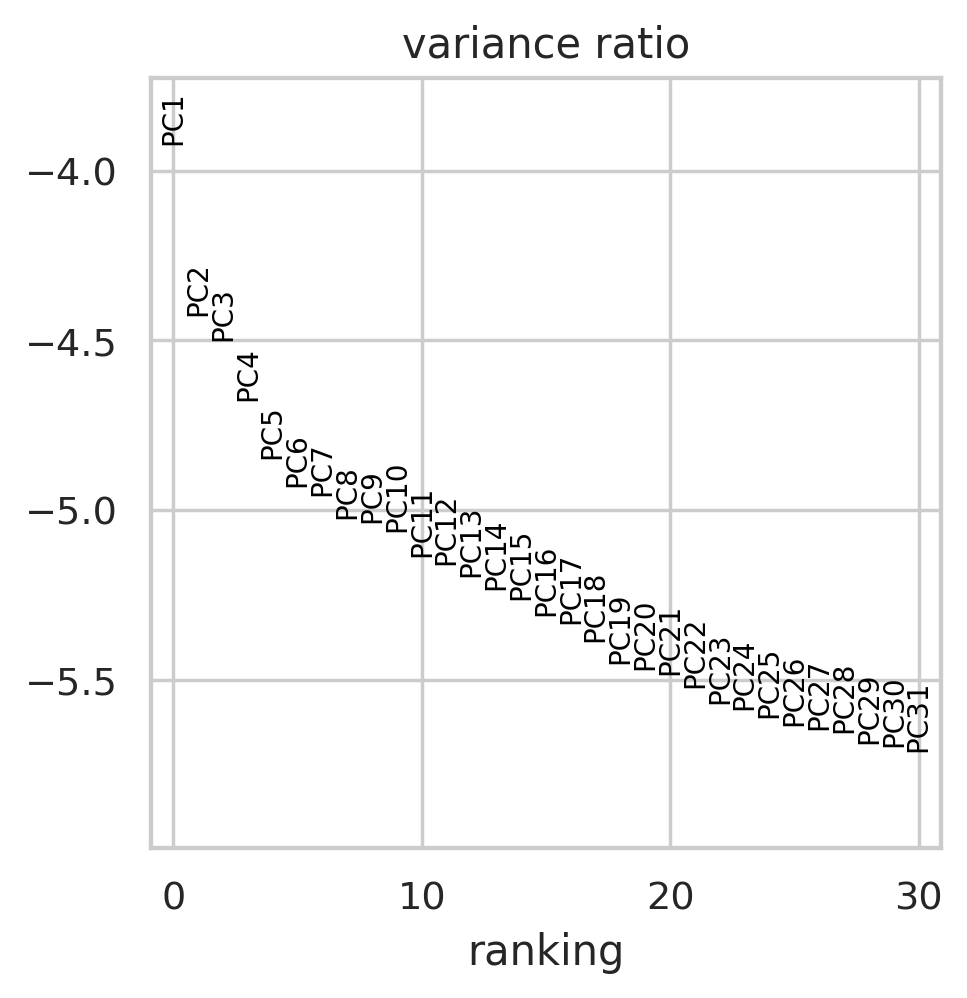
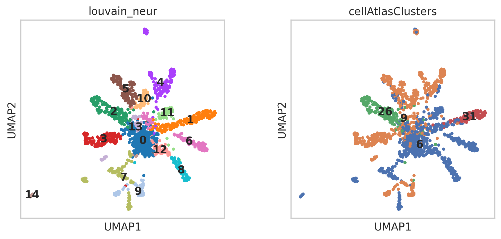
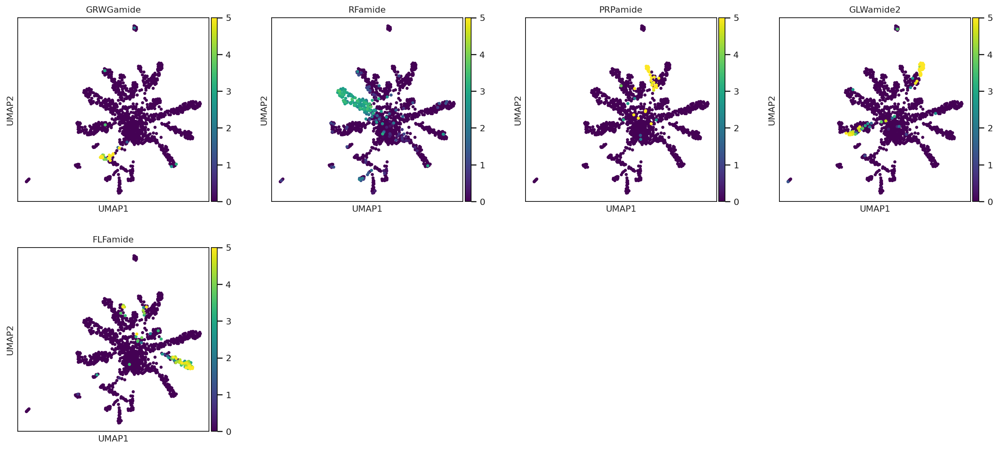
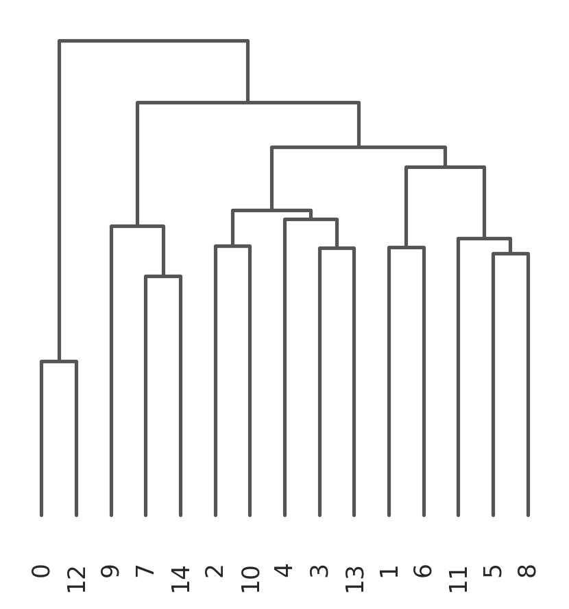

<a href="https://colab.research.google.com/github/pachterlab/CWGFLHGCCHAP_2021/blob/master/notebooks/CellAtlasAnalysis/neuronSubpop_Analysis.ipynb" target="_parent"></a>


```
!date
```

    Fri Aug 21 00:45:00 UTC 2020


### **Download Data**


```
import requests
from tqdm import tnrange, tqdm_notebook
def download_file(doi,ext):
    url = 'https://api.datacite.org/dois/'+doi+'/media'
    r = requests.get(url).json()
    netcdf_url = r['data'][0]['attributes']['url']
    r = requests.get(netcdf_url,stream=True)
    #Set file name
    fname = doi.split('/')[-1]+ext
    #Download file with progress bar
    if r.status_code == 403:
        print("File Unavailable")
    if 'content-length' not in r.headers:
        print("Did not get file")
    else:
        with open(fname, 'wb') as f:
            total_length = int(r.headers.get('content-length'))
            pbar = tnrange(int(total_length/1024), unit="B")
            for chunk in r.iter_content(chunk_size=1024):
                if chunk:
                    pbar.update()
                    f.write(chunk)
        return fname
```


```
#Kallisto bus clustered starvation data, h5ad
download_file('10.22002/D1.1796','.gz')

#Starvation h5ad data, all nonzero genes included, filtered for 'real cells' from de-multiplexing
download_file('10.22002/D1.1797','.gz')
```

    /usr/local/lib/python3.6/dist-packages/ipykernel_launcher.py:18: TqdmDeprecationWarning: Please use `tqdm.notebook.trange` instead of `tqdm.tnrange`


    HBox(children=(FloatProgress(value=0.0, max=479630.0), HTML(value='')))


    HBox(children=(FloatProgress(value=0.0, max=26058.0), HTML(value='')))


    'D1.1797.gz'


```
#Human ortholog annotations
download_file('10.22002/D1.1819','.gz')

#Panther annotations
download_file('10.22002/D1.1820','.gz')

#GO Terms
download_file('10.22002/D1.1822','.gz')
```

    /usr/local/lib/python3.6/dist-packages/ipykernel_launcher.py:18: TqdmDeprecationWarning: Please use `tqdm.notebook.trange` instead of `tqdm.tnrange`


    HBox(children=(FloatProgress(value=0.0, max=528.0), HTML(value='')))


    


    HBox(children=(FloatProgress(value=0.0, max=515.0), HTML(value='')))


    HBox(children=(FloatProgress(value=0.0, max=227.0), HTML(value='')))


    'D1.1822.gz'


```
#Previously saved neuron subpopulations
download_file('10.22002/D1.1804','.gz')

#Previously saved marker genes for neurons
download_file('10.22002/D1.1823','.gz')

```

    /usr/local/lib/python3.6/dist-packages/ipykernel_launcher.py:18: TqdmDeprecationWarning: Please use `tqdm.notebook.trange` instead of `tqdm.tnrange`


    HBox(children=(FloatProgress(value=0.0, max=1595.0), HTML(value='')))


    HBox(children=(FloatProgress(value=0.0, max=257856.0), HTML(value='')))


    'D1.1823.gz'


```
!gunzip *.gz
```


```
!pip install --quiet anndata
!pip install --quiet scanpy

!pip install --quiet louvain

```

         |████████████████████████████████| 122kB 6.0MB/s 
         |████████████████████████████████| 10.2MB 3.8MB/s 
         |████████████████████████████████| 71kB 7.6MB/s 
         |████████████████████████████████| 51kB 5.7MB/s 
    [?25h  Building wheel for sinfo (setup.py) ... [?25l[?25hdone
         |████████████████████████████████| 2.2MB 4.3MB/s 
         |████████████████████████████████| 3.2MB 24.3MB/s 
    [?25h


```
!pip3 install --quiet rpy2
```

###**Import Packages** 


```
#Install Packages
import random
import pandas as pd
import anndata
import scanpy as sc
import numpy as np
import scipy.sparse

import warnings
warnings.filterwarnings('ignore')

from sklearn.neighbors import (KNeighborsClassifier,NeighborhoodComponentsAnalysis)
from sklearn.pipeline import Pipeline
from sklearn.manifold import TSNE

#import scrublet as scr

import matplotlib.pyplot as plt
%matplotlib inline
sc.set_figure_params(dpi=125)

import seaborn as sns
sns.set(style="whitegrid")
%load_ext rpy2.ipython
```

## **Read in Previously Saved Data**


```
#Read in h5ad file
bus_fs_combo = anndata.read("D1.1796")

#Previously saved neurons
neurons = anndata.read("D1.1804")

#Read in annotations
from io import StringIO

hg_ortho_df = pd.read_csv(StringIO(''.join(l.replace('|', '\t') for l in open('D1.1819'))),
            sep="\t",header=None,skiprows=[0,1,2,3])

hg_ortho_df[['XLOC','TCONS']] = hg_ortho_df[13].str.split(expand=True) 
hg_ortho_df[['Gene','gi']] = hg_ortho_df[3].str.split(expand=True) 
hg_ortho_df['Description']= hg_ortho_df[11]


panther_df = pd.read_csv('D1.1820',
            sep="\t",header=None) #skiprows=[0,1,2,3]


goTerm_df = pd.read_csv('D1.1822',
            sep=" ",header=None) #skiprows=[0,1,2,3]

bus_fs_combo
```


    AnnData object with n_obs × n_vars = 13673 × 8696
        obs: 'batch', 'n_counts', 'n_countslog', 'louvain', 'leiden', 'orgID', 'fed', 'starved', 'fed_neighbor_score', 'cellRanger_louvain', 'annos', 'new_cellRanger_louvain', 'annosSub'
        var: 'n_counts', 'mean', 'std'
        uns: 'annosSub_colors', 'annos_colors', 'cellRanger_louvain_colors', 'cellRanger_louvain_sizes', "dendrogram_['new_cellRanger_louvain']", 'dendrogram_new_cellRanger_louvain', 'fed_colors', 'fed_neighbor_score_colors', 'leiden', 'leiden_colors', 'louvain', 'louvain_colors', 'neighbors', 'new_cellRanger_louvain_colors', 'orgID_colors', 'paga', 'pca', 'rank_genes_groups', 'umap'
        obsm: 'X_nca', 'X_pca', 'X_tsne', 'X_umap'
        varm: 'PCs'
        obsp: 'connectivities', 'distances'


```
raw_fs_combo = anndata.read('D1.1797')

raw_fs_combo = raw_fs_combo[bus_fs_combo.obs_names,]
#Transfer info from embedded version
raw_fs_combo.obs['cellRanger_louvain'] = pd.Categorical(bus_fs_combo.obs['cellRanger_louvain'])
raw_fs_combo.obs['fed'] = pd.Categorical(bus_fs_combo.obs['fed'])
raw_fs_combo.obsm['X_tsne'] = bus_fs_combo.obsm['X_tsne']

raw_fs_combo

```

    Trying to set attribute `.obs` of view, copying.


    AnnData object with n_obs × n_vars = 13673 × 46716
        obs: 'batch', 'cellRanger_louvain', 'fed'
        obsm: 'X_tsne'


###**Generating Neuron Subpopulations**

We begin by restricting analysis to four clusters that contain neuron subpopulations (31,26,6 and 9). After constraining the single-cell count matrices to the relevant cells, we examine the variance explained in the top principal components, and based on the "elbow plot" continue analysis with 15 principal components. 


```
# #Neurons, start from raw counts + unfiltered genes
neurons = raw_fs_combo[raw_fs_combo.obs['cellRanger_louvain'].isin([31,26,6,9])]
sc.pp.filter_cells(neurons, min_counts=0)
sc.pp.filter_genes(neurons, min_counts=0)

sc.pp.normalize_per_cell(neurons, counts_per_cell_after=1e4)

sc.pp.log1p(neurons)

sc.pp.highly_variable_genes(neurons,n_top_genes=2000,n_bins=50)

neurons = neurons[:,neurons.var['highly_variable']]

sc.pp.scale(neurons, max_value=10)

sc.tl.pca(neurons, n_comps=60)
sc.pl.pca_variance_ratio(neurons, log=True)

sc.pp.neighbors(neurons,n_neighbors=15, n_pcs=15) #n_neighbors=5, n_pcs=15,use_rep='X_nca'
sc.tl.louvain(neurons,resolution=1,key_added='louvain_neur',random_state=42)#Clustering algorithm,resolution=0.5
```

    Trying to set attribute `.obs` of view, copying.





Next, we perform Louvain clustering to identify distinct neuron subpopulations, and we plot them using a UMAP reduction of the count matrix. The plot on the left shows the 15 Louvain derived clusters; the plot on the right shows the same UMAP representation of the cells but colored according to the clusters obtained from clustering with all the cells. This shows that a reclustering on the restricted cell x gene matrix produces a refinement of the original clusters.


```
sc.tl.louvain(neurons,resolution=2.5,key_added='louvain_neur',random_state=42)#Clustering algorithm,resolution=0.5
```


```
neurons
```


    AnnData object with n_obs × n_vars = 1387 × 2000
        obs: 'batch', 'cellRanger_louvain', 'fed', 'n_counts', 'louvain_neur', 'test_louvain'
        var: 'n_counts', 'highly_variable', 'means', 'dispersions', 'dispersions_norm', 'mean', 'std'
        uns: 'cellRanger_louvain_colors', 'hvg', 'louvain', 'louvain_neur_colors', 'neighbors', 'pca', 'rank_genes_groups', 'test_louvain_colors', 'umap'
        obsm: 'X_pca', 'X_tsne', 'X_umap'
        varm: 'PCs'
        obsp: 'connectivities', 'distances'


```
sc.tl.tsne(neurons, n_pcs=15,perplexity=25,random_state = 42) #learning_rate=250
sc.tl.umap(neurons,random_state=42,spread=2.5, min_dist=1)

neurons.obs['cellAtlasClusters'] = pd.Categorical(neurons.obs['cellRanger_louvain'] )
sc.pl.umap(neurons, color=['louvain_neur','cellAtlasClusters'],color_map='viridis',size=50,legend_loc='on data')
```





The plots below show the cells expressing several different neuropeptides:


```
sc.pl.umap(neurons, color=['XLOC_040584','XLOC_019434','TRINITY_DN20104_c0_g1_i1.mrna1','XLOC_017097',
                           'XLOC_004021'],color_map='viridis',size=50,legend_loc='on data',
           title=['GRWGamide','RFamide','PRPamide','GLWamide2',
                  'FLFamide'],vmin=0,vmax=5)


```





Next, we identify marker genes for each of the 15 Louvain clusters determined for the neuron subpopulation, and we annotate them using the Panther database, gene ontology (GO) terms and via orthology searches.


```
#Get top n marker genes for each cluster

#Keep top 100 genes, 'louvain_neur' is label for neuron clusters determined using Louvain clustering algorithm
sc.tl.rank_genes_groups(neurons, 'louvain_neur',n_genes = 100,method='wilcoxon') #Using non-parametric test for significance
neurons
```


    AnnData object with n_obs × n_vars = 1387 × 2000
        obs: 'batch', 'cellRanger_louvain', 'fed', 'n_counts', 'louvain_neur', 'test_louvain'
        var: 'n_counts', 'highly_variable', 'means', 'dispersions', 'dispersions_norm', 'mean', 'std'
        uns: 'cellRanger_louvain_colors', 'hvg', 'louvain', 'louvain_neur_colors', 'neighbors', 'pca', 'rank_genes_groups', 'test_louvain_colors', 'umap'
        obsm: 'X_pca', 'X_tsne', 'X_umap'
        varm: 'PCs'
        obsp: 'connectivities', 'distances'


```
#Make dataframe, with 100 marker genes for each cluster + annotations
neuron_clusters = np.unique(neurons.obs['louvain_neur'])
neuron_markers = pd.DataFrame()

neurClus = []
markerGene = []
padj = []
orthoGene = []
orthoDescr = []

pantherNum = []
pantherDescr = []

goTerms = []

for i in neuron_clusters:
  genes = neurons.uns['rank_genes_groups']['names'][str(i)]

  neurClus += list(np.repeat(i,len(genes)))
  markerGene += list(genes)
  padj += list(neurons.uns['rank_genes_groups']['pvals_adj'][str(i)])

  for g in genes:
        
    sub_df = hg_ortho_df[hg_ortho_df.XLOC.isin([g])]
    panth_df = panther_df[panther_df[0].isin([g])]
    go_df = goTerm_df[goTerm_df[0].isin([g])]

    if len(sub_df) > 0:
      #Save first result for gene/description
      orthoGene += [list(sub_df.Gene)[0]]
      orthoDescr += [list(sub_df.Description)[0]]
    else:
      orthoGene += ['NA']
      orthoDescr += ['NA']


    if len(panth_df) > 0:
      pantherNum += [list(panth_df[1])]
      pantherDescr += [list(panth_df[2])]
    else:
      pantherNum += ['NA']
      pantherDescr += ['NA']


    if len(go_df) > 0:
      goTerms += [list(go_df[1])]
    else:
      goTerms += ['NA']
 

neuron_markers['neurClus'] = neurClus
neuron_markers['markerGene'] = markerGene
neuron_markers['padj'] = padj

neuron_markers['orthoGene'] = orthoGene
neuron_markers['orthoDescr'] = orthoDescr

neuron_markers['pantherID'] = pantherNum
neuron_markers['pantherDescr'] = pantherDescr

neuron_markers['goTerms'] = goTerms
     
neuron_markers.head()
#list(neurons.uns['rank_genes_groups']['names']['1'])


```


<div>
<style scoped>
    .dataframe tbody tr th:only-of-type {
        vertical-align: middle;
    }

    .dataframe tbody tr th {
        vertical-align: top;
    }

    .dataframe thead th {
        text-align: right;
    }
</style>
<table border="1" class="dataframe">
  <thead>
    <tr style="text-align: right;">
      <th></th>
      <th>neurClus</th>
      <th>markerGene</th>
      <th>padj</th>
      <th>orthoGene</th>
      <th>orthoDescr</th>
      <th>pantherID</th>
      <th>pantherDescr</th>
      <th>goTerms</th>
    </tr>
  </thead>
  <tbody>
    <tr>
      <th>0</th>
      <td>0</td>
      <td>XLOC_011074</td>
      <td>9.930711e-30</td>
      <td>TUBA1C</td>
      <td>tubulin alpha-1C chain isoform a [Homo sapiens]</td>
      <td>[PTHR11588:SF223]</td>
      <td>[SUBFAMILY NOT NAMED]</td>
      <td>[GO:0045298,GO:0005856,GO:0005200,GO:0005622,G...</td>
    </tr>
    <tr>
      <th>1</th>
      <td>0</td>
      <td>XLOC_015355</td>
      <td>2.959498e-09</td>
      <td>NA</td>
      <td>NA</td>
      <td>[PTHR12124:SF53]</td>
      <td>[EXONUCLEASE 3'-5' DOMAIN-CONTAINING PROTEIN 1]</td>
      <td>[GO:0016070,GO:0016787,GO:0016072,GO:0044238,G...</td>
    </tr>
    <tr>
      <th>2</th>
      <td>0</td>
      <td>XLOC_044603</td>
      <td>1.123759e-05</td>
      <td>NDUFV2</td>
      <td>NADH dehydrogenase [ubiquinone] flavoprotein ...</td>
      <td>[PTHR10371]</td>
      <td>[NADH DEHYDROGENASE  UBIQUINONE  FLAVOPROTEIN ...</td>
      <td>[GO:0043234,GO:0005886,GO:0016020,GO:0032991,G...</td>
    </tr>
    <tr>
      <th>3</th>
      <td>0</td>
      <td>XLOC_030920</td>
      <td>3.931534e-05</td>
      <td>NA</td>
      <td>NA</td>
      <td>[PTHR19290]</td>
      <td>[BASIC HELIX-LOOP-HELIX PROTEIN NEUROGENIN-REL...</td>
      <td>[nan]</td>
    </tr>
    <tr>
      <th>4</th>
      <td>0</td>
      <td>XLOC_004445</td>
      <td>3.710752e-01</td>
      <td>NA</td>
      <td>NA</td>
      <td>[PTHR28618]</td>
      <td>[FAMILY NOT NAMED]</td>
      <td>[nan]</td>
    </tr>
  </tbody>
</table>
</div>


```
#Write to csv
neuron_markers.to_csv('neuron_marker_annotations.csv')

#Read in csv (previously saved version, uploaded to Box)
neuron_markers = pd.read_csv('neuron_marker_annotations.csv',
            sep=",")
neuron_markers.head()
```


<div>
<style scoped>
    .dataframe tbody tr th:only-of-type {
        vertical-align: middle;
    }

    .dataframe tbody tr th {
        vertical-align: top;
    }

    .dataframe thead th {
        text-align: right;
    }
</style>
<table border="1" class="dataframe">
  <thead>
    <tr style="text-align: right;">
      <th></th>
      <th>Unnamed: 0</th>
      <th>neurClus</th>
      <th>markerGene</th>
      <th>padj</th>
      <th>orthoGene</th>
      <th>orthoDescr</th>
      <th>pantherID</th>
      <th>pantherDescr</th>
      <th>goTerms</th>
    </tr>
  </thead>
  <tbody>
    <tr>
      <th>0</th>
      <td>0</td>
      <td>0</td>
      <td>XLOC_011074</td>
      <td>9.930711e-30</td>
      <td>TUBA1C</td>
      <td>tubulin alpha-1C chain isoform a [Homo sapiens]</td>
      <td>['PTHR11588:SF223']</td>
      <td>['SUBFAMILY NOT NAMED']</td>
      <td>['GO:0045298,GO:0005856,GO:0005200,GO:0005622,...</td>
    </tr>
    <tr>
      <th>1</th>
      <td>1</td>
      <td>0</td>
      <td>XLOC_015355</td>
      <td>2.959498e-09</td>
      <td>NaN</td>
      <td>NaN</td>
      <td>['PTHR12124:SF53']</td>
      <td>["EXONUCLEASE 3'-5' DOMAIN-CONTAINING PROTEIN 1"]</td>
      <td>['GO:0016070,GO:0016787,GO:0016072,GO:0044238,...</td>
    </tr>
    <tr>
      <th>2</th>
      <td>2</td>
      <td>0</td>
      <td>XLOC_044603</td>
      <td>1.123759e-05</td>
      <td>NDUFV2</td>
      <td>NADH dehydrogenase [ubiquinone] flavoprotein ...</td>
      <td>['PTHR10371']</td>
      <td>['NADH DEHYDROGENASE  UBIQUINONE  FLAVOPROTEIN...</td>
      <td>['GO:0043234,GO:0005886,GO:0016020,GO:0032991,...</td>
    </tr>
    <tr>
      <th>3</th>
      <td>3</td>
      <td>0</td>
      <td>XLOC_030920</td>
      <td>3.931534e-05</td>
      <td>NaN</td>
      <td>NaN</td>
      <td>['PTHR19290']</td>
      <td>['BASIC HELIX-LOOP-HELIX PROTEIN NEUROGENIN-RE...</td>
      <td>[nan]</td>
    </tr>
    <tr>
      <th>4</th>
      <td>4</td>
      <td>0</td>
      <td>XLOC_004445</td>
      <td>3.710752e-01</td>
      <td>NaN</td>
      <td>NaN</td>
      <td>['PTHR28618']</td>
      <td>['FAMILY NOT NAMED']</td>
      <td>[nan]</td>
    </tr>
  </tbody>
</table>
</div>


```
neurons.write('neuron_subpops_fs.h5ad')
```

### **Neuron Subpopulation Plots**

Hierarchical Clustering of Neuron Subpopulations


```
#Previously saved neurons
neurons = anndata.read("D1.1804")
print(neurons)

raw_fs_combo = anndata.read('D1.1797')

raw_fs_combo = raw_fs_combo[bus_fs_combo.obs_names,]
#Transfer info from embedded version
raw_fs_combo.obs['cellRanger_louvain'] = pd.Categorical(bus_fs_combo.obs['cellRanger_louvain'])
raw_fs_combo.obs['fed'] = pd.Categorical(bus_fs_combo.obs['fed'])
raw_fs_combo.obsm['X_tsne'] = bus_fs_combo.obsm['X_tsne']

raw_fs_combo

```

    Trying to set attribute `.obs` of view, copying.


    AnnData object with n_obs × n_vars = 1387 × 2000
        obs: 'batch', 'cellRanger_louvain', 'fed', 'n_counts', 'louvain_neur', 'test_louvain'
        var: 'n_counts', 'highly_variable', 'means', 'dispersions', 'dispersions_norm', 'mean', 'std'
        uns: 'cellRanger_louvain_colors', 'hvg', 'louvain', 'louvain_neur_colors', 'neighbors', 'pca', 'rank_genes_groups', 'test_louvain_colors', 'umap'
        obsm: 'X_pca', 'X_tsne', 'X_umap'
        varm: 'PCs'
        obsp: 'connectivities', 'distances'


    AnnData object with n_obs × n_vars = 13673 × 46716
        obs: 'batch', 'cellRanger_louvain', 'fed'
        obsm: 'X_tsne'


To examine similarities between different subpopulations we infer a dendogram based on similarities of cells in the different Louvain derived clusters:


```
sc.tl.dendrogram(neurons,'louvain_neur',linkage_method='ward')
neurons
```


    AnnData object with n_obs × n_vars = 1387 × 2000
        obs: 'batch', 'cellRanger_louvain', 'fed', 'n_counts', 'louvain_neur', 'test_louvain'
        var: 'n_counts', 'highly_variable', 'means', 'dispersions', 'dispersions_norm', 'mean', 'std'
        uns: 'cellRanger_louvain_colors', 'hvg', 'louvain', 'louvain_neur_colors', 'neighbors', 'pca', 'rank_genes_groups', 'test_louvain_colors', 'umap', "dendrogram_['louvain_neur']"
        obsm: 'X_pca', 'X_tsne', 'X_umap'
        varm: 'PCs'
        obsp: 'connectivities', 'distances'


```
neurons.uns['dendrogram_louvain_neur'] = neurons.uns["dendrogram_['louvain_neur']"]
```


```
sc.pl.dendrogram(neurons,'louvain_neur')
```





    <matplotlib.axes._subplots.AxesSubplot at 0x7f984bb074e0>


Plot marker genes


```
neuron_markers = pd.read_csv('D1.1823') 
neuron_markers.head()


```


<div>
<style scoped>
    .dataframe tbody tr th:only-of-type {
        vertical-align: middle;
    }

    .dataframe tbody tr th {
        vertical-align: top;
    }

    .dataframe thead th {
        text-align: right;
    }
</style>
<table border="1" class="dataframe">
  <thead>
    <tr style="text-align: right;">
      <th></th>
      <th>Unnamed: 0</th>
      <th>neurClus</th>
      <th>markerGene</th>
      <th>padj</th>
      <th>orthoGene</th>
      <th>orthoDescr</th>
      <th>pantherID</th>
      <th>pantherDescr</th>
      <th>goTerms</th>
    </tr>
  </thead>
  <tbody>
    <tr>
      <th>0</th>
      <td>0</td>
      <td>0</td>
      <td>XLOC_011074</td>
      <td>9.930711e-30</td>
      <td>TUBA1C</td>
      <td>tubulin alpha-1C chain isoform a [Homo sapiens]</td>
      <td>['PTHR11588:SF223']</td>
      <td>['SUBFAMILY NOT NAMED']</td>
      <td>['GO:0045298,GO:0005856,GO:0005200,GO:0005622,...</td>
    </tr>
    <tr>
      <th>1</th>
      <td>1</td>
      <td>0</td>
      <td>XLOC_015355</td>
      <td>2.959498e-09</td>
      <td>NaN</td>
      <td>NaN</td>
      <td>['PTHR12124:SF53']</td>
      <td>["EXONUCLEASE 3'-5' DOMAIN-CONTAINING PROTEIN 1"]</td>
      <td>['GO:0016070,GO:0016787,GO:0016072,GO:0044238,...</td>
    </tr>
    <tr>
      <th>2</th>
      <td>2</td>
      <td>0</td>
      <td>XLOC_044603</td>
      <td>1.123759e-05</td>
      <td>NDUFV2</td>
      <td>NADH dehydrogenase [ubiquinone] flavoprotein ...</td>
      <td>['PTHR10371']</td>
      <td>['NADH DEHYDROGENASE  UBIQUINONE  FLAVOPROTEIN...</td>
      <td>['GO:0043234,GO:0005886,GO:0016020,GO:0032991,...</td>
    </tr>
    <tr>
      <th>3</th>
      <td>3</td>
      <td>0</td>
      <td>XLOC_030920</td>
      <td>3.931534e-05</td>
      <td>NaN</td>
      <td>NaN</td>
      <td>['PTHR19290']</td>
      <td>['BASIC HELIX-LOOP-HELIX PROTEIN NEUROGENIN-RE...</td>
      <td>[nan]</td>
    </tr>
    <tr>
      <th>4</th>
      <td>4</td>
      <td>0</td>
      <td>XLOC_004445</td>
      <td>3.710752e-01</td>
      <td>NaN</td>
      <td>NaN</td>
      <td>['PTHR28618']</td>
      <td>['FAMILY NOT NAMED']</td>
      <td>[nan]</td>
    </tr>
  </tbody>
</table>
</div>


```
# topGenes = []
# var_groups = []
# var_labels = []
# ind = 0
# n_genes = 10
# for i in np.unique(neuron_markers.neurClus):
#   sub = neuron_markers[neuron_markers.neurClus == i]
#   sub.sort_values(by='padj',ascending=True)

#   #noDups = [i for i in sub.markerGene if i not in topGenes] #Remove duplicate genes
#   topGenes += list(sub.markerGene[0:n_genes])

#   var_groups += [(ind,ind+n_genes-1)]
#   var_labels += [str(i)]
#   ind += n_genes


```


```
# forBLAST = neuron_markers[neuron_markers.markerGene.isin(topGenes)]
# forBLAST.to_csv('blastNeuroPop_Genes.csv')
```


```
# Use raw adata with all genes, to plot any gene expression in neuron subpopulations
neurons_raw = raw_fs_combo[raw_fs_combo.obs['cellRanger_louvain'].isin([31,26,6,9])]


sc.pp.filter_cells(neurons_raw, min_counts=0)
sc.pp.filter_genes(neurons_raw, min_counts=0)

sc.pp.normalize_per_cell(neurons_raw, counts_per_cell_after=1e4)

sc.pp.log1p(neurons_raw)

#sc.pp.scale(neurons_raw,max_value=10)
neurons_raw.obs['louvain_neur'] = neurons.obs['louvain_neur']
neurons_raw.obsm['X_tsne'] = neurons.obsm['X_tsne']
neurons_raw.obsm['X_umap'] = neurons.obsm['X_umap']

neurons_raw.uns['dendrogram_louvain_neur'] = neurons.uns['dendrogram_louvain_neur']
neurons_raw.uns['louvain_neur_colors'] = neurons.uns['louvain_neur_colors']

```

    Trying to set attribute `.obs` of view, copying.


```
#Plot main figure genes

topGenes = ['XLOC_018937','XLOC_035224','XLOC_040584',
            'XLOC_008764','XLOC_040209', 'XLOC_010892','XLOC_003339','XLOC_019434','XLOC_042761','XLOC_017097',
            'XLOC_021799','XLOC_041402','XLOC_004021','XLOC_008730',
            'XLOC_014624','XLOC_030120',
            'XLOC_038155'] 
neurons_sigTop = neurons_raw[:,topGenes]

labels = ['bHLH TF 2','+PP24','PP7',
          'PP8','+PP19','+PP21','+PP15','PP5','PP1','PP11',
          '+PP25','PP9','PP14','+PP26',
          '+PP27','+PP17',
          '+PP20']
neurons_sigTop.var['names'] = labels

sc.set_figure_params(scanpy=True, fontsize=10)
sc.pl.heatmap(neurons_sigTop, labels, groupby='louvain_neur', dendrogram=True,show_gene_labels=True,
              gene_symbols = 'names',swap_axes=True,
              cmap='PuBuGn',standard_scale='var',save='neuronMarkers.pdf') #var_group_positions =var_groups ,var_group_labels = var_labels
```

    Trying to set attribute `.var` of view, copying.


    WARNING: saving figure to file figures/heatmapneuronMarkers.pdf


```
sc.pl.umap(neurons_raw,color=['XLOC_041402','XLOC_019434','XLOC_040584'],title=['PP9','PP5','PP7'],color_map='plasma')
```


