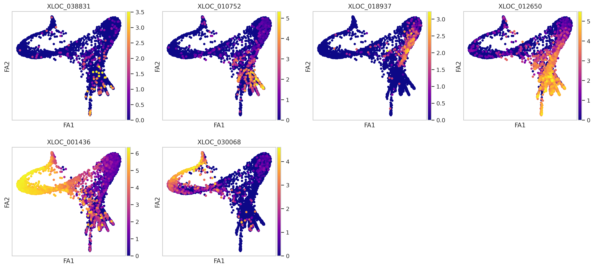
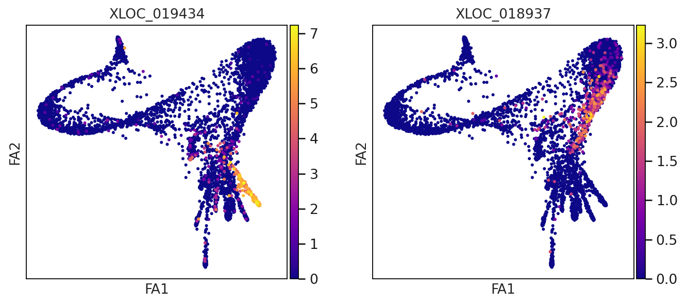
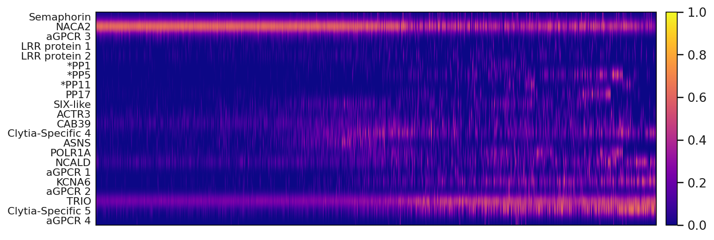
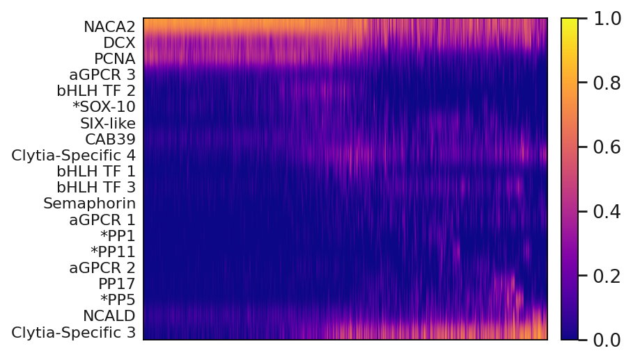
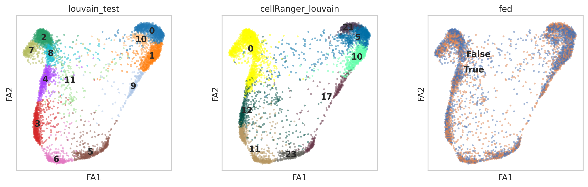
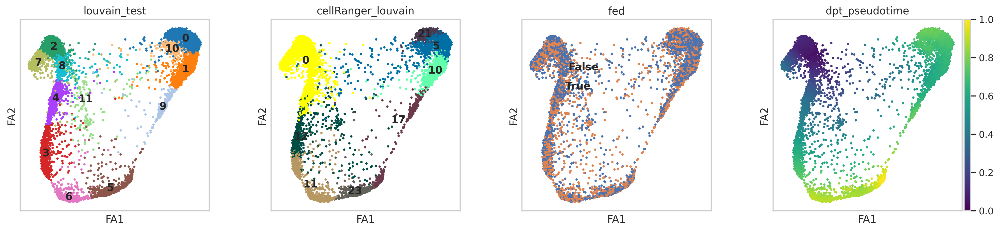
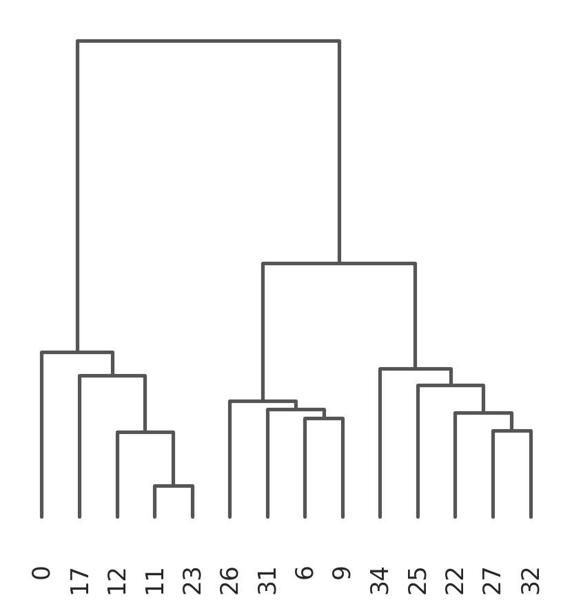

<a href="https://colab.research.google.com/github/pachterlab/CWGFLHGCCHAP_2021/blob/master/notebooks/CellAtlasAnalysis/pseudotime_Analysis.ipynb" target="_parent"></a>


```
!date
```

    Wed Aug 19 16:45:58 UTC 2020


### **Download Data**


```
import requests
from tqdm import tnrange, tqdm_notebook
def download_file(doi,ext):
    url = 'https://api.datacite.org/dois/'+doi+'/media'
    r = requests.get(url).json()
    netcdf_url = r['data'][0]['attributes']['url']
    r = requests.get(netcdf_url,stream=True)
    #Set file name
    fname = doi.split('/')[-1]+ext
    #Download file with progress bar
    if r.status_code == 403:
        print("File Unavailable")
    if 'content-length' not in r.headers:
        print("Did not get file")
    else:
        with open(fname, 'wb') as f:
            total_length = int(r.headers.get('content-length'))
            pbar = tnrange(int(total_length/1024), unit="B")
            for chunk in r.iter_content(chunk_size=1024):
                if chunk:
                    pbar.update()
                    f.write(chunk)
        return fname
```


```
#Kallisto bus clustered starvation data, h5ad
download_file('10.22002/D1.1796','.gz')

#Starvation h5ad data, all nonzero genes included, filtered for 'real cells' from de-multiplexing
download_file('10.22002/D1.1797','.gz')
```

    /usr/local/lib/python3.6/dist-packages/ipykernel_launcher.py:18: TqdmDeprecationWarning: Please use `tqdm.notebook.trange` instead of `tqdm.tnrange`


    HBox(children=(FloatProgress(value=0.0, max=479106.0), HTML(value='')))


    HBox(children=(FloatProgress(value=0.0, max=26058.0), HTML(value='')))


    'D1.1797.gz'


```
#Previously saved neuron subpopulations
download_file('10.22002/D1.1804','.gz')

#Previously saved neuron pseudotime adata
download_file('10.22002/D1.1806','.gz')

#Previously saved nematocyte pseudotime adata
download_file('10.22002/D1.1805','.gz')
```

    /usr/local/lib/python3.6/dist-packages/ipykernel_launcher.py:18: TqdmDeprecationWarning: Please use `tqdm.notebook.trange` instead of `tqdm.tnrange`


    HBox(children=(FloatProgress(value=0.0, max=1595.0), HTML(value='')))


    HBox(children=(FloatProgress(value=0.0, max=10910.0), HTML(value='')))


    HBox(children=(FloatProgress(value=0.0, max=12207.0), HTML(value='')))


    'D1.1805.gz'


```
#Human ortholog annotations
download_file('10.22002/D1.1819','.gz')

#Panther annotations
download_file('10.22002/D1.1820','.gz')

#GO Terms
download_file('10.22002/D1.1822','.gz')
```

    /usr/local/lib/python3.6/dist-packages/ipykernel_launcher.py:18: TqdmDeprecationWarning: Please use `tqdm.notebook.trange` instead of `tqdm.tnrange`


    HBox(children=(FloatProgress(value=0.0, max=528.0), HTML(value='')))


    


    HBox(children=(FloatProgress(value=0.0, max=515.0), HTML(value='')))


    HBox(children=(FloatProgress(value=0.0, max=227.0), HTML(value='')))


    'D1.1822.gz'


```
#Previously saved ranked pseudotime genes

#Nematocyte trajectory (ranked genes)
#!wget --quiet https://caltech.box.com/shared/static/u19vzppejvt6ky3ysqptt2ia2dqozpkf
download_file('10.22002/D1.1808','.gz')

#Neuron trajectory (ranked genes)
#!wget --quiet https://caltech.box.com/shared/static/ippfug3xt20etmyx08egzpipgmyfc17m
download_file('10.22002/D1.1807','.gz')
```

    /usr/local/lib/python3.6/dist-packages/ipykernel_launcher.py:18: TqdmDeprecationWarning: Please use `tqdm.notebook.trange` instead of `tqdm.tnrange`


    HBox(children=(FloatProgress(value=0.0, max=135.0), HTML(value='')))


    HBox(children=(FloatProgress(value=0.0, max=134.0), HTML(value='')))


    'D1.1807.gz'


```
!gunzip *.gz
```


```
#Install packages
!pip install --quiet anndata
!pip install --quiet scanpy

!pip install --quiet louvain
```

         |████████████████████████████████| 122kB 5.8MB/s 
         |████████████████████████████████| 10.2MB 3.7MB/s 
         |████████████████████████████████| 51kB 6.3MB/s 
         |████████████████████████████████| 71kB 9.1MB/s 
    [?25h  Building wheel for sinfo (setup.py) ... [?25l[?25hdone
         |████████████████████████████████| 2.2MB 4.4MB/s 
         |████████████████████████████████| 3.2MB 28.2MB/s 
    [?25h

###**Import Packages** 


```
#Import Packages

import random
import pandas as pd
import anndata
import scanpy as sc
import numpy as np
import scipy.sparse

import warnings
warnings.filterwarnings('ignore')

from sklearn.neighbors import (KNeighborsClassifier,NeighborhoodComponentsAnalysis)
from sklearn.pipeline import Pipeline
from sklearn.manifold import TSNE

#import scrublet as scr

import matplotlib.pyplot as plt
%matplotlib inline
sc.set_figure_params(dpi=125)

import seaborn as sns
sns.set(style="whitegrid")

```


```
#Read in annotations
from io import StringIO

hg_ortho_df = pd.read_csv(StringIO(''.join(l.replace('|', '\t') for l in open('D1.1819'))),
            sep="\t",header=None,skiprows=[0,1,2,3])

hg_ortho_df[['XLOC','TCONS']] = hg_ortho_df[13].str.split(expand=True) 
hg_ortho_df[['Gene','gi']] = hg_ortho_df[3].str.split(expand=True) 
hg_ortho_df['Description']= hg_ortho_df[11]


panther_df = pd.read_csv('D1.1820',
            sep="\t",header=None) #skiprows=[0,1,2,3]


goTerm_df = pd.read_csv('D1.1822',
            sep=" ",header=None) #skiprows=[0,1,2,3]
```


```
#Read in saved data
bus_fs_combo = anndata.read('D1.1796')
print(bus_fs_combo)

bus_fs_raw  = anndata.read('D1.1797')
bus_fs_raw.obs['cellRanger_louvain'] = pd.Categorical(bus_fs_combo.obs['cellRanger_louvain'])
bus_fs_raw.obs['fed'] = pd.Categorical(bus_fs_combo.obs['fed'])
bus_fs_raw.obs['orgID'] = pd.Categorical(bus_fs_combo.obs['orgID'])
bus_fs_raw.obs['annos'] = pd.Categorical(bus_fs_combo.obs['annos'])
bus_fs_raw.obs['annosSub'] = pd.Categorical(bus_fs_combo.obs['annosSub'])

bus_fs_raw.uns['annos_colors'] = bus_fs_combo.uns['annos_colors']
bus_fs_raw.uns['cellRanger_louvain_colors'] = bus_fs_combo.uns['annosSub_colors']
#bus_fs_raw.uns['annosSub_colors'] = bus_fs_combo.uns['annosSub_colors']
print(bus_fs_raw)

neuron_subpops  = anndata.read('D1.1804') 
print(neuron_subpops)
```

    AnnData object with n_obs × n_vars = 13673 × 8696
        obs: 'batch', 'n_counts', 'n_countslog', 'louvain', 'leiden', 'orgID', 'fed', 'starved', 'fed_neighbor_score', 'cellRanger_louvain', 'annos', 'new_cellRanger_louvain', 'annosSub'
        var: 'n_counts', 'mean', 'std'
        uns: 'annosSub_colors', 'annos_colors', 'cellRanger_louvain_colors', 'cellRanger_louvain_sizes', "dendrogram_['new_cellRanger_louvain']", 'dendrogram_new_cellRanger_louvain', 'fed_colors', 'fed_neighbor_score_colors', 'leiden', 'leiden_colors', 'louvain', 'louvain_colors', 'neighbors', 'new_cellRanger_louvain_colors', 'orgID_colors', 'paga', 'pca', 'rank_genes_groups', 'umap'
        obsm: 'X_nca', 'X_pca', 'X_tsne', 'X_umap'
        varm: 'PCs'
        obsp: 'connectivities', 'distances'
    AnnData object with n_obs × n_vars = 13673 × 46716
        obs: 'batch', 'cellRanger_louvain', 'fed', 'orgID', 'annos', 'annosSub'
        uns: 'annos_colors', 'cellRanger_louvain_colors'
    AnnData object with n_obs × n_vars = 1387 × 2000
        obs: 'batch', 'cellRanger_louvain', 'fed', 'n_counts', 'louvain_neur', 'test_louvain'
        var: 'n_counts', 'highly_variable', 'means', 'dispersions', 'dispersions_norm', 'mean', 'std'
        uns: 'cellRanger_louvain_colors', 'hvg', 'louvain', 'louvain_neur_colors', 'neighbors', 'pca', 'rank_genes_groups', 'test_louvain_colors', 'umap'
        obsm: 'X_pca', 'X_tsne', 'X_umap'
        varm: 'PCs'
        obsp: 'connectivities', 'distances'


```
#Functions used

#Random forest regression to determine best genes to predict pseudotime
from sklearn.ensemble import RandomForestRegressor
from sklearn.inspection import permutation_importance
def runRegr_dptPseudotime(adata,adata_scaled,label='dpt_pseudotime'):
  X = adata.X
  if scipy.sparse.issparse(X):
    X = X.toarray()
  
  #80% training data
  perc = 0.8
  n = np.int(perc*X.shape[0])

  np.random.seed(0)
  indices = np.random.choice(X.shape[0], n, replace=False,)
  X_train = X[indices,:]

  y = adata_scaled.obs[label]
  y_train = y[indices]

  X_test = X[[i for i in range(0,X.shape[0]) if i not in indices],:]
  y_test = y[[i for i in range(0,X.shape[0]) if i not in indices]]

  regr = RandomForestRegressor(random_state=42,max_samples=perc)
  regr.fit(X_train, y_train)
  print(regr.score(X_test, y_test))
  result = permutation_importance(regr, X_test, y_test, n_repeats=5, random_state=42)
  
  return result

#Convert filtered results to dataframe
def resToDF(result,adata):
  neur_gene_res = pd.DataFrame()
  neur_gene_res['Genes'] = adata.var_names
  neur_gene_res['Mean'] = result.importances_mean
  neur_gene_res['Std'] = result.importances_std

  neur_gene_res= neur_gene_res.sort_values('Mean', axis=0, ascending=False)

  neur_gene_res= neur_gene_res[neur_gene_res.Mean > 0]

  print(len(neur_gene_res.Genes))

  return neur_gene_res

#Make dataframe, with 100 marker genes for each cluster + annotations
def annotateResDF(resultDF):
  orthoGene = []
  orthoDescr = []

  pantherNum = []
  pantherDescr = []

  goTerms = []

  genes = resultDF.Genes

  for g in genes:
          
    sub_df = hg_ortho_df[hg_ortho_df.XLOC.isin([g])]
    panth_df = panther_df[panther_df[0].isin([g])]
    go_df = goTerm_df[goTerm_df[0].isin([g])]

    if len(sub_df) > 0:
      #Save first result for gene/description
      orthoGene += [list(sub_df.Gene)[0]]
      orthoDescr += [list(sub_df.Description)[0]]
    else:
      orthoGene += ['NA']
      orthoDescr += ['NA']


    if len(panth_df) > 0:
      pantherNum += [list(panth_df[1])]
      pantherDescr += [list(panth_df[2])]
    else:
      pantherNum += ['NA']
      pantherDescr += ['NA']


    if len(go_df) > 0:
      goTerms += [list(go_df[1])]
    else:
      goTerms += ['NA']
  

  resultDF['orthoGene'] = orthoGene
  resultDF['orthoDescr'] = orthoDescr

  resultDF['pantherID'] = pantherNum
  resultDF['pantherDescr'] = pantherDescr

  resultDF['goTerms'] = goTerms
      
  return resultDF
  #list(neurons.uns['rank_genes_groups']['names']['1'])

#Order cells in cell-by-gene matrix by pseudotime
def orderTime(adata):
  sortTime = np.argsort(adata.obs['dpt_pseudotime'])
  newNames = adata.obs_names[list(sortTime)]

  adataRet = adata[newNames,:]
  return adataRet

```

###**Generate Pseudotime Trajectories for I-cells, Neurons, Nematocytes**

Select cell types 0, 11, 12, 17, 23 6, 9, 26 & 31 which represent the i-cells, Neural cells, and Nematocytes for downstream analysis


```
#Subset data

#I-cells, neurons, nematocytes
big_lin = bus_fs_raw[bus_fs_raw.obs['cellRanger_louvain'].isin([31,26,6,9,0,11,12,17,23])]


sc.pp.filter_cells(big_lin, min_counts=0)
sc.pp.filter_genes(big_lin, min_counts=1)
sc.pp.normalize_per_cell(big_lin, counts_per_cell_after=1e4)

big_lin_copy = big_lin.copy()
sc.pp.log1p(big_lin)

big_lin.raw = sc.pp.log1p(big_lin_copy, copy=True)


sc.pp.highly_variable_genes(big_lin, n_top_genes=4000,n_bins=50)

big_lin = big_lin[:,big_lin.var['highly_variable']]

big_lin


```

    Trying to set attribute `.obs` of view, copying.


    View of AnnData object with n_obs × n_vars = 4064 × 4000
        obs: 'batch', 'cellRanger_louvain', 'fed', 'orgID', 'annos', 'annosSub', 'n_counts'
        var: 'n_counts', 'highly_variable', 'means', 'dispersions', 'dispersions_norm'
        uns: 'annos_colors', 'cellRanger_louvain_colors', 'log1p', 'hvg'


Cluster and embed cells for pseudotime visualization


```
#Large lineage PAGA embedding

big_lin_scaled = big_lin
sc.pp.scale(big_lin_scaled, max_value=10)

sc.tl.pca(big_lin_scaled, n_comps=60)
#sc.pl.pca_variance_ratio(neur_lin_scaled, log=True)
sc.pp.neighbors(big_lin_scaled,n_neighbors=50, n_pcs=15,method='gauss')

sc.tl.louvain(big_lin_scaled,resolution=1,key_added='louvain_test')#Clustering algorithm,resolution=0.5


sc.tl.paga(big_lin_scaled, groups='louvain_test',)
sc.pl.paga(big_lin_scaled, color=['louvain_test'])
```


```
#Add neuron subpopulation labels
labels = []
for c in big_lin_scaled.obs_names:
  if c in neuron_subpops.obs_names:

    labels += [neuron_subpops[c,:].obs['louvain_neur'][0]]
  else:
    labels += ['rest']

big_lin_scaled.obs['louvain_neur'] = pd.Categorical(labels)
```


```
sc.tl.draw_graph(big_lin_scaled, init_pos='paga')
#sc.pl.draw_graph(big_lin_scaled, color=['louvain_test','louvain_neur','cellRanger_louvain','fed'], legend_loc='on data',color_map='viridis',alpha=0.5)
```


```
#Calculate pseudotime with diffusion components (dim reduction)

big_lin_scaled.uns['iroot'] = np.flatnonzero(big_lin_scaled.obs['louvain_test']  == '0')[0]
sc.tl.diffmap(big_lin_scaled,n_comps=10)
sc.tl.dpt(big_lin_scaled,n_dcs=10)

```


```
sc.pl.draw_graph(big_lin_scaled, color=['louvain_test','annos','fed','dpt_pseudotime','louvain_neur'], 
                 color_map='viridis') #legend_loc='on data'
```

    *c* argument looks like a single numeric RGB or RGBA sequence, which should be avoided as value-mapping will have precedence in case its length matches with *x* & *y*.  Please use the *color* keyword-argument or provide a 2-D array with a single row if you intend to specify the same RGB or RGBA value for all points.
    *c* argument looks like a single numeric RGB or RGBA sequence, which should be avoided as value-mapping will have precedence in case its length matches with *x* & *y*.  Please use the *color* keyword-argument or provide a 2-D array with a single row if you intend to specify the same RGB or RGBA value for all points.


```
sc.pl.draw_graph(big_lin_scaled, color=['XLOC_038831','XLOC_010752','XLOC_018937','XLOC_012650','XLOC_001436','XLOC_030068'], 
                 legend_loc='on data',color_map='plasma',s=80) 
```





Make adata object including more variable genes to rank by their importance/relevance to the pseudotime trajectories


```
#Make adata for doing regression (more variable genes included)
big_lin_reg = bus_fs_raw[bus_fs_raw.obs['cellRanger_louvain'].isin([31,26,6,9,0,11,12,17,23])]


sc.pp.filter_cells(big_lin_reg, min_counts=0)
sc.pp.filter_genes(big_lin_reg, min_counts=1)
sc.pp.normalize_per_cell(big_lin_reg, counts_per_cell_after=1e4)

big_lin_copy = big_lin_reg.copy()
sc.pp.log1p(big_lin_reg)

big_lin_reg.raw = sc.pp.log1p(big_lin_copy, copy=True)

#For shorter demonstration use 4000 option
#sc.pp.highly_variable_genes(big_lin_reg, n_top_genes=4000,n_bins=10)
sc.pp.highly_variable_genes(big_lin_reg, n_top_genes=15000,n_bins=10) 

big_lin_reg = big_lin_reg[:,big_lin_reg.var['highly_variable']]

```

    Trying to set attribute `.obs` of view, copying.


```
#Convert pseudotime valeus to quantiles of pseudotime 
big_lin_reg.obs['dpt_pseudotime'] = big_lin_scaled.obs['dpt_pseudotime']

nbins = 20 #quantiles
rangeList = range(0,nbins)
strList = [str(i) for i in rangeList]

cnido = big_lin_reg[big_lin_reg.obs['cellRanger_louvain'].isin([0,11,12,17,23])]
cnido.obs['quantTimeBlocks'] = pd.qcut(cnido.obs['dpt_pseudotime'],q=nbins,labels=strList)

neuro = big_lin_reg[big_lin_reg.obs['cellRanger_louvain'].isin([0,26,31,9,6])]
neuro.obs['quantTimeBlocks'] = pd.qcut(neuro.obs['dpt_pseudotime'],q=nbins,labels=strList)
```

    Trying to set attribute `.obs` of view, copying.
    Trying to set attribute `.obs` of view, copying.
    Trying to set attribute `.obs` of view, copying.


```
cnido.write('nemato.h5ad')
neuro.write('neuro.h5ad')
```


```
big_lin_scaled
```


    AnnData object with n_obs × n_vars = 4064 × 4000
        obs: 'batch', 'cellRanger_louvain', 'fed', 'orgID', 'annos', 'annosSub', 'n_counts', 'louvain_test', 'louvain_neur', 'dpt_pseudotime'
        var: 'n_counts', 'highly_variable', 'means', 'dispersions', 'dispersions_norm', 'mean', 'std'
        uns: 'annos_colors', 'cellRanger_louvain_colors', 'log1p', 'hvg', 'pca', 'neighbors', 'louvain', 'paga', 'louvain_test_sizes', 'louvain_test_colors', 'draw_graph', 'iroot', 'diffmap_evals', 'fed_colors', 'louvain_neur_colors'
        obsm: 'X_pca', 'X_draw_graph_fa', 'X_diffmap'
        varm: 'PCs'
        obsp: 'distances', 'connectivities'


```
#Create embedding for plotting pseudotime genes
big_lin_reg.uns['paga'] = big_lin_scaled.uns['paga'] 

big_lin_reg.uns['draw_graph'] = big_lin_scaled.uns['draw_graph']

big_lin_reg.obsm['X_draw_graph_fa'] = big_lin_scaled.obsm['X_draw_graph_fa']

```


```
sc.pl.draw_graph(big_lin_reg, color=['XLOC_019434','XLOC_018937'], 
                 legend_loc='on data',color_map='plasma') 
```





```
big_lin_reg.write('pseudoEmbed_fullLineage.h5ad')
```

#### **Run Regression**
Will take a while. Can plot with saved results instead of re-running model or run with less genes


```
#Run regression

result_cnido = runRegr_dptPseudotime(cnido,cnido,'quantTimeBlocks')
result_neuro = runRegr_dptPseudotime(neuro,neuro,'quantTimeBlocks')
```

    0.9252565851716389
    0.8683961569750528


```

#Make dataframe from regression results
cnido_gene_res = resToDF(result_cnido,cnido)
neuro_gene_res = resToDF(result_neuro,neuro)

```

    2202
    2186


```
cnido_gene_res = annotateResDF(cnido_gene_res)
neuro_gene_res = annotateResDF(neuro_gene_res)
cnido_gene_res.head()
```


<div>
<style scoped>
    .dataframe tbody tr th:only-of-type {
        vertical-align: middle;
    }

    .dataframe tbody tr th {
        vertical-align: top;
    }

    .dataframe thead th {
        text-align: right;
    }
</style>
<table border="1" class="dataframe">
  <thead>
    <tr style="text-align: right;">
      <th></th>
      <th>Genes</th>
      <th>Mean</th>
      <th>Std</th>
      <th>orthoGene</th>
      <th>orthoDescr</th>
      <th>pantherID</th>
      <th>pantherDescr</th>
      <th>goTerms</th>
    </tr>
  </thead>
  <tbody>
    <tr>
      <th>629</th>
      <td>XLOC_001436</td>
      <td>0.264423</td>
      <td>0.018149</td>
      <td>NA</td>
      <td>NA</td>
      <td>[PTHR35378]</td>
      <td>[FAMILY NOT NAMED]</td>
      <td>[nan]</td>
    </tr>
    <tr>
      <th>631</th>
      <td>XLOC_001437</td>
      <td>0.075968</td>
      <td>0.006814</td>
      <td>NA</td>
      <td>NA</td>
      <td>NA</td>
      <td>NA</td>
      <td>NA</td>
    </tr>
    <tr>
      <th>3242</th>
      <td>XLOC_008048</td>
      <td>0.066162</td>
      <td>0.005565</td>
      <td>LOC102723665</td>
      <td>PREDICTED: basic proline-rich protein-like [H...</td>
      <td>[PTHR24023:SF718]</td>
      <td>[COL-129, ISOFORM A]</td>
      <td>[GO:0032502,GO:0016337,GO:0007398,GO:0007498,G...</td>
    </tr>
    <tr>
      <th>7688</th>
      <td>XLOC_021750</td>
      <td>0.017792</td>
      <td>0.001821</td>
      <td>ACTG1</td>
      <td>actin, cytoplasmic 2 [Homo sapiens]</td>
      <td>[PTHR11937:SF347]</td>
      <td>[BETA-ACTIN-LIKE PROTEIN 3-RELATED]</td>
      <td>[GO:0000910,GO:0005856,GO:0005200,GO:0006897,G...</td>
    </tr>
    <tr>
      <th>12680</th>
      <td>XLOC_039385</td>
      <td>0.015740</td>
      <td>0.002258</td>
      <td>CPE</td>
      <td>carboxypeptidase E preproprotein [Homo sapiens]</td>
      <td>[PTHR11532:SF68]</td>
      <td>[CARBOXYPEPTIDASE E]</td>
      <td>[GO:0016787,GO:0005615,GO:0044238,GO:0019538,G...</td>
    </tr>
  </tbody>
</table>
</div>


```
cnido_gene_res.to_csv('cnido_stem_lineage_pseudotime_genes.csv')
neuro_gene_res.to_csv('neuro_stem_lineage_pseudotime_genes.csv')
```

### **Plot Results of Regression (Pseudotime Heatmaps)**


```
def returnVal(i):
  if i == i:
    i= i.replace("[","")
    i = i.replace("]","")
    i= i.replace("'","")
    i = i.replace("'","")
    return i 
  else:
    return 'nan'

neuro_gene_res = pd.read_csv('D1.1807')
print(neuro_gene_res.head())

cnido = anndata.read('D1.1805')
neuro = anndata.read('D1.1806')
print(neuro)


```

       Unnamed: 0  ...                                            goTerms
    0        8941  ...                                                NaN
    1        4963  ...                                                NaN
    2        4295  ...                                              [nan]
    3        4164  ...                                              [nan]
    4       10102  ...  ['GO:0006996,GO:0044238,GO:0005622,GO:0032991,...
    
    [5 rows x 9 columns]
    AnnData object with n_obs × n_vars = 2662 × 14999
        obs: 'batch', 'cellRanger_louvain', 'fed', 'orgID', 'annos', 'annosSub', 'n_counts', 'dpt_pseudotime', 'quantTimeBlocks'
        var: 'n_counts', 'highly_variable', 'means', 'dispersions', 'dispersions_norm'
        uns: 'annos_colors', 'cellRanger_louvain_colors', 'hvg'


Plot expression of genes of interest over time, after ordering cells by pseudotime coordinates so that expression is shown over 'time'


```
#Order cells by pseudotime (0 --> 1)
orderCnido = orderTime(cnido)
orderNeuro = orderTime(neuro)
```


```
#Plot interesting genes from ranking over time
neuroPeps = ['XLOC_042761','XLOC_019434','XLOC_017097','XLOC_030120']
n_names = ['*PP1','*PP5','*PP11','PP17']

early = ['XLOC_038831','XLOC_041836','XLOC_010226','XLOC_041854','XLOC_045448'] #'XLOC_041854','XLOC_045448'

e_names = ['Semaphorin','NACA2','aGPCR 3','LRR protein 1','LRR protein 2']

late = ['XLOC_034623','XLOC_008333','XLOC_040506','XLOC_012560','XLOC_044075',
        'XLOC_043514','XLOC_034910','XLOC_001206',
        'XLOC_003576','XLOC_002941','XLOC_008328','XLOC_044176','XLOC_017070'] #'XLOC_034910','XLOC_040506'

l_names = ['SIX-like','ACTR3','CAB39','Clytia-Specific 4','ASNS',
           'POLR1A','NCALD','aGPCR 1',
           'KCNA6','aGPCR 2','TRIO','Clytia-Specific 5','aGPCR 4']

total = early+neuroPeps+late
total_names = e_names+n_names+l_names

```


```
set(neuroPeps).intersection(late)
```


    set()


```
toAddNeuroDict_Other = {}
for i in range(0,len(total)):
  toAddNeuroDict_Other[total[i]] = total_names[i]
```


```
labels= [toAddNeuroDict_Other[i] for i in total]
orderNeuro = orderNeuro[:,total]
orderNeuro.var['names'] = labels


sc.set_figure_params(scanpy=True, fontsize=12)
sc.pl.heatmap(orderNeuro, total_names, groupby=None, 
              show_gene_labels=True,use_raw=False,standard_scale='var',
              interpolation='gaussian',cmap='plasma',swap_axes=True,gene_symbols= 'names')
```

    Trying to set attribute `.var` of view, copying.





##### **Final Pseudotime Plots**

Plots include a mixture of neuro-development related genes


```
#Add more pseudotime ranked genes for heatmap
toAddNeuro = ['XLOC_037011','XLOC_031923','XLOC_010412','XLOC_030920','XLOC_026271','XLOC_025094','XLOC_018937','XLOC_037278','XLOC_009173','XLOC_033489',
                                        'XLOC_010752','XLOC_045293','XLOC_033337','XLOC_012650']
toAddNeuroNames = ['TUBA4A','PCNA','GLUL','bHLH TF 1','DCX','CALR','bHLH TF 2','TAGLN-2','H2AFV','PRDX4',
                          'bHLH TF 3','*SOX-10','CL1','Clytia-Specific 3']

toAddNeuroDict = {}
for i in range(0,len(toAddNeuro)):
  toAddNeuroDict[toAddNeuro[i]] = toAddNeuroNames[i]


toAddCnido = ['XLOC_001436','XLOC_008048','XLOC_030068','XLOC_011074','XLOC_041365','XLOC_041836','XLOC_011949','XLOC_015554']
toAddCnidoNames = ['*Mcol3/4','Mcol','*Dkk3','TUBA1C','TF IIIA','NACA2','BOP1','Mos3']
toAddCnidoDict = {}
for i in range(0,len(toAddCnido)):
  toAddCnidoDict[toAddCnido[i]] = toAddCnidoNames[i]


```


```
#Determine where var_names is in list of genesToPlot
allGenes = {**toAddCnidoDict, **toAddNeuroDict}
allGenes = {**allGenes,**toAddNeuroDict_Other}  #'XLOC_002941','XLOC_043514','XLOC_037011','XLOC_040506','XLOC_003576',

forPlotNeuro = ['XLOC_041836','XLOC_026271','XLOC_031923','XLOC_010226',
                'XLOC_018937','XLOC_045293',
                'XLOC_034623','XLOC_040506','XLOC_012560','XLOC_030920','XLOC_010752',
                'XLOC_038831','XLOC_001206','XLOC_042761','XLOC_017097',
                'XLOC_002941','XLOC_030120','XLOC_019434',
                'XLOC_034910','XLOC_012650']


forPlotCnido = ['XLOC_011949','XLOC_011074','XLOC_041836','XLOC_015554','XLOC_041365','XLOC_030068','XLOC_008048','XLOC_001436']


```


```

labelsCnido = [allGenes[i] for i in forPlotCnido]
labelsNeuro = [allGenes[i] for i in forPlotNeuro]

#Order cells by pseudotime (0 --> 1)
orderCnido = orderTime(cnido)
orderNeuro = orderTime(neuro)

orderCnido = orderCnido[:,forPlotCnido]
orderCnido.var['names'] = labelsCnido


orderNeuro = orderNeuro[:,forPlotNeuro]
orderNeuro.var['names'] = labelsNeuro
```

    Trying to set attribute `.var` of view, copying.
    Trying to set attribute `.var` of view, copying.


```

sc.set_figure_params(scanpy=True, fontsize=12)
sc.pl.heatmap(orderCnido, labelsCnido, groupby=None, 
              show_gene_labels=True,use_raw=False,standard_scale='var',
              interpolation='gaussian',cmap='plasma',swap_axes=True,gene_symbols='names',figsize=(8,2),
              save='cnido_gauss_BigLinTimeGenes.pdf')
```

    WARNING: saving figure to file figures/heatmapcnido_gauss_BigLinTimeGenes.pdf


```

sc.set_figure_params(scanpy=True, fontsize=12)
sc.pl.heatmap(orderNeuro, labelsNeuro, groupby=None, 
              show_gene_labels=True,use_raw=False,standard_scale='var',
              interpolation='gaussian',cmap='plasma',swap_axes=True,gene_symbols='names',figsize=(5,4),
              save='neuro_gauss_BigLinTimeGenes.pdf')
```

    WARNING: saving figure to file figures/heatmapneuro_gauss_BigLinTimeGenes.pdf





### **Check gland cell trajectories and/or hair cells**


```
#Subset data

#Gland cells: 27,25,32,34,22 + no 31,26,6,9
#Actually including sensory hair cell populations, 5, 10, 21
gland_lin = bus_fs_raw[bus_fs_raw.obs['cellRanger_louvain'].isin([5,10,21,0,11,12,17,23])]


sc.pp.filter_cells(gland_lin, min_counts=0)
sc.pp.filter_genes(gland_lin, min_counts=1)
sc.pp.normalize_per_cell(gland_lin, counts_per_cell_after=1e4)

sc.pp.log1p(gland_lin)


sc.pp.highly_variable_genes(gland_lin, n_top_genes=4000,n_bins=50)

gland_lin = gland_lin[:,gland_lin.var['highly_variable']]

gland_lin


```

    Trying to set attribute `.obs` of view, copying.


    View of AnnData object with n_obs × n_vars = 4094 × 4000
        obs: 'batch', 'cellRanger_louvain', 'fed', 'orgID', 'annos', 'annosSub', 'n_counts'
        var: 'n_counts', 'highly_variable', 'means', 'dispersions', 'dispersions_norm'
        uns: 'annos_colors', 'cellRanger_louvain_colors', 'log1p', 'hvg'


```
#Large lineage PAGA embedding

gland_lin_scaled = gland_lin
sc.pp.scale(gland_lin_scaled, max_value=10)

sc.tl.pca(gland_lin_scaled, n_comps=60)
#sc.pl.pca_variance_ratio(neur_lin_scaled, log=True)
sc.pp.neighbors(gland_lin_scaled,n_neighbors=100, n_pcs=60,method='gauss')

sc.tl.louvain(gland_lin_scaled,resolution=2,key_added='louvain_test')#Clustering algorithm,resolution=0.5


sc.tl.paga(gland_lin_scaled, groups='louvain_test',)
sc.pl.paga(gland_lin_scaled, color=['louvain_test'])
```


```
sc.tl.draw_graph(gland_lin_scaled, init_pos='paga') #'louvain_test'
sc.pl.draw_graph(gland_lin_scaled, color=['louvain_test','cellRanger_louvain','fed'], 
                 legend_loc='on data',color_map='viridis',alpha=0.5)
```





```
#Calculate pseudotime with diffusion components (dim reduction)

gland_lin_scaled.uns['iroot'] = np.flatnonzero(gland_lin_scaled.obs['louvain_test']  == '2')[0]
sc.tl.diffmap(gland_lin_scaled,n_comps=10)
sc.tl.dpt(gland_lin_scaled,n_dcs=10)
```


```
sc.pl.draw_graph(gland_lin_scaled, color=['louvain_test','cellRanger_louvain','fed','dpt_pseudotime'], 
                 legend_loc='on data',color_map='viridis')
```





```
sc.tl.dendrogram(gland_lin_scaled,'cellRanger_louvain',linkage_method='ward')
gland_lin_scaled.uns['dendrogram_cellRanger_louvain'] = gland_lin_scaled.uns["dendrogram_['cellRanger_louvain']"]
sc.pl.dendrogram(gland_lin_scaled,'cellRanger_louvain')
```





    <matplotlib.axes._subplots.AxesSubplot at 0x7fbfef430908>


