<a href="https://colab.research.google.com/github/pachterlab/CWGFLHGCCHAP_2021/blob/master/notebooks/CellAtlasAnalysis/starvation_Analysis.ipynb" target="_parent"></a>


```
!date
```

    Sat Nov 21 21:38:02 UTC 2020


### **Download Data**


```
import requests
from tqdm import tnrange, tqdm_notebook
def download_file(doi,ext):
    url = 'https://api.datacite.org/dois/'+doi+'/media'
    r = requests.get(url).json()
    netcdf_url = r['data'][0]['attributes']['url']
    r = requests.get(netcdf_url,stream=True)
    #Set file name
    fname = doi.split('/')[-1]+ext
    #Download file with progress bar
    if r.status_code == 403:
        print("File Unavailable")
    if 'content-length' not in r.headers:
        print("Did not get file")
    else:
        with open(fname, 'wb') as f:
            total_length = int(r.headers.get('content-length'))
            pbar = tnrange(int(total_length/1024), unit="B")
            for chunk in r.iter_content(chunk_size=1024):
                if chunk:
                    pbar.update()
                    f.write(chunk)
        return fname
```


```
#Starvation h5ad data, all nonzero genes included, filtered for 'real cells' from de-multiplexing
download_file('10.22002/D1.1797','.gz')
```

    /usr/local/lib/python3.6/dist-packages/ipykernel_launcher.py:18: TqdmDeprecationWarning: Please use `tqdm.notebook.trange` instead of `tqdm.tnrange`


    HBox(children=(FloatProgress(value=0.0, max=26058.0), HTML(value='')))


    'D1.1797.gz'


```
#CellRanger Starvation h5ad data
download_file('10.22002/D1.1798','.gz')
```

    /usr/local/lib/python3.6/dist-packages/ipykernel_launcher.py:18: TqdmDeprecationWarning: Please use `tqdm.notebook.trange` instead of `tqdm.tnrange`


    HBox(children=(FloatProgress(value=0.0, max=45376.0), HTML(value='')))


    'D1.1798.gz'


```
#Kallisto bus clustered starvation data, h5ad
download_file('10.22002/D1.1796','.gz')
```

    /usr/local/lib/python3.6/dist-packages/ipykernel_launcher.py:18: TqdmDeprecationWarning: Please use `tqdm.notebook.trange` instead of `tqdm.tnrange`


    HBox(children=(FloatProgress(value=0.0, max=479630.0), HTML(value='')))


    'D1.1796.gz'


```
#Human ortholog annotations
download_file('10.22002/D1.1819','.gz')

#Panther annotations
download_file('10.22002/D1.1820','.gz')

#GO Terms
download_file('10.22002/D1.1822','.gz')

#Saved DeSeq2 Results for Fed/Starved (Differentially expressed under starvation --> perturbed genes)
download_file('10.22002/D1.1810','.gz')

#Saved gene modules adata
download_file('10.22002/D1.1813','.gz')

#Gene Markers to plot (for cell atlas) --> Fig 2 heatmap
download_file('10.22002/D1.1809','.gz')
```

    /usr/local/lib/python3.6/dist-packages/ipykernel_launcher.py:18: TqdmDeprecationWarning: Please use `tqdm.notebook.trange` instead of `tqdm.tnrange`


    HBox(children=(FloatProgress(value=0.0, max=528.0), HTML(value='')))


    HBox(children=(FloatProgress(value=0.0, max=515.0), HTML(value='')))


    HBox(children=(FloatProgress(value=0.0, max=227.0), HTML(value='')))


    


    HBox(children=(FloatProgress(value=0.0, max=224.0), HTML(value='')))


    HBox(children=(FloatProgress(value=0.0, max=59338.0), HTML(value='')))


    HBox(children=(FloatProgress(value=0.0, max=2.0), HTML(value='')))


    'D1.1809.gz'


```
!gunzip *.gz
```


```
!pip install --quiet anndata
!pip install --quiet scanpy
!pip install --quiet louvain
```

         |████████████████████████████████| 122kB 8.1MB/s 
         |████████████████████████████████| 10.2MB 7.5MB/s 
         |████████████████████████████████| 51kB 4.5MB/s 
         |████████████████████████████████| 71kB 6.8MB/s 
    [?25h  Building wheel for sinfo (setup.py) ... [?25l[?25hdone
         |████████████████████████████████| 2.2MB 9.3MB/s 
         |████████████████████████████████| 3.2MB 41.7MB/s 
    [?25h


```
!pip3 install --quiet rpy2
```

###**Import Packages** 


```
import pandas as pd
import anndata
import scanpy as sc
import numpy as np
import scipy.sparse

import warnings
warnings.filterwarnings('ignore')

from sklearn.neighbors import (KNeighborsClassifier,NeighborhoodComponentsAnalysis)
from sklearn.pipeline import Pipeline
from sklearn.manifold import TSNE
from sklearn.decomposition import PCA

from sklearn.preprocessing import scale

import random

import matplotlib.pyplot as plt
import matplotlib.colors as mcolors
%matplotlib inline
sc.set_figure_params(dpi=125)

import seaborn as sns
sns.set(style="whitegrid")
%load_ext rpy2.ipython
```


```
# # See version of all installed packages, last done 01/11/2021
# !pip list -v > pkg_vers_20210111.txt
```


```
#Read in annotations
from io import StringIO

hg_ortho_df = pd.read_csv(StringIO(''.join(l.replace('|', '\t') for l in open('D1.1819'))),
            sep="\t",header=None,skiprows=[0,1,2,3])

hg_ortho_df[['XLOC','TCONS']] = hg_ortho_df[13].str.split(expand=True) 
hg_ortho_df[['Gene','gi']] = hg_ortho_df[3].str.split(expand=True) 
hg_ortho_df['Description']= hg_ortho_df[11]


panther_df = pd.read_csv('D1.1820',
            sep="\t",header=None) #skiprows=[0,1,2,3]


goTerm_df = pd.read_csv('D1.1822',
            sep=" ",header=None) #skiprows=[0,1,2,3]
```

####**How Gene Filtering & Clustering Was Done for Kallisto Processed Data**


```
#Read in starvation data

#Kallisto bus h5ad file with no gene filtering 
bus_fs_raw = anndata.read("D1.1797")
print(bus_fs_raw )


#CellRanger h5ad file with old louvain clustering
cellRanger_fs = anndata.read("D1.1798")
print(cellRanger_fs)
```

    AnnData object with n_obs × n_vars = 13673 × 46716
        obs: 'batch'
    AnnData object with n_obs × n_vars = 13673 × 2657
        obs: 'n_counts', 'n_countslog', 'louvain', 'orgID', 'fed', 'starved', 'fed_ord', 'starved_ord', 'new_fed', 'fed_neighbor_score'
        var: 'n_counts', 'n_cells'
        uns: 'fed_ord_colors', 'louvain', 'louvain_colors', 'louvain_sizes', 'neighbors', 'new_fed_colors', 'orgID_colors', 'paga', 'pca', 'rank_genes_groups', 'starved_ord_colors'
        obsm: 'X_pca', 'X_tsne', 'X_umap'
        varm: 'PCs'
        obsp: 'connectivities', 'distances'


Apply labels from ClickTags (organism number and condition)


```
bus_fs_raw.obs['orgID'] = pd.Categorical(cellRanger_fs.obs['orgID'])
bus_fs_raw.obs['fed'] = pd.Categorical(cellRanger_fs.obs['fed'])
bus_fs_raw.obs['starved'] = pd.Categorical(cellRanger_fs.obs['starved'])
bus_fs_raw.obs['cellRanger_louvain'] = pd.Categorical(cellRanger_fs.obs['louvain'])
bus_fs_raw
```


    AnnData object with n_obs × n_vars = 13673 × 46716
        obs: 'batch', 'orgID', 'fed', 'starved', 'cellRanger_louvain'


```
sc.pp.filter_cells(bus_fs_raw, min_counts=0) #1
sc.pp.filter_genes(bus_fs_raw, min_counts=0)
```


```
bus_fs_raw_sub = bus_fs_raw[bus_fs_raw.obs['fed'] == True]
bus_fs_raw_sub2 = bus_fs_raw[bus_fs_raw.obs['fed'] == False]
bus_fs_raw_sub2

```


    View of AnnData object with n_obs × n_vars = 7062 × 46716
        obs: 'batch', 'orgID', 'fed', 'starved', 'cellRanger_louvain', 'n_counts'
        var: 'n_counts'


```
print('Fed reads:' + str(sum(bus_fs_raw_sub.obs['n_counts'])))
print('Starved reads:' + str(sum(bus_fs_raw_sub2.obs['n_counts'])))
```

    Fed reads:37119861.0
    Starved reads:30254873.0


```
print('Fed cells: '+str(len(bus_fs_raw_sub.obs_names)))
print('Starved cells: '+str(len(bus_fs_raw_sub2.obs_names)))
```

    Fed cells: 6611
    Starved cells: 7062


```
#Median Genes/cell
nonZero = bus_fs_raw.X.todense() != 0.0
nonZeroCounts = np.sum(nonZero,axis=1)
nonZeroCounts.shape
print('Median genes/cell:' + str(np.median(list(nonZeroCounts))))
```

    Median genes/cell:676.0


```
#Median UMIs/cell
print('Median UMIs/cell:' + str(np.median(bus_fs_raw.obs['n_counts'])))
```

    Median UMIs/cell:1802.0


Filter for highly variable genes and apply cluster labels


```
#Find highly variable genes from all nonzero genes

#How annotated/filtered adata was made

#sc.pp.filter_cells(bus_fs_raw, min_counts=0) #1
#sc.pp.filter_genes(bus_fs_raw, min_counts=0)
bus_fs_raw.obs['n_countslog']=np.log10(bus_fs_raw.obs['n_counts'])

bus_fs_raw.raw = sc.pp.log1p(bus_fs_raw, copy=True)
sc.pp.normalize_per_cell(bus_fs_raw, counts_per_cell_after=1e4)
filter_result = sc.pp.filter_genes_dispersion(
    bus_fs_raw.X, min_mean=0.0125, max_mean=4.5, min_disp=0.2)
sc.pl.filter_genes_dispersion(filter_result)
```


```
#Filter genes from anndata
bus_fs_raw = bus_fs_raw[:, filter_result.gene_subset]

print(bus_fs_raw)
```


```
#How to get PAGA/UMAP embedding (creates bus_fs_clus)

sc.pp.scale(bus_fs_raw, max_value=10)
sc.tl.pca(bus_fs_raw, n_comps=60)
sc.pp.neighbors(bus_fs_raw,n_neighbors=150, n_pcs=60,random_state=42) #use_rep='X_nca'
sc.tl.paga(bus_fs_raw, groups='cellRanger_louvain')
sc.pl.paga(bus_fs_raw, color=['cellRanger_louvain'])

sc.tl.umap(bus_fs_raw,random_state=42,spread=2.5,min_dist = 0.8,init_pos='paga') #min_dist=0.5,spread=3,   min_dist=0.3

```

###**Cell Atlas Analysis for previously saved clustered and labeled data**
Use for Cell Atlas markers, labels, perturbation response analysis, etc


```
#Read in PREVIOUSLY SAVED clustered + labeled data
bus_fs_clus = anndata.read("D1.1796")
print(bus_fs_clus )
```

    AnnData object with n_obs × n_vars = 13673 × 8696
        obs: 'batch', 'n_counts', 'n_countslog', 'louvain', 'leiden', 'orgID', 'fed', 'starved', 'fed_neighbor_score', 'cellRanger_louvain', 'annos', 'new_cellRanger_louvain', 'annosSub'
        var: 'n_counts', 'mean', 'std'
        uns: 'annosSub_colors', 'annos_colors', 'cellRanger_louvain_colors', 'cellRanger_louvain_sizes', "dendrogram_['new_cellRanger_louvain']", 'dendrogram_new_cellRanger_louvain', 'fed_colors', 'fed_neighbor_score_colors', 'leiden', 'leiden_colors', 'louvain', 'louvain_colors', 'neighbors', 'new_cellRanger_louvain_colors', 'orgID_colors', 'paga', 'pca', 'rank_genes_groups', 'umap'
        obsm: 'X_nca', 'X_pca', 'X_tsne', 'X_umap'
        varm: 'PCs'
        obsp: 'connectivities', 'distances'


```
#Code here for neighbor score
#Calculate number of neighbors (out of top 15) with same starvation condition
#Input adata object and if score is for fed or starved (True or False)
def neighborScores(adata,conditionBool):
  sc.pp.neighbors(adata,n_neighbors=15)
  neighborDists = adata.uns['neighbors']['distances'].todense()
  counts = []

  for i in range(0,len(adata.obs_names)):
    cellNames = adata.obs_names
      
    #get fed observation for this cell
    cellObs = adata.obs['fed'][cellNames[i]]
      
    #get row for cell
    nonZero = neighborDists[i,:]>0
    l = nonZero.tolist()[0]

    cellRow = neighborDists[i,:]
    cellRow = cellRow[:,l]


    #get 'fed' observations
    obs = adata.obs['fed'][l]
      
    # count # in 'fed' observations == cell obs
    count = 0
    #if cellObs == conditionBool:
    for j in obs:
      if j == conditionBool:
        count += 1
              

    counts += [count]
      
  print(len(counts))

  return counts
```

Use PAGA embedding of cells to visualize umi counts, cell types, and animal conditions/labels


```
#Exact values used to generate PAGA image below
# sc.pp.neighbors(bus_fs_clus,n_neighbors=150, n_pcs=60,random_state=42) #use_rep='X_nca'
# sc.tl.paga(bus_fs_clus, groups='cellRanger_louvain',)

sc.pl.paga(bus_fs_clus, color=['cellRanger_louvain'])
```


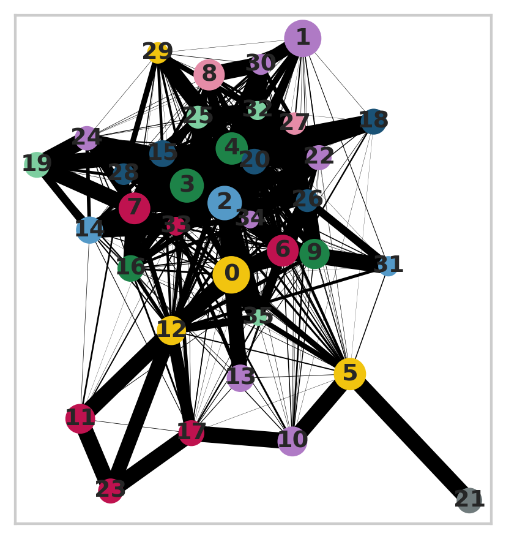


```
bus_fs_clus
```


    AnnData object with n_obs × n_vars = 13673 × 8696
        obs: 'batch', 'n_counts', 'n_countslog', 'louvain', 'leiden', 'orgID', 'fed', 'starved', 'fed_neighbor_score', 'cellRanger_louvain', 'annos', 'new_cellRanger_louvain', 'annosSub'
        var: 'n_counts', 'mean', 'std'
        uns: 'annosSub_colors', 'annos_colors', 'cellRanger_louvain_colors', 'cellRanger_louvain_sizes', "dendrogram_['new_cellRanger_louvain']", 'dendrogram_new_cellRanger_louvain', 'fed_colors', 'fed_neighbor_score_colors', 'leiden', 'leiden_colors', 'louvain', 'louvain_colors', 'neighbors', 'new_cellRanger_louvain_colors', 'orgID_colors', 'paga', 'pca', 'rank_genes_groups', 'umap'
        obsm: 'X_nca', 'X_pca', 'X_tsne', 'X_umap'
        varm: 'PCs'
        obsp: 'connectivities', 'distances'


```
# Add fed_neighbor_score to adata
# bus_fs_clus.obs['fed_neighbor_score'] = neighborScores(bus_fs_clus,'True') #Uncomment to run
```


```
#Exact parameters for umap embedding below
#sc.tl.umap(bus_fs_clus,random_state=42,spread=2.5,min_dist = 0.8,init_pos='paga') #min_dist=0.5,spread=3,   min_dist=0.3

#sc.pl.umap(bus_fs_clus,color=['annos'])
sc.pl.umap(bus_fs_clus,color=['n_countslog'],color_map='viridis')
```


```
#Change colormap range
rgb_list = [tuple([67/256,114/256,196/256]),tuple([237/256,125/256,49/256])]
float_list = list(np.linspace(0,1,len(rgb_list)))

cdict = dict()
for num, col in enumerate(['red','green','blue']):
  col_list = [[float_list[i],rgb_list[i][num],rgb_list[i][num]] for i in range(len(float_list))]
  cdict[col] = col_list

cmp = mcolors.LinearSegmentedColormap('starv',segmentdata=cdict,N=256)
```


```
sc.pl.umap(bus_fs_clus,color=['fed_neighbor_score'],color_map=cmp,save='score.pdf')
```

    WARNING: saving figure to file figures/umapscore.pdf


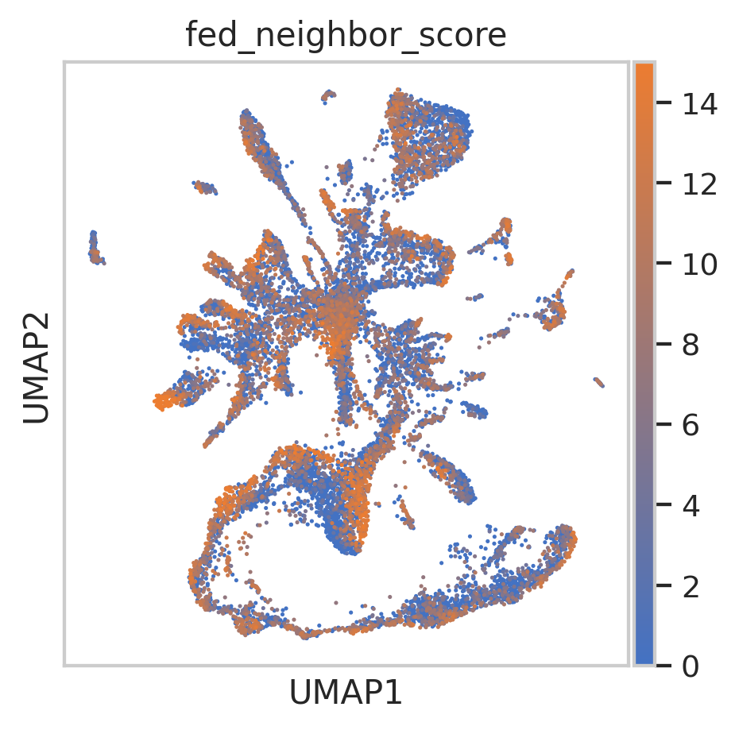


```
bus_fs_clus.obs['Individual'] = pd.Categorical(bus_fs_clus.obs['orgID'])
bus_fs_clus.obs['Individual'].cat.categories
```


    Index(['1', '2', '3', '4', '5', '6', '7', '8', '9', '10'], dtype='object')


```
bus_fs_clus.uns['Individual_colors'] = np.array(['#B00005','#8F5DFD','#FED354',
                                                 '#7D98D3','#FD4F53','#5FA137',
                                                 '#F0A171','#BBD9BB','#D18085',
                                                 '#16A53F'])
```


```
#Assign color to orgIDs
sc.pl.umap(bus_fs_clus,color=['Individual'],save='orgID.pdf')
```

    WARNING: saving figure to file figures/umaporgID.pdf


####**How Cluster/Cell Type Labels are Assigned**


```
#Defining the eight main classes

def annotateLouvain(bus_fs_clus):
  cluster_types = []
  
  for i in bus_fs_clus.obs_names:

    if bus_fs_clus[i,:].obs['cellRanger_louvain'][0] in [35,13,2,0]:
      cluster_types += ['Stem Cell/Germ Cell']
    elif bus_fs_clus[i,:].obs['cellRanger_louvain'][0] in [12,11,23,17]:
      cluster_types += ['Nematocyte']
    elif bus_fs_clus[i,:].obs['cellRanger_louvain'][0] in [5,10,21]:
      cluster_types += ['Mechanosensory']
    elif bus_fs_clus[i,:].obs['cellRanger_louvain'][0] in [6,9,26,31]:
      cluster_types += ['Neural']
    elif bus_fs_clus[i,:].obs['cellRanger_louvain'][0] in [34,22,27,32,25]:
      cluster_types += ['Gland Cell']
    elif bus_fs_clus[i,:].obs['cellRanger_louvain'][0] in [3,7,14,15,19,24,16,33]:
      cluster_types += ['Gastroderm']
    elif bus_fs_clus[i,:].obs['cellRanger_louvain'][0] in [28]:
      cluster_types += ['Bioluminescent Cells']
    elif bus_fs_clus[i,:].obs['cellRanger_louvain'][0] in [1,4,29,18,8,30,20]:
      cluster_types += ['Epidermal/Muscle']
    
    
  bus_fs_clus.obs['annos'] = pd.Categorical(cluster_types)

annotateLouvain(bus_fs_clus)
bus_fs_clus
```


    AnnData object with n_obs × n_vars = 13673 × 8696
        obs: 'batch', 'n_counts', 'n_countslog', 'louvain', 'leiden', 'orgID', 'fed', 'starved', 'fed_neighbor_score', 'cellRanger_louvain', 'annos', 'new_cellRanger_louvain', 'annosSub'
        var: 'n_counts', 'mean', 'std'
        uns: 'annosSub_colors', 'annos_colors', 'cellRanger_louvain_colors', 'cellRanger_louvain_sizes', "dendrogram_['new_cellRanger_louvain']", 'dendrogram_new_cellRanger_louvain', 'fed_colors', 'fed_neighbor_score_colors', 'leiden', 'leiden_colors', 'louvain', 'louvain_colors', 'neighbors', 'new_cellRanger_louvain_colors', 'orgID_colors', 'paga', 'pca', 'rank_genes_groups', 'umap'
        obsm: 'X_nca', 'X_pca', 'X_tsne', 'X_umap'
        varm: 'PCs'
        obsp: 'connectivities', 'distances'


```
bus_fs_clus.obs["annos"].cat.categories
```


    Index(['Bioluminescent Cells', 'Epidermal/Muscle', 'Gastroderm', 'Gland Cell',
           'Mechanosensory', 'Nematocyte', 'Neural', 'Stem Cell/Germ Cell'],
          dtype='object')


```
bus_fs_clus.uns['annos_colors'] = ['#707B7C','#AF7AC5','#BF124F','#1A5276','#5499C7','#1D8348','#7DCEA0','#F1C40F']

```


```
sc.pl.umap(bus_fs_clus,color="annos")
```


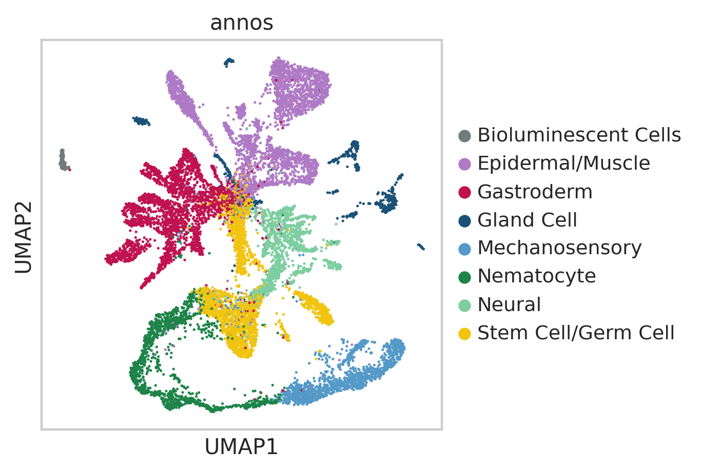


```
#Get colors for broad class annotations, and apply colors to 36 subclusters
colors = bus_fs_clus.uns['annos_colors']
colorsCellR = bus_fs_clus.uns['cellRanger_louvain_colors']

annos_names = bus_fs_clus.obs["annos"].cat.categories
cellR_names = bus_fs_clus.obs["cellRanger_louvain"].cat.categories

annos_dict = {}
annos_dict['Stem Cell/Germ Cell'] = [35,13,2,0]
annos_dict['Nematocyte'] = [12,11,23,17]
annos_dict['Mechanosensory'] = [5,10,21]
annos_dict['Neural'] = [6,9,26,31]
annos_dict['Gland Cell'] = [34,22,27,32,25]
annos_dict['Gastroderm'] = [3,7,14,15,19,24,16,33]
annos_dict['Bioluminescent Cells'] = [28]
annos_dict['Epidermal/Muscle'] = [1,4,29,18,8,30,20]

#annos_dict
```


```
#Update 36 Louvain cluster colors with main class colors
for n in annos_names:
  pos = annos_dict[n]
  for p in pos:
    #
    pos_2 = np.where(annos_names == n)[0][0]
    colorsCellR[p] = colors[pos_2]

#colorsCellR
colorsCopy = colorsCellR.copy()
```


```
#Append color information to adata
bus_fs_clus.obs['new_cellRanger_louvain'] = bus_fs_clus.obs['cellRanger_louvain']
bus_fs_clus.uns['new_cellRanger_louvain_colors'] = colorsCellR

#Convert labels to string format for plotting - and update order of colors
#Make dictionary with cellRanger_louvain 36 clusters and new names --> new_cellRanger_louvain
bus_fs_clus.obs['new_cellRanger_louvain'] = [str(i) for i in bus_fs_clus.obs['new_cellRanger_louvain']]
bus_fs_clus.obs['new_cellRanger_louvain'] = pd.Categorical(bus_fs_clus.obs['new_cellRanger_louvain'])

new_cats = bus_fs_clus.obs['new_cellRanger_louvain'].cat.categories

new_colors = bus_fs_clus.uns['new_cellRanger_louvain_colors']
for i in range(0,len(new_cats)):
  new_colors[i] = colorsCopy[int(new_cats[i])]

bus_fs_clus.uns['new_cellRanger_louvain_colors'] = new_colors

#Create dendrogram for subclusters
sc.tl.dendrogram(bus_fs_clus,'new_cellRanger_louvain',linkage_method='ward')


bus_fs_clus.uns["dendrogram_new_cellRanger_louvain"] = bus_fs_clus.uns["dendrogram_['new_cellRanger_louvain']"]


```


```
bus_fs_clus.uns['new_cellRanger_louvain_colors']
```


    array(['#F1C40F', '#AF7AC5', '#5499C7', '#1D8348', '#1D8348', '#F1C40F',
           '#BF124F', '#BF124F', '#BF124F', '#1D8348', '#AF7AC5', '#BF124F',
           '#F1C40F', '#AF7AC5', '#5499C7', '#1A5276', '#1D8348', '#BF124F',
           '#1A5276', '#7DCEA0', '#1A5276', '#707B7C', '#AF7AC5', '#BF124F',
           '#AF7AC5', '#7DCEA0', '#1A5276', '#BF124F', '#1A5276', '#F1C40F',
           '#AF7AC5', '#5499C7', '#7DCEA0', '#BF124F', '#AF7AC5', '#7DCEA0'],
          dtype=object)


```
#Make plot for 8 broad classes of cell types
colors = bus_fs_clus.uns['annos_colors']
colors
fig, ax = plt.subplots(figsize=(10,10))

c = np.unique(bus_fs_clus.obs["annos"].values)
cmap = [i+'70' for i in colors]#plt.cm.get_cmap("tab20")


names = c

for idx, (cluster, name) in enumerate(zip(c, names)):
    XX = bus_fs_clus[bus_fs_clus.obs.annos == cluster,:].obsm["X_umap"]
    
    x = XX[:,0]
    y = XX[:,1]
    ax.scatter(x, y, color = cmap[idx], label=cluster,s=5)
    if name == 'Bioluminescent Cells':
      ax.annotate(name, 
                  (np.median(x)+7, np.median(y)),
                  horizontalalignment='center',
                  verticalalignment='bottom',
                  size=14, weight='bold',
                  color="black",
                  backgroundcolor=cmap[idx])
    else:
      ax.annotate(name, 
                  (np.median(x), np.median(y)),
                  horizontalalignment='center',
                  verticalalignment='bottom',
                  size=14, weight='bold',
                  color="black",
                  backgroundcolor=cmap[idx])
 
ax.set_xlabel('UMAP1')
ax.set_ylabel('UMAP2')
ax.grid(False)
ax.get_xaxis().set_ticks([])
ax.get_yaxis().set_ticks([])
for edge_i in ['bottom','left']:
    ax.spines[edge_i].set_edgecolor("black")
for edge_i in ['top', 'right']:
    ax.spines[edge_i].set_edgecolor("white")

plt.savefig('broadAtlas.pdf') 
plt.show()
 
```


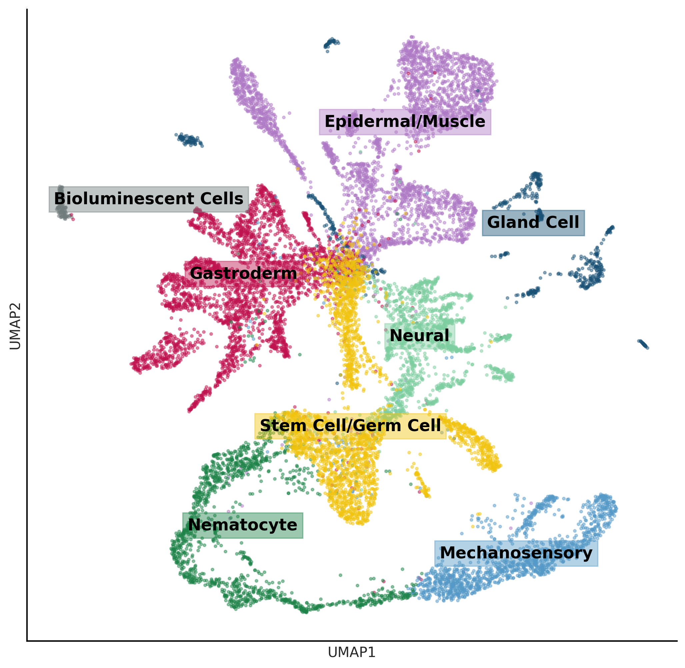


```
#Names for all 36 clusters/cell types
def annotateLouvainSub(bus_fs_clus):
  cluster_types = []
  
  for i in bus_fs_clus.obs_names:

    if bus_fs_clus[i,:].obs['cellRanger_louvain'][0] in [12]:
      cluster_types += ['Nematocyte Precursors']
    elif bus_fs_clus[i,:].obs['cellRanger_louvain'][0] in [17]:
      cluster_types += ['Maturing/mature Nematocytes']
    elif bus_fs_clus[i,:].obs['cellRanger_louvain'][0] in [11]:
      cluster_types += ['Early Nematocytes']
    elif bus_fs_clus[i,:].obs['cellRanger_louvain'][0] in [23]:
      cluster_types += ['Late Nematocytes']
    elif bus_fs_clus[i,:].obs['cellRanger_louvain'][0] in [2]:
      cluster_types += ['Medium Oocytes']
    elif bus_fs_clus[i,:].obs['cellRanger_louvain'][0] in [13]:
      cluster_types += ['Small Oocytes']

    elif bus_fs_clus[i,:].obs['cellRanger_louvain'][0] in [7]:
      cluster_types += ['GastroDigestive-B']
    elif bus_fs_clus[i,:].obs['cellRanger_louvain'][0] in [15]:
      cluster_types += ['GastroDigestive-D']
    elif bus_fs_clus[i,:].obs['cellRanger_louvain'][0] in [3]:
      cluster_types += ['GastroDigestive-A']
    elif bus_fs_clus[i,:].obs['cellRanger_louvain'][0] in [14]:
      cluster_types += ['GastroDigestive-C']
    elif bus_fs_clus[i,:].obs['cellRanger_louvain'][0] in [19]:
      cluster_types += ['GastroDigestive-E']
    elif bus_fs_clus[i,:].obs['cellRanger_louvain'][0] in [24]:
      cluster_types += ['GastroDigestive-F']


    elif bus_fs_clus[i,:].obs['cellRanger_louvain'][0] in [5]:
      cluster_types += ['Mechanosensory Cells Early Stages']
    elif bus_fs_clus[i,:].obs['cellRanger_louvain'][0] in [10]:
      cluster_types += ['Mechanosensory Cells-A']
    elif bus_fs_clus[i,:].obs['cellRanger_louvain'][0] in [21]:
      cluster_types += ['Mechanosensory Cells-B']

    elif bus_fs_clus[i,:].obs['cellRanger_louvain'][0] in [0]:
      cluster_types += ['i-Cells']
    elif bus_fs_clus[i,:].obs['cellRanger_louvain'][0] in [1]:
      cluster_types += ['Exumbrella Epidermis']
    elif bus_fs_clus[i,:].obs['cellRanger_louvain'][0] in [4]:
      cluster_types += ['Manubrium Epidermis']

    elif bus_fs_clus[i,:].obs['cellRanger_louvain'][0] in [6]:
      cluster_types += ['Neural Cells Early Stages']
    elif bus_fs_clus[i,:].obs['cellRanger_louvain'][0] in [9]:
      cluster_types += ['Neural Cells-A (incl. GLWa, MIH cells)']
    elif bus_fs_clus[i,:].obs['cellRanger_louvain'][0] in [26]:
      cluster_types += ['Neural Cells-B (incl. RFamide cells)']
    elif bus_fs_clus[i,:].obs['cellRanger_louvain'][0] in [31]:
      cluster_types += ['Neural Cells-C (incl. YFamide cells)']

    elif bus_fs_clus[i,:].obs['cellRanger_louvain'][0] in [8]:
      cluster_types += ['Striated Muscle of Subumbrella']
    elif bus_fs_clus[i,:].obs['cellRanger_louvain'][0] in [16]:
      cluster_types += ['Tentacle Bulb Distal Gastroderm']
    elif bus_fs_clus[i,:].obs['cellRanger_louvain'][0] in [18]:
      cluster_types += ['Radial Smooth Muscles']
    elif bus_fs_clus[i,:].obs['cellRanger_louvain'][0] in [20]:
      cluster_types += ['Tentacle Epidermis']
    elif bus_fs_clus[i,:].obs['cellRanger_louvain'][0] in [22]:
      cluster_types += ['Gland Cells-A']
    elif bus_fs_clus[i,:].obs['cellRanger_louvain'][0] in [25]:
      cluster_types += ['Gland Cells-C']
    elif bus_fs_clus[i,:].obs['cellRanger_louvain'][0] in [27]:
      cluster_types += ['Gland Cells-B']
    elif bus_fs_clus[i,:].obs['cellRanger_louvain'][0] in [28]:
      cluster_types += ['Tentacle GFP Cells']
    elif bus_fs_clus[i,:].obs['cellRanger_louvain'][0] in [29]:
      cluster_types += ['Gonad Epidermis']
    elif bus_fs_clus[i,:].obs['cellRanger_louvain'][0] in [30]:
      cluster_types += ['Striated Muscle of Velum']
    elif bus_fs_clus[i,:].obs['cellRanger_louvain'][0] in [32]:
      cluster_types += ['Gland Cells-D']
    elif bus_fs_clus[i,:].obs['cellRanger_louvain'][0] in [33]:
      cluster_types += ['Endodermal Plate']
    elif bus_fs_clus[i,:].obs['cellRanger_louvain'][0] in [34]:
      cluster_types += ['Gland Cells-E']
    elif bus_fs_clus[i,:].obs['cellRanger_louvain'][0] in [35]:
      cluster_types += ['Very Early Oocytes']
    
  bus_fs_clus.obs['annosSub'] = pd.Categorical(cluster_types)

annotateLouvainSub(bus_fs_clus)
bus_fs_clus
```


```
sc.pl.umap(bus_fs_clus,color='annosSub')
```


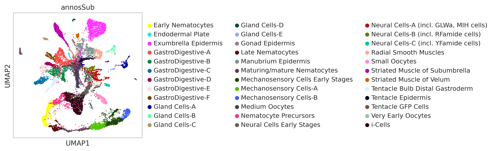


```
colors = bus_fs_clus.uns['annosSub_colors']
colors
fig, ax = plt.subplots(figsize=(10,10))

c = np.unique(bus_fs_clus.obs["cellRanger_louvain"].values)
cmap = [i+'70' for i in colors]


names = c

for idx, (cluster, name) in enumerate(zip(c, names)):
    XX = bus_fs_clus[bus_fs_clus.obs.cellRanger_louvain.isin([cluster]),:].obsm["X_umap"]
    text = list(bus_fs_clus[bus_fs_clus.obs.cellRanger_louvain.isin([cluster]),:].obs.annosSub)[0]
    x = XX[:,0]
    y = XX[:,1]
    ax.scatter(x, y, color = cmap[idx], label=str(cluster)+': '+text,s=5)
    ax.annotate(name, 
             (np.mean(x), np.mean(y)),
             horizontalalignment='center',
             verticalalignment='bottom',
             size=20, weight='bold',
             color="black",
               backgroundcolor=cmap[idx]) 
    

ax.legend(loc='center left',bbox_to_anchor=(1, 0.5),prop={'size': 10},frameon=False)
ax.set_axis_off()
#plt.savefig('36ClusAtlas.pdf')  
plt.show()

```


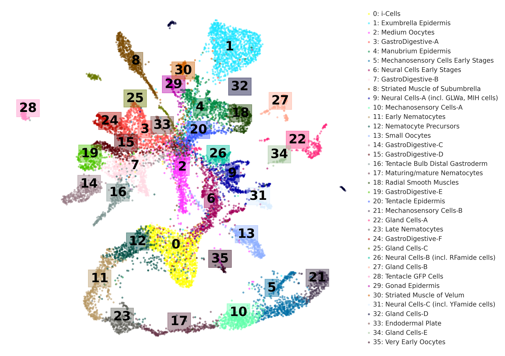


```
# This is the saved output used in the notebook
bus_fs_clus.write('fedStarved_withUMAPPaga.h5ad')
```

#### **Heatmaps for Top Markers**

##### **How marker genes are selected and annotated for the 36 cell types**


```
#Get top n marker genes for each cluster

#Keep top 100 genes, 'louvain_neur' is label for neuron clusters determined using Louvain clustering algorithm
sc.tl.rank_genes_groups(bus_fs_clus, 'cellRanger_louvain',n_genes = 100,method='wilcoxon') #Using non-parametric test for significance
```


```
#Make dataframe, with 100 marker genes for each cluster + annotations
clusters = np.unique(bus_fs_clus.obs['cellRanger_louvain'])
markers = pd.DataFrame()

clus = []
markerGene = []
padj = []
orthoGene = []
orthoDescr = []

pantherNum = []
pantherDescr = []

goTerms = []

for i in clusters:
  genes = bus_fs_clus.uns['rank_genes_groups']['names'][str(i)]

  clus += list(np.repeat(i,len(genes)))
  markerGene += list(genes)
  padj += list(bus_fs_clus.uns['rank_genes_groups']['pvals_adj'][str(i)])

  for g in genes:
        
    sub_df = hg_ortho_df[hg_ortho_df.XLOC.isin([g])]
    panth_df = panther_df[panther_df[0].isin([g])]
    go_df = goTerm_df[goTerm_df[0].isin([g])]

    if len(sub_df) > 0:
      #Save first result for gene/description
      orthoGene += [list(sub_df.Gene)[0]]
      orthoDescr += [list(sub_df.Description)[0]]
    else:
      orthoGene += ['NA']
      orthoDescr += ['NA']


    if len(panth_df) > 0:
      pantherNum += [list(panth_df[1])]
      pantherDescr += [list(panth_df[2])]
    else:
      pantherNum += ['NA']
      pantherDescr += ['NA']


    if len(go_df) > 0:
      goTerms += [list(go_df[1])]
    else:
      goTerms += ['NA']
 

markers['clus'] = clus
markers['markerGene'] = markerGene
markers['padj'] = padj

markers['orthoGene'] = orthoGene
markers['orthoDescr'] = orthoDescr

markers['pantherID'] = pantherNum
markers['pantherDescr'] = pantherDescr

markers['goTerms'] = goTerms
     
markers.head()
#list(neurons.uns['rank_genes_groups']['names']['1'])


```


<div>
<style scoped>
    .dataframe tbody tr th:only-of-type {
        vertical-align: middle;
    }

    .dataframe tbody tr th {
        vertical-align: top;
    }

    .dataframe thead th {
        text-align: right;
    }
</style>
<table border="1" class="dataframe">
  <thead>
    <tr style="text-align: right;">
      <th></th>
      <th>clus</th>
      <th>markerGene</th>
      <th>padj</th>
      <th>orthoGene</th>
      <th>orthoDescr</th>
      <th>pantherID</th>
      <th>pantherDescr</th>
      <th>goTerms</th>
    </tr>
  </thead>
  <tbody>
    <tr>
      <th>0</th>
      <td>0</td>
      <td>XLOC_010813</td>
      <td>0.0</td>
      <td>DDX39B</td>
      <td>spliceosome RNA helicase DDX39B [Homo sapiens]</td>
      <td>[PTHR47958:SF10]</td>
      <td>[ATP-DEPENDENT RNA HELICASE DDX39A]</td>
      <td>[GO:0015931,GO:0051169,GO:0006807,GO:0030529,G...</td>
    </tr>
    <tr>
      <th>1</th>
      <td>0</td>
      <td>XLOC_043536</td>
      <td>0.0</td>
      <td>CCT7</td>
      <td>T-complex protein 1 subunit eta isoform a [Ho...</td>
      <td>[PTHR11353:SF22]</td>
      <td>[T-COMPLEX PROTEIN 1 SUBUNIT ETA]</td>
      <td>[GO:0019538,GO:0044238,GO:0006461,GO:0006457,G...</td>
    </tr>
    <tr>
      <th>2</th>
      <td>0</td>
      <td>XLOC_008430</td>
      <td>0.0</td>
      <td>PA2G4</td>
      <td>proliferation-associated protein 2G4 [Homo sa...</td>
      <td>[PTHR10804:SF11]</td>
      <td>[PROLIFERATION-ASSOCIATED PROTEIN 2G4]</td>
      <td>[GO:0016787,GO:0044238,GO:0008152,GO:0006508,G...</td>
    </tr>
    <tr>
      <th>3</th>
      <td>0</td>
      <td>XLOC_017967</td>
      <td>0.0</td>
      <td>NA</td>
      <td>NA</td>
      <td>NA</td>
      <td>NA</td>
      <td>[nan]</td>
    </tr>
    <tr>
      <th>4</th>
      <td>0</td>
      <td>XLOC_000657</td>
      <td>0.0</td>
      <td>RPS12</td>
      <td>40S ribosomal protein S12 [Homo sapiens]</td>
      <td>[PTHR11843:SF19]</td>
      <td>[40S RIBOSOMAL PROTEIN S12]</td>
      <td>[GO:0005737,GO:0005622,GO:0032991,GO:0005840,G...</td>
    </tr>
  </tbody>
</table>
</div>


```
#Write to csv
markers.to_csv('fs_marker_annotations.csv')

#Read in csv (previously saved version, uploaded to Box)
markers = pd.read_csv('fs_marker_annotations.csv',
            sep=",")
markers.head()
```


<div>
<style scoped>
    .dataframe tbody tr th:only-of-type {
        vertical-align: middle;
    }

    .dataframe tbody tr th {
        vertical-align: top;
    }

    .dataframe thead th {
        text-align: right;
    }
</style>
<table border="1" class="dataframe">
  <thead>
    <tr style="text-align: right;">
      <th></th>
      <th>Unnamed: 0</th>
      <th>clus</th>
      <th>markerGene</th>
      <th>padj</th>
      <th>orthoGene</th>
      <th>orthoDescr</th>
      <th>pantherID</th>
      <th>pantherDescr</th>
      <th>goTerms</th>
    </tr>
  </thead>
  <tbody>
    <tr>
      <th>0</th>
      <td>0</td>
      <td>0</td>
      <td>XLOC_010813</td>
      <td>0.0</td>
      <td>DDX39B</td>
      <td>spliceosome RNA helicase DDX39B [Homo sapiens]</td>
      <td>['PTHR24031:SF521']</td>
      <td>['SPLICEOSOME RNA HELICASE DDX39B']</td>
      <td>['GO:0015931,GO:0051169,GO:0006807,GO:0030529,...</td>
    </tr>
    <tr>
      <th>1</th>
      <td>1</td>
      <td>0</td>
      <td>XLOC_043536</td>
      <td>0.0</td>
      <td>CCT7</td>
      <td>T-complex protein 1 subunit eta isoform a [Ho...</td>
      <td>['PTHR11353:SF139']</td>
      <td>['T-COMPLEX PROTEIN 1 SUBUNIT ETA']</td>
      <td>['GO:0019538,GO:0044238,GO:0006461,GO:0006457,...</td>
    </tr>
    <tr>
      <th>2</th>
      <td>2</td>
      <td>0</td>
      <td>XLOC_008430</td>
      <td>0.0</td>
      <td>PA2G4</td>
      <td>proliferation-associated protein 2G4 [Homo sa...</td>
      <td>['PTHR10804:SF125']</td>
      <td>['PROLIFERATION-ASSOCIATED 2G4 ,B']</td>
      <td>['GO:0016787,GO:0044238,GO:0008152,GO:0006508,...</td>
    </tr>
    <tr>
      <th>3</th>
      <td>3</td>
      <td>0</td>
      <td>XLOC_017967</td>
      <td>0.0</td>
      <td>NaN</td>
      <td>NaN</td>
      <td>NaN</td>
      <td>NaN</td>
      <td>[nan]</td>
    </tr>
    <tr>
      <th>4</th>
      <td>4</td>
      <td>0</td>
      <td>XLOC_000657</td>
      <td>0.0</td>
      <td>RPS12</td>
      <td>40S ribosomal protein S12 [Homo sapiens]</td>
      <td>['PTHR11843:SF5']</td>
      <td>['40S RIBOSOMAL PROTEIN S12']</td>
      <td>['GO:0005737,GO:0005622,GO:0032991,GO:0005840,...</td>
    </tr>
  </tbody>
</table>
</div>


```
topGenes = []
clusts = []
names = []
var_groups = []
var_labels = []

top5 = pd.DataFrame()

ind = 0
n_genes = 5
for j in np.unique(markers.clus):
  sub = markers[markers.clus == j]
  sub.sort_values(by='padj',ascending=True)

  noDups = [i for i in sub.markerGene if i not in topGenes] #Remove duplicate genes
  topGenes += list(noDups[0:n_genes])
  clusts += [j]*n_genes


top5['marker'] = topGenes
top5['clus'] = clusts

top5.to_csv('top5markersAtlas.csv')

  
```

##### **Read in saved markers for figure**


```
#List of top markers for Figure 2, from subset of top5markers
topMarkers = pd.read_csv('D1.1809',sep=",")
topMarkers.head()
```


<div>
<style scoped>
    .dataframe tbody tr th:only-of-type {
        vertical-align: middle;
    }

    .dataframe tbody tr th {
        vertical-align: top;
    }

    .dataframe thead th {
        text-align: right;
    }
</style>
<table border="1" class="dataframe">
  <thead>
    <tr style="text-align: right;">
      <th></th>
      <th>clus</th>
      <th>markerGene</th>
      <th>annot</th>
      <th>orthoGene</th>
      <th>orthoDescr</th>
      <th>pantherID</th>
      <th>pantherDescr</th>
      <th>source</th>
    </tr>
  </thead>
  <tbody>
    <tr>
      <th>0</th>
      <td>0</td>
      <td>XLOC_010813</td>
      <td>DDX39A/B</td>
      <td>DDX39B</td>
      <td>spliceosome RNA helicase DDX39B [Homo sapiens]</td>
      <td>['PTHR24031:SF521']</td>
      <td>['SPLICEOSOME RNA HELICASE DDX39B']</td>
      <td></td>
    </tr>
    <tr>
      <th>1</th>
      <td>0</td>
      <td>XLOC_008430</td>
      <td>PA2G4</td>
      <td>PA2G4</td>
      <td>proliferation-associated protein 2G4 [Homo sa...</td>
      <td>['PTHR10804:SF125']</td>
      <td>['PROLIFERATION-ASSOCIATED 2G4 ,B']</td>
      <td></td>
    </tr>
    <tr>
      <th>2</th>
      <td>1</td>
      <td>XLOC_016073</td>
      <td>ZP-containing-1</td>
      <td>NaN</td>
      <td>NaN</td>
      <td>['PTHR11576']</td>
      <td>['ZONA PELLUCIDA SPERM-BINDING PROTEIN 3']</td>
      <td></td>
    </tr>
    <tr>
      <th>3</th>
      <td>2</td>
      <td>XLOC_006164</td>
      <td>FMN-reductiase</td>
      <td>NaN</td>
      <td>NaN</td>
      <td>['PTHR30543:SF12']</td>
      <td>['NAD(P)H-DEPENDENT FMN REDUCTASE LOT6']</td>
      <td></td>
    </tr>
    <tr>
      <th>4</th>
      <td>3</td>
      <td>XLOC_013735</td>
      <td>Innexin-like</td>
      <td>NaN</td>
      <td>NaN</td>
      <td>['PTHR11893:SF41']</td>
      <td>['INNEXIN INX7']</td>
      <td></td>
    </tr>
  </tbody>
</table>
</div>


```
topMarkers = topMarkers[0:51]
```


```
topGenes = []
names = []
var_groups = []
var_labels = []
ind = 0

#Add cell type labels for gene markers
for i in np.unique(topMarkers.clus):
  sub = topMarkers[topMarkers.clus == i]


  topGenes += list(sub.markerGene)
  names += list(sub.annot)

  var_groups += [(ind,ind+len(list(sub.annot))-1)]
  var_labels += [str(int(i))] 
  ind += len(list(sub.annot))
```


```
#Add to raw data so any genes can be plotted
#Kallisto bus h5ad file with no gene filtering 
bus_fs_raw = anndata.read("D1.1797")
print(bus_fs_raw )

sc.pp.filter_cells(bus_fs_raw, min_counts=0) #1
sc.pp.filter_genes(bus_fs_raw, min_counts=0)

bus_fs_raw.obs['new_cellRanger_louvain'] = bus_fs_clus.obs['new_cellRanger_louvain']
bus_fs_raw.uns["dendrogram_new_cellRanger_louvain"] = bus_fs_clus.uns["dendrogram_new_cellRanger_louvain"]
bus_fs_raw.uns['new_cellRanger_louvain_colors'] = bus_fs_clus.uns['new_cellRanger_louvain_colors']
bus_fs_raw.obs['fed'] = pd.Categorical(bus_fs_clus.obs['fed'])
bus_fs_raw.obs['cellRanger_louvain'] = pd.Categorical(bus_fs_clus.obs['cellRanger_louvain'])


```

    AnnData object with n_obs × n_vars = 13673 × 46716
        obs: 'batch'


```
#Plot data with names attached to gene XLOCs
toPlot = bus_fs_raw[:,topGenes]
toPlot.var['names'] = names

sc.pp.log1p(toPlot)
```

    Trying to set attribute `.var` of view, copying.


```
#Subsample for clusters > 100 in size
#Subsample from full dataset, across each cluster
def subSample(adata):
  groups = np.unique(adata.obs['cellRanger_louvain'])
  subSample = 100
  cellNames = np.array(adata.obs_names)

  allCells = []
  for i in groups:
      
      cells = np.array(list(adata.obs['cellRanger_louvain'].isin([i])))
      cellLocs = list(np.where(cells)[0])
      
      if len(cellLocs) > 100:
      #Take all cells if < subSample
        choice = random.sample(cellLocs,subSample)
      else:
        choice = cellLocs
     
      pos = list(choice)
      #print(len(pos))
      
      allCells += list(cellNames[pos])

      
  sub = adata[allCells,:]
  return sub

```


```
toPlotSub = subSample(toPlot)
toPlotSub
```


    View of AnnData object with n_obs × n_vars = 3404 × 51
        obs: 'batch', 'n_counts', 'new_cellRanger_louvain', 'fed', 'cellRanger_louvain'
        var: 'n_counts', 'names'
        uns: 'dendrogram_new_cellRanger_louvain', 'new_cellRanger_louvain_colors', 'log1p'


```
bus_fs_raw.uns['new_cellRanger_louvain_colors']
```


    array(['#F1C40F', '#AF7AC5', '#5499C7', '#1D8348', '#1D8348', '#F1C40F',
           '#BF124F', '#BF124F', '#BF124F', '#1D8348', '#AF7AC5', '#BF124F',
           '#F1C40F', '#AF7AC5', '#5499C7', '#1A5276', '#1D8348', '#BF124F',
           '#1A5276', '#7DCEA0', '#1A5276', '#707B7C', '#AF7AC5', '#BF124F',
           '#AF7AC5', '#7DCEA0', '#1A5276', '#BF124F', '#1A5276', '#F1C40F',
           '#AF7AC5', '#5499C7', '#7DCEA0', '#BF124F', '#AF7AC5', '#7DCEA0'],
          dtype=object)


```
sc.set_figure_params(scanpy=True, fontsize=30,dpi=150)
#bus_fs_clus.obs['cellRanger_louvain'] =  pd.Categorical([str(i) for i in bus_fs_clus.obs['cellRanger_louvain']])
sc.pl.heatmap(toPlotSub, names, groupby='new_cellRanger_louvain', dendrogram=True,show_gene_labels=True,
              var_group_positions=var_groups,var_group_labels=var_labels,cmap='PuBuGn',gene_symbols='names',
              standard_scale='var',use_raw=False,swap_axes=True,figsize = (30,30),save='cellAtlas.pdf')
```

    WARNING: saving figure to file figures/heatmapcellAtlas.pdf


####**DE Gene Analysis Across Clusters (After Extracting Perturbed Genes)**


```
#Remove clusters with < 10 cells per condition

#Read in previously saved data
bus_fs_clus = anndata.read("D1.1796")
print(bus_fs_clus )

bus_fs_raw = anndata.read("D1.1797")

bus_fs_raw = bus_fs_raw[bus_fs_clus.obs_names,]
#bus_fs_raw.obs['orgID'] = bus_fs_clus.obs['orgID']
bus_fs_raw.obs['fed'] = bus_fs_clus.obs['fed']
bus_fs_raw.obs['cellRanger_louvain'] = bus_fs_clus.obs['cellRanger_louvain']
bus_fs_raw


#clusSize
```

    Trying to set attribute `.obs` of view, copying.


    AnnData object with n_obs × n_vars = 13673 × 8696
        obs: 'batch', 'n_counts', 'n_countslog', 'louvain', 'leiden', 'orgID', 'fed', 'starved', 'fed_neighbor_score', 'cellRanger_louvain', 'annos', 'new_cellRanger_louvain', 'annosSub'
        var: 'n_counts', 'mean', 'std'
        uns: 'annosSub_colors', 'annos_colors', 'cellRanger_louvain_colors', 'cellRanger_louvain_sizes', "dendrogram_['new_cellRanger_louvain']", 'dendrogram_new_cellRanger_louvain', 'fed_colors', 'fed_neighbor_score_colors', 'leiden', 'leiden_colors', 'louvain', 'louvain_colors', 'neighbors', 'new_cellRanger_louvain_colors', 'orgID_colors', 'paga', 'pca', 'rank_genes_groups', 'umap'
        obsm: 'X_nca', 'X_pca', 'X_tsne', 'X_umap'
        varm: 'PCs'
        obsp: 'connectivities', 'distances'


    AnnData object with n_obs × n_vars = 13673 × 46716
        obs: 'batch', 'fed', 'cellRanger_louvain'


##### **Cluster DE Genes by Expression and Run TopGO Analysis**

Use output from DeSeq2 analysis in separate notebook: Genes in each cell type with differential expression under starvation


```
deGenesDF = pd.read_csv('D1.1810') #deSeq2_deGenesDF_log2FCof1_singleCellReplicates_noShrinkage_subSample_annotations.csv from DeSeq2 analysis
deGenesDF.head()
```


<div>
<style scoped>
    .dataframe tbody tr th:only-of-type {
        vertical-align: middle;
    }

    .dataframe tbody tr th {
        vertical-align: top;
    }

    .dataframe thead th {
        text-align: right;
    }
</style>
<table border="1" class="dataframe">
  <thead>
    <tr style="text-align: right;">
      <th></th>
      <th>Unnamed: 0</th>
      <th>Unnamed: 0.1</th>
      <th>Unnamed: 0.1.1</th>
      <th>Genes</th>
      <th>Cluster</th>
      <th>Condition</th>
      <th>padj</th>
      <th>padjClus</th>
      <th>log2FC</th>
      <th>orthoGene</th>
      <th>orthoDescr</th>
      <th>pantherID</th>
      <th>pantherDescr</th>
      <th>goTerms</th>
      <th>geneClus</th>
    </tr>
  </thead>
  <tbody>
    <tr>
      <th>0</th>
      <td>0</td>
      <td>0</td>
      <td>1</td>
      <td>XLOC_028699</td>
      <td>0</td>
      <td>Starved</td>
      <td>5.554489e-16</td>
      <td>1.832981e-14</td>
      <td>-1.284301</td>
      <td>NaN</td>
      <td>NaN</td>
      <td>NaN</td>
      <td>NaN</td>
      <td>NaN</td>
      <td>4</td>
    </tr>
    <tr>
      <th>1</th>
      <td>1</td>
      <td>1</td>
      <td>2</td>
      <td>XLOC_010635</td>
      <td>0</td>
      <td>Starved</td>
      <td>2.528288e-14</td>
      <td>8.343350e-13</td>
      <td>-1.492625</td>
      <td>SRSF1</td>
      <td>serine/arginine-rich splicing factor 1 isofor...</td>
      <td>['PTHR24012:SF650']</td>
      <td>['SERINE/ARGININE-RICH SPLICING FACTOR 1']</td>
      <td>[nan]</td>
      <td>4</td>
    </tr>
    <tr>
      <th>2</th>
      <td>2</td>
      <td>2</td>
      <td>3</td>
      <td>XLOC_011294</td>
      <td>0</td>
      <td>Starved</td>
      <td>8.348790e-14</td>
      <td>2.755101e-12</td>
      <td>-1.441413</td>
      <td>NaN</td>
      <td>NaN</td>
      <td>NaN</td>
      <td>NaN</td>
      <td>[nan]</td>
      <td>0</td>
    </tr>
    <tr>
      <th>3</th>
      <td>3</td>
      <td>3</td>
      <td>4</td>
      <td>XLOC_034889</td>
      <td>0</td>
      <td>Starved</td>
      <td>1.786565e-13</td>
      <td>5.895663e-12</td>
      <td>-1.448216</td>
      <td>NaN</td>
      <td>NaN</td>
      <td>['PTHR13680:SF29']</td>
      <td>['CDGSH IRON-SULFUR DOMAIN-CONTAINING PROTEIN ...</td>
      <td>[nan]</td>
      <td>1</td>
    </tr>
    <tr>
      <th>4</th>
      <td>4</td>
      <td>4</td>
      <td>5</td>
      <td>XLOC_030861</td>
      <td>0</td>
      <td>Starved</td>
      <td>8.598653e-12</td>
      <td>2.837556e-10</td>
      <td>-1.570453</td>
      <td>SRSF1</td>
      <td>serine/arginine-rich splicing factor 1 isofor...</td>
      <td>['PTHR24012:SF650']</td>
      <td>['SERINE/ARGININE-RICH SPLICING FACTOR 1']</td>
      <td>[nan]</td>
      <td>4</td>
    </tr>
  </tbody>
</table>
</div>


```
deGenesDF_sig = deGenesDF[deGenesDF.padjClus < 0.05]
```

Cluster gene x cell matrix for 'perturbed' genes


```
#Filter raw count dataset for only perturbed genes
bus_fs_raw = anndata.read("D1.1797")
bus_fs_raw = bus_fs_raw [:,np.unique(deGenesDF_sig.Genes)]
bus_fs_raw =bus_fs_raw[bus_fs_clus.obs_names,:]
bus_fs_raw.obs['cellRanger_louvain'] = bus_fs_clus.obs['cellRanger_louvain']
bus_fs_raw.obs['fed'] = bus_fs_clus.obs['fed']
```

    Trying to set attribute `.obs` of view, copying.


```
de_gene_adata = anndata.AnnData(X=bus_fs_raw.X.T)
de_gene_adata.var_names = bus_fs_raw.obs_names
de_gene_adata.obs_names = bus_fs_raw.var_names

de_gene_adata_orig = de_gene_adata.copy()
#de_gene_adata

numIntersects = deGenesDF['Genes'].value_counts()
num_intersect = []
for g in de_gene_adata.obs_names: 
    if g in list(deGenesDF['Genes']):
      num_intersect += [numIntersects[g]]
    else:
      num_intersect += [0]
    
de_gene_adata.obs['numIntersects'] = pd.Categorical(num_intersect)

#de_gene_adata

de_gene_adata
```


    AnnData object with n_obs × n_vars = 953 × 13673
        obs: 'numIntersects'


```
#Normalize and scale data
sc.pp.filter_genes(de_gene_adata, min_counts=0)

sc.pp.normalize_per_cell(de_gene_adata, counts_per_cell_after=1e4)
de_gene_adata.raw = sc.pp.log1p(de_gene_adata, copy=True)

sc.pp.scale(de_gene_adata, max_value=10)
sc.tl.pca(de_gene_adata, n_comps=60,random_state=42)
#sc.pl.pca_variance_ratio(bus_combo, log=True)

#Determine neighbors for clustering
sc.pp.neighbors(de_gene_adata,n_neighbors=20, n_pcs=15) #n_neighbors=5, n_pcs=15,  20, n_pcs=15
sc.tl.louvain(de_gene_adata,resolution=2)

sc.tl.tsne(de_gene_adata, n_pcs=15,random_state=42)
sc.pl.tsne(de_gene_adata,color=['louvain','numIntersects'])


```

    WARNING: Consider installing the package MulticoreTSNE (https://github.com/DmitryUlyanov/Multicore-TSNE). Even for n_jobs=1 this speeds up the computation considerably and might yield better converged results.


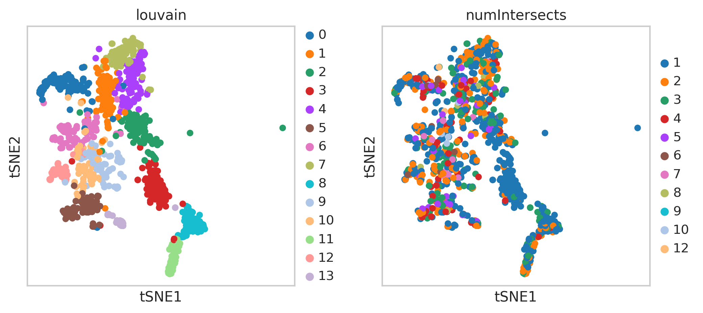


```
sc.tl.tsne(de_gene_adata, n_pcs=10,random_state=42,perplexity=15) #
sc.pl.tsne(de_gene_adata,color=['louvain'])
```

    WARNING: Consider installing the package MulticoreTSNE (https://github.com/DmitryUlyanov/Multicore-TSNE). Even for n_jobs=1 this speeds up the computation considerably and might yield better converged results.


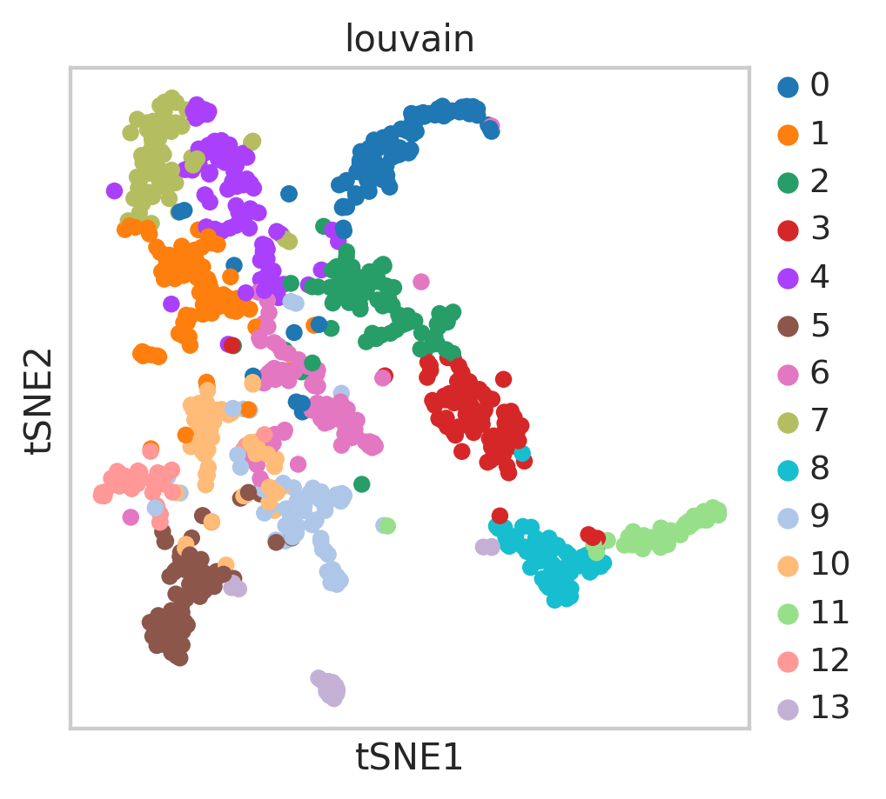


```
# Add which gene modules the pertubed genes are in
clusters = []
for g in deGenesDF.Genes:
  if g in list(de_gene_adata.obs_names):
    clus = de_gene_adata[g,:].obs['louvain'][0]
    clusters += [clus]
  else:
    clusters += ['padjClus_not_sig']

deGenesDF['geneClus'] = clusters
deGenesDF.head()
```


<div>
<style scoped>
    .dataframe tbody tr th:only-of-type {
        vertical-align: middle;
    }

    .dataframe tbody tr th {
        vertical-align: top;
    }

    .dataframe thead th {
        text-align: right;
    }
</style>
<table border="1" class="dataframe">
  <thead>
    <tr style="text-align: right;">
      <th></th>
      <th>Unnamed: 0</th>
      <th>Unnamed: 0.1</th>
      <th>Genes</th>
      <th>Cluster</th>
      <th>Condition</th>
      <th>padj</th>
      <th>padjClus</th>
      <th>log2FC</th>
      <th>orthoGene</th>
      <th>orthoDescr</th>
      <th>pantherID</th>
      <th>pantherDescr</th>
      <th>goTerms</th>
      <th>geneClus</th>
    </tr>
  </thead>
  <tbody>
    <tr>
      <th>0</th>
      <td>0</td>
      <td>1</td>
      <td>XLOC_028699</td>
      <td>0</td>
      <td>Starved</td>
      <td>5.554489e-16</td>
      <td>1.832981e-14</td>
      <td>-1.284301</td>
      <td>NaN</td>
      <td>NaN</td>
      <td>NaN</td>
      <td>NaN</td>
      <td>NaN</td>
      <td>4</td>
    </tr>
    <tr>
      <th>1</th>
      <td>1</td>
      <td>2</td>
      <td>XLOC_010635</td>
      <td>0</td>
      <td>Starved</td>
      <td>2.528288e-14</td>
      <td>8.343350e-13</td>
      <td>-1.492625</td>
      <td>SRSF1</td>
      <td>serine/arginine-rich splicing factor 1 isofor...</td>
      <td>['PTHR24012:SF650']</td>
      <td>['SERINE/ARGININE-RICH SPLICING FACTOR 1']</td>
      <td>[nan]</td>
      <td>4</td>
    </tr>
    <tr>
      <th>2</th>
      <td>2</td>
      <td>3</td>
      <td>XLOC_011294</td>
      <td>0</td>
      <td>Starved</td>
      <td>8.348790e-14</td>
      <td>2.755101e-12</td>
      <td>-1.441413</td>
      <td>NaN</td>
      <td>NaN</td>
      <td>NaN</td>
      <td>NaN</td>
      <td>[nan]</td>
      <td>0</td>
    </tr>
    <tr>
      <th>3</th>
      <td>3</td>
      <td>4</td>
      <td>XLOC_034889</td>
      <td>0</td>
      <td>Starved</td>
      <td>1.786565e-13</td>
      <td>5.895663e-12</td>
      <td>-1.448216</td>
      <td>NaN</td>
      <td>NaN</td>
      <td>['PTHR13680:SF29']</td>
      <td>['CDGSH IRON-SULFUR DOMAIN-CONTAINING PROTEIN ...</td>
      <td>[nan]</td>
      <td>1</td>
    </tr>
    <tr>
      <th>4</th>
      <td>4</td>
      <td>5</td>
      <td>XLOC_030861</td>
      <td>0</td>
      <td>Starved</td>
      <td>8.598653e-12</td>
      <td>2.837556e-10</td>
      <td>-1.570453</td>
      <td>SRSF1</td>
      <td>serine/arginine-rich splicing factor 1 isofor...</td>
      <td>['PTHR24012:SF650']</td>
      <td>['SERINE/ARGININE-RICH SPLICING FACTOR 1']</td>
      <td>[nan]</td>
      <td>4</td>
    </tr>
  </tbody>
</table>
</div>


```
deGenesDF.to_csv('atlas_deSeq2_deGenesDF_log2FCof1_singleCellReplicates_noShrinkage_subSample_annotations.csv')
```


```
deGenesDF = pd.read_csv('D1.1810') 
deGenesDF.head()
```


<div>
<style scoped>
    .dataframe tbody tr th:only-of-type {
        vertical-align: middle;
    }

    .dataframe tbody tr th {
        vertical-align: top;
    }

    .dataframe thead th {
        text-align: right;
    }
</style>
<table border="1" class="dataframe">
  <thead>
    <tr style="text-align: right;">
      <th></th>
      <th>Unnamed: 0</th>
      <th>Unnamed: 0.1</th>
      <th>Unnamed: 0.1.1</th>
      <th>Genes</th>
      <th>Cluster</th>
      <th>Condition</th>
      <th>padj</th>
      <th>padjClus</th>
      <th>log2FC</th>
      <th>orthoGene</th>
      <th>orthoDescr</th>
      <th>pantherID</th>
      <th>pantherDescr</th>
      <th>goTerms</th>
      <th>geneClus</th>
    </tr>
  </thead>
  <tbody>
    <tr>
      <th>0</th>
      <td>0</td>
      <td>0</td>
      <td>1</td>
      <td>XLOC_028699</td>
      <td>0</td>
      <td>Starved</td>
      <td>5.554489e-16</td>
      <td>1.832981e-14</td>
      <td>-1.284301</td>
      <td>NaN</td>
      <td>NaN</td>
      <td>NaN</td>
      <td>NaN</td>
      <td>NaN</td>
      <td>4</td>
    </tr>
    <tr>
      <th>1</th>
      <td>1</td>
      <td>1</td>
      <td>2</td>
      <td>XLOC_010635</td>
      <td>0</td>
      <td>Starved</td>
      <td>2.528288e-14</td>
      <td>8.343350e-13</td>
      <td>-1.492625</td>
      <td>SRSF1</td>
      <td>serine/arginine-rich splicing factor 1 isofor...</td>
      <td>['PTHR24012:SF650']</td>
      <td>['SERINE/ARGININE-RICH SPLICING FACTOR 1']</td>
      <td>[nan]</td>
      <td>4</td>
    </tr>
    <tr>
      <th>2</th>
      <td>2</td>
      <td>2</td>
      <td>3</td>
      <td>XLOC_011294</td>
      <td>0</td>
      <td>Starved</td>
      <td>8.348790e-14</td>
      <td>2.755101e-12</td>
      <td>-1.441413</td>
      <td>NaN</td>
      <td>NaN</td>
      <td>NaN</td>
      <td>NaN</td>
      <td>[nan]</td>
      <td>0</td>
    </tr>
    <tr>
      <th>3</th>
      <td>3</td>
      <td>3</td>
      <td>4</td>
      <td>XLOC_034889</td>
      <td>0</td>
      <td>Starved</td>
      <td>1.786565e-13</td>
      <td>5.895663e-12</td>
      <td>-1.448216</td>
      <td>NaN</td>
      <td>NaN</td>
      <td>['PTHR13680:SF29']</td>
      <td>['CDGSH IRON-SULFUR DOMAIN-CONTAINING PROTEIN ...</td>
      <td>[nan]</td>
      <td>1</td>
    </tr>
    <tr>
      <th>4</th>
      <td>4</td>
      <td>4</td>
      <td>5</td>
      <td>XLOC_030861</td>
      <td>0</td>
      <td>Starved</td>
      <td>8.598653e-12</td>
      <td>2.837556e-10</td>
      <td>-1.570453</td>
      <td>SRSF1</td>
      <td>serine/arginine-rich splicing factor 1 isofor...</td>
      <td>['PTHR24012:SF650']</td>
      <td>['SERINE/ARGININE-RICH SPLICING FACTOR 1']</td>
      <td>[nan]</td>
      <td>4</td>
    </tr>
  </tbody>
</table>
</div>


Run TopGO analysis for gene modules to find GO Term enrichment


```
#For topGO analysis (To Assign Labels to Modules)

def returnVal(i):
  if i == i:
    i= i.replace("[","")
    i = i.replace("]","")
    i= i.replace("'","")
    i = i.replace("'","")
    return i 
  else:
    return 'nan'

deGenesDF.goTerms = [returnVal(i) for i in list(deGenesDF.goTerms)]
deGenesDF = deGenesDF[deGenesDF.goTerms != 'nan']
deGenesDF = deGenesDF[deGenesDF.geneClus != 'padjClus_not_sig']

deGenesDF.to_csv('atlas_deseq2_genes_fortopGO_metadata.txt',sep='\t',columns=['Genes','goTerms','geneClus'],
             header=None,index_label=False,index=False)
deGenesDF.to_csv('atlas_deseq2_genes_fortopGO.txt',sep='\t',columns=['Genes','goTerms'],
             header=None,index_label=False,index=False)
```


```r
%%R 

install.packages('rlang')
if (!requireNamespace("BiocManager", quietly=TRUE)){
  install.packages("BiocManager")
}

BiocManager::install("topGO")

```


```r
%%R

library(topGO)
library(readr)
#Read in DE genes (XLOC's) with GO Terms
geneID2GO <- readMappings(file = "atlas_deseq2_genes_fortopGO.txt")
str(head(geneID2GO ))

#Add gene modules as factor 
atlas_deseq2_genes_fortopGO_metadata <- read_delim("atlas_deseq2_genes_fortopGO_metadata.txt", 
                                                   "\t", escape_double = FALSE, col_names = FALSE, 
                                                   trim_ws = TRUE)

#Set variables
allMods = unique(atlas_deseq2_genes_fortopGO_metadata$X3)
alpha = 0.05/length(allMods) #Bonferroni correction, could correct for all pairwise comparisons?


getEnrichTerms <- function(geneID2GO, modMetadata, clus){
  mods <- factor(as.integer(modMetadata$X3 == clus)) #Choose gene module to make 'interesting'
  names(mods) <- names(geneID2GO)

  
  #Get genes only in module of interest
  clusGenes <- function(mods) {
    return(mods == 1)
  }
  subMods <- clusGenes(mods)
  
  #Make GO data
  GOdata <- new("topGOdata", ontology = "BP", allGenes = mods,
                geneSel = subMods, annot = annFUN.gene2GO, gene2GO = geneID2GO)
  
  #GOdata
  #sigGenes(GOdata)
  
  resultFis <- runTest(GOdata, algorithm = "classic", statistic = "fisher")
  
  resultWeight <- runTest(GOdata, statistic = "fisher")

  #P-values from Weight Algorithm
  pvalsWeight <- score(resultWeight)
  
  #hist(pvalsWeight, 50, xlab = "p-values")
  
  allRes <- GenTable(GOdata, classic = resultFis, weight = resultWeight, 
                     orderBy = "weight", ranksOf = "classic", topNodes = 20)
  
  subRes <- allRes[as.numeric(allRes$weight) < alpha,]
  
  #Write output
  write.csv(subRes,file=paste('mod',clus,'_GOTerms.csv',sep=""))
}

#Run for all modules and write outputs
for(c in allMods){
  
  getEnrichTerms(geneID2GO = geneID2GO,modMetadata = atlas_deseq2_genes_fortopGO_metadata, clus = c)
  
}
```

    List of 6
     $ XLOC_007052: chr [1:5] "GO:0019538" "GO:0044238" "GO:0006461" "GO:0006457" ...
     $ XLOC_045583: chr [1:17] "GO:0005488" "GO:0006139" "GO:0007166" "GO:0044238" ...
     $ XLOC_004670: chr [1:12] "GO:0016070" "GO:0006139" "GO:0044238" "GO:0019219" ...
     $ XLOC_025064: chr [1:3] "GO:0003824" "GO:0008152" "GO:0016491"
     $ XLOC_045734: chr [1:16] "GO:0016070" "GO:0016787" "GO:0016072" "GO:0044238" ...
     $ XLOC_042552: chr [1:31] "GO:0019220" "GO:0005085" "GO:0006807" "GO:0007165" ...


    R[write to console]: 
    ── Column specification ────────────────────────────────────────────────────────
    cols(
      X1 = col_character(),
      X2 = col_character(),
      X3 = col_double()
    )
    
    
    R[write to console]: 
    Building most specific GOs .....
    
    R[write to console]: 	( 176 GO terms found. )
    
    R[write to console]: 
    Build GO DAG topology ..........
    
    R[write to console]: 	( 442 GO terms and 780 relations. )
    
    R[write to console]: 
    Annotating nodes ...............
    
    R[write to console]: 	( 440 genes annotated to the GO terms. )
    
    R[write to console]: 
    			 -- Classic Algorithm -- 
    
    		 the algorithm is scoring 193 nontrivial nodes
    		 parameters: 
    			 test statistic: fisher
    
    R[write to console]: 
    			 -- Weight01 Algorithm -- 
    
    		 the algorithm is scoring 193 nontrivial nodes
    		 parameters: 
    			 test statistic: fisher
    
    R[write to console]: 
    	 Level 12:	4 nodes to be scored	(0 eliminated genes)
    
    R[write to console]: 
    	 Level 11:	5 nodes to be scored	(0 eliminated genes)
    
    R[write to console]: 
    	 Level 10:	5 nodes to be scored	(38 eliminated genes)
    
    R[write to console]: 
    	 Level 9:	11 nodes to be scored	(42 eliminated genes)
    
    R[write to console]: 
    	 Level 8:	15 nodes to be scored	(63 eliminated genes)
    
    R[write to console]: 
    	 Level 7:	17 nodes to be scored	(123 eliminated genes)
    
    R[write to console]: 
    	 Level 6:	31 nodes to be scored	(174 eliminated genes)
    
    R[write to console]: 
    	 Level 5:	41 nodes to be scored	(228 eliminated genes)
    
    R[write to console]: 
    	 Level 4:	31 nodes to be scored	(278 eliminated genes)
    
    R[write to console]: 
    	 Level 3:	24 nodes to be scored	(340 eliminated genes)
    
    R[write to console]: 
    	 Level 2:	8 nodes to be scored	(374 eliminated genes)
    
    R[write to console]: 
    	 Level 1:	1 nodes to be scored	(408 eliminated genes)
    
    R[write to console]: 
    Building most specific GOs .....
    
    R[write to console]: 	( 176 GO terms found. )
    
    R[write to console]: 
    Build GO DAG topology ..........
    
    R[write to console]: 	( 442 GO terms and 780 relations. )
    
    R[write to console]: 
    Annotating nodes ...............
    
    R[write to console]: 	( 440 genes annotated to the GO terms. )
    
    R[write to console]: 
    			 -- Classic Algorithm -- 
    
    		 the algorithm is scoring 221 nontrivial nodes
    		 parameters: 
    			 test statistic: fisher
    
    R[write to console]: 
    			 -- Weight01 Algorithm -- 
    
    		 the algorithm is scoring 221 nontrivial nodes
    		 parameters: 
    			 test statistic: fisher
    
    R[write to console]: 
    	 Level 13:	1 nodes to be scored	(0 eliminated genes)
    
    R[write to console]: 
    	 Level 12:	3 nodes to be scored	(0 eliminated genes)
    
    R[write to console]: 
    	 Level 11:	4 nodes to be scored	(4 eliminated genes)
    
    R[write to console]: 
    	 Level 10:	5 nodes to be scored	(29 eliminated genes)
    
    R[write to console]: 
    	 Level 9:	11 nodes to be scored	(37 eliminated genes)
    
    R[write to console]: 
    	 Level 8:	18 nodes to be scored	(50 eliminated genes)
    
    R[write to console]: 
    	 Level 7:	22 nodes to be scored	(105 eliminated genes)
    
    R[write to console]: 
    	 Level 6:	28 nodes to be scored	(149 eliminated genes)
    
    R[write to console]: 
    	 Level 5:	48 nodes to be scored	(222 eliminated genes)
    
    R[write to console]: 
    	 Level 4:	40 nodes to be scored	(286 eliminated genes)
    
    R[write to console]: 
    	 Level 3:	30 nodes to be scored	(360 eliminated genes)
    
    R[write to console]: 
    	 Level 2:	10 nodes to be scored	(385 eliminated genes)
    
    R[write to console]: 
    	 Level 1:	1 nodes to be scored	(409 eliminated genes)
    
    R[write to console]: 
    Building most specific GOs .....
    
    R[write to console]: 	( 176 GO terms found. )
    
    R[write to console]: 
    Build GO DAG topology ..........
    
    R[write to console]: 	( 442 GO terms and 780 relations. )
    
    R[write to console]: 
    Annotating nodes ...............
    
    R[write to console]: 	( 440 genes annotated to the GO terms. )
    
    R[write to console]: 
    			 -- Classic Algorithm -- 
    
    		 the algorithm is scoring 208 nontrivial nodes
    		 parameters: 
    			 test statistic: fisher
    
    R[write to console]: 
    			 -- Weight01 Algorithm -- 
    
    		 the algorithm is scoring 208 nontrivial nodes
    		 parameters: 
    			 test statistic: fisher
    
    R[write to console]: 
    	 Level 13:	1 nodes to be scored	(0 eliminated genes)
    
    R[write to console]: 
    	 Level 12:	3 nodes to be scored	(0 eliminated genes)
    
    R[write to console]: 
    	 Level 11:	5 nodes to be scored	(4 eliminated genes)
    
    R[write to console]: 
    	 Level 10:	7 nodes to be scored	(38 eliminated genes)
    
    R[write to console]: 
    	 Level 9:	15 nodes to be scored	(45 eliminated genes)
    
    R[write to console]: 
    	 Level 8:	19 nodes to be scored	(67 eliminated genes)
    
    R[write to console]: 
    	 Level 7:	15 nodes to be scored	(124 eliminated genes)
    
    R[write to console]: 
    	 Level 6:	30 nodes to be scored	(176 eliminated genes)
    
    R[write to console]: 
    	 Level 5:	45 nodes to be scored	(223 eliminated genes)
    
    R[write to console]: 
    	 Level 4:	32 nodes to be scored	(284 eliminated genes)
    
    R[write to console]: 
    	 Level 3:	26 nodes to be scored	(347 eliminated genes)
    
    R[write to console]: 
    	 Level 2:	9 nodes to be scored	(383 eliminated genes)
    
    R[write to console]: 
    	 Level 1:	1 nodes to be scored	(407 eliminated genes)
    
    R[write to console]: 
    Building most specific GOs .....
    
    R[write to console]: 	( 176 GO terms found. )
    
    R[write to console]: 
    Build GO DAG topology ..........
    
    R[write to console]: 	( 442 GO terms and 780 relations. )
    
    R[write to console]: 
    Annotating nodes ...............
    
    R[write to console]: 	( 440 genes annotated to the GO terms. )
    
    R[write to console]: 
    			 -- Classic Algorithm -- 
    
    		 the algorithm is scoring 165 nontrivial nodes
    		 parameters: 
    			 test statistic: fisher
    
    R[write to console]: 
    			 -- Weight01 Algorithm -- 
    
    		 the algorithm is scoring 165 nontrivial nodes
    		 parameters: 
    			 test statistic: fisher
    
    R[write to console]: 
    	 Level 13:	1 nodes to be scored	(0 eliminated genes)
    
    R[write to console]: 
    	 Level 12:	3 nodes to be scored	(0 eliminated genes)
    
    R[write to console]: 
    	 Level 11:	4 nodes to be scored	(4 eliminated genes)
    
    R[write to console]: 
    	 Level 10:	5 nodes to be scored	(29 eliminated genes)
    
    R[write to console]: 
    	 Level 9:	10 nodes to be scored	(35 eliminated genes)
    
    R[write to console]: 
    	 Level 8:	12 nodes to be scored	(52 eliminated genes)
    
    R[write to console]: 
    	 Level 7:	12 nodes to be scored	(107 eliminated genes)
    
    R[write to console]: 
    	 Level 6:	23 nodes to be scored	(158 eliminated genes)
    
    R[write to console]: 
    	 Level 5:	38 nodes to be scored	(205 eliminated genes)
    
    R[write to console]: 
    	 Level 4:	27 nodes to be scored	(264 eliminated genes)
    
    R[write to console]: 
    	 Level 3:	22 nodes to be scored	(341 eliminated genes)
    
    R[write to console]: 
    	 Level 2:	7 nodes to be scored	(379 eliminated genes)
    
    R[write to console]: 
    	 Level 1:	1 nodes to be scored	(402 eliminated genes)
    
    R[write to console]: 
    Building most specific GOs .....
    
    R[write to console]: 	( 176 GO terms found. )
    
    R[write to console]: 
    Build GO DAG topology ..........
    
    R[write to console]: 	( 442 GO terms and 780 relations. )
    
    R[write to console]: 
    Annotating nodes ...............
    
    R[write to console]: 	( 440 genes annotated to the GO terms. )
    
    R[write to console]: 
    			 -- Classic Algorithm -- 
    
    		 the algorithm is scoring 165 nontrivial nodes
    		 parameters: 
    			 test statistic: fisher
    
    R[write to console]: 
    			 -- Weight01 Algorithm -- 
    
    		 the algorithm is scoring 165 nontrivial nodes
    		 parameters: 
    			 test statistic: fisher
    
    R[write to console]: 
    	 Level 12:	2 nodes to be scored	(0 eliminated genes)
    
    R[write to console]: 
    	 Level 11:	3 nodes to be scored	(0 eliminated genes)
    
    R[write to console]: 
    	 Level 10:	3 nodes to be scored	(23 eliminated genes)
    
    R[write to console]: 
    	 Level 9:	6 nodes to be scored	(31 eliminated genes)
    
    R[write to console]: 
    	 Level 8:	8 nodes to be scored	(46 eliminated genes)
    
    R[write to console]: 
    	 Level 7:	13 nodes to be scored	(101 eliminated genes)
    
    R[write to console]: 
    	 Level 6:	27 nodes to be scored	(151 eliminated genes)
    
    R[write to console]: 
    	 Level 5:	37 nodes to be scored	(199 eliminated genes)
    
    R[write to console]: 
    	 Level 4:	27 nodes to be scored	(263 eliminated genes)
    
    R[write to console]: 
    	 Level 3:	28 nodes to be scored	(337 eliminated genes)
    
    R[write to console]: 
    	 Level 2:	10 nodes to be scored	(379 eliminated genes)
    
    R[write to console]: 
    	 Level 1:	1 nodes to be scored	(411 eliminated genes)
    
    R[write to console]: 
    Building most specific GOs .....
    
    R[write to console]: 	( 176 GO terms found. )
    
    R[write to console]: 
    Build GO DAG topology ..........
    
    R[write to console]: 	( 442 GO terms and 780 relations. )
    
    R[write to console]: 
    Annotating nodes ...............
    
    R[write to console]: 	( 440 genes annotated to the GO terms. )
    
    R[write to console]: 
    			 -- Classic Algorithm -- 
    
    		 the algorithm is scoring 191 nontrivial nodes
    		 parameters: 
    			 test statistic: fisher
    
    R[write to console]: 
    			 -- Weight01 Algorithm -- 
    
    		 the algorithm is scoring 191 nontrivial nodes
    		 parameters: 
    			 test statistic: fisher
    
    R[write to console]: 
    	 Level 12:	1 nodes to be scored	(0 eliminated genes)
    
    R[write to console]: 
    	 Level 11:	2 nodes to be scored	(0 eliminated genes)
    
    R[write to console]: 
    	 Level 10:	4 nodes to be scored	(23 eliminated genes)
    
    R[write to console]: 
    	 Level 9:	6 nodes to be scored	(31 eliminated genes)
    
    R[write to console]: 
    	 Level 8:	10 nodes to be scored	(49 eliminated genes)
    
    R[write to console]: 
    	 Level 7:	17 nodes to be scored	(92 eliminated genes)
    
    R[write to console]: 
    	 Level 6:	25 nodes to be scored	(124 eliminated genes)
    
    R[write to console]: 
    	 Level 5:	48 nodes to be scored	(198 eliminated genes)
    
    R[write to console]: 
    	 Level 4:	37 nodes to be scored	(265 eliminated genes)
    
    R[write to console]: 
    	 Level 3:	30 nodes to be scored	(355 eliminated genes)
    
    R[write to console]: 
    	 Level 2:	10 nodes to be scored	(385 eliminated genes)
    
    R[write to console]: 
    	 Level 1:	1 nodes to be scored	(410 eliminated genes)
    
    R[write to console]: 
    Building most specific GOs .....
    
    R[write to console]: 	( 176 GO terms found. )
    
    R[write to console]: 
    Build GO DAG topology ..........
    
    R[write to console]: 	( 442 GO terms and 780 relations. )
    
    R[write to console]: 
    Annotating nodes ...............
    
    R[write to console]: 	( 440 genes annotated to the GO terms. )
    
    R[write to console]: 
    			 -- Classic Algorithm -- 
    
    		 the algorithm is scoring 183 nontrivial nodes
    		 parameters: 
    			 test statistic: fisher
    
    R[write to console]: 
    			 -- Weight01 Algorithm -- 
    
    		 the algorithm is scoring 183 nontrivial nodes
    		 parameters: 
    			 test statistic: fisher
    
    R[write to console]: 
    	 Level 12:	1 nodes to be scored	(0 eliminated genes)
    
    R[write to console]: 
    	 Level 11:	1 nodes to be scored	(0 eliminated genes)
    
    R[write to console]: 
    	 Level 10:	1 nodes to be scored	(13 eliminated genes)
    
    R[write to console]: 
    	 Level 9:	4 nodes to be scored	(13 eliminated genes)
    
    R[write to console]: 
    	 Level 8:	10 nodes to be scored	(13 eliminated genes)
    
    R[write to console]: 
    	 Level 7:	15 nodes to be scored	(71 eliminated genes)
    
    R[write to console]: 
    	 Level 6:	31 nodes to be scored	(126 eliminated genes)
    
    R[write to console]: 
    	 Level 5:	45 nodes to be scored	(207 eliminated genes)
    
    R[write to console]: 
    	 Level 4:	35 nodes to be scored	(289 eliminated genes)
    
    R[write to console]: 
    	 Level 3:	29 nodes to be scored	(348 eliminated genes)
    
    R[write to console]: 
    	 Level 2:	10 nodes to be scored	(383 eliminated genes)
    
    R[write to console]: 
    	 Level 1:	1 nodes to be scored	(410 eliminated genes)
    
    R[write to console]: 
    Building most specific GOs .....
    
    R[write to console]: 	( 176 GO terms found. )
    
    R[write to console]: 
    Build GO DAG topology ..........
    
    R[write to console]: 	( 442 GO terms and 780 relations. )
    
    R[write to console]: 
    Annotating nodes ...............
    
    R[write to console]: 	( 440 genes annotated to the GO terms. )
    
    R[write to console]: 
    			 -- Classic Algorithm -- 
    
    		 the algorithm is scoring 180 nontrivial nodes
    		 parameters: 
    			 test statistic: fisher
    
    R[write to console]: 
    			 -- Weight01 Algorithm -- 
    
    		 the algorithm is scoring 180 nontrivial nodes
    		 parameters: 
    			 test statistic: fisher
    
    R[write to console]: 
    	 Level 12:	1 nodes to be scored	(0 eliminated genes)
    
    R[write to console]: 
    	 Level 11:	2 nodes to be scored	(0 eliminated genes)
    
    R[write to console]: 
    	 Level 10:	4 nodes to be scored	(23 eliminated genes)
    
    R[write to console]: 
    	 Level 9:	7 nodes to be scored	(31 eliminated genes)
    
    R[write to console]: 
    	 Level 8:	11 nodes to be scored	(47 eliminated genes)
    
    R[write to console]: 
    	 Level 7:	17 nodes to be scored	(102 eliminated genes)
    
    R[write to console]: 
    	 Level 6:	26 nodes to be scored	(137 eliminated genes)
    
    R[write to console]: 
    	 Level 5:	44 nodes to be scored	(222 eliminated genes)
    
    R[write to console]: 
    	 Level 4:	33 nodes to be scored	(274 eliminated genes)
    
    R[write to console]: 
    	 Level 3:	25 nodes to be scored	(361 eliminated genes)
    
    R[write to console]: 
    	 Level 2:	9 nodes to be scored	(383 eliminated genes)
    
    R[write to console]: 
    	 Level 1:	1 nodes to be scored	(410 eliminated genes)
    
    R[write to console]: 
    Building most specific GOs .....
    
    R[write to console]: 	( 176 GO terms found. )
    
    R[write to console]: 
    Build GO DAG topology ..........
    
    R[write to console]: 	( 442 GO terms and 780 relations. )
    
    R[write to console]: 
    Annotating nodes ...............
    
    R[write to console]: 	( 440 genes annotated to the GO terms. )
    
    R[write to console]: 
    			 -- Classic Algorithm -- 
    
    		 the algorithm is scoring 76 nontrivial nodes
    		 parameters: 
    			 test statistic: fisher
    
    R[write to console]: 
    			 -- Weight01 Algorithm -- 
    
    		 the algorithm is scoring 76 nontrivial nodes
    		 parameters: 
    			 test statistic: fisher
    
    R[write to console]: 
    	 Level 9:	1 nodes to be scored	(0 eliminated genes)
    
    R[write to console]: 
    	 Level 8:	2 nodes to be scored	(0 eliminated genes)
    
    R[write to console]: 
    	 Level 7:	4 nodes to be scored	(54 eliminated genes)
    
    R[write to console]: 
    	 Level 6:	7 nodes to be scored	(85 eliminated genes)
    
    R[write to console]: 
    	 Level 5:	20 nodes to be scored	(90 eliminated genes)
    
    R[write to console]: 
    	 Level 4:	17 nodes to be scored	(175 eliminated genes)
    
    R[write to console]: 
    	 Level 3:	16 nodes to be scored	(316 eliminated genes)
    
    R[write to console]: 
    	 Level 2:	8 nodes to be scored	(349 eliminated genes)
    
    R[write to console]: 
    	 Level 1:	1 nodes to be scored	(391 eliminated genes)
    
    R[write to console]: 
    Building most specific GOs .....
    
    R[write to console]: 	( 176 GO terms found. )
    
    R[write to console]: 
    Build GO DAG topology ..........
    
    R[write to console]: 	( 442 GO terms and 780 relations. )
    
    R[write to console]: 
    Annotating nodes ...............
    
    R[write to console]: 	( 440 genes annotated to the GO terms. )
    
    R[write to console]: 
    			 -- Classic Algorithm -- 
    
    		 the algorithm is scoring 101 nontrivial nodes
    		 parameters: 
    			 test statistic: fisher
    
    R[write to console]: 
    			 -- Weight01 Algorithm -- 
    
    		 the algorithm is scoring 101 nontrivial nodes
    		 parameters: 
    			 test statistic: fisher
    
    R[write to console]: 
    	 Level 9:	2 nodes to be scored	(0 eliminated genes)
    
    R[write to console]: 
    	 Level 8:	6 nodes to be scored	(0 eliminated genes)
    
    R[write to console]: 
    	 Level 7:	10 nodes to be scored	(55 eliminated genes)
    
    R[write to console]: 
    	 Level 6:	14 nodes to be scored	(67 eliminated genes)
    
    R[write to console]: 
    	 Level 5:	23 nodes to be scored	(126 eliminated genes)
    
    R[write to console]: 
    	 Level 4:	19 nodes to be scored	(229 eliminated genes)
    
    R[write to console]: 
    	 Level 3:	18 nodes to be scored	(291 eliminated genes)
    
    R[write to console]: 
    	 Level 2:	8 nodes to be scored	(367 eliminated genes)
    
    R[write to console]: 
    	 Level 1:	1 nodes to be scored	(393 eliminated genes)
    
    R[write to console]: 
    Building most specific GOs .....
    
    R[write to console]: 	( 176 GO terms found. )
    
    R[write to console]: 
    Build GO DAG topology ..........
    
    R[write to console]: 	( 442 GO terms and 780 relations. )
    
    R[write to console]: 
    Annotating nodes ...............
    
    R[write to console]: 	( 440 genes annotated to the GO terms. )
    
    R[write to console]: 
    			 -- Classic Algorithm -- 
    
    		 the algorithm is scoring 152 nontrivial nodes
    		 parameters: 
    			 test statistic: fisher
    
    R[write to console]: 
    			 -- Weight01 Algorithm -- 
    
    		 the algorithm is scoring 152 nontrivial nodes
    		 parameters: 
    			 test statistic: fisher
    
    R[write to console]: 
    	 Level 12:	1 nodes to be scored	(0 eliminated genes)
    
    R[write to console]: 
    	 Level 11:	2 nodes to be scored	(0 eliminated genes)
    
    R[write to console]: 
    	 Level 10:	3 nodes to be scored	(23 eliminated genes)
    
    R[write to console]: 
    	 Level 9:	4 nodes to be scored	(31 eliminated genes)
    
    R[write to console]: 
    	 Level 8:	7 nodes to be scored	(41 eliminated genes)
    
    R[write to console]: 
    	 Level 7:	11 nodes to be scored	(91 eliminated genes)
    
    R[write to console]: 
    	 Level 6:	26 nodes to be scored	(108 eliminated genes)
    
    R[write to console]: 
    	 Level 5:	37 nodes to be scored	(176 eliminated genes)
    
    R[write to console]: 
    	 Level 4:	27 nodes to be scored	(252 eliminated genes)
    
    R[write to console]: 
    	 Level 3:	23 nodes to be scored	(324 eliminated genes)
    
    R[write to console]: 
    	 Level 2:	10 nodes to be scored	(361 eliminated genes)
    
    R[write to console]: 
    	 Level 1:	1 nodes to be scored	(401 eliminated genes)
    
    R[write to console]: 
    Building most specific GOs .....
    
    R[write to console]: 	( 176 GO terms found. )
    
    R[write to console]: 
    Build GO DAG topology ..........
    
    R[write to console]: 	( 442 GO terms and 780 relations. )
    
    R[write to console]: 
    Annotating nodes ...............
    
    R[write to console]: 	( 440 genes annotated to the GO terms. )
    
    R[write to console]: 
    			 -- Classic Algorithm -- 
    
    		 the algorithm is scoring 139 nontrivial nodes
    		 parameters: 
    			 test statistic: fisher
    
    R[write to console]: 
    			 -- Weight01 Algorithm -- 
    
    		 the algorithm is scoring 139 nontrivial nodes
    		 parameters: 
    			 test statistic: fisher
    
    R[write to console]: 
    	 Level 10:	1 nodes to be scored	(0 eliminated genes)
    
    R[write to console]: 
    	 Level 9:	4 nodes to be scored	(0 eliminated genes)
    
    R[write to console]: 
    	 Level 8:	8 nodes to be scored	(7 eliminated genes)
    
    R[write to console]: 
    	 Level 7:	13 nodes to be scored	(69 eliminated genes)
    
    R[write to console]: 
    	 Level 6:	21 nodes to be scored	(121 eliminated genes)
    
    R[write to console]: 
    	 Level 5:	29 nodes to be scored	(213 eliminated genes)
    
    R[write to console]: 
    	 Level 4:	28 nodes to be scored	(286 eliminated genes)
    
    R[write to console]: 
    	 Level 3:	26 nodes to be scored	(349 eliminated genes)
    
    R[write to console]: 
    	 Level 2:	8 nodes to be scored	(381 eliminated genes)
    
    R[write to console]: 
    	 Level 1:	1 nodes to be scored	(408 eliminated genes)
    
    R[write to console]: 
    Building most specific GOs .....
    
    R[write to console]: 	( 176 GO terms found. )
    
    R[write to console]: 
    Build GO DAG topology ..........
    
    R[write to console]: 	( 442 GO terms and 780 relations. )
    
    R[write to console]: 
    Annotating nodes ...............
    
    R[write to console]: 	( 440 genes annotated to the GO terms. )
    
    R[write to console]: 
    			 -- Classic Algorithm -- 
    
    		 the algorithm is scoring 157 nontrivial nodes
    		 parameters: 
    			 test statistic: fisher
    
    R[write to console]: 
    			 -- Weight01 Algorithm -- 
    
    		 the algorithm is scoring 157 nontrivial nodes
    		 parameters: 
    			 test statistic: fisher
    
    R[write to console]: 
    	 Level 12:	1 nodes to be scored	(0 eliminated genes)
    
    R[write to console]: 
    	 Level 11:	2 nodes to be scored	(0 eliminated genes)
    
    R[write to console]: 
    	 Level 10:	2 nodes to be scored	(23 eliminated genes)
    
    R[write to console]: 
    	 Level 9:	3 nodes to be scored	(31 eliminated genes)
    
    R[write to console]: 
    	 Level 8:	5 nodes to be scored	(39 eliminated genes)
    
    R[write to console]: 
    	 Level 7:	12 nodes to be scored	(90 eliminated genes)
    
    R[write to console]: 
    	 Level 6:	24 nodes to be scored	(126 eliminated genes)
    
    R[write to console]: 
    	 Level 5:	40 nodes to be scored	(168 eliminated genes)
    
    R[write to console]: 
    	 Level 4:	32 nodes to be scored	(249 eliminated genes)
    
    R[write to console]: 
    	 Level 3:	26 nodes to be scored	(340 eliminated genes)
    
    R[write to console]: 
    	 Level 2:	9 nodes to be scored	(380 eliminated genes)
    
    R[write to console]: 
    	 Level 1:	1 nodes to be scored	(403 eliminated genes)
    
    R[write to console]: 
    Building most specific GOs .....
    
    R[write to console]: 	( 176 GO terms found. )
    
    R[write to console]: 
    Build GO DAG topology ..........
    
    R[write to console]: 	( 442 GO terms and 780 relations. )
    
    R[write to console]: 
    Annotating nodes ...............
    
    R[write to console]: 	( 440 genes annotated to the GO terms. )
    
    R[write to console]: 
    			 -- Classic Algorithm -- 
    
    		 the algorithm is scoring 227 nontrivial nodes
    		 parameters: 
    			 test statistic: fisher
    
    R[write to console]: 
    			 -- Weight01 Algorithm -- 
    
    		 the algorithm is scoring 227 nontrivial nodes
    		 parameters: 
    			 test statistic: fisher
    
    R[write to console]: 
    	 Level 12:	3 nodes to be scored	(0 eliminated genes)
    
    R[write to console]: 
    	 Level 11:	4 nodes to be scored	(0 eliminated genes)
    
    R[write to console]: 
    	 Level 10:	6 nodes to be scored	(36 eliminated genes)
    
    R[write to console]: 
    	 Level 9:	11 nodes to be scored	(40 eliminated genes)
    
    R[write to console]: 
    	 Level 8:	21 nodes to be scored	(59 eliminated genes)
    
    R[write to console]: 
    	 Level 7:	21 nodes to be scored	(106 eliminated genes)
    
    R[write to console]: 
    	 Level 6:	36 nodes to be scored	(161 eliminated genes)
    
    R[write to console]: 
    	 Level 5:	51 nodes to be scored	(203 eliminated genes)
    
    R[write to console]: 
    	 Level 4:	34 nodes to be scored	(267 eliminated genes)
    
    R[write to console]: 
    	 Level 3:	28 nodes to be scored	(338 eliminated genes)
    
    R[write to console]: 
    	 Level 2:	11 nodes to be scored	(384 eliminated genes)
    
    R[write to console]: 
    	 Level 1:	1 nodes to be scored	(410 eliminated genes)
    


##### **DE Genes Across Cell Types**

We analyze clustered perturbed genes with GO term analysis output by looking at the sharing of gene modules between cell types and differential expression of these genes under starvation


```
deGenesDF = pd.read_csv('D1.1810')
deGenesDF.head()

#Read in saved de_gene_adata here
de_gene_adata = anndata.read('D1.1813')
de_gene_adata
```


    AnnData object with n_obs × n_vars = 953 × 13673
        obs: 'numIntersects', 'n_counts', 'louvain', 'clus35', 'clus14', 'clus19'
        var: 'n_counts', 'mean', 'std'
        uns: 'louvain', 'louvain_colors', 'neighbors', 'numIntersects_colors', 'pca'
        obsm: 'X_pca', 'X_tsne'
        varm: 'PCs'
        obsp: 'connectivities', 'distances'


```
sc.set_figure_params(dpi=125)
sc.pl.tsne(de_gene_adata,color=['louvain','numIntersects'])
```


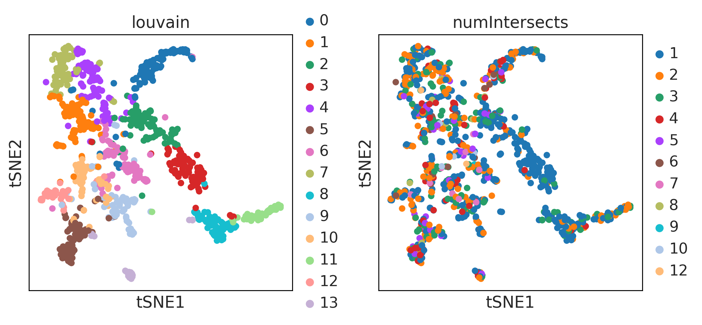


```
#Based on saved topGO output (See script....)
c = np.unique(de_gene_adata.obs["louvain"].values)
print(c)
```

    ['0' '1' '10' '11' '12' '13' '2' '3' '4' '5' '6' '7' '8' '9']


```
names = ['Protein Synthesis & Stress Response','Oxidative Phosphorylation','Cytoskeletal','Synaptic Transmission & Transport','NA','NA',
         'Phosphate-Containing Metabolic Process','Cell Cycle & Development (Early Oocytes)','Protein Synthesis',
         'Proteolysis & Cell Physiology','Cell Cycle','Protein Synthesis & Transport','Cell-Matrix Adhesion','Metabolic Process']

geneClusNames = dict(zip(c, names)) 
```


```
addNames = []
deGenesDF_sig = deGenesDF[deGenesDF.geneClus != 'padjClus_not_sig']

for i in deGenesDF_sig.geneClus:
  addNames += [geneClusNames[i]]

deGenesDF_sig['names'] = addNames
deGenesDF_sig.head()
```


<div>
<style scoped>
    .dataframe tbody tr th:only-of-type {
        vertical-align: middle;
    }

    .dataframe tbody tr th {
        vertical-align: top;
    }

    .dataframe thead th {
        text-align: right;
    }
</style>
<table border="1" class="dataframe">
  <thead>
    <tr style="text-align: right;">
      <th></th>
      <th>Unnamed: 0</th>
      <th>Unnamed: 0.1</th>
      <th>Unnamed: 0.1.1</th>
      <th>Genes</th>
      <th>Cluster</th>
      <th>Condition</th>
      <th>padj</th>
      <th>padjClus</th>
      <th>log2FC</th>
      <th>orthoGene</th>
      <th>orthoDescr</th>
      <th>pantherID</th>
      <th>pantherDescr</th>
      <th>goTerms</th>
      <th>geneClus</th>
      <th>names</th>
    </tr>
  </thead>
  <tbody>
    <tr>
      <th>0</th>
      <td>0</td>
      <td>0</td>
      <td>1</td>
      <td>XLOC_028699</td>
      <td>0</td>
      <td>Starved</td>
      <td>5.554489e-16</td>
      <td>1.832981e-14</td>
      <td>-1.284301</td>
      <td>NaN</td>
      <td>NaN</td>
      <td>NaN</td>
      <td>NaN</td>
      <td>NaN</td>
      <td>4</td>
      <td>Protein Synthesis</td>
    </tr>
    <tr>
      <th>1</th>
      <td>1</td>
      <td>1</td>
      <td>2</td>
      <td>XLOC_010635</td>
      <td>0</td>
      <td>Starved</td>
      <td>2.528288e-14</td>
      <td>8.343350e-13</td>
      <td>-1.492625</td>
      <td>SRSF1</td>
      <td>serine/arginine-rich splicing factor 1 isofor...</td>
      <td>['PTHR24012:SF650']</td>
      <td>['SERINE/ARGININE-RICH SPLICING FACTOR 1']</td>
      <td>[nan]</td>
      <td>4</td>
      <td>Protein Synthesis</td>
    </tr>
    <tr>
      <th>2</th>
      <td>2</td>
      <td>2</td>
      <td>3</td>
      <td>XLOC_011294</td>
      <td>0</td>
      <td>Starved</td>
      <td>8.348790e-14</td>
      <td>2.755101e-12</td>
      <td>-1.441413</td>
      <td>NaN</td>
      <td>NaN</td>
      <td>NaN</td>
      <td>NaN</td>
      <td>[nan]</td>
      <td>0</td>
      <td>Protein Synthesis &amp; Stress Response</td>
    </tr>
    <tr>
      <th>3</th>
      <td>3</td>
      <td>3</td>
      <td>4</td>
      <td>XLOC_034889</td>
      <td>0</td>
      <td>Starved</td>
      <td>1.786565e-13</td>
      <td>5.895663e-12</td>
      <td>-1.448216</td>
      <td>NaN</td>
      <td>NaN</td>
      <td>['PTHR13680:SF29']</td>
      <td>['CDGSH IRON-SULFUR DOMAIN-CONTAINING PROTEIN ...</td>
      <td>[nan]</td>
      <td>1</td>
      <td>Oxidative Phosphorylation</td>
    </tr>
    <tr>
      <th>4</th>
      <td>4</td>
      <td>4</td>
      <td>5</td>
      <td>XLOC_030861</td>
      <td>0</td>
      <td>Starved</td>
      <td>8.598653e-12</td>
      <td>2.837556e-10</td>
      <td>-1.570453</td>
      <td>SRSF1</td>
      <td>serine/arginine-rich splicing factor 1 isofor...</td>
      <td>['PTHR24012:SF650']</td>
      <td>['SERINE/ARGININE-RICH SPLICING FACTOR 1']</td>
      <td>[nan]</td>
      <td>4</td>
      <td>Protein Synthesis</td>
    </tr>
  </tbody>
</table>
</div>


```
#https://stackoverflow.com/questions/29530355/plotting-multiple-histograms-in-grid

def draw_plots(df, variables, n_rows, n_cols):
    fig=plt.figure(figsize=(20,20))
    for i, var_name in enumerate(variables):
        ax=fig.add_subplot(n_rows,n_cols,i+1)
        name = geneClusNames[var_name]
        sub = df[df['names'] == name]
        sub.Cluster.value_counts().sort_values().plot(kind = 'barh',ax=ax,fontsize = 10)
        #sub['Cluster'].hist(bins=10,ax=ax)
        ax.set_title(var_name+': '+name+" Distribution",fontsize = 12)
        ax.set_ylabel("Cell Atlas Clusters",fontsize = 12)
        ax.set_xlabel("Number of Perturbed Genes from Atlas Cluster",fontsize = 12)
    fig.tight_layout()  # Improves appearance a bit.

    plt.show()

draw_plots(deGenesDF_sig, np.unique(deGenesDF_sig.geneClus), 5, 4)

```


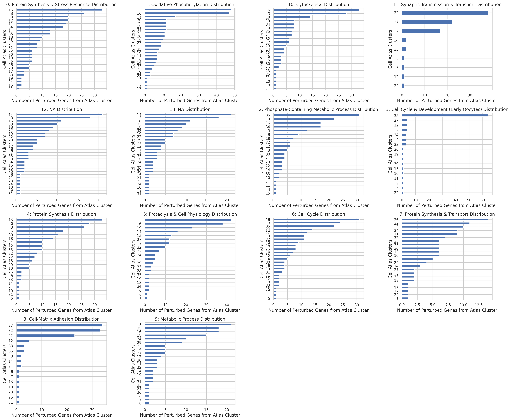


###### **Gene Module Plots**

Plot gene modules colored by how genes are shared between cell types


```
#Mark DE/Perturbed Genes
def returnDE(i,names):
  if i in list(names):
    return 'DE'
  else:
    return 'nonSig'


```


```
#Mark genes with no GO Terms
def returnVal(i):
  if i == i:
    i= i.replace("[","")
    i = i.replace("]","")
    i= i.replace("'","")
    i = i.replace("'","")
    return i 
  else:
    return 'nan'

def returnGO(i,names):
  if i in names:
    return "withGO"
  else:
    return "n/a"

deGenesDF.goTerms = [returnVal(i) for i in list(deGenesDF.goTerms)]

deGenesDF_sub = deGenesDF[deGenesDF.geneClus != 'padjClus_not_sig']
deGenesDF_sub = deGenesDF_sub[deGenesDF_sub.goTerms != 'nan'] # Has GO Term
withGO_names = list(deGenesDF_sub.Genes)

print(len(np.unique(withGO_names)))

goLabels = [returnGO(i,withGO_names) for i in de_gene_adata.obs_names]
de_gene_adata.obs['withGO'] = pd.Categorical(goLabels)
de_gene_adata
```

    472


    AnnData object with n_obs × n_vars = 953 × 13673
        obs: 'numIntersects', 'n_counts', 'louvain', 'clus35', 'clus14', 'clus19', 'withGO'
        var: 'n_counts', 'mean', 'std'
        uns: 'louvain', 'louvain_colors', 'neighbors', 'numIntersects_colors', 'pca'
        obsm: 'X_pca', 'X_tsne'
        varm: 'PCs'
        obsp: 'connectivities', 'distances'


```

clus14Genes = deGenesDF[deGenesDF.Cluster == 14]
clus19Genes = deGenesDF[deGenesDF.Cluster == 19]
clus35Genes = deGenesDF[deGenesDF.Cluster == 35]
```


```
# Label DE/notDE genes
clus35Labels = [returnDE(i,np.unique(clus35Genes.Genes)) for i in de_gene_adata.obs_names]
de_gene_adata.obs['clus35'] = pd.Categorical(clus35Labels)

clus14Labels = [returnDE(i,np.unique(clus14Genes.Genes)) for i in de_gene_adata.obs_names]
de_gene_adata.obs['clus14'] = pd.Categorical(clus14Labels)

#sc.pl.tsne(de_gene_adata,groups=['DE'],color=['clus14'])
```


```
# Label DE/notDE genes
clus19Labels = [returnDE(i,np.unique(clus19Genes.Genes)) for i in de_gene_adata.obs_names]
de_gene_adata.obs['clus19'] = pd.Categorical(clus19Labels)

#sc.pl.tsne(de_gene_adata,groups=['DE'],color=['clus19'])
```


```
c = list(np.unique(de_gene_adata.obs["louvain"].values))
c
```


    ['0', '1', '10', '11', '12', '13', '2', '3', '4', '5', '6', '7', '8', '9']


```
#Add labels to each cluster in de_gene_adata (from GO terms) on tSNE plot
fig, ax = plt.subplots(figsize=(6,6))

#c = np.unique(de_gene_adata.obs["louvain"].values)
cmap = plt.cm.get_cmap("tab20")


for idx, (cluster, cluster) in enumerate(zip(c, c)):
    XX = de_gene_adata[de_gene_adata.obs.louvain == cluster,:].obsm["X_tsne"]
    
    x = XX[:,0]
    y = XX[:,1]
    ax.scatter(x, y, color = cmap(idx), label=cluster,s=25,alpha=0.7)

   
    ax.annotate(cluster, 
                (np.median(x), np.median(y)),
                horizontalalignment='right',
                verticalalignment='bottom',
                size=12, weight='bold',
                color="black",
                backgroundcolor=cmap(idx) )
   
    

#ax.legend(loc='center left', bbox_to_anchor=(1, 0.5))
#ax.set_axis_off()
ax.set_xlabel('tSNE1')
ax.set_ylabel('tSNE2')
ax.grid(False)
ax.get_xaxis().set_ticks([])
ax.get_yaxis().set_ticks([])
for edge_i in ['bottom','left']:
    ax.spines[edge_i].set_edgecolor("black")
for edge_i in ['top', 'right']:
    ax.spines[edge_i].set_edgecolor("white")
plt.show()
```


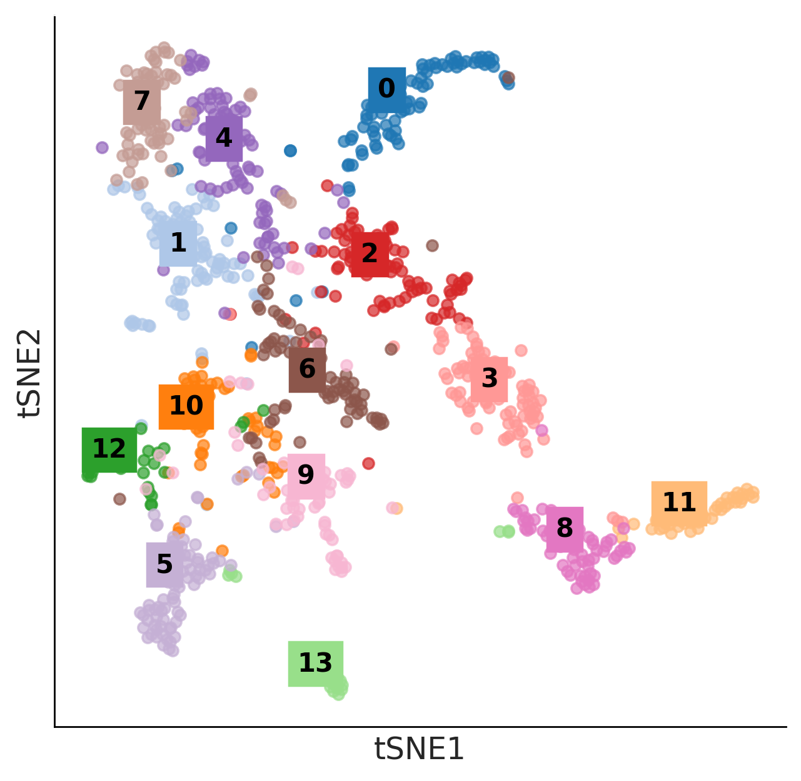


```
# Density plot of perturbed genes with two cell types
def multDensityofDE(de_gene_adata,clusName1,clusName2,label1,label2):
  s = 13
  # Add labels to each cluster in de_gene_adata (from GO terms) on tSNE plot
  fig, ax = plt.subplots(figsize=(3,3))

  XX = de_gene_adata.obsm["X_tsne"]
  
  de1 = np.array([de_gene_adata.obs[clusName1] == 'DE'])
  de2 = np.array([de_gene_adata.obs[clusName2] == 'DE'])

  overlap = list(np.where(de1 & de2)[1])
  only1 = [i for i in list(np.where(de1)[1]) if i not in overlap]
  only2 = [i for i in list(np.where(de2)[1]) if i not in overlap]

  nonsig = [i for i in range(0,len(XX[:,0])) if i not in overlap+only1+only2]
      

  x = XX[nonsig,0]
  y = XX[nonsig,1]
  ax.scatter(x, y, color = 'grey',s=25,alpha=0.1,edgecolors='none') #cmap(idx),label=cluster

  x_DE1 = XX[only1,0]
  y_DE1 = XX[only1,1]
  ax.scatter(x_DE1, y_DE1, color = 'navy',s=25,alpha=0.3,label=label1) #label=cluster

  x_DE2 = XX[only2,0]
  y_DE2 = XX[only2,1]
  ax.scatter(x_DE2, y_DE2, color = 'orange',s=25,alpha=0.3,label=label2) #label=cluster

  x_DE3 = XX[overlap,0]
  y_DE3 = XX[overlap,1]
  ax.scatter(x_DE3, y_DE3, color = 'green',s=25,alpha=0.3,label='Both') #label=cluster

  ax.set_axis_off()
  ax.legend(loc='center left', bbox_to_anchor=(1, 0.5))
  plt.show()

# Density plot of perturbed genes with three cell types
def tripleDensityofDE(de_gene_adata,clusName1,clusName2,clusName3,label1,label2):
  s = 13
  # Add labels to each cluster in de_gene_adata (from GO terms) on tSNE plot
  fig, ax = plt.subplots(figsize=(3,3))

  XX = de_gene_adata.obsm["X_tsne"]
  
  de1 = np.array([de_gene_adata.obs[clusName1] == 'DE'])
  de2 = np.array([de_gene_adata.obs[clusName2] == 'DE'])
  de3 = np.array([de_gene_adata.obs[clusName3] == 'DE'])

  overlap = list(np.where((de1 & de2) | (de1 & de3))[1])
  only1 = [i for i in list(np.where(de1)[1]) if i not in overlap]
  other = [i for i in list(np.where(de2 | de3)[1]) if i not in overlap]
 

  nonsig = [i for i in range(0,len(XX[:,0])) if i not in overlap+only1+other]
      

  x = XX[nonsig,0]
  y = XX[nonsig,1]
  ax.scatter(x, y, color = 'grey',s=25,alpha=0.1,edgecolors='none') #cmap(idx),label=cluster

  x_DE1 = XX[only1,0]
  y_DE1 = XX[only1,1]
  ax.scatter(x_DE1, y_DE1, color = 'purple',s=25,alpha=0.3,label=label1) #label=cluster

  x_DE2 = XX[other,0]
  y_DE2 = XX[other,1]
  ax.scatter(x_DE2, y_DE2, color = 'lightcoral',s=25,alpha=0.3,label=label2) #label=cluster

  x_DE3 = XX[overlap,0]
  y_DE3 = XX[overlap,1]
  ax.scatter(x_DE3, y_DE3, color = 'green',s=25,alpha=0.3,label='Shared') #label=cluster

  ax.set_axis_off()
  ax.legend(loc='center left', bbox_to_anchor=(1, 0.5))
  plt.show()
```


```
multDensityofDE(de_gene_adata,'clus14','clus19','Cluster 14','Cluster 19')
```


```
tripleDensityofDE(de_gene_adata,'clus35','clus14','clus19','Cluster 35','Digestive Types (14/19)')
```


```
#Saved version used for this analysis
#de_gene_adata.write('de_gene_clus_adata.h5ad')
```

###### **For Gene Cluster SplitsTree Conversion**


```
from sklearn.metrics import pairwise_distances

#Centroids of cell atlas/defined clusters
def getClusCentroids(overlap_combo,pcs=60,clusType='knn_clus'):
    clusters = np.unique(overlap_combo.obs[clusType])
    centroids = np.zeros((len(clusters),pcs))
    
    for c in clusters:
        
        sub_data = overlap_combo[overlap_combo.obs[clusType] == c]
        pca_embed = sub_data.obsm['X_pca'][:,0:pcs]
        centroid = pca_embed.mean(axis=0)
        
        centroids[int(c),:] = list(centroid)
        
    return centroids

#Compare to pairwise distances between cell atlas clusters
centroids = getClusCentroids(de_gene_adata,60,'louvain')
#centroids_arr = centroids['centroid'].to_numpy()
pairCentroid_dists = pairwise_distances(centroids, metric = 'l1')
pairCentroid_dists.shape

```


    (14, 14)


```
df = pd.DataFrame(pairCentroid_dists)
clus = np.unique(de_gene_adata.obs['louvain'])
df['cluster'] = range(0,len(clus))

clusters = [int(i) for i in de_gene_adata.obs['louvain']]

names = [geneClusDict[str(i)] for i in df['cluster']]

df['annos'] = names

df.to_csv('geneClustDist_SplitsTree.csv')
df.head()
```


<div>
<style scoped>
    .dataframe tbody tr th:only-of-type {
        vertical-align: middle;
    }

    .dataframe tbody tr th {
        vertical-align: top;
    }

    .dataframe thead th {
        text-align: right;
    }
</style>
<table border="1" class="dataframe">
  <thead>
    <tr style="text-align: right;">
      <th></th>
      <th>0</th>
      <th>1</th>
      <th>2</th>
      <th>3</th>
      <th>4</th>
      <th>5</th>
      <th>6</th>
      <th>7</th>
      <th>8</th>
      <th>9</th>
      <th>10</th>
      <th>11</th>
      <th>12</th>
      <th>13</th>
      <th>cluster</th>
      <th>annos</th>
    </tr>
  </thead>
  <tbody>
    <tr>
      <th>0</th>
      <td>0.000000</td>
      <td>115.627783</td>
      <td>143.492221</td>
      <td>154.445199</td>
      <td>139.531540</td>
      <td>161.270522</td>
      <td>154.411614</td>
      <td>154.479290</td>
      <td>179.288620</td>
      <td>144.515184</td>
      <td>118.180061</td>
      <td>187.660104</td>
      <td>178.807665</td>
      <td>202.399721</td>
      <td>0</td>
      <td>Protein Synthesis &amp; Stress Response</td>
    </tr>
    <tr>
      <th>1</th>
      <td>115.627783</td>
      <td>0.000000</td>
      <td>98.075214</td>
      <td>143.125559</td>
      <td>77.157201</td>
      <td>132.257530</td>
      <td>104.986413</td>
      <td>100.198085</td>
      <td>154.236652</td>
      <td>120.262093</td>
      <td>92.372829</td>
      <td>162.726511</td>
      <td>162.104749</td>
      <td>182.189908</td>
      <td>1</td>
      <td>Oxidative Phosphorylation</td>
    </tr>
    <tr>
      <th>2</th>
      <td>143.492221</td>
      <td>98.075214</td>
      <td>0.000000</td>
      <td>134.376313</td>
      <td>89.768823</td>
      <td>148.965495</td>
      <td>132.329147</td>
      <td>117.734078</td>
      <td>154.317732</td>
      <td>126.807212</td>
      <td>122.691857</td>
      <td>161.371515</td>
      <td>178.094517</td>
      <td>187.628485</td>
      <td>2</td>
      <td>Phosphate-Containing Metabolic Process</td>
    </tr>
    <tr>
      <th>3</th>
      <td>154.445199</td>
      <td>143.125559</td>
      <td>134.376313</td>
      <td>0.000000</td>
      <td>131.398811</td>
      <td>150.699813</td>
      <td>164.020334</td>
      <td>161.338567</td>
      <td>142.324225</td>
      <td>152.467793</td>
      <td>129.686223</td>
      <td>162.602245</td>
      <td>181.032459</td>
      <td>206.935751</td>
      <td>3</td>
      <td>Development &amp; Reproduction</td>
    </tr>
    <tr>
      <th>4</th>
      <td>139.531540</td>
      <td>77.157201</td>
      <td>89.768823</td>
      <td>131.398811</td>
      <td>0.000000</td>
      <td>143.979940</td>
      <td>120.886121</td>
      <td>79.866331</td>
      <td>160.604428</td>
      <td>123.758153</td>
      <td>118.502382</td>
      <td>167.547313</td>
      <td>167.604706</td>
      <td>193.690030</td>
      <td>4</td>
      <td>Protein Synthesis</td>
    </tr>
  </tbody>
</table>
</div>


###### **Gene expression Plots & Cluster 14 & 19 DE Gene Comparisons/Violin Plots**

Look at expression profiles of perturbed genes from different cell types


```
#Kallisto bus h5ad file with no gene filtering 
bus_fs_raw = anndata.read("D1.1797")
print(bus_fs_raw )

#Read in PREVIOUSLY SAVED clustered + labeled data (cells x gene)
bus_fs_clus = anndata.read("D1.1796")
print(bus_fs_clus)
bus_fs_clus.obs['Fed'] = pd.Categorical(bus_fs_clus.obs['fed'])
#sc.pl.umap(bus_fs_clus, color='Fed')


bus_fs_raw.obs['cellRanger_louvain'] = pd.Categorical(bus_fs_clus.obs['cellRanger_louvain'])
bus_fs_raw
```

    AnnData object with n_obs × n_vars = 13673 × 46716
        obs: 'batch'
    AnnData object with n_obs × n_vars = 13673 × 8696
        obs: 'batch', 'n_counts', 'n_countslog', 'louvain', 'leiden', 'orgID', 'fed', 'starved', 'fed_neighbor_score', 'cellRanger_louvain', 'annos', 'new_cellRanger_louvain', 'annosSub'
        var: 'n_counts', 'mean', 'std'
        uns: 'annosSub_colors', 'annos_colors', 'cellRanger_louvain_colors', 'cellRanger_louvain_sizes', "dendrogram_['new_cellRanger_louvain']", 'dendrogram_new_cellRanger_louvain', 'fed_colors', 'fed_neighbor_score_colors', 'leiden', 'leiden_colors', 'louvain', 'louvain_colors', 'neighbors', 'new_cellRanger_louvain_colors', 'orgID_colors', 'paga', 'pca', 'rank_genes_groups', 'umap'
        obsm: 'X_nca', 'X_pca', 'X_tsne', 'X_umap'
        varm: 'PCs'
        obsp: 'connectivities', 'distances'


    AnnData object with n_obs × n_vars = 13673 × 46716
        obs: 'batch', 'cellRanger_louvain'


```
deGenesDF_sig = deGenesDF[deGenesDF.padjClus < 0.05] 
clusGenes = list(deGenesDF_sig.Genes[deGenesDF_sig.Cluster == 3])
len(clusGenes)
```


    82


```
#Expression profiles for perturbed genes in each cell type (all high expression or not)

cellTypes = np.unique(deGenesDF_sig.Cluster)
colors = bus_fs_clus.uns['annosSub_colors']
cmap = [i for i in colors]
vals = []
types = []
num = []
cmap_l = []

exprPlots = pd.DataFrame()
for t in cellTypes:
  clusGenes = list(deGenesDF_sig.Genes[deGenesDF_sig.Cluster == t])
  sub = bus_fs_raw[:,clusGenes]
  sub = sub[sub.obs['cellRanger_louvain'].isin([t])]
  toAdd = sub.X.todense().mean(0)
  #Calculate average expression for each gene across cells in type t
  means = toAdd.flatten().tolist()[0]
  vals += means

  types += list(np.repeat(t,len(means)))
  num += list(np.repeat(len(means),len(means)))
  cmap_l  += [cmap[t]]


exprPlots['cellType'] = types
exprPlots['expr'] = np.log1p(vals)
exprPlots['numGenes'] = num

```


```
exprPlots.head()
```


<div>
<style scoped>
    .dataframe tbody tr th:only-of-type {
        vertical-align: middle;
    }

    .dataframe tbody tr th {
        vertical-align: top;
    }

    .dataframe thead th {
        text-align: right;
    }
</style>
<table border="1" class="dataframe">
  <thead>
    <tr style="text-align: right;">
      <th></th>
      <th>cellType</th>
      <th>expr</th>
      <th>numGenes</th>
    </tr>
  </thead>
  <tbody>
    <tr>
      <th>0</th>
      <td>0</td>
      <td>2.297710</td>
      <td>99</td>
    </tr>
    <tr>
      <th>1</th>
      <td>0</td>
      <td>1.577077</td>
      <td>99</td>
    </tr>
    <tr>
      <th>2</th>
      <td>0</td>
      <td>2.441016</td>
      <td>99</td>
    </tr>
    <tr>
      <th>3</th>
      <td>0</td>
      <td>1.346493</td>
      <td>99</td>
    </tr>
    <tr>
      <th>4</th>
      <td>0</td>
      <td>1.190470</td>
      <td>99</td>
    </tr>
  </tbody>
</table>
</div>


```
palette = sns.color_palette(cmap_l)
fig, ax = plt.subplots(figsize=(10,6))
ax = sns.boxplot(x="numGenes", y="expr", hue='cellType',palette=palette, data=exprPlots,order=np.arange(190),dodge=False)


for i,artist in enumerate(ax.artists):
    # Set the linecolor on the artist to the facecolor, and set the facecolor to None
    col = artist.get_facecolor()
    artist.set_edgecolor(col)
    artist.set_facecolor('None')

    # Each box has 6 associated Line2D objects (to make the whiskers, fliers, etc.)
    # Loop over them here, and use the same colour as above
    for j in range(i*6,i*6+6):
        line = ax.lines[j]
        if j == (i*6+4):
          line.set_color('black')
          line.set_mfc('black')
          line.set_mec('black')
        else:
          line.set_color(col)
          line.set_mfc(col)
          line.set_mec(col)


ax.set_xlabel('Number of Perturbed Genes')
ax.set_ylabel('log(Expression)')
ax.grid(False)

for edge_i in ['bottom','left']:
    ax.spines[edge_i].set_edgecolor("black")
for edge_i in ['top', 'right']:
    ax.spines[edge_i].set_edgecolor("white")
ax.legend(loc='center left',bbox_to_anchor=(1, 0.5),prop={'size': 10},frameon=False,ncol=2,title="Cell Type")


for i in range(190):
     if i % 25 != 0:
       ax.xaxis.get_major_ticks()[i].draw = lambda *args:None


plt.show()
```


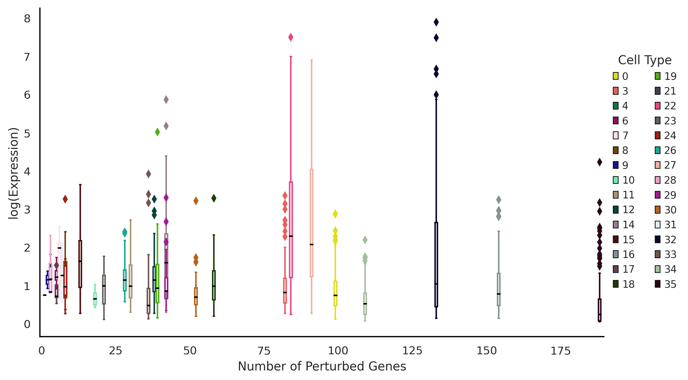


```
clus14 = bus_fs_clus[bus_fs_clus.obs['cellRanger_louvain'].isin([14])]
clus14.obs['Condition2'] = pd.Categorical(clus14.obs['fed'])
clus19 = bus_fs_clus[bus_fs_clus.obs['cellRanger_louvain'].isin([19])]
clus19.obs['Condition2'] = pd.Categorical(clus19.obs['fed'])
```

    *c* argument looks like a single numeric RGB or RGBA sequence, which should be avoided as value-mapping will have precedence in case its length matches with *x* & *y*.  Please use the *color* keyword-argument or provide a 2-D array with a single row if you intend to specify the same RGB or RGBA value for all points.
    *c* argument looks like a single numeric RGB or RGBA sequence, which should be avoided as value-mapping will have precedence in case its length matches with *x* & *y*.  Please use the *color* keyword-argument or provide a 2-D array with a single row if you intend to specify the same RGB or RGBA value for all points.


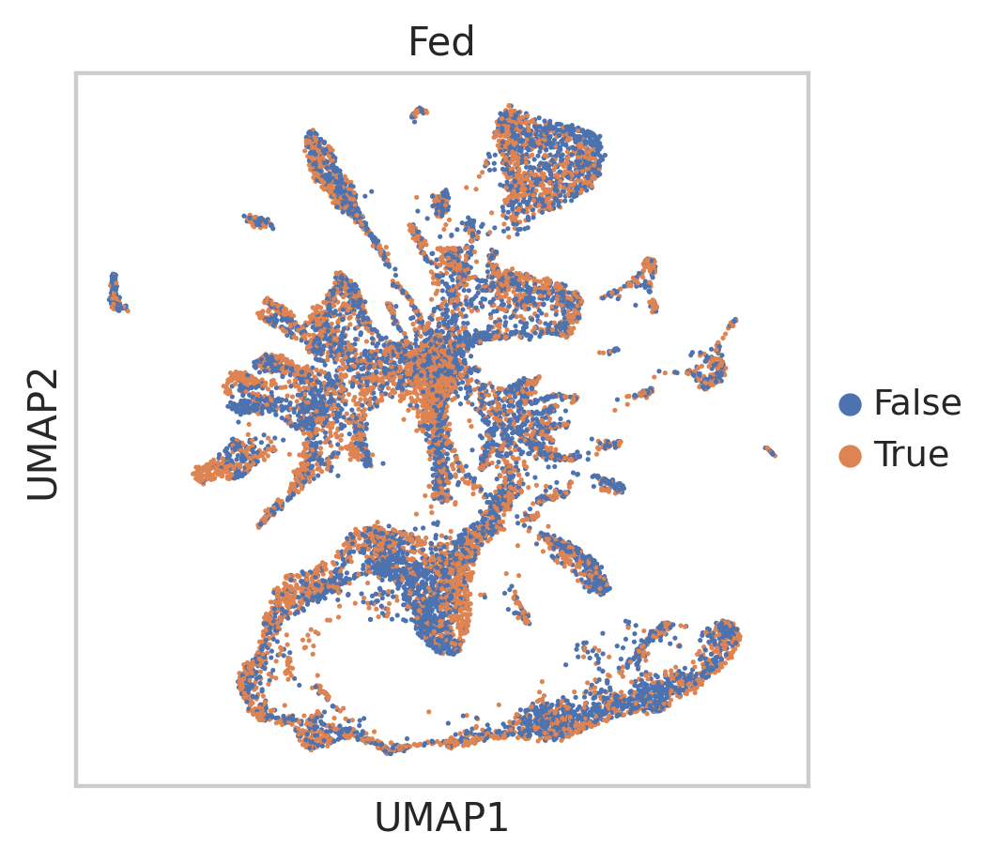


    Trying to set attribute `.obs` of view, copying.
    Trying to set attribute `.obs` of view, copying.


```
newOfInterest = ['XLOC_043836','XLOC_043846','XLOC_007437','XLOC_009798','XLOC_008632','XLOC_033541','XLOC_004011'] 
```


```
axes = sc.pl.violin(clus14, newOfInterest, groupby='Condition2',ylabel=['Oxidoreductase','Dioxygenase',
                                                                        'POSTN-related','KRTAP5','Uncharacterized','NPC2','NPC2'],show=False)
for ax in axes:
  ax.set_ylim(0, 5)
  ax.grid(False)
  ax.spines['right'].set_visible(False)
  ax.spines['top'].set_visible(False)
  ax.spines['bottom'].set_color('black')
  ax.spines['left'].set_color('black') 
axes = sc.pl.violin(clus19, newOfInterest, groupby='Condition2',ylabel=['Oxidoreductase','Dioxygenase',
                                                                        'POSTN-related','KRTAP5','Uncharacterized','NPC2','NPC2'],show=False)
for ax in axes:
  ax.set_ylim(0, 5)
  ax.grid(False)
  ax.spines['right'].set_visible(False)
  ax.spines['top'].set_visible(False)
  ax.spines['bottom'].set_color('black')
  ax.spines['left'].set_color('black') 
```


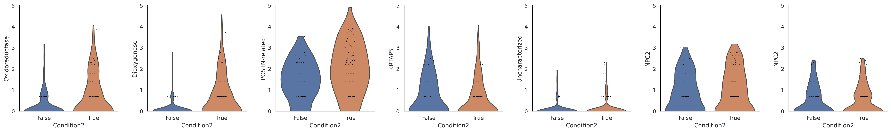


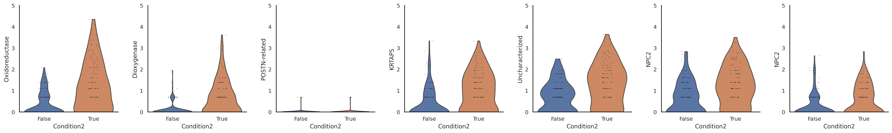


```
newOfInterest = ['XLOC_035232','XLOC_007437'] 
axes = sc.pl.violin(clus14, newOfInterest, groupby='Condition2',ylabel=['TGFB-like',
                                                                        'POSTN-like'],show=False)
for ax in axes:
  ax.set_ylim(0, 7)
  ax.grid(False)
  ax.spines['right'].set_visible(False)
  ax.spines['top'].set_visible(False)
  ax.spines['bottom'].set_color('black')
  ax.spines['left'].set_color('black') 

axes = sc.pl.violin(clus19, newOfInterest, groupby='Condition2',ylabel=['TGFB-like',
                                                                        'POSTN-like'],show=False)
for ax in axes:
  ax.set_ylim(0, 7)
  ax.grid(False)
  ax.spines['right'].set_visible(False)
  ax.spines['top'].set_visible(False)
  ax.spines['bottom'].set_color('black')
  ax.spines['left'].set_color('black') 
```


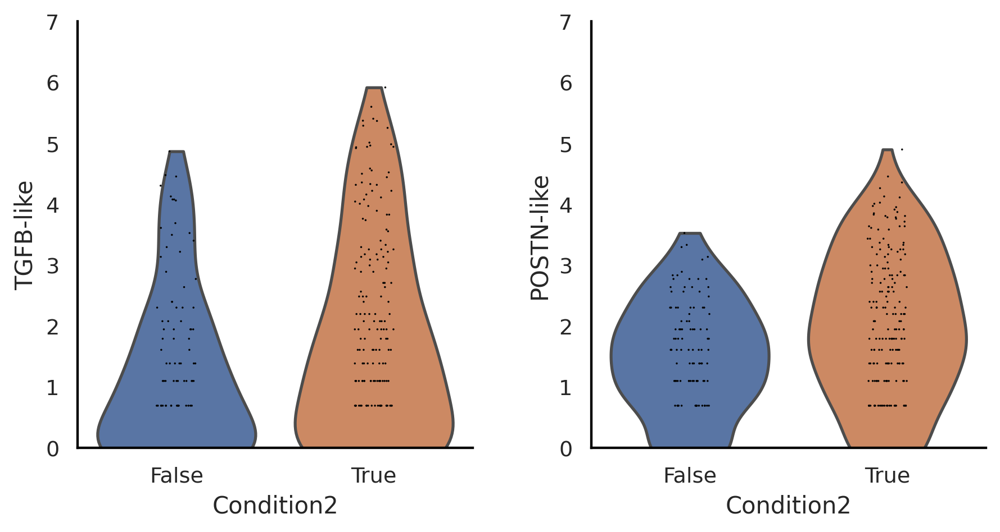


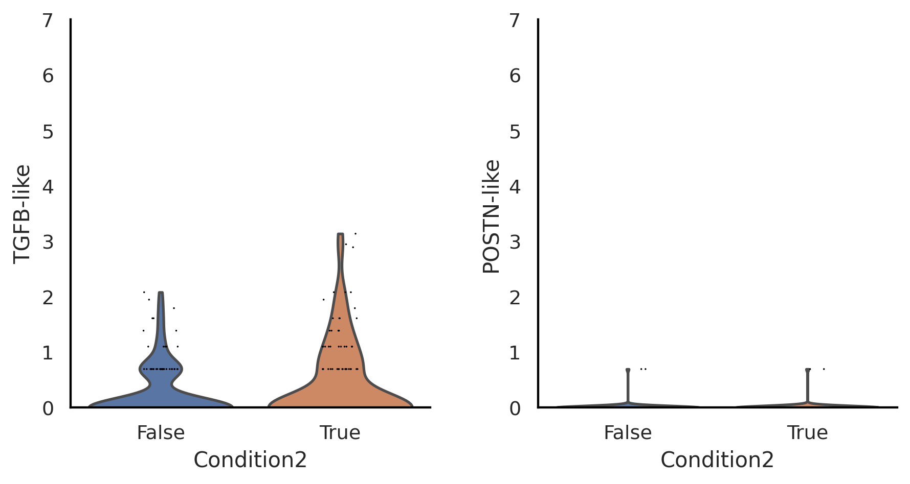


```
#Cluster 35, early oocytes Violin Plots

bus_fs_clus.obs['fed'] = pd.Categorical(bus_fs_clus.obs['fed'])
clus35 = bus_fs_clus[bus_fs_clus.obs['cellRanger_louvain'].isin([35])]

```


```
newOfInterest = ['XLOC_012655','XLOC_004306','XLOC_037567','XLOC_006902','XLOC_016286','XLOC_037771',
                 'XLOC_035249','XLOC_012527','XLOC_001916','XLOC_015039']

clus35.obs['Condition2'] = pd.Categorical(clus35.obs['fed'])
#sc.pl.umap(clus35, color='Condition')
sc.pl.violin(clus35, newOfInterest, groupby='Condition2',ylabel=['DNAJ','MCM8','TF AP4','CAF-1','SPO11','MOV10L1',
                                                                 'SIN3A','FAF1','CDK9','TMBIM4'])


newOfInterest = ['XLOC_016286','XLOC_012527']
#sc.pl.umap(clus35, color='Condition')
axes = sc.pl.violin(clus35, newOfInterest, groupby='Condition2',ylabel=['MEIOTIC RECOMBINATION PROTEIN','FAF1'],show=False)

for ax in axes:
  ax.set_ylim(0, 5)
  ax.grid(False)
  ax.spines['right'].set_visible(False)
  ax.spines['top'].set_visible(False)
  ax.spines['bottom'].set_color('black')
  ax.spines['left'].set_color('black') 

```

    Trying to set attribute `.obs` of view, copying.


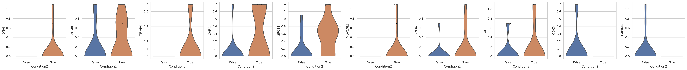


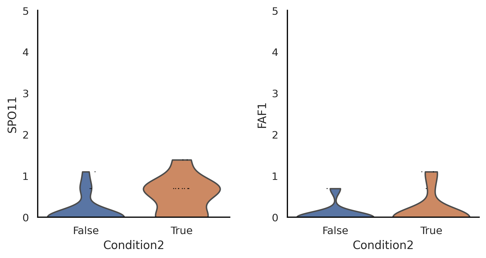


####**Overlap with Original CellRanger Clusters** 

Use Jaccard Index to quantify overlap of markers for the 36 cell types between the Kallisto-processed and initial, Cell Ranger processed data


```
n=100
bus_fs_clus = anndata.read("D1.1796")
cellRanger_fs = anndata.read("D1.1798")

bus_fs_clus.obs['cellRanger_louvain'] = pd.Categorical(bus_fs_clus.obs['cellRanger_louvain'])
sc.tl.rank_genes_groups(cellRanger_fs,groupby='louvain',n_genes=n,method='wilcoxon')
sc.tl.rank_genes_groups(bus_fs_clus,groupby='cellRanger_louvain',n_genes=n,method='wilcoxon')
```


```
#Show pairwise overlap in top 100 names between all clusters, 36x36 grid
clus = np.unique(bus_fs_clus.obs['cellRanger_louvain'])

cellR = [[]]*len(clus) #np array of top 100 genes for each of 36 clusters
busFS = [[]]*len(clus)#np array of top 100 genes for each of 36 clusters

for c in clus:
  cellR[c] =  list(cellRanger_fs.uns['rank_genes_groups']['names'][str(c)])
  busFS[c] = list(bus_fs_clus.uns['rank_genes_groups']['names'][str(c)])

```


```
#https://stackoverflow.com/questions/52408910/python-pairwise-intersection-of-multiple-lists-then-sum-up-all-duplicates
```


```
from itertools import combinations_with_replacement

#Changed to calculate Jaccard Index
def intersect(i,j):
  return len(set(cellR[i]).intersection(busFS[j]))/len(set(cellR[i]).union(busFS[j]))

def pairwise(clus):        
  # Initialise precomputed matrix (num of clusters, 36x36)
  precomputed = np.zeros((len(clus),len(clus)), dtype='float')
  # Initialise iterator over objects in X
  iterator = combinations_with_replacement(range(0,len(clus)), 2)
  # Perform the operation on each pair
  for i,j in iterator:
    precomputed[i,j] = intersect(i,j)          
  # Make symmetric and return
  return precomputed + precomputed.T - np.diag(np.diag(precomputed))

```


```
pairCorrs = pairwise(clus)
```


```
plt.figure(figsize=(7,7))
plt.imshow(pairCorrs, cmap='viridis')
plt.colorbar()
plt.xlabel('kallisto Clusters')
plt.ylabel('Cell Ranger Clusters')

plt.xticks(np.arange(0, 36, 1),fontsize=6)
plt.yticks(np.arange(0, 36, 1),fontsize=6)
plt.grid(color='black',linewidth=0.3)
plt.show()
```


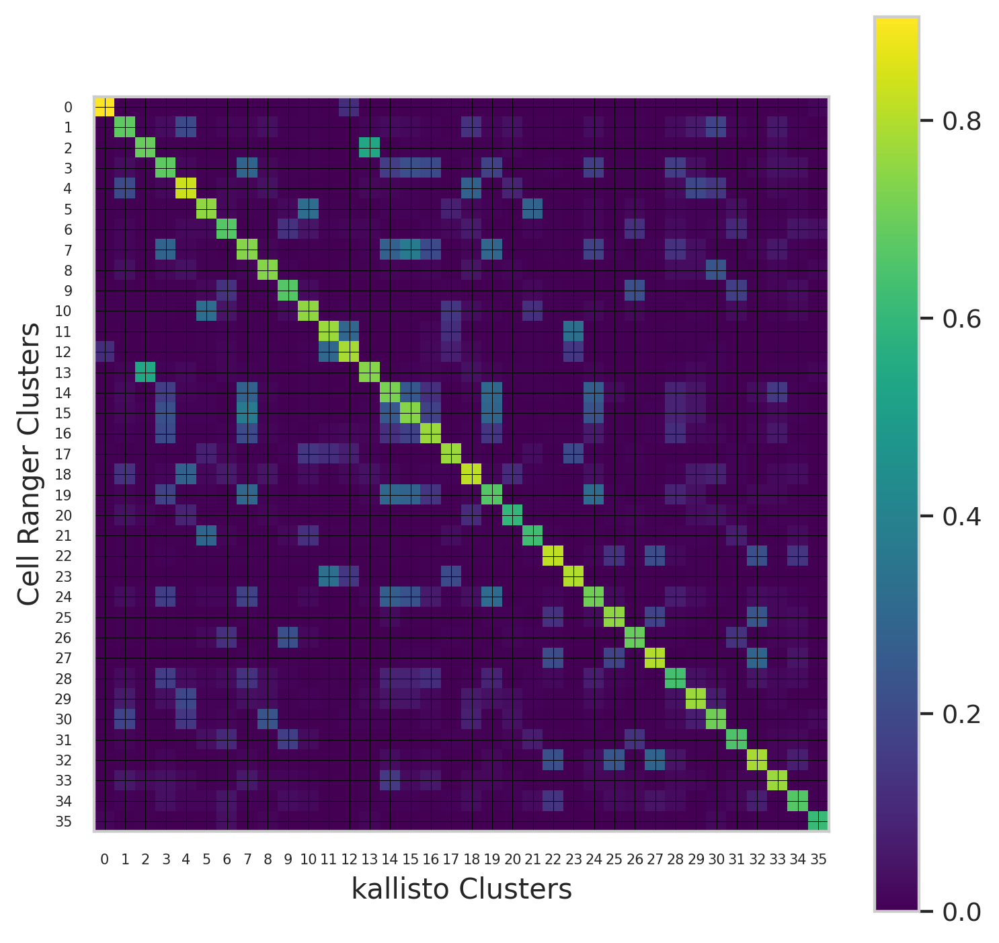


#### **Cell Type Data for SplitsTree**


```
print(bus_fs_clus)

from sklearn.metrics import pairwise_distances

#Centroids of cell atlas/defined clusters
def getClusCentroids(overlap_combo,pcs=60,clusType='knn_clus'):
    clusters = np.unique(overlap_combo.obs[clusType])
    centroids = np.zeros((len(clusters),pcs))
    
    for c in clusters:
        
        sub_data = overlap_combo[overlap_combo.obs[clusType] == c]
        pca_embed = sub_data.obsm['X_pca'][:,0:pcs]
        centroid = pca_embed.mean(axis=0)
        
        centroids[int(c),:] = list(centroid)
        
    return centroids
```

    AnnData object with n_obs × n_vars = 13673 × 8696
        obs: 'batch', 'n_counts', 'n_countslog', 'louvain', 'leiden', 'orgID', 'fed', 'starved', 'fed_neighbor_score', 'cellRanger_louvain', 'annos', 'new_cellRanger_louvain', 'annosSub'
        var: 'n_counts', 'mean', 'std'
        uns: 'annosSub_colors', 'annos_colors', 'cellRanger_louvain_colors', 'cellRanger_louvain_sizes', "dendrogram_['new_cellRanger_louvain']", 'dendrogram_new_cellRanger_louvain', 'fed_colors', 'fed_neighbor_score_colors', 'leiden', 'leiden_colors', 'louvain', 'louvain_colors', 'neighbors', 'new_cellRanger_louvain_colors', 'orgID_colors', 'paga', 'pca', 'rank_genes_groups', 'umap'
        obsm: 'X_nca', 'X_pca', 'X_tsne', 'X_umap'
        varm: 'PCs'
        obsp: 'connectivities', 'distances'


```
#Compare to pairwise distances between cell atlas clusters
fed_only = bus_fs_clus[bus_fs_clus.obs['fed'] == 'True']
centroids = getClusCentroids(fed_only,60,'cellRanger_louvain')
#centroids_arr = centroids['centroid'].to_numpy()
pairCentroid_dists = pairwise_distances(centroids, metric = 'l1')
pairCentroid_dists.shape

```


    (36, 36)


```

clus = np.unique(fed_only.obs['cellRanger_louvain'])
df = pd.DataFrame(pairCentroid_dists)
df['cluster'] = range(0,len(clus))

clusters = [int(i) for i in fed_only.obs['cellRanger_louvain']]
annos = fed_only.obs['annosSub']

annosDict = {}
for i in range(0,len(clusters)):
  annosDict[clusters[i]] = annos[i]


names = [annosDict[i] for i in df['cluster']]

df['annos'] = names
df.head()

df.to_csv('cellTypeDist_SplitsTree.csv')
```


```
df.head()
```


<div>
<style scoped>
    .dataframe tbody tr th:only-of-type {
        vertical-align: middle;
    }

    .dataframe tbody tr th {
        vertical-align: top;
    }

    .dataframe thead th {
        text-align: right;
    }
</style>
<table border="1" class="dataframe">
  <thead>
    <tr style="text-align: right;">
      <th></th>
      <th>0</th>
      <th>1</th>
      <th>2</th>
      <th>3</th>
      <th>4</th>
      <th>5</th>
      <th>6</th>
      <th>7</th>
      <th>8</th>
      <th>9</th>
      <th>10</th>
      <th>11</th>
      <th>12</th>
      <th>13</th>
      <th>14</th>
      <th>15</th>
      <th>16</th>
      <th>17</th>
      <th>18</th>
      <th>19</th>
      <th>20</th>
      <th>21</th>
      <th>22</th>
      <th>23</th>
      <th>24</th>
      <th>25</th>
      <th>26</th>
      <th>27</th>
      <th>28</th>
      <th>29</th>
      <th>30</th>
      <th>31</th>
      <th>32</th>
      <th>33</th>
      <th>34</th>
      <th>35</th>
      <th>cluster</th>
      <th>annos</th>
    </tr>
  </thead>
  <tbody>
    <tr>
      <th>0</th>
      <td>0.000000</td>
      <td>73.464909</td>
      <td>65.525303</td>
      <td>75.936037</td>
      <td>74.636204</td>
      <td>85.283588</td>
      <td>73.824954</td>
      <td>82.401569</td>
      <td>75.196994</td>
      <td>89.087199</td>
      <td>99.485741</td>
      <td>106.611646</td>
      <td>54.108183</td>
      <td>120.785654</td>
      <td>108.300500</td>
      <td>99.363475</td>
      <td>95.612621</td>
      <td>129.268401</td>
      <td>110.133130</td>
      <td>142.236416</td>
      <td>77.468914</td>
      <td>135.696652</td>
      <td>128.288597</td>
      <td>135.917111</td>
      <td>138.019980</td>
      <td>128.605249</td>
      <td>129.160607</td>
      <td>189.208824</td>
      <td>96.878118</td>
      <td>138.443425</td>
      <td>110.750130</td>
      <td>182.934958</td>
      <td>237.364691</td>
      <td>132.279790</td>
      <td>226.214219</td>
      <td>217.054862</td>
      <td>0</td>
      <td>Stem Cells</td>
    </tr>
    <tr>
      <th>1</th>
      <td>73.464909</td>
      <td>0.000000</td>
      <td>73.655777</td>
      <td>70.877597</td>
      <td>77.173203</td>
      <td>89.054201</td>
      <td>79.136972</td>
      <td>76.645835</td>
      <td>80.323026</td>
      <td>87.011464</td>
      <td>105.366511</td>
      <td>117.057891</td>
      <td>80.386629</td>
      <td>119.954732</td>
      <td>105.483109</td>
      <td>96.652534</td>
      <td>104.324513</td>
      <td>139.127698</td>
      <td>102.092035</td>
      <td>121.881019</td>
      <td>84.260834</td>
      <td>138.856221</td>
      <td>118.074936</td>
      <td>131.726808</td>
      <td>123.111721</td>
      <td>131.677083</td>
      <td>124.471839</td>
      <td>171.451975</td>
      <td>111.999539</td>
      <td>148.526727</td>
      <td>113.647093</td>
      <td>178.768390</td>
      <td>218.127628</td>
      <td>135.157440</td>
      <td>239.898399</td>
      <td>266.314562</td>
      <td>1</td>
      <td>Exumbrella Epidermis</td>
    </tr>
    <tr>
      <th>2</th>
      <td>65.525303</td>
      <td>73.655777</td>
      <td>0.000000</td>
      <td>64.303731</td>
      <td>68.100740</td>
      <td>81.223223</td>
      <td>80.838113</td>
      <td>77.755090</td>
      <td>78.419210</td>
      <td>84.807741</td>
      <td>98.161895</td>
      <td>103.657681</td>
      <td>72.123625</td>
      <td>96.296266</td>
      <td>112.966357</td>
      <td>86.755541</td>
      <td>99.595890</td>
      <td>125.994965</td>
      <td>109.128990</td>
      <td>145.543685</td>
      <td>49.520744</td>
      <td>140.668973</td>
      <td>110.204552</td>
      <td>134.502650</td>
      <td>128.123380</td>
      <td>119.130684</td>
      <td>117.597645</td>
      <td>187.189022</td>
      <td>94.002531</td>
      <td>142.049688</td>
      <td>111.176973</td>
      <td>174.081892</td>
      <td>228.301164</td>
      <td>109.351743</td>
      <td>233.731906</td>
      <td>245.953266</td>
      <td>2</td>
      <td>Large Oocytes</td>
    </tr>
    <tr>
      <th>3</th>
      <td>75.936037</td>
      <td>70.877597</td>
      <td>64.303731</td>
      <td>0.000000</td>
      <td>72.357871</td>
      <td>87.616355</td>
      <td>86.604400</td>
      <td>60.036329</td>
      <td>91.686399</td>
      <td>93.482419</td>
      <td>105.186968</td>
      <td>110.185755</td>
      <td>77.286173</td>
      <td>122.598505</td>
      <td>103.684279</td>
      <td>79.500823</td>
      <td>93.338071</td>
      <td>128.078706</td>
      <td>109.438380</td>
      <td>131.196984</td>
      <td>70.998642</td>
      <td>143.392353</td>
      <td>121.166188</td>
      <td>126.212171</td>
      <td>112.271870</td>
      <td>130.067005</td>
      <td>132.364972</td>
      <td>186.111448</td>
      <td>96.825716</td>
      <td>135.182865</td>
      <td>114.170083</td>
      <td>186.398904</td>
      <td>215.861273</td>
      <td>123.974192</td>
      <td>231.286331</td>
      <td>255.491559</td>
      <td>3</td>
      <td>Digestive Subtype 1</td>
    </tr>
    <tr>
      <th>4</th>
      <td>74.636204</td>
      <td>77.173203</td>
      <td>68.100740</td>
      <td>72.357871</td>
      <td>0.000000</td>
      <td>88.802717</td>
      <td>85.075363</td>
      <td>80.497037</td>
      <td>85.861816</td>
      <td>94.622659</td>
      <td>105.989449</td>
      <td>114.388857</td>
      <td>79.916953</td>
      <td>124.872919</td>
      <td>122.905036</td>
      <td>97.065098</td>
      <td>101.276803</td>
      <td>139.583311</td>
      <td>104.866280</td>
      <td>145.690134</td>
      <td>68.573588</td>
      <td>147.198918</td>
      <td>125.230667</td>
      <td>141.370164</td>
      <td>131.855025</td>
      <td>131.689243</td>
      <td>127.044982</td>
      <td>185.315343</td>
      <td>103.332901</td>
      <td>118.784507</td>
      <td>98.033347</td>
      <td>178.431799</td>
      <td>234.030079</td>
      <td>129.508063</td>
      <td>237.051490</td>
      <td>250.430968</td>
      <td>4</td>
      <td>Manubrium Epidermis</td>
    </tr>
  </tbody>
</table>
</div>


Data for SplitsTree analysis of all cells within cell types of interest


```
def convertCond(fed):
  if fed == 'True':
    return 'Control'
  else:
    return 'Starved'
```


```
#Save csv for cell type 14 (dig. gastroderm type)
pcs=60
sub = bus_fs_clus[bus_fs_clus.obs['cellRanger_louvain'] == 14]
pca_embed = sub.obsm['X_pca'][:,0:pcs]
cellDists = pairwise_distances(pca_embed, metric = 'l1')

df = pd.DataFrame(cellDists)

conds =  [convertCond(i) for i in sub.obs['fed']]
for i in range(0,len(conds)):
  conds[i] = conds[i]+'_'+str(i)

df['annos'] = conds
df['cluster'] = np.repeat(14,len(conds))

df.to_csv('cells14Dist_SplitsTree.csv')

df.head()
```


<div>
<style scoped>
    .dataframe tbody tr th:only-of-type {
        vertical-align: middle;
    }

    .dataframe tbody tr th {
        vertical-align: top;
    }

    .dataframe thead th {
        text-align: right;
    }
</style>
<table border="1" class="dataframe">
  <thead>
    <tr style="text-align: right;">
      <th></th>
      <th>0</th>
      <th>1</th>
      <th>2</th>
      <th>3</th>
      <th>4</th>
      <th>5</th>
      <th>6</th>
      <th>7</th>
      <th>8</th>
      <th>9</th>
      <th>10</th>
      <th>11</th>
      <th>12</th>
      <th>13</th>
      <th>14</th>
      <th>15</th>
      <th>16</th>
      <th>17</th>
      <th>18</th>
      <th>19</th>
      <th>20</th>
      <th>21</th>
      <th>22</th>
      <th>23</th>
      <th>24</th>
      <th>25</th>
      <th>26</th>
      <th>27</th>
      <th>28</th>
      <th>29</th>
      <th>30</th>
      <th>31</th>
      <th>32</th>
      <th>33</th>
      <th>34</th>
      <th>35</th>
      <th>36</th>
      <th>37</th>
      <th>38</th>
      <th>39</th>
      <th>...</th>
      <th>283</th>
      <th>284</th>
      <th>285</th>
      <th>286</th>
      <th>287</th>
      <th>288</th>
      <th>289</th>
      <th>290</th>
      <th>291</th>
      <th>292</th>
      <th>293</th>
      <th>294</th>
      <th>295</th>
      <th>296</th>
      <th>297</th>
      <th>298</th>
      <th>299</th>
      <th>300</th>
      <th>301</th>
      <th>302</th>
      <th>303</th>
      <th>304</th>
      <th>305</th>
      <th>306</th>
      <th>307</th>
      <th>308</th>
      <th>309</th>
      <th>310</th>
      <th>311</th>
      <th>312</th>
      <th>313</th>
      <th>314</th>
      <th>315</th>
      <th>316</th>
      <th>317</th>
      <th>318</th>
      <th>319</th>
      <th>320</th>
      <th>annos</th>
      <th>cluster</th>
    </tr>
  </thead>
  <tbody>
    <tr>
      <th>0</th>
      <td>0.000000</td>
      <td>94.143427</td>
      <td>48.626253</td>
      <td>101.574068</td>
      <td>109.223591</td>
      <td>186.350220</td>
      <td>190.945339</td>
      <td>194.066881</td>
      <td>156.403821</td>
      <td>218.048962</td>
      <td>168.793326</td>
      <td>137.715137</td>
      <td>179.836035</td>
      <td>149.927222</td>
      <td>195.354427</td>
      <td>233.945757</td>
      <td>166.067516</td>
      <td>136.096284</td>
      <td>216.107262</td>
      <td>199.529440</td>
      <td>193.207474</td>
      <td>182.298597</td>
      <td>178.294928</td>
      <td>213.548189</td>
      <td>172.876985</td>
      <td>184.106836</td>
      <td>181.708748</td>
      <td>212.022591</td>
      <td>195.449468</td>
      <td>163.745207</td>
      <td>163.936970</td>
      <td>212.432469</td>
      <td>191.489405</td>
      <td>229.737238</td>
      <td>203.838168</td>
      <td>192.304306</td>
      <td>189.078393</td>
      <td>182.772713</td>
      <td>230.196760</td>
      <td>200.160259</td>
      <td>...</td>
      <td>229.297610</td>
      <td>302.022273</td>
      <td>103.226011</td>
      <td>246.180590</td>
      <td>79.685577</td>
      <td>228.837330</td>
      <td>179.028481</td>
      <td>175.254564</td>
      <td>204.683130</td>
      <td>132.183881</td>
      <td>190.640601</td>
      <td>188.083746</td>
      <td>174.172712</td>
      <td>127.577098</td>
      <td>91.216964</td>
      <td>186.637843</td>
      <td>220.118893</td>
      <td>174.819850</td>
      <td>106.416963</td>
      <td>90.373066</td>
      <td>98.419187</td>
      <td>109.399699</td>
      <td>181.359886</td>
      <td>196.729804</td>
      <td>157.085444</td>
      <td>133.338628</td>
      <td>161.478459</td>
      <td>209.860675</td>
      <td>186.578729</td>
      <td>210.796355</td>
      <td>210.508243</td>
      <td>210.962729</td>
      <td>153.360147</td>
      <td>169.810844</td>
      <td>214.112565</td>
      <td>124.262565</td>
      <td>163.718460</td>
      <td>196.192738</td>
      <td>Control_0</td>
      <td>14</td>
    </tr>
    <tr>
      <th>1</th>
      <td>94.143427</td>
      <td>0.000000</td>
      <td>86.390540</td>
      <td>58.534484</td>
      <td>73.824113</td>
      <td>153.057557</td>
      <td>144.543805</td>
      <td>144.581489</td>
      <td>177.692855</td>
      <td>163.166209</td>
      <td>156.282159</td>
      <td>101.568765</td>
      <td>133.849859</td>
      <td>105.531266</td>
      <td>158.145493</td>
      <td>182.800918</td>
      <td>137.467117</td>
      <td>150.280211</td>
      <td>168.261541</td>
      <td>193.167339</td>
      <td>137.709932</td>
      <td>173.786182</td>
      <td>131.830320</td>
      <td>164.291988</td>
      <td>106.345033</td>
      <td>152.030092</td>
      <td>135.129226</td>
      <td>157.747258</td>
      <td>147.633373</td>
      <td>122.283538</td>
      <td>115.482289</td>
      <td>169.319059</td>
      <td>150.128244</td>
      <td>186.767662</td>
      <td>151.456408</td>
      <td>152.404536</td>
      <td>154.228067</td>
      <td>158.826242</td>
      <td>181.862659</td>
      <td>158.542549</td>
      <td>...</td>
      <td>191.266843</td>
      <td>271.680207</td>
      <td>84.215284</td>
      <td>199.883731</td>
      <td>41.845021</td>
      <td>175.484402</td>
      <td>126.961714</td>
      <td>127.455923</td>
      <td>168.441797</td>
      <td>123.490639</td>
      <td>137.286613</td>
      <td>138.587477</td>
      <td>126.644105</td>
      <td>91.531271</td>
      <td>36.178894</td>
      <td>129.433266</td>
      <td>234.363872</td>
      <td>136.274003</td>
      <td>84.452477</td>
      <td>95.836442</td>
      <td>56.339853</td>
      <td>64.970466</td>
      <td>158.308563</td>
      <td>182.310413</td>
      <td>154.223460</td>
      <td>103.979841</td>
      <td>107.624468</td>
      <td>153.881173</td>
      <td>145.742968</td>
      <td>195.334608</td>
      <td>169.259788</td>
      <td>149.438632</td>
      <td>159.529412</td>
      <td>131.624746</td>
      <td>163.498180</td>
      <td>102.808167</td>
      <td>118.140950</td>
      <td>162.508761</td>
      <td>Control_1</td>
      <td>14</td>
    </tr>
    <tr>
      <th>2</th>
      <td>48.626253</td>
      <td>86.390540</td>
      <td>0.000000</td>
      <td>97.736700</td>
      <td>98.147891</td>
      <td>164.746364</td>
      <td>184.626710</td>
      <td>178.048935</td>
      <td>149.629548</td>
      <td>213.443877</td>
      <td>147.289196</td>
      <td>123.705298</td>
      <td>168.429515</td>
      <td>143.842020</td>
      <td>179.956767</td>
      <td>213.739130</td>
      <td>143.481182</td>
      <td>135.920917</td>
      <td>206.268016</td>
      <td>174.021207</td>
      <td>182.332838</td>
      <td>155.756659</td>
      <td>164.451219</td>
      <td>214.787755</td>
      <td>162.804292</td>
      <td>164.391505</td>
      <td>169.553513</td>
      <td>199.173782</td>
      <td>185.730899</td>
      <td>152.403594</td>
      <td>156.011609</td>
      <td>193.935450</td>
      <td>167.398094</td>
      <td>222.720465</td>
      <td>201.603039</td>
      <td>175.217648</td>
      <td>180.261124</td>
      <td>152.206669</td>
      <td>228.494801</td>
      <td>190.030389</td>
      <td>...</td>
      <td>220.140234</td>
      <td>294.730742</td>
      <td>85.742543</td>
      <td>240.889364</td>
      <td>71.882806</td>
      <td>222.800527</td>
      <td>166.456497</td>
      <td>175.917007</td>
      <td>181.432335</td>
      <td>113.941515</td>
      <td>187.045217</td>
      <td>176.779761</td>
      <td>168.326184</td>
      <td>132.838011</td>
      <td>80.586767</td>
      <td>177.987493</td>
      <td>212.425775</td>
      <td>164.874481</td>
      <td>88.778732</td>
      <td>71.622405</td>
      <td>83.718424</td>
      <td>98.078372</td>
      <td>157.648039</td>
      <td>186.338032</td>
      <td>144.322076</td>
      <td>119.795497</td>
      <td>149.711772</td>
      <td>206.515952</td>
      <td>187.489883</td>
      <td>219.176888</td>
      <td>207.909479</td>
      <td>205.898141</td>
      <td>131.169522</td>
      <td>157.164535</td>
      <td>194.733981</td>
      <td>111.197437</td>
      <td>150.988701</td>
      <td>169.121609</td>
      <td>Control_2</td>
      <td>14</td>
    </tr>
    <tr>
      <th>3</th>
      <td>101.574068</td>
      <td>58.534484</td>
      <td>97.736700</td>
      <td>0.000000</td>
      <td>75.298443</td>
      <td>161.961798</td>
      <td>143.317353</td>
      <td>149.625743</td>
      <td>173.866739</td>
      <td>142.182168</td>
      <td>157.130683</td>
      <td>94.061077</td>
      <td>128.427204</td>
      <td>103.337065</td>
      <td>155.178435</td>
      <td>177.437357</td>
      <td>141.917049</td>
      <td>167.117992</td>
      <td>154.682007</td>
      <td>205.637233</td>
      <td>136.567256</td>
      <td>176.289161</td>
      <td>124.402694</td>
      <td>136.016197</td>
      <td>93.230688</td>
      <td>157.686644</td>
      <td>136.545843</td>
      <td>139.872165</td>
      <td>123.517754</td>
      <td>129.625700</td>
      <td>111.319758</td>
      <td>165.674834</td>
      <td>154.912371</td>
      <td>177.827547</td>
      <td>127.548855</td>
      <td>155.486745</td>
      <td>145.820134</td>
      <td>170.591673</td>
      <td>159.679090</td>
      <td>152.910245</td>
      <td>...</td>
      <td>166.074201</td>
      <td>277.655783</td>
      <td>73.963112</td>
      <td>181.608547</td>
      <td>69.183016</td>
      <td>153.739582</td>
      <td>124.156899</td>
      <td>106.971703</td>
      <td>171.007710</td>
      <td>125.184050</td>
      <td>128.177026</td>
      <td>124.388380</td>
      <td>107.059112</td>
      <td>87.626529</td>
      <td>58.429277</td>
      <td>130.799655</td>
      <td>245.649857</td>
      <td>121.897359</td>
      <td>75.102888</td>
      <td>91.946107</td>
      <td>68.707121</td>
      <td>75.724273</td>
      <td>171.676829</td>
      <td>182.136511</td>
      <td>164.883143</td>
      <td>99.161451</td>
      <td>116.528071</td>
      <td>128.388914</td>
      <td>129.884990</td>
      <td>203.863351</td>
      <td>159.806983</td>
      <td>140.013943</td>
      <td>167.867174</td>
      <td>137.436931</td>
      <td>160.685175</td>
      <td>90.797872</td>
      <td>94.354009</td>
      <td>176.591642</td>
      <td>Control_3</td>
      <td>14</td>
    </tr>
    <tr>
      <th>4</th>
      <td>109.223591</td>
      <td>73.824113</td>
      <td>98.147891</td>
      <td>75.298443</td>
      <td>0.000000</td>
      <td>132.009158</td>
      <td>134.578927</td>
      <td>135.770046</td>
      <td>143.583777</td>
      <td>155.297091</td>
      <td>127.364356</td>
      <td>77.128204</td>
      <td>115.733704</td>
      <td>106.414797</td>
      <td>133.832323</td>
      <td>157.963138</td>
      <td>103.322510</td>
      <td>149.783598</td>
      <td>163.513924</td>
      <td>173.290917</td>
      <td>130.087097</td>
      <td>151.744598</td>
      <td>126.224322</td>
      <td>160.863930</td>
      <td>100.225399</td>
      <td>132.604051</td>
      <td>119.144223</td>
      <td>152.362733</td>
      <td>149.329880</td>
      <td>117.102320</td>
      <td>116.754743</td>
      <td>147.826127</td>
      <td>124.619254</td>
      <td>186.254123</td>
      <td>147.426402</td>
      <td>140.962448</td>
      <td>132.043963</td>
      <td>133.042190</td>
      <td>182.821648</td>
      <td>140.550387</td>
      <td>...</td>
      <td>175.898428</td>
      <td>260.451376</td>
      <td>49.450630</td>
      <td>171.985034</td>
      <td>75.543180</td>
      <td>162.706951</td>
      <td>113.656639</td>
      <td>132.241623</td>
      <td>145.007483</td>
      <td>105.843326</td>
      <td>145.833708</td>
      <td>118.861925</td>
      <td>119.538196</td>
      <td>125.271453</td>
      <td>67.955246</td>
      <td>129.556370</td>
      <td>218.066169</td>
      <td>128.970532</td>
      <td>62.333552</td>
      <td>64.080649</td>
      <td>52.578907</td>
      <td>85.173873</td>
      <td>137.664802</td>
      <td>164.840957</td>
      <td>128.423699</td>
      <td>76.853709</td>
      <td>126.766379</td>
      <td>149.744109</td>
      <td>163.905734</td>
      <td>195.949054</td>
      <td>150.687379</td>
      <td>135.842524</td>
      <td>128.599873</td>
      <td>134.604387</td>
      <td>143.898806</td>
      <td>78.894951</td>
      <td>112.537008</td>
      <td>146.474484</td>
      <td>Control_4</td>
      <td>14</td>
    </tr>
  </tbody>
</table>
<p>5 rows × 323 columns</p>
</div>


```
#Save csv for cell type 8 
pcs=60
sub = bus_fs_clus[bus_fs_clus.obs['cellRanger_louvain'] == 8]
pca_embed = sub.obsm['X_pca'][:,0:pcs]
cellDists = pairwise_distances(pca_embed, metric = 'l1')

df = pd.DataFrame(cellDists)

conds =  [convertCond(i) for i in sub.obs['fed']]

for i in range(0,len(conds)):
  conds[i] = conds[i]+'_'+str(i)

df['annos'] = conds
df['cluster'] = np.repeat(8,len(conds))

df.to_csv('cells8Dist_SplitsTree.csv')

df.head()
```


<div>
<style scoped>
    .dataframe tbody tr th:only-of-type {
        vertical-align: middle;
    }

    .dataframe tbody tr th {
        vertical-align: top;
    }

    .dataframe thead th {
        text-align: right;
    }
</style>
<table border="1" class="dataframe">
  <thead>
    <tr style="text-align: right;">
      <th></th>
      <th>0</th>
      <th>1</th>
      <th>2</th>
      <th>3</th>
      <th>4</th>
      <th>5</th>
      <th>6</th>
      <th>7</th>
      <th>8</th>
      <th>9</th>
      <th>10</th>
      <th>11</th>
      <th>12</th>
      <th>13</th>
      <th>14</th>
      <th>15</th>
      <th>16</th>
      <th>17</th>
      <th>18</th>
      <th>19</th>
      <th>20</th>
      <th>21</th>
      <th>22</th>
      <th>23</th>
      <th>24</th>
      <th>25</th>
      <th>26</th>
      <th>27</th>
      <th>28</th>
      <th>29</th>
      <th>30</th>
      <th>31</th>
      <th>32</th>
      <th>33</th>
      <th>34</th>
      <th>35</th>
      <th>36</th>
      <th>37</th>
      <th>38</th>
      <th>39</th>
      <th>...</th>
      <th>551</th>
      <th>552</th>
      <th>553</th>
      <th>554</th>
      <th>555</th>
      <th>556</th>
      <th>557</th>
      <th>558</th>
      <th>559</th>
      <th>560</th>
      <th>561</th>
      <th>562</th>
      <th>563</th>
      <th>564</th>
      <th>565</th>
      <th>566</th>
      <th>567</th>
      <th>568</th>
      <th>569</th>
      <th>570</th>
      <th>571</th>
      <th>572</th>
      <th>573</th>
      <th>574</th>
      <th>575</th>
      <th>576</th>
      <th>577</th>
      <th>578</th>
      <th>579</th>
      <th>580</th>
      <th>581</th>
      <th>582</th>
      <th>583</th>
      <th>584</th>
      <th>585</th>
      <th>586</th>
      <th>587</th>
      <th>588</th>
      <th>annos</th>
      <th>cluster</th>
    </tr>
  </thead>
  <tbody>
    <tr>
      <th>0</th>
      <td>0.000000</td>
      <td>60.144983</td>
      <td>76.372043</td>
      <td>66.494132</td>
      <td>56.432907</td>
      <td>106.750517</td>
      <td>63.259248</td>
      <td>64.543560</td>
      <td>103.313487</td>
      <td>88.505627</td>
      <td>62.510605</td>
      <td>62.839743</td>
      <td>54.117143</td>
      <td>60.876416</td>
      <td>69.241539</td>
      <td>49.890980</td>
      <td>63.115900</td>
      <td>75.901447</td>
      <td>65.833620</td>
      <td>46.972126</td>
      <td>59.117521</td>
      <td>50.828162</td>
      <td>64.611214</td>
      <td>83.392522</td>
      <td>54.228186</td>
      <td>60.750958</td>
      <td>61.832451</td>
      <td>65.970672</td>
      <td>56.634726</td>
      <td>62.320127</td>
      <td>60.930371</td>
      <td>94.799349</td>
      <td>54.312209</td>
      <td>80.935857</td>
      <td>56.469866</td>
      <td>78.045338</td>
      <td>97.414141</td>
      <td>47.106535</td>
      <td>52.340316</td>
      <td>47.393314</td>
      <td>...</td>
      <td>56.317990</td>
      <td>78.665763</td>
      <td>102.519642</td>
      <td>54.470162</td>
      <td>74.206045</td>
      <td>71.110467</td>
      <td>57.144690</td>
      <td>60.212767</td>
      <td>94.438412</td>
      <td>64.947516</td>
      <td>58.463693</td>
      <td>96.371474</td>
      <td>70.982465</td>
      <td>68.470088</td>
      <td>55.454763</td>
      <td>90.557976</td>
      <td>69.057868</td>
      <td>57.370530</td>
      <td>110.705628</td>
      <td>62.855537</td>
      <td>55.911682</td>
      <td>78.440062</td>
      <td>65.798097</td>
      <td>64.860006</td>
      <td>82.284685</td>
      <td>78.548047</td>
      <td>60.363950</td>
      <td>47.283687</td>
      <td>118.235103</td>
      <td>61.281831</td>
      <td>62.095791</td>
      <td>70.993424</td>
      <td>63.176492</td>
      <td>82.638864</td>
      <td>65.643171</td>
      <td>49.659580</td>
      <td>72.415766</td>
      <td>100.235864</td>
      <td>Control_0</td>
      <td>8</td>
    </tr>
    <tr>
      <th>1</th>
      <td>60.144983</td>
      <td>0.000000</td>
      <td>86.442079</td>
      <td>83.235973</td>
      <td>51.924538</td>
      <td>118.189361</td>
      <td>69.300209</td>
      <td>69.237901</td>
      <td>111.011623</td>
      <td>96.840631</td>
      <td>66.761150</td>
      <td>62.787025</td>
      <td>64.509542</td>
      <td>70.040120</td>
      <td>82.535353</td>
      <td>57.042035</td>
      <td>62.217727</td>
      <td>50.519683</td>
      <td>50.821090</td>
      <td>44.514138</td>
      <td>56.116313</td>
      <td>44.747514</td>
      <td>55.996851</td>
      <td>65.429151</td>
      <td>58.836193</td>
      <td>53.755685</td>
      <td>63.995224</td>
      <td>73.764828</td>
      <td>80.625462</td>
      <td>60.245426</td>
      <td>70.809966</td>
      <td>77.816029</td>
      <td>57.881604</td>
      <td>93.299843</td>
      <td>47.710753</td>
      <td>91.230807</td>
      <td>118.168571</td>
      <td>54.537929</td>
      <td>54.853684</td>
      <td>44.323889</td>
      <td>...</td>
      <td>52.669083</td>
      <td>87.858019</td>
      <td>116.350319</td>
      <td>68.076112</td>
      <td>84.519127</td>
      <td>92.341931</td>
      <td>58.762293</td>
      <td>77.746750</td>
      <td>103.652715</td>
      <td>52.284794</td>
      <td>71.777005</td>
      <td>96.288046</td>
      <td>79.784954</td>
      <td>84.964503</td>
      <td>50.106554</td>
      <td>58.830359</td>
      <td>46.453382</td>
      <td>51.187307</td>
      <td>119.734781</td>
      <td>60.088097</td>
      <td>55.391921</td>
      <td>93.297142</td>
      <td>56.703107</td>
      <td>57.903604</td>
      <td>92.084961</td>
      <td>57.693223</td>
      <td>76.727119</td>
      <td>57.380273</td>
      <td>123.147671</td>
      <td>45.369704</td>
      <td>58.613022</td>
      <td>58.896148</td>
      <td>77.726322</td>
      <td>85.332088</td>
      <td>79.407758</td>
      <td>53.452267</td>
      <td>63.079363</td>
      <td>112.651485</td>
      <td>Control_1</td>
      <td>8</td>
    </tr>
    <tr>
      <th>2</th>
      <td>76.372043</td>
      <td>86.442079</td>
      <td>0.000000</td>
      <td>92.197382</td>
      <td>63.272943</td>
      <td>105.308902</td>
      <td>72.240901</td>
      <td>63.892020</td>
      <td>70.177240</td>
      <td>56.916090</td>
      <td>61.509721</td>
      <td>60.661871</td>
      <td>58.840806</td>
      <td>50.095664</td>
      <td>52.716062</td>
      <td>60.069598</td>
      <td>87.517705</td>
      <td>86.563938</td>
      <td>73.395764</td>
      <td>74.351870</td>
      <td>69.882013</td>
      <td>76.141038</td>
      <td>84.990894</td>
      <td>105.735411</td>
      <td>68.030166</td>
      <td>70.006578</td>
      <td>48.973458</td>
      <td>48.041114</td>
      <td>82.686475</td>
      <td>90.131740</td>
      <td>54.633708</td>
      <td>118.670893</td>
      <td>56.979855</td>
      <td>62.765306</td>
      <td>77.565609</td>
      <td>46.419926</td>
      <td>70.692113</td>
      <td>77.078970</td>
      <td>61.443398</td>
      <td>75.723481</td>
      <td>...</td>
      <td>90.866300</td>
      <td>64.740272</td>
      <td>104.697828</td>
      <td>50.934523</td>
      <td>58.325615</td>
      <td>56.903474</td>
      <td>76.533149</td>
      <td>59.223939</td>
      <td>106.632709</td>
      <td>87.948440</td>
      <td>53.746843</td>
      <td>141.567596</td>
      <td>51.720590</td>
      <td>56.263659</td>
      <td>78.111106</td>
      <td>105.336517</td>
      <td>96.708537</td>
      <td>66.323087</td>
      <td>80.872255</td>
      <td>102.348394</td>
      <td>71.995598</td>
      <td>51.604319</td>
      <td>79.604278</td>
      <td>87.046409</td>
      <td>102.458091</td>
      <td>84.284729</td>
      <td>51.868968</td>
      <td>60.383201</td>
      <td>109.956103</td>
      <td>66.412003</td>
      <td>88.741395</td>
      <td>98.565783</td>
      <td>60.074302</td>
      <td>75.270098</td>
      <td>53.960435</td>
      <td>68.212597</td>
      <td>83.672812</td>
      <td>83.044235</td>
      <td>Starved_2</td>
      <td>8</td>
    </tr>
    <tr>
      <th>3</th>
      <td>66.494132</td>
      <td>83.235973</td>
      <td>92.197382</td>
      <td>0.000000</td>
      <td>76.283285</td>
      <td>100.474915</td>
      <td>59.714631</td>
      <td>75.692691</td>
      <td>105.347625</td>
      <td>96.883744</td>
      <td>84.592759</td>
      <td>77.868867</td>
      <td>71.077264</td>
      <td>71.623509</td>
      <td>85.937109</td>
      <td>68.892743</td>
      <td>73.558295</td>
      <td>102.805204</td>
      <td>91.201422</td>
      <td>76.869735</td>
      <td>84.751180</td>
      <td>70.014629</td>
      <td>85.987749</td>
      <td>104.618756</td>
      <td>75.588171</td>
      <td>80.724889</td>
      <td>82.444481</td>
      <td>84.341322</td>
      <td>55.293334</td>
      <td>76.457045</td>
      <td>64.812197</td>
      <td>103.164522</td>
      <td>66.077887</td>
      <td>81.304880</td>
      <td>80.937751</td>
      <td>86.652107</td>
      <td>104.123518</td>
      <td>70.264511</td>
      <td>65.563247</td>
      <td>74.535903</td>
      <td>...</td>
      <td>71.922489</td>
      <td>86.318574</td>
      <td>106.602828</td>
      <td>77.004801</td>
      <td>86.556066</td>
      <td>83.766100</td>
      <td>66.018927</td>
      <td>77.703502</td>
      <td>95.756355</td>
      <td>84.888723</td>
      <td>78.641428</td>
      <td>88.892761</td>
      <td>91.098623</td>
      <td>86.168107</td>
      <td>80.344344</td>
      <td>109.601149</td>
      <td>87.865686</td>
      <td>79.999816</td>
      <td>106.091861</td>
      <td>73.944167</td>
      <td>74.653632</td>
      <td>94.131515</td>
      <td>92.263945</td>
      <td>75.156970</td>
      <td>68.755884</td>
      <td>93.553924</td>
      <td>80.329967</td>
      <td>69.485267</td>
      <td>105.038163</td>
      <td>76.858074</td>
      <td>79.582475</td>
      <td>92.043199</td>
      <td>72.041728</td>
      <td>92.608716</td>
      <td>80.959029</td>
      <td>88.158541</td>
      <td>74.342947</td>
      <td>106.086149</td>
      <td>Starved_3</td>
      <td>8</td>
    </tr>
    <tr>
      <th>4</th>
      <td>56.432907</td>
      <td>51.924538</td>
      <td>63.272943</td>
      <td>76.283285</td>
      <td>0.000000</td>
      <td>113.375482</td>
      <td>70.604369</td>
      <td>65.810346</td>
      <td>99.366576</td>
      <td>83.913583</td>
      <td>61.056639</td>
      <td>59.528658</td>
      <td>55.141460</td>
      <td>59.658959</td>
      <td>64.488933</td>
      <td>48.897210</td>
      <td>59.044761</td>
      <td>62.925647</td>
      <td>55.318539</td>
      <td>51.081762</td>
      <td>57.109698</td>
      <td>44.735403</td>
      <td>57.856466</td>
      <td>82.044829</td>
      <td>60.552988</td>
      <td>58.173658</td>
      <td>60.841931</td>
      <td>64.581594</td>
      <td>75.487261</td>
      <td>62.866149</td>
      <td>57.990504</td>
      <td>89.923440</td>
      <td>46.204944</td>
      <td>86.102504</td>
      <td>52.315008</td>
      <td>66.294960</td>
      <td>96.090289</td>
      <td>50.348422</td>
      <td>52.381180</td>
      <td>40.238280</td>
      <td>...</td>
      <td>63.998809</td>
      <td>81.335290</td>
      <td>109.842015</td>
      <td>49.136437</td>
      <td>78.641090</td>
      <td>70.909253</td>
      <td>63.480354</td>
      <td>62.613485</td>
      <td>113.272593</td>
      <td>63.541737</td>
      <td>60.484872</td>
      <td>107.174455</td>
      <td>65.626185</td>
      <td>74.159397</td>
      <td>59.472820</td>
      <td>83.899269</td>
      <td>58.955134</td>
      <td>46.782148</td>
      <td>106.250577</td>
      <td>66.641848</td>
      <td>52.169798</td>
      <td>76.424168</td>
      <td>48.945158</td>
      <td>56.051539</td>
      <td>96.444591</td>
      <td>66.309185</td>
      <td>68.701733</td>
      <td>45.760853</td>
      <td>125.932776</td>
      <td>47.310946</td>
      <td>64.777106</td>
      <td>71.938300</td>
      <td>62.361760</td>
      <td>88.076779</td>
      <td>71.189860</td>
      <td>54.868896</td>
      <td>66.827119</td>
      <td>106.934622</td>
      <td>Control_4</td>
      <td>8</td>
    </tr>
  </tbody>
</table>
<p>5 rows × 591 columns</p>
</div>


```

```


    array([0, 0, 0, 0, 0])


