<a href="https://colab.research.google.com/github/pachterlab/CWGFLHGCCHAP_2021/blob/master/notebooks/StimulationAnalysis/stimulation_Analysis.ipynb" target="_parent"></a>


```
!date
```

    Wed Jun 24 23:17:52 UTC 2020


### **Download Data**


```
import requests
from tqdm import tnrange, tqdm_notebook
def download_file(doi,ext):
    url = 'https://api.datacite.org/dois/'+doi+'/media'
    r = requests.get(url).json()
    netcdf_url = r['data'][0]['attributes']['url']
    r = requests.get(netcdf_url,stream=True)
    #Set file name
    fname = doi.split('/')[-1]+ext
    #Download file with progress bar
    if r.status_code == 403:
        print("File Unavailable")
    if 'content-length' not in r.headers:
        print("Did not get file")
    else:
        with open(fname, 'wb') as f:
            total_length = int(r.headers.get('content-length'))
            pbar = tnrange(int(total_length/1024), unit="B")
            for chunk in r.iter_content(chunk_size=1024):
                if chunk:
                    pbar.update()
                    f.write(chunk)
        return fname
```


```
#Import raw, unclustered stimulation data
download_file('10.22002/D1.1814','.gz')

#Import cell barcodes --> individual ID matrix from ClickTag filtering
download_file('10.22002/D1.1817','.gz')
```

    /usr/local/lib/python3.6/dist-packages/ipykernel_launcher.py:18: TqdmDeprecationWarning: Please use `tqdm.notebook.trange` instead of `tqdm.tnrange`


    HBox(children=(FloatProgress(value=0.0, max=78502.0), HTML(value='')))


    HBox(children=(FloatProgress(value=0.0, max=183.0), HTML(value='')))


    'D1.1817.gz'


```
#Import previously saved, clustered, & filtered stimulation data 
download_file('10.22002/D1.1821','.gz')
```

    /usr/local/lib/python3.6/dist-packages/ipykernel_launcher.py:18: TqdmDeprecationWarning: Please use `tqdm.notebook.trange` instead of `tqdm.tnrange`


    HBox(children=(FloatProgress(value=0.0, max=772581.0), HTML(value='')))


    'D1.1821.gz'


```
#Import merged data with knn clusters
download_file('10.22002/D1.1823','.gz')
```

    /usr/local/lib/python3.6/dist-packages/ipykernel_launcher.py:18: TqdmDeprecationWarning: Please use `tqdm.notebook.trange` instead of `tqdm.tnrange`


    HBox(children=(FloatProgress(value=0.0, max=257856.0), HTML(value='')))


    'D1.1823.gz'


```
#Gene Markers to plot (for cell atlas) --> Fig 2 heatmap
download_file('10.22002/D1.1809','.gz')
```

    /usr/local/lib/python3.6/dist-packages/ipykernel_launcher.py:18: TqdmDeprecationWarning: Please use `tqdm.notebook.trange` instead of `tqdm.tnrange`


    HBox(children=(FloatProgress(value=0.0, max=2.0), HTML(value='')))


    'D1.1809.gz'


```
#Kallisto bus clustered starvation data, h5ad
download_file('10.22002/D1.1796','.gz')

#Neurons from fed/starved
download_file('10.22002/D1.1804','.gz')

#Saved DeSeq2 genes for stimulation perturbations
download_file('10.22002/D1.1818','.gz')
```

    


    /usr/local/lib/python3.6/dist-packages/ipykernel_launcher.py:18: TqdmDeprecationWarning: Please use `tqdm.notebook.trange` instead of `tqdm.tnrange`


    HBox(children=(FloatProgress(value=0.0, max=479630.0), HTML(value='')))


    HBox(children=(FloatProgress(value=0.0, max=1595.0), HTML(value='')))


    HBox(children=(FloatProgress(value=0.0, max=321.0), HTML(value='')))


    'D1.1818.gz'


```
#Human ortholog annotations
download_file('10.22002/D1.1819','.gz')

#Panther annotations
download_file('10.22002/D1.1820','.gz')

#GO Terms
download_file('10.22002/D1.1822','.gz')
```

    /usr/local/lib/python3.6/dist-packages/ipykernel_launcher.py:18: TqdmDeprecationWarning: Please use `tqdm.notebook.trange` instead of `tqdm.tnrange`


    HBox(children=(FloatProgress(value=0.0, max=528.0), HTML(value='')))


    
    


    HBox(children=(FloatProgress(value=0.0, max=515.0), HTML(value='')))


    HBox(children=(FloatProgress(value=0.0, max=227.0), HTML(value='')))


    'D1.1822.gz'


```
!gunzip *.gz
```


```
!pip install --quiet anndata
!pip install --quiet scanpy
!pip install --quiet louvain

```

         |████████████████████████████████| 122kB 7.9MB/s 
         |████████████████████████████████| 10.2MB 6.6MB/s 
         |████████████████████████████████| 71kB 10.0MB/s 
         |████████████████████████████████| 51kB 8.0MB/s 
    [?25h  Building wheel for sinfo (setup.py) ... [?25l[?25hdone
         |████████████████████████████████| 2.2MB 9.2MB/s 
         |████████████████████████████████| 3.2MB 55.9MB/s 
    [?25h


```
!pip3 install --quiet rpy2
```

###**Import Packages**


```
import scanpy as sc
import anndata
import pandas as pd
import matplotlib.pyplot as plt
import numpy as np

import scipy.sparse
import scipy.io as sio
import seaborn as sns
import random

import warnings
warnings.filterwarnings('ignore')

from sklearn.neighbors import (KNeighborsClassifier,NeighborhoodComponentsAnalysis)
from sklearn.pipeline import Pipeline
from sklearn.manifold import TSNE

sc.set_figure_params(dpi=125)
%load_ext rpy2.ipython
```


```
#Read in annotations
from io import StringIO

hg_ortho_df = pd.read_csv(StringIO(''.join(l.replace('|', '\t') for l in open('D1.1819'))),
            sep="\t",header=None,skiprows=[0,1,2,3])

hg_ortho_df[['XLOC','TCONS']] = hg_ortho_df[13].str.split(expand=True) 
hg_ortho_df[['Gene','gi']] = hg_ortho_df[3].str.split(expand=True) 
hg_ortho_df['Description']= hg_ortho_df[11]


panther_df = pd.read_csv('D1.1820',
            sep="\t",header=None) #skiprows=[0,1,2,3]


goTerm_df = pd.read_csv('D1.1822',
            sep=" ",header=None) #skiprows=[0,1,2,3]

```

###**How Stim Data was Clustered/Filtered**

Clustering kallisto quantification output and applying 36 cell type labels


```
#Raw, unclustered h5ad
bus_stim = anndata.read('D1.1814')
sc.pp.filter_cells(bus_stim, min_counts=1)
sc.pp.filter_genes(bus_stim, min_counts=1)
bus_stim.obs['n_countslog']=np.log10(bus_stim.obs['n_counts'])
```


```
#Median Genes/cell
nonZero = bus_stim.X.todense() != 0.0
nonZeroCounts = np.sum(nonZero,axis=1)
nonZeroCounts.shape
print('Median genes/cell:' + str(np.median(list(nonZeroCounts))))
```

    Median genes/cell:1303.0


```
#Median UMIs/cell
print('Median UMIs/cell:' + str(np.median(bus_stim.obs['n_counts'])))
```

    Median UMIs/cell:4297.0


```
#Normalize
sc.pp.normalize_per_cell(bus_stim, counts_per_cell_after=1e4) #or 1e5
bus_stim.raw = sc.pp.log1p(bus_stim, copy=True)
filter_result = sc.pp.filter_genes_dispersion(
    bus_stim.X, min_mean=0.0125, max_mean=4.5, min_disp=0.2)
```


```
bus_stim = bus_stim[:, filter_result.gene_subset]

print(bus_stim)
```

    View of AnnData object with n_obs × n_vars = 23057 × 10260
        obs: 'batch', 'n_counts', 'n_countslog'
        var: 'n_counts'


```
#Clustering and visualization

sc.pp.scale(bus_stim, max_value=10)
sc.tl.pca(bus_stim, n_comps=60)
#sc.tl.tsne(bus_stim, n_pcs=30)

sc.pp.neighbors(bus_stim,n_neighbors=50, n_pcs=30) #n_neighbors=5, n_pcs=15
#sc.tl.leiden(bus_stim, resolution=0.8)
sc.tl.louvain(bus_stim, resolution=0.7)
sc.tl.umap(bus_stim)
```


```
sc.pl.umap(bus_stim, color=['louvain','XLOC_012650','XLOC_030971','n_countslog'],legend_loc='on data',color_map='viridis') #leiden
```


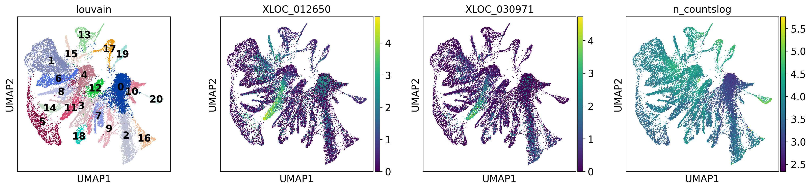


Filter for cells selected by ClickTag pre-processing and add organism condition information


```
#Assign labels to cells (condition and organism ID/#)
!mv D1.1817 jelly4stim_individs_tagCells_50k.mat
barcodes_list = sio.loadmat('jelly4stim_individs_tagCells_50k.mat')
barcodes_list.pop('__header__', None)
barcodes_list.pop('__version__', None)
barcodes_list.pop('__globals__', None)

# Add all cell barcodes for each individual
barcodes = []
for b in barcodes_list:
    if barcodes_list[b] != "None":
        barcodes.append(b)

print(len(barcodes))

barcodes = [s.replace('-1', '-3') for s in barcodes]
barcodes = [s.replace('-2', '-1') for s in barcodes]
barcodes = [s.replace('-3', '-2') for s in barcodes]


#Flip -1 -2 labels (from Miseq/Hiseq lane ordering)
def convertCode(b_list):
    b_list = [s.replace('-1', '-3') for s in b_list]
    b_list = [s.replace('-2', '-1') for s in b_list]
    b_list = [s.replace('-3', '-2') for s in b_list]
    return b_list

def convertCode_str(b):
    b = b.replace('-1', '-3')
    b = b.replace('-2', '-1')
    b = b.replace('-3', '-2')
    return b

fixed_bars = {}
for b in barcodes:
    fixed_bars[b] = barcodes_list[convertCode_str(b)][0]

#Add condition labels to individuals   
ids = []
for name in bus_stim.obs_names.tolist():
    for barcode, individ in fixed_bars.items():    
        if (name in barcode):
            ids += [int(individ)]

condition = ['SW','SW','SW','SW','DI','DI','DI','DI','KCl','KCl','KCl','KCl']

#Add ID numbers to individuals  
labels = []
for name in bus_stim.obs_names.tolist():
    for barcode, individ in fixed_bars.items():    
        if name in barcode:
            labels += [condition[int(individ)-1]]
            
bus_stim.obs['condition'] = pd.Categorical(labels)
bus_stim.obs['orgID'] = pd.Categorical(ids)
bus_stim
```

    23058


    AnnData object with n_obs × n_vars = 23057 × 10260
        obs: 'batch', 'n_counts', 'n_countslog', 'louvain', 'condition', 'orgID'
        var: 'n_counts', 'mean', 'std'
        uns: 'pca', 'neighbors', 'louvain', 'umap', 'louvain_colors'
        obsm: 'X_pca', 'X_umap'
        varm: 'PCs'
        obsp: 'distances', 'connectivities'


```
#Remove low count region, '0'
bus_combo_noZero = bus_stim[~bus_stim.obs['louvain'].isin(['0'])] #leiden

bus_combo_noZero.write('bus_stim.h5ad')
```

###**Analysis of Stimulation Experiment with previously saved data**


```
#Saved Filtered and clustered h5ad

#Stimulation data
bus_stim_clus = anndata.read('D1.1821')

print(bus_stim_clus)

#Merged experimental data
overlap_combo = anndata.read('D1.1823')
print(overlap_combo )

#Raw, unclustered h5ad
bus_stim = anndata.read('D1.1814')
```

    AnnData object with n_obs × n_vars = 18921 × 10260
        obs: 'batch', 'n_counts', 'n_countslog', 'louvain', 'condition', 'orgID', 'cellRanger_louvain'
        var: 'n_counts', 'mean', 'std'
        uns: 'cellRanger_louvain_colors', 'cellRanger_louvain_sizes', 'condition_colors', 'louvain', 'neighbors', 'paga', 'pca', 'umap'
        obsm: 'X_pca', 'X_tsne', 'X_umap'
        varm: 'PCs'
        obsp: 'connectivities', 'distances'
    AnnData object with n_obs × n_vars = 32594 × 6756
        obs: 'batch', 'n_counts', 'n_countslog', 'louvain', 'leiden', 'orgID', 'fed', 'starved', 'fed_neighbor_score', 'cellRanger_louvain', 'annos', 'new_cellRanger_louvain', 'annosSub', 'condition', 'cell_origin', 'knn_clus'
        var: 'n_counts-0', 'mean-0', 'std-0', 'n_counts-1', 'mean-1', 'std-1', 'mean', 'std'
        uns: 'pca'
        obsm: 'X_nca', 'X_pca', 'X_tsne', 'X_umap'
        varm: 'PCs'


```
#Starvation data
bus_fs_clus = anndata.read('D1.1796')
```


```
sc.pp.filter_cells(bus_stim, min_counts=1)
sc.pp.filter_genes(bus_stim, min_counts=1)
np.sum(bus_stim[list(bus_stim_clus.obs_names),:].X) #Number of unique reads
```


    170722140.0


```
#Markers for cell atlas heatmap (Fig 2b)
markers = pd.read_csv('D1.1809')
markers.head()
```


<div>
<style scoped>
    .dataframe tbody tr th:only-of-type {
        vertical-align: middle;
    }

    .dataframe tbody tr th {
        vertical-align: top;
    }

    .dataframe thead th {
        text-align: right;
    }
</style>
<table border="1" class="dataframe">
  <thead>
    <tr style="text-align: right;">
      <th></th>
      <th>clus</th>
      <th>markerGene</th>
      <th>annot</th>
      <th>orthoGene</th>
      <th>orthoDescr</th>
      <th>pantherID</th>
      <th>pantherDescr</th>
      <th>source</th>
      <th>Unnamed: 8</th>
      <th>Unnamed: 9</th>
      <th>Unnamed: 10</th>
      <th>Unnamed: 11</th>
      <th>Unnamed: 12</th>
      <th>Unnamed: 13</th>
    </tr>
  </thead>
  <tbody>
    <tr>
      <th>0</th>
      <td>0.0</td>
      <td>XLOC_010813</td>
      <td>DDX39B</td>
      <td>DDX39B</td>
      <td>spliceosome RNA helicase DDX39B [Homo sapiens]</td>
      <td>['PTHR24031:SF521']</td>
      <td>['SPLICEOSOME RNA HELICASE DDX39B']</td>
      <td></td>
      <td>NaN</td>
      <td>NaN</td>
      <td>NaN</td>
      <td>NaN</td>
      <td>NaN</td>
      <td>NaN</td>
    </tr>
    <tr>
      <th>1</th>
      <td>0.0</td>
      <td>XLOC_008430</td>
      <td>PA2G4</td>
      <td>PA2G4</td>
      <td>proliferation-associated protein 2G4 [Homo sa...</td>
      <td>['PTHR10804:SF125']</td>
      <td>['PROLIFERATION-ASSOCIATED 2G4 ,B']</td>
      <td></td>
      <td>NaN</td>
      <td>NaN</td>
      <td>NaN</td>
      <td>NaN</td>
      <td>NaN</td>
      <td>NaN</td>
    </tr>
    <tr>
      <th>2</th>
      <td>1.0</td>
      <td>XLOC_016073</td>
      <td>ZP3</td>
      <td>NaN</td>
      <td>NaN</td>
      <td>['PTHR11576']</td>
      <td>['ZONA PELLUCIDA SPERM-BINDING PROTEIN 3']</td>
      <td></td>
      <td>NaN</td>
      <td>NaN</td>
      <td>NaN</td>
      <td>NaN</td>
      <td>NaN</td>
      <td>NaN</td>
    </tr>
    <tr>
      <th>3</th>
      <td>2.0</td>
      <td>XLOC_006164</td>
      <td>LOT6</td>
      <td>NaN</td>
      <td>NaN</td>
      <td>['PTHR30543:SF12']</td>
      <td>['NAD(P)H-DEPENDENT FMN REDUCTASE LOT6']</td>
      <td></td>
      <td>NaN</td>
      <td>NaN</td>
      <td>NaN</td>
      <td>NaN</td>
      <td>NaN</td>
      <td>NaN</td>
    </tr>
    <tr>
      <th>4</th>
      <td>3.0</td>
      <td>XLOC_013735</td>
      <td>INXA</td>
      <td>NaN</td>
      <td>NaN</td>
      <td>['PTHR11893:SF41']</td>
      <td>['INNEXIN INX7']</td>
      <td></td>
      <td>NaN</td>
      <td>NaN</td>
      <td>NaN</td>
      <td>NaN</td>
      <td>NaN</td>
      <td>NaN</td>
    </tr>
  </tbody>
</table>
</div>


```
bus_stim_clus.obs['cellRanger_louvain'] = pd.Categorical(overlap_combo[overlap_combo.obs['cell_origin'] == 'Stim'].obs['knn_clus'])
```


```
#Exact values for generating UMAP/PAGA embedding for stimulation data
#sc.pp.neighbors(bus_stim_clus,n_neighbors=30, n_pcs=30) #use_rep='X_nca'
#sc.tl.paga(bus_stim_clus, groups='cellRanger_louvain')
sc.pl.paga(bus_stim_clus, color=['cellRanger_louvain'])
```


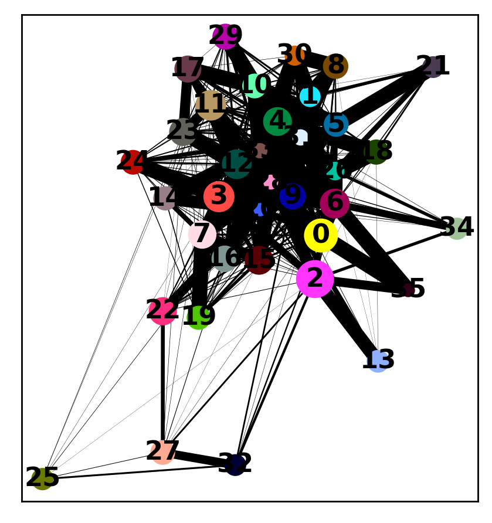


```
#Exact inputs for umap embedding
#sc.tl.umap(bus_stim_clus,random_state=42,init_pos='paga',spread=2.0)
sc.pl.umap(bus_stim_clus, color=['cellRanger_louvain','condition'],color_map='viridis')
```


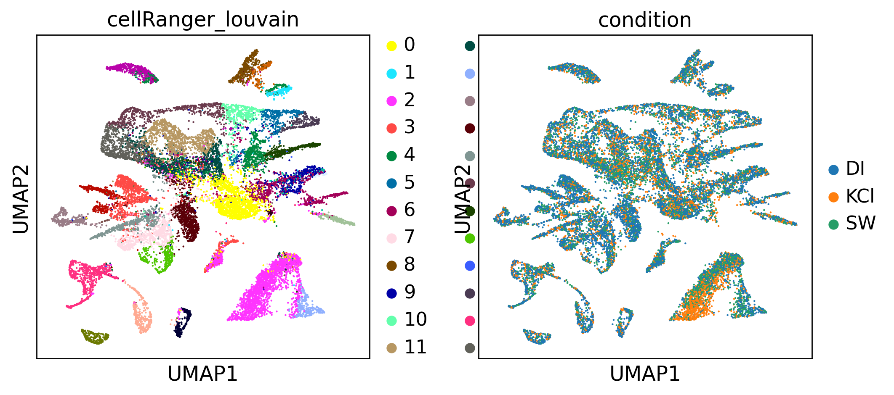


```
sc.pl.umap(bus_stim_clus, color=['cellRanger_louvain'],color_map='viridis')
```


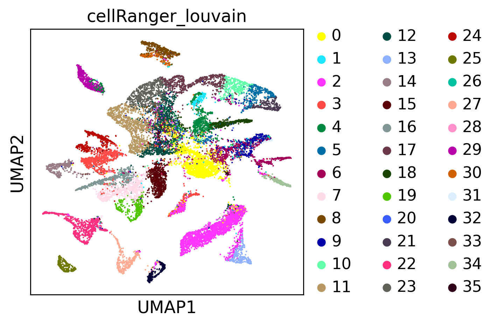


```
# Saved adata usedd for this analysis
#bus_stim_clus.write('bus_stim.h5ad')
```

####**Application of Cluster Labels/Analysis of Label Fit**

Here we apply the 36 cell type labels and look at the overlap in marker genes for these clusters versus markers from the starvation experiment


```
#Names for 36 subclusters
def annotateLouvainSub(bus_fs_clus):
  cluster_types = []
  
  for i in bus_fs_clus.obs_names:

    if bus_fs_clus[i,:].obs['cellRanger_louvain'][0] in [12]:
      cluster_types += ['Nematocyte Precursors']
    elif bus_fs_clus[i,:].obs['cellRanger_louvain'][0] in [17]:
      cluster_types += ['Maturing/mature Nematocytes']
    elif bus_fs_clus[i,:].obs['cellRanger_louvain'][0] in [11]:
      cluster_types += ['Early Nematocytes']
    elif bus_fs_clus[i,:].obs['cellRanger_louvain'][0] in [23]:
      cluster_types += ['Late Nematocytes']
    elif bus_fs_clus[i,:].obs['cellRanger_louvain'][0] in [2]:
      cluster_types += ['Medium Oocytes']
    elif bus_fs_clus[i,:].obs['cellRanger_louvain'][0] in [13]:
      cluster_types += ['Small Oocytes']

    elif bus_fs_clus[i,:].obs['cellRanger_louvain'][0] in [7]:
      cluster_types += ['GastroDigestive-B']
    elif bus_fs_clus[i,:].obs['cellRanger_louvain'][0] in [15]:
      cluster_types += ['GastroDigestive-D']
    elif bus_fs_clus[i,:].obs['cellRanger_louvain'][0] in [3]:
      cluster_types += ['GastroDigestive-A']
    elif bus_fs_clus[i,:].obs['cellRanger_louvain'][0] in [14]:
      cluster_types += ['GastroDigestive-C']
    elif bus_fs_clus[i,:].obs['cellRanger_louvain'][0] in [19]:
      cluster_types += ['GastroDigestive-E']
    elif bus_fs_clus[i,:].obs['cellRanger_louvain'][0] in [24]:
      cluster_types += ['GastroDigestive-F']


    elif bus_fs_clus[i,:].obs['cellRanger_louvain'][0] in [5]:
      cluster_types += ['Mechanosensory Cells Early Stages']
    elif bus_fs_clus[i,:].obs['cellRanger_louvain'][0] in [10]:
      cluster_types += ['Mechanosensory Cells-A']
    elif bus_fs_clus[i,:].obs['cellRanger_louvain'][0] in [21]:
      cluster_types += ['Mechanosensory Cells-B']

    elif bus_fs_clus[i,:].obs['cellRanger_louvain'][0] in [0]:
      cluster_types += ['i-Cells']
    elif bus_fs_clus[i,:].obs['cellRanger_louvain'][0] in [1]:
      cluster_types += ['Exumbrella Epidermis']
    elif bus_fs_clus[i,:].obs['cellRanger_louvain'][0] in [4]:
      cluster_types += ['Manubrium Epidermis']

    elif bus_fs_clus[i,:].obs['cellRanger_louvain'][0] in [6]:
      cluster_types += ['Neural Cells Early Stages']
    elif bus_fs_clus[i,:].obs['cellRanger_louvain'][0] in [9]:
      cluster_types += ['Neural Cells-A (incl. GLWa, MIH cells)']
    elif bus_fs_clus[i,:].obs['cellRanger_louvain'][0] in [26]:
      cluster_types += ['Neural Cells-B (incl. RFamide cells)']
    elif bus_fs_clus[i,:].obs['cellRanger_louvain'][0] in [31]:
      cluster_types += ['Neural Cells-C (incl. YFamide cells)']

    elif bus_fs_clus[i,:].obs['cellRanger_louvain'][0] in [8]:
      cluster_types += ['Striated Muscle of Subumbrella']
    elif bus_fs_clus[i,:].obs['cellRanger_louvain'][0] in [16]:
      cluster_types += ['Tentacle Bulb Distal Gastroderm']
    elif bus_fs_clus[i,:].obs['cellRanger_louvain'][0] in [18]:
      cluster_types += ['Radial Smooth Muscles']
    elif bus_fs_clus[i,:].obs['cellRanger_louvain'][0] in [20]:
      cluster_types += ['Tentacle Epidermis']
    elif bus_fs_clus[i,:].obs['cellRanger_louvain'][0] in [22]:
      cluster_types += ['Gland Cells-A']
    elif bus_fs_clus[i,:].obs['cellRanger_louvain'][0] in [25]:
      cluster_types += ['Gland Cells-C']
    elif bus_fs_clus[i,:].obs['cellRanger_louvain'][0] in [27]:
      cluster_types += ['Gland Cells-B']
    elif bus_fs_clus[i,:].obs['cellRanger_louvain'][0] in [28]:
      cluster_types += ['Tentacle GFP Cells']
    elif bus_fs_clus[i,:].obs['cellRanger_louvain'][0] in [29]:
      cluster_types += ['Gonad Epidermis']
    elif bus_fs_clus[i,:].obs['cellRanger_louvain'][0] in [30]:
      cluster_types += ['Striated Muscle of Velum']
    elif bus_fs_clus[i,:].obs['cellRanger_louvain'][0] in [32]:
      cluster_types += ['Gland Cells-D']
    elif bus_fs_clus[i,:].obs['cellRanger_louvain'][0] in [33]:
      cluster_types += ['Endodermal Plate']
    elif bus_fs_clus[i,:].obs['cellRanger_louvain'][0] in [34]:
      cluster_types += ['Gland Cells-E']
    elif bus_fs_clus[i,:].obs['cellRanger_louvain'][0] in [35]:
      cluster_types += ['Very Early Oocytes']
    
  bus_fs_clus.obs['annosSub'] = pd.Categorical(cluster_types)

annotateLouvainSub(bus_stim_clus)
bus_stim_clus
```


    AnnData object with n_obs × n_vars = 18921 × 10260
        obs: 'batch', 'n_counts', 'n_countslog', 'louvain', 'condition', 'orgID', 'cellRanger_louvain', 'annosSub'
        var: 'n_counts', 'mean', 'std'
        uns: 'cellRanger_louvain_colors', 'cellRanger_louvain_sizes', 'condition_colors', 'louvain', 'neighbors', 'paga', 'pca', 'umap'
        obsm: 'X_pca', 'X_tsne', 'X_umap'
        varm: 'PCs'
        obsp: 'connectivities', 'distances'


```
sc.pl.umap(bus_stim_clus,color='annosSub')
```


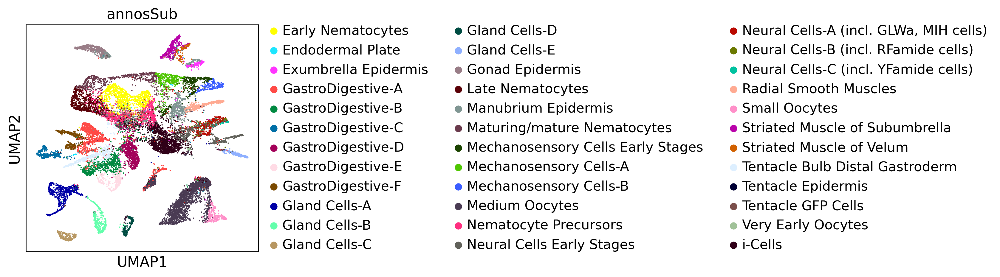


```
colors = bus_stim_clus.uns['annosSub_colors']#bus_fs_clus.uns['annosSub_colors']
colors
fig, ax = plt.subplots(figsize=(10,10))

c = np.unique(bus_stim_clus.obs["cellRanger_louvain"].values)
cmap = [i+'70' for i in colors]#plt.cm.get_cmap("tab20")


names = c

for idx, (cluster, name) in enumerate(zip(c, names)):
    XX = bus_stim_clus[bus_stim_clus.obs.cellRanger_louvain.isin([cluster]),:].obsm["X_umap"]
    text = list(bus_stim_clus[bus_stim_clus.obs.cellRanger_louvain.isin([cluster]),:].obs.annosSub)[0]
    x = XX[:,0]
    y = XX[:,1]
    ax.scatter(x, y, color = cmap[idx], label=str(cluster)+': '+text,s=5)
    ax.annotate(name, 
             (np.mean(x), np.mean(y)),
             horizontalalignment='center',
             verticalalignment='bottom',
             size=10, weight='bold',
             color="black",
               backgroundcolor=cmap[idx]) 
    

ax.legend(loc='center left',bbox_to_anchor=(1, 0.5),prop={'size': 8},frameon=False)
ax.set_axis_off()
plt.savefig('36ClusAtlas_Stim.pdf') 
plt.show()
```


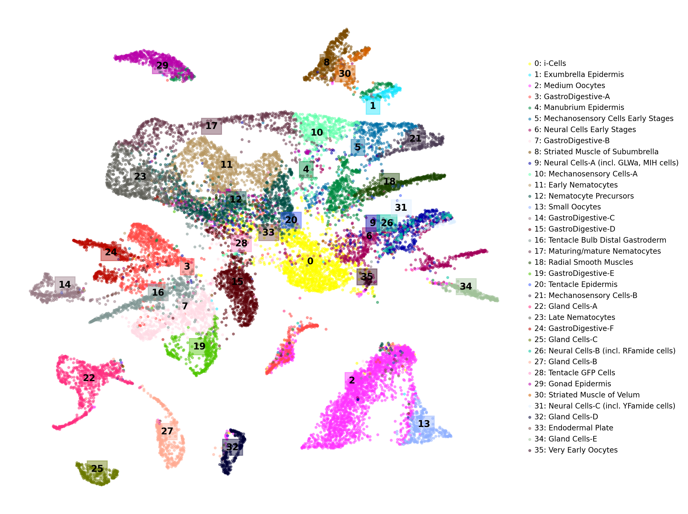


```
#Subsample for clusters > 100 in size
#Subsample from full dataset, across each cluster
def subSample(adata):
  groups = np.unique(adata.obs['cellRanger_louvain'])
  subSample = 100
  cellNames = np.array(adata.obs_names)

  allCells = []
  for i in groups:
      #subSample =  clusSize[i] # Uncomment if not looking at similar scale cluster sizes
      
      cells = np.array(list(adata.obs['cellRanger_louvain'].isin([i])))
      cellLocs = list(np.where(cells)[0])
      
      if len(cellLocs) > 100:
      #Take all cells if < subSample
        choice = random.sample(cellLocs,subSample)
      else:
        choice = cellLocs
     
      pos = list(choice)
      #print(len(pos))
      
      allCells += list(cellNames[pos])

      
  sub = adata[allCells,:]
  return sub
```


```
# #Filtered list of top markers
topMarkers = pd.read_csv('D1.1809',sep=",")
#topMarkers.head()

topMarkers = topMarkers[0:51]

topGenes = []
names = []
var_groups = []
var_labels = []
ind = 0
#n_genes = 2
for i in np.unique(topMarkers.clus):
  sub = topMarkers[topMarkers.clus == i]
  #sub.sort_values(by='padj',ascending=True)

  #noDups = [i for i in sub.markerGene if i not in topGenes] #Remove duplicate genes
  topGenes += list(sub.markerGene)
  names += list(sub.annot)

  var_groups += [(ind,ind+len(list(sub.annot))-1)]
  var_labels += [str(int(i))] #make i from clusNameDict[i]
  ind += len(list(sub.annot))

```


```
bus_stim_clus.obs['cellRanger_louvain'] = [str(i) for i in bus_stim_clus.obs['cellRanger_louvain']]
bus_stim_clus.obs['cellRanger_louvain'] = pd.Categorical(bus_stim_clus.obs['cellRanger_louvain'])
#Create dendrogram for subclusters
sc.tl.dendrogram(bus_stim_clus,'cellRanger_louvain',linkage_method='ward')
bus_stim_clus.uns["dendrogram_cellRanger_louvain"] = bus_stim_clus.uns["dendrogram_['cellRanger_louvain']"]

bus_stim_clusSub = subSample(bus_stim_clus)

#Raw, unclustered h5ad
bus_stim = anndata.read('D1.1814')
sc.pp.filter_cells(bus_stim, min_counts=1)
sc.pp.filter_genes(bus_stim, min_counts=1)

bus_stim = bus_stim[bus_stim_clusSub.obs_names,:]
bus_stim.obs['cellRanger_louvain'] = bus_stim_clusSub.obs['cellRanger_louvain']
bus_stim.uns['cellRanger_louvain_colors'] = bus_stim_clus.uns['annosSub_colors']
bus_stim.uns["dendrogram_cellRanger_louvain"] = bus_stim_clusSub.uns["dendrogram_cellRanger_louvain"]


bus_stim = bus_stim[:,topGenes]
bus_stim.var['names'] = names

sc.pp.log1p(bus_stim)

sc.set_figure_params(scanpy=True, fontsize=30,dpi=150)
sc.pl.heatmap(bus_stim,names,groupby='cellRanger_louvain',dendrogram=True,show_gene_labels=True,cmap='PuBuGn',use_raw = False,
                var_group_positions=var_groups,var_group_labels=var_labels,figsize = (30,30),swap_axes=True,standard_scale='var',
              gene_symbols='names',save='stimAtlas.pdf')
```

    Trying to set attribute `.obs` of view, copying.
    Trying to set attribute `.var` of view, copying.


    WARNING: saving figure to file figures/heatmapstimAtlas.pdf


Jaccard Marker Overlap Comparison


```
n=100
bus_fs_clus.obs['cellRanger_louvain'] = pd.Categorical(bus_fs_clus.obs['cellRanger_louvain'])
sc.tl.rank_genes_groups(bus_stim_clus,groupby='cellRanger_louvain',n_genes=n,method='wilcoxon')
sc.tl.rank_genes_groups(bus_fs_clus,groupby='cellRanger_louvain',n_genes=n,method='wilcoxon')
```


```
#Show pairwise overlap in top 100 names between all clusters, 36x36 grid
#https://stackoverflow.com/questions/52408910/python-pairwise-intersection-of-multiple-lists-then-sum-up-all-duplicates

clus = np.unique(bus_fs_clus.obs['cellRanger_louvain'])

busStim = [[]]*len(clus) #np array of top 100 genes for each of 36 clusters
busFS = [[]]*len(clus)#np array of top 100 genes for each of 36 clusters

for c in clus:
  busStim[c] =  list(bus_stim_clus.uns['rank_genes_groups']['names'][str(c)])
  busFS[c] = list(bus_fs_clus.uns['rank_genes_groups']['names'][str(c)])

```


```
from itertools import combinations_with_replacement

#Changed to calculate Jaccard Index
def intersect(i,j):
  return len(set(busStim[i]).intersection(busFS[j]))/len(set(busStim[i]).union(busFS[j]))

def pairwise(clus):        
  # Initialise precomputed matrix (num of clusters, 36x36)
  precomputed = np.zeros((len(clus),len(clus)), dtype='float')
  # Initialise iterator over objects in X
  iterator = combinations_with_replacement(range(0,len(clus)), 2)
  # Perform the operation on each pair
  for i,j in iterator:
    precomputed[i,j] = intersect(i,j)          
  # Make symmetric and return
  return precomputed + precomputed.T - np.diag(np.diag(precomputed))

```


```
pairCorrs = pairwise(clus)
```


```
plt.figure(figsize=(7,7))
plt.imshow(pairCorrs, cmap='viridis')
plt.colorbar()
plt.xlabel('Starvation Clusters')
plt.ylabel('Stimulation Clusters')

plt.xticks(np.arange(0, 36, 1),fontsize=5)
plt.yticks(np.arange(0, 36, 1),fontsize=5)
plt.grid(color='black',linewidth=0.3)
plt.show()
```


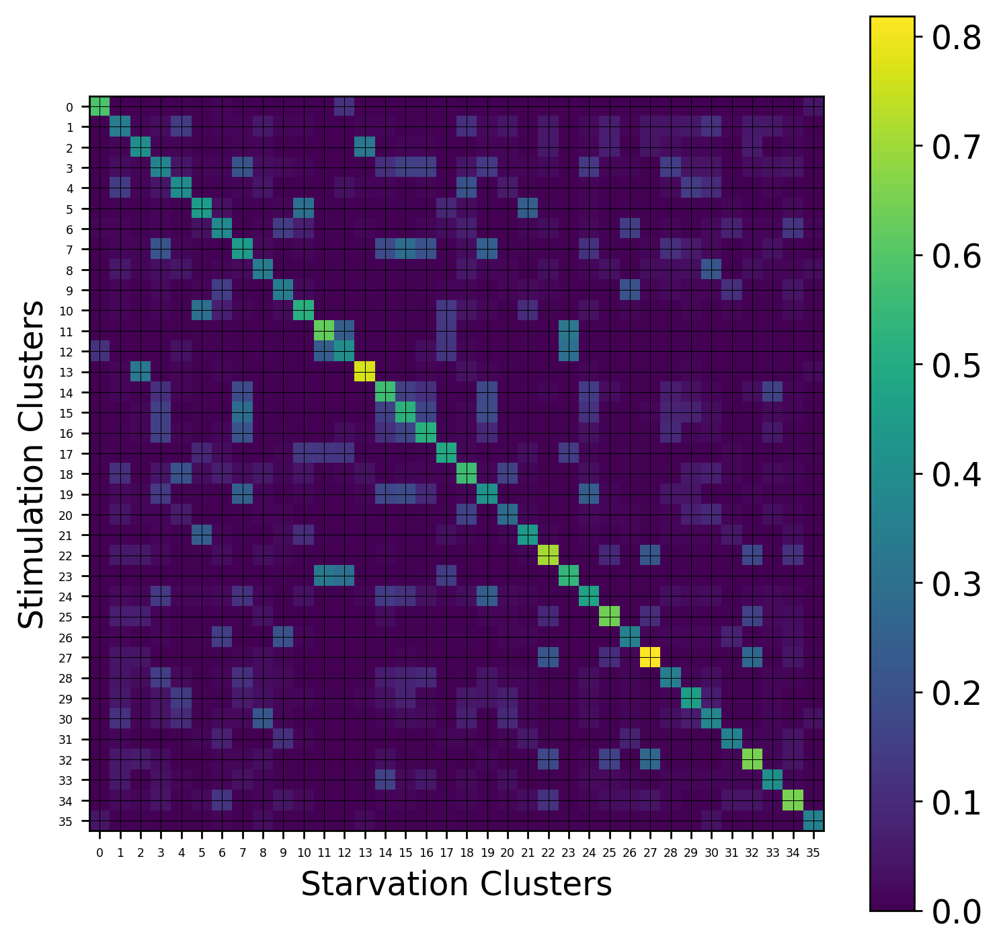


#### **Neighbor Score Plots**

Look at the density neighbors for each cell from the different perturbation conditions


```
#Calculate number of neighbors (out of top 15) with same starvation condition
#Input adata object and if score is for fed or starved (True or False)
def neighborScores(adata,conditionBool):
  sc.pp.neighbors(adata,n_neighbors=15)
  neighborDists = adata.uns['neighbors']['distances'].todense()
  counts = []

  for i in range(0,len(adata.obs_names)):
    cellNames = adata.obs_names
      
    #get condition observation for this cell
    cellObs = adata.obs['condition'][cellNames[i]]
      
    #get row for cell
    nonZero = neighborDists[i,:]>0
    l = nonZero.tolist()[0]

    cellRow = neighborDists[i,:]
    cellRow = cellRow[:,l]


    #get 'fed' observations
    obs = adata.obs['condition'][l]
      
    # count # in 'fed' observations == cell obs
    count = 0
    #if cellObs == conditionBool:
    for j in obs:
      if j == conditionBool:
        count += 1
              

    counts += [count]
      
  print(len(counts))

  return counts
```


```
bus_stim_clus.obs['di_neighbor_score'] = neighborScores(bus_stim_clus,'DI')
sc.pl.umap(bus_stim_clus,color='di_neighbor_score',color_map='plasma')

```

    18921


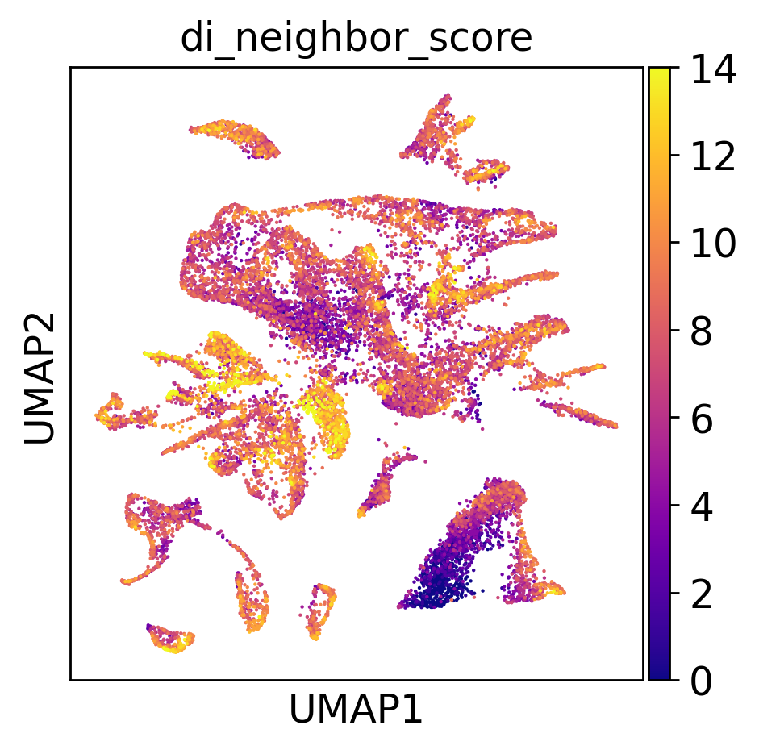


```
bus_stim_clus.obs['sw_neighbor_score'] = neighborScores(bus_stim_clus,'SW')
sc.pl.umap(bus_stim_clus,color='sw_neighbor_score',color_map='plasma')

```

    18921


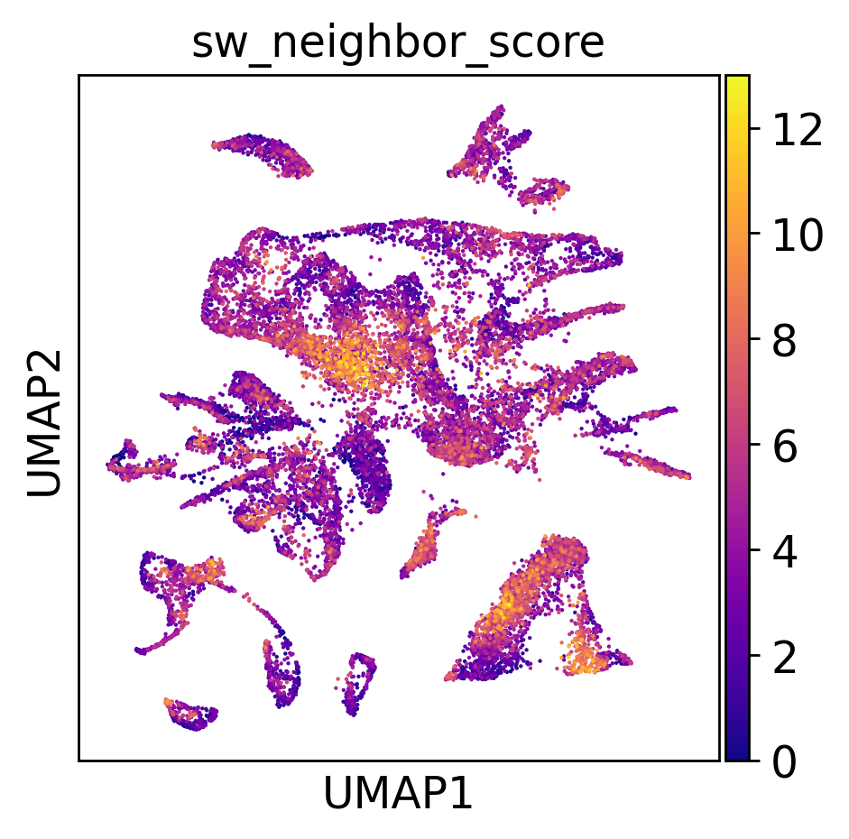


```
bus_stim_clus.obs['kcl_neighbor_score'] = neighborScores(bus_stim_clus,'KCl')
sc.pl.umap(bus_stim_clus,color='kcl_neighbor_score',color_map='plasma')

```

    18921


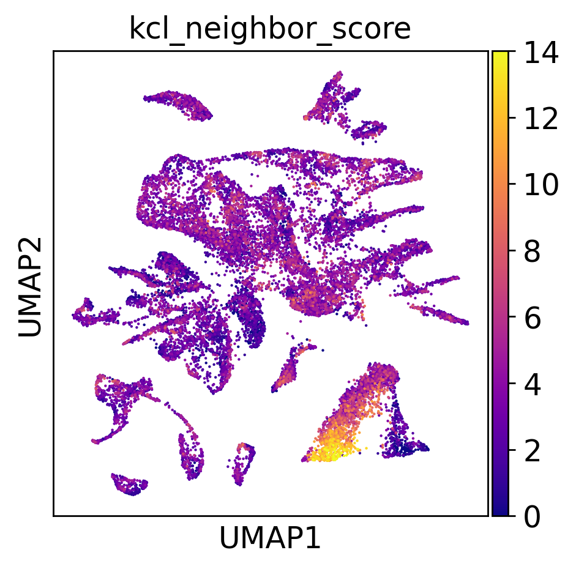


#### **Violin Plots for DE Genes**

Look at expression profiles for DE genes under the different perturbations


```
bus_stim_clus
```


    AnnData object with n_obs × n_vars = 18921 × 10260
        obs: 'batch', 'n_counts', 'n_countslog', 'louvain', 'condition', 'orgID', 'cellRanger_louvain', 'di_neighbor_score', 'sw_neighbor_score', 'kcl_neighbor_score'
        var: 'n_counts', 'mean', 'std'
        uns: 'cellRanger_louvain_colors', 'cellRanger_louvain_sizes', 'condition_colors', 'louvain', 'neighbors', 'paga', 'pca', 'umap'
        obsm: 'X_pca', 'X_tsne', 'X_umap'
        varm: 'PCs'
        obsp: 'connectivities', 'distances'


```
clus5 = bus_stim_clus[bus_stim_clus.obs['cellRanger_louvain'].isin([5])]

#Piwi-like, DNA-directed RNA polymerase, Cilia/Flagella Associated Protein **
sc.pl.violin(clus5,keys=['XLOC_007915','XLOC_005790','XLOC_004521'], groupby='condition')
```


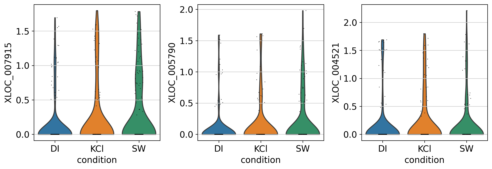


```
clus2 = bus_stim_clus[bus_stim_clus.obs['cellRanger_louvain'].isin([2])]

#Mitosis-related Cyclin, Tubulin beta-like, Collagen alpha-like 
sc.pl.violin(clus2,keys=['XLOC_045075','XLOC_006366','XLOC_029934'], groupby='condition')

```


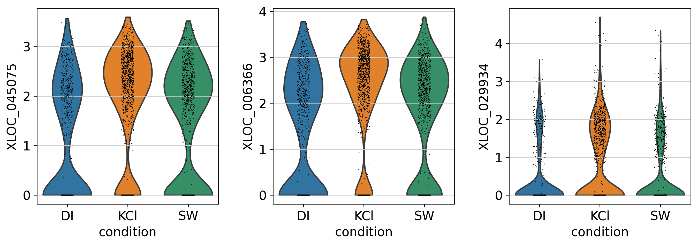


```
clus7 = bus_stim_clus[bus_stim_clus.obs['cellRanger_louvain'].isin([7])]
sc.pl.violin(clus7,keys=['XLOC_006729','XLOC_000601','XLOC_006558'], groupby='condition')
```


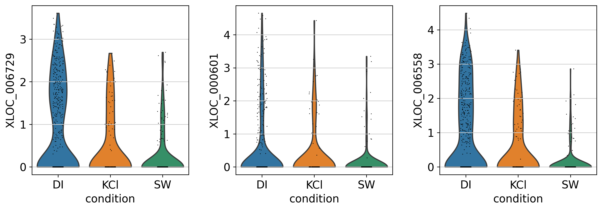


#### **Neuron Subpopulations**


```
fs_neuron = anndata.read('D1.1804')
```


<div>
<style scoped>
    .dataframe tbody tr th:only-of-type {
        vertical-align: middle;
    }

    .dataframe tbody tr th {
        vertical-align: top;
    }

    .dataframe thead th {
        text-align: right;
    }
</style>
<table border="1" class="dataframe">
  <thead>
    <tr style="text-align: right;">
      <th></th>
      <th>XLOC</th>
      <th>Annotation</th>
      <th>Class</th>
      <th>Cluster</th>
    </tr>
  </thead>
  <tbody>
    <tr>
      <th>0</th>
      <td>XLOC_030971</td>
      <td>ELAV</td>
      <td>NaN</td>
      <td>0</td>
    </tr>
    <tr>
      <th>1</th>
      <td>XLOC_001566</td>
      <td>Synaptotagmin</td>
      <td>NaN</td>
      <td>0</td>
    </tr>
    <tr>
      <th>2</th>
      <td>XLOC_030920</td>
      <td>Neurogenin</td>
      <td>NaN</td>
      <td>0</td>
    </tr>
    <tr>
      <th>3</th>
      <td>XLOC_040584</td>
      <td>GRWGamide</td>
      <td>Peptide</td>
      <td>7</td>
    </tr>
    <tr>
      <th>4</th>
      <td>XLOC_019434</td>
      <td>Rfamide</td>
      <td>Peptide</td>
      <td>2</td>
    </tr>
  </tbody>
</table>
</div>


```
#Raw, unclustered h5ad
bus_stim = anndata.read('D1.1814')
bus_stim = bus_stim[bus_stim_clus.obs_names,]
#Transfer info from embedded version
bus_stim.obs['cellRanger_louvain'] = pd.Categorical(bus_stim_clus.obs['cellRanger_louvain'])
bus_stim.obs['condition'] = pd.Categorical(bus_stim_clus.obs['condition'])
```

    Trying to set attribute `.obs` of view, copying.


```
#Neurons, start from raw counts + unfiltered genes
neurons = bus_stim[bus_stim.obs['cellRanger_louvain'].isin([31,26,6,9])]
sc.pp.filter_cells(neurons, min_counts=0)
sc.pp.filter_genes(neurons, min_counts=0)

sc.pp.normalize_per_cell(neurons, counts_per_cell_after=1e4)

neurons_copy = neurons.copy()
sc.pp.log1p(neurons)
neurons.raw = sc.pp.log1p(neurons_copy, copy=True)

# sc.pp.scale(raw_overlap_combo, max_value=10)
sc.pp.highly_variable_genes(neurons,n_top_genes=2000,n_bins=50)

neurons = neurons[:,neurons.var['highly_variable']]

sc.pp.scale(neurons, max_value=10)

sc.tl.pca(neurons, n_comps=60)
sc.pl.pca_variance_ratio(neurons, log=True)

#applyNCAEmbed(neurons,neurons.obs['knn_clus'])

sc.pp.neighbors(neurons,n_neighbors=15, n_pcs=15) #n_neighbors=5, n_pcs=15,use_rep='X_nca'
sc.tl.louvain(neurons,resolution=1,key_added='louvain_neur',random_state=42)#Clustering algorithm,resolution=0.5
```

    Trying to set attribute `.obs` of view, copying.


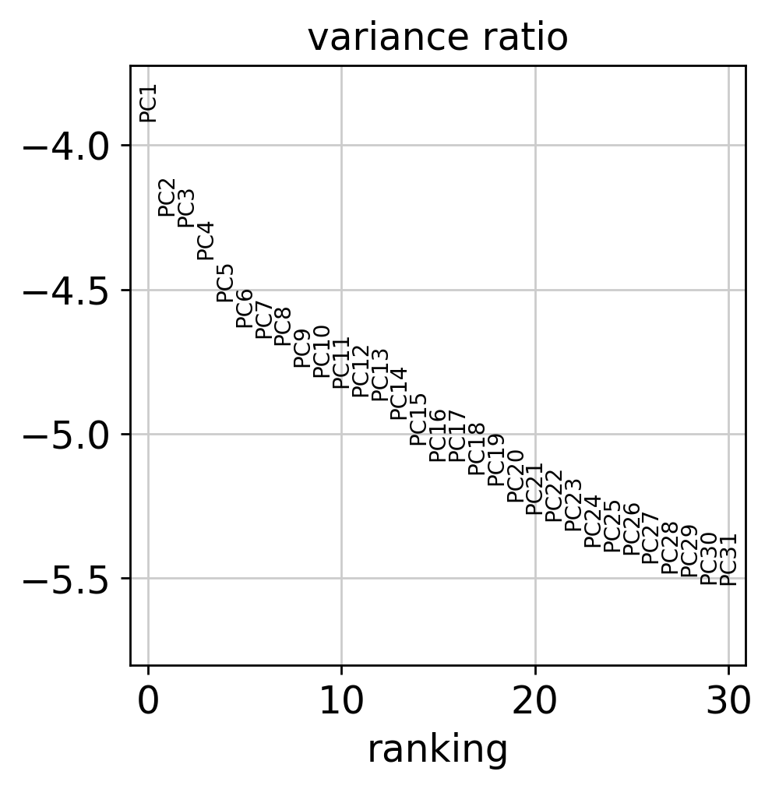


```
#sc.tl.louvain(neurons,resolution=2.5,key_added='louvain_neur',random_state=42)

```


```
sc.tl.umap(neurons,random_state=42,spread=2.5, min_dist=1)

neurons.obs['cellAtlasClusters'] = pd.Categorical(neurons.obs['cellRanger_louvain'] )
sc.pl.umap(neurons, color=['louvain_neur','cellAtlasClusters'],color_map='viridis',size=50,legend_loc='on data')
```


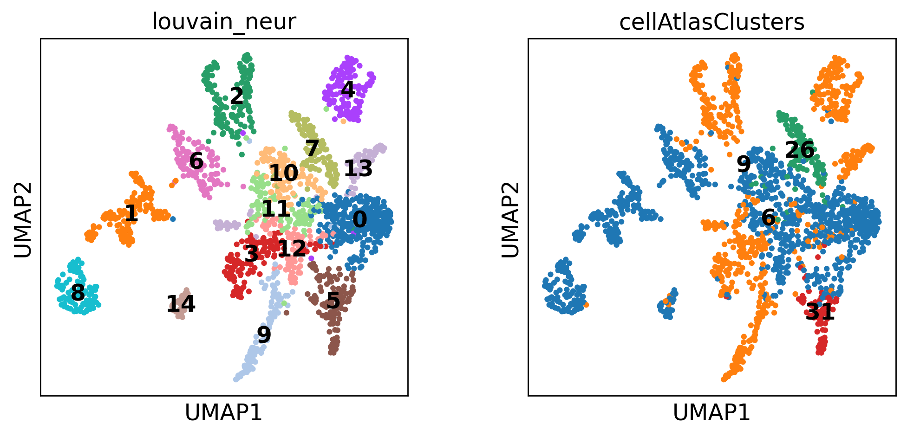


```
sc.pl.umap(neurons, color=['XLOC_040584','XLOC_019434','TRINITY_DN20104_c0_g1_i1.mrna1',
                           'XLOC_017097','XLOC_041402','XLOC_004021',
                           'XLOC_030120','XLOC_008730','XLOC_035224','XLOC_021799','XLOC_014624'],color_map='viridis',size=50,legend_loc='on data',
           title=['GRWGamide','RFamide','PRPamide',
                  'GLWamide2','YFamide','FLFamide',
                  'PP17','PP Candidate G[KR][KRED]','PP Candidate 2','PP Candidate 3','PP Candidate G[LI]W repeats'])
```


